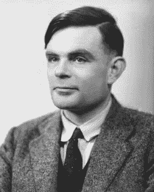

# 艾伦·图灵关于机器智能的 9 个论点

> 原文：<https://medium.com/analytics-vidhya/alan-turings-9-arguments-for-the-intelligence-of-machines-68770174fe4e?source=collection_archive---------0----------------------->

## 关于人工智能本质的争论

机器会思考吗？

是的，艾伦·图灵在他 1950 年的论文《计算机器和智能》中提出了这个观点。

[来源。](http://crackingtheenigma.blogspot.com/2012/06/did-alan-turing-have-asperger-syndrome.html)

在他的论文中，图灵概述了对反对机器智能的九个论点的九个反驳。具体来说，这些是: