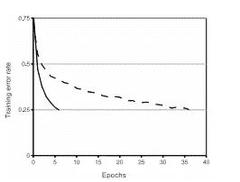

# AlexNet 架构解释道

> 原文：<https://medium.com/analytics-vidhya/alexnet-architecture-explained-5d19e3dca2bb?source=collection_archive---------6----------------------->

AlexNet 在 2012 年 ImageNet LSVRC-2012 比赛中以较大优势获胜(15.3%对 26.2%(第二名)的错误率)。这是原始[论文](https://papers.nips.cc/paper/4824-imagenet-classification-with-deep-convolutional-neural-networks.pdf)的链接。

文件的主要重点

1.  使用 ReLU 代替 tanh 来增加非线性。
2.  使用退出而不是调整来处理过度拟合。
3.  重叠池用于缩小网络规模。
4.  **输入**

AlexNet 使用 ImageNet 数据集的子集解决了图像分类的问题，该数据集大约有 120 万张训练图像、50，000 张验证图像和 150，000 张测试图像。输入是 1000 个不同类别之一的图像，输出是 1000 个数字的向量。

AlexNet 的输入是大小为 256*256 的 RGB 图像。这意味着训练集和测试图像中的所有图像的大小都是 256*256。如果输入图像不是 256*256，则图像被重新缩放，使得较短的尺寸为长度 256，并从结果图像中裁剪出中心 256*256 的小块。

[来源](https://www.learnopencv.com/wp-content/uploads/2018/05/AlexNet-Resize-Crop-Input.jpg)

用像素的原始 RGB 值训练图像。因此，如果输入图像是灰度图像，它将被转换为 RGB 图像。大小为 257*257 的图像是通过随机裁剪从 256*256 的图像中生成的，它被馈送到 AlexNet 的第一层。

**2。AlexNet 架构**

AlexNet 包含五个卷积层和三个全连接层，总共八层。AlexNet 架构如下图所示:

[来源](https://www.learnopencv.com/wp-content/uploads/2018/05/AlexNet-1.png)

对于前两个卷积层，每个卷积层之后是重叠的最大池层。第三、第四和第五卷积层彼此直接相连。第五卷积层之后是重叠的最大池层，然后连接到完全连接的层。全连接层各有 4096 个神经元，第二个全连接层被送入具有 1000 个类的 softmax 分类器。

***2.1) ReLU 非线性:***

引入非线性的标准方法是使用 tanh: f(x) = tanh(x)，其中 f 是输入 x 的函数，或者使用 f(x) = (1+e^-x)^-1.

就梯度下降的训练时间而言，这些是比非饱和非线性 f(x) = max(0，x)慢得多的饱和非线性。

图(此处虚线代表 tanh，实线代表 ReLU)

饱和非线性:这些函数具有紧凑的范围，这意味着它们将神经响应压缩到实数的有界子集。对数将输入压缩为 0 至 1 之间的输出，TAN H 在-1 至 1 之间。这些函数在边界显示限制行为。

具有非饱和非线性的训练网络比具有饱和非线性的训练网络更快。

***2.2)重叠合并:***

最大池层有助于对输入表示(图像、隐藏层输出矩阵等)进行下采样。)，减少其维数，并允许对包含在被装仓的子区域中的特征进行假设。最大池有助于减少过度拟合。基本上，它使用一个最大值操作来集合特性，留给我们更少的特性。除了计算最大值的相邻窗口彼此重叠之外，最大池化和重叠是相同的。

> 汇集层可以被认为是由间隔 s 个像素的汇集单元的网格组成，每个汇集单元概括了以汇集单元的位置为中心的大小为 z*z 的邻域。如果我们设置 s=z，我们得到传统的本地池。如果我们设置 s < z, we obtain overlapping pooling.
> 
> AlexNet Paper (2012)

The overlapping pooling reduces the top-1 and top-5 error rates by 0.4% and 0.3% compared to non-overlapping pooling, thus finding it very difficult to overfit.

**2.3)减少过拟合**

应用各种技术来减少重叠

数据扩充

减少图像数据过度拟合的最常见方法是数据扩充。这是一种在不收集新数据的情况下显著增加可用于训练模型的数据多样性的策略。数据增强包括诸如位置增强(裁剪、填充、旋转、平移、仿射变换)、颜色增强(亮度、对比度饱和度、色调)和许多其他技术。AlexNet 采用两种不同形式数据扩充。

数据扩充的第一种形式是转换图像和水平反射。这是通过从 256*256 图像中提取随机的 224*224 小块并在这些小块上训练网络来实现的。数据扩充的第二种形式包括改变训练图像中 RGB 通道的强度。

拒绝传统社会的人

Dropout 是一种正则化技术，用于减少过拟合并提高深度神经网络的泛化能力。“丢失”是指在神经网络中丢失单元(隐藏的和可见的)。我们可以将 dropout 解释为训练一层中给定节点的概率，其中 1.0 表示没有丢失，0.5 表示 50%的隐藏神经元被忽略。

[来源](http://jmlr.org/papers/v15/srivastava14a.html)

原贴[此处](https://prabinnepal.com/alexnet-architecture-explained/)。

参考资料:

1.  Alex Krizhevsky、Ilya Sutskever 和 Geoffrey E. Hinton 于 2012 年发表的《使用深度卷积神经网络进行 ImageNet 分类》
2.  https://www.learnopencv.com/understanding-alexnet/