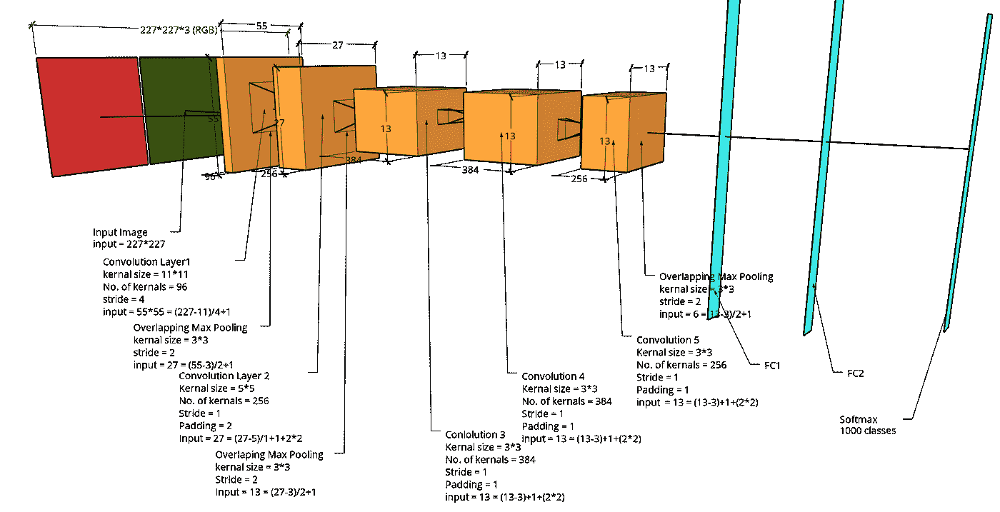
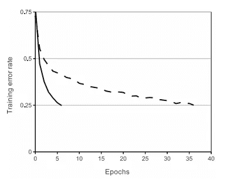
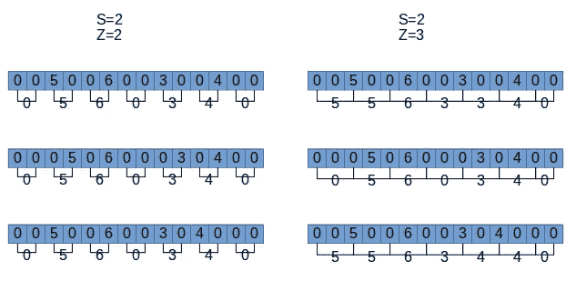
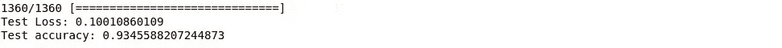

# 简而言之 AlexNet

> 原文：<https://medium.com/analytics-vidhya/alexnet-in-a-nutshell-4a9445e92d6d?source=collection_archive---------18----------------------->

你好，欢迎回到我的博客，我是**里提克·杜塔**，在这个博客中，我将向你展示另一个 CNN 模型 **AlexNet 的工作和架构。**我们还在 AlexNet 中首次看到了不同的技术。最后我们看看如何训练自己的 AlexNet 模型。

那么，为什么有人关心另一个 CNN 的模特名叫 **AlexNet。**如果我告诉你这是计算机视觉中**最大的突破** **之一，不信跟我来，让我们开始吧。**

AlexNet 由 Alex **Krizhevsky、Ilya Sutskever 和 Geoffrey E. Hinton** 于 2012 年开发。

AlexNet 在 ImageNet 数据集上接受了训练，数据集由**120 万个数据(图像)**组成，其中包含 **1000 个不同的类**具有**6000 万个参数**和 **650000 个神经元**组成 **5 个卷积层**

# AlexNet 架构



> **第一层** (Conv1)

在第一层中，我们应用了**大小为 11*11** 的 **96 个内核**，其中**跨距为 4** ，并且**没有填充**，因此我们得到了 55*55*96 的**输入**

55 因为，当前输入= *(先前输入-内核大小)/步幅+(填充* 2)=(227–11)/4+(0 * 2)*

由于使用了**激活 ReLU**

> **第二层**

在这一层**中使用了**内核大小为 3*3** 的**与**步距为 2** 的**重叠最大池，因此我们得到的**输入为 27**=*(55–3)/2+1***

有了重叠，过度拟合模型会稍微困难一些

> **第三层** (Conv2)

与上面类似，我们有:

内核数量= 256

内核大小= 5*5

步幅= 1

填充= 2

输入= 27 =(27–5)/1+1+(2 * 2)

正如你所看到的，输入大小与前一层相同，这是因为我们使用了填充= 2，步幅= 1

通过使用填充为*(内核大小-1)/2* ，跨距为 1，我们得到与前一层相同的输入。

> **第四层**

内核大小= 3*3

步幅= 2

输入= 13 =(27–3)/2+1

> **第五层** (Conv3)

内核数量= 384

内核大小= 3*3

步幅= 1

填充= 1

输入= 13 =(13–3)/1+1+(2 * 1)

> **第六层** (Conv4)

内核数量= 384

内核大小= 3*3

步幅= 1

填充= 1

输入= 13 =(13–3)/1+1+(2 * 1)

> **第七层** (Conv5)

内核数量= 256

内核大小= 3*3

步幅= 1

填充= 1

输入= 13 =(13–3)/1+1+(2 * 1)

> **第八层**

内核大小= 3*3

步幅= 2

填充= 0

输入= 5 =(13–3)/2+(2 * 0)

> **第九层，第十层**

这些层是完全连接的层，由 4096 个神经元组成

> **输出层**

最终层由 1000 个输出类组成。

# AlexNet 中使用的新功能

> **热卢**

正如我们所知，tanh 的复杂性比 ReLU 更高，因为 tanh 是一个非线性函数，所以最好使用 ReLU 作为激活函数，这样训练时间会更短。

根据 AlexNet 的记录，ReLU 的训练时间比 tanh 快 6 倍



MaxPooling2D

> **在多个 GPU 上训练**

使用单个 GPU 限制了网络的最大规模，120 万条记录对于单个 GPU 来说太大了，所以他们所做的是将任务分散到两个 GPU 上，称为 GPU 并行化

> **局部反应正常化**

也称为数据标准化

这是第一次使用 LRN，LRN 被用来鼓励横向居住的概念。这个概念来自神经学，它认为横向抑制是神经元减少其邻居活动的能力。就深度神经网络而言，它用于执行局部对比度增强 t，因此局部最大像素值用于激励下一层。

> **重叠池**

如果我们设置 S=Z (stride = keral size ),我们得到传统的局部池，但是如果我们设置 Z>S，我们得到重叠池，我们将能够提取更多的特征。好吧，让我们用简单的语言来理解它。



假设我们有上图所示的 1D 元素列表，并且我们有两个参数用于步幅和内核大小。因此，可以清楚地看到，如果我们设置 S=Z(左部)，我们从不同的列表中获得相同的输出，但如果我们设置 Z>S，我们获得不同的输出(右部)。这是因为当 S=Z 时信息丢失导致数据收缩(从 3 个数据集到 1 个数据集),从而导致过拟合。

# 还使用了一些技术

> **数据扩充**

这种技术用于增加数据的多样性，包括合并、翻转、平移、增亮等。因此，当测试任何图像是否异常缩放或光线不足时，该模型可以正确预测。

> **辍学**

深度神经网络倾向于在样本较少的情况下过度拟合训练数据集。但是通过使用不同的模型配置，过拟合的机会减少了，但是这也需要更多的计算能力，因为我们需要训练那些额外的模型。但是通过在训练期间随机删除节点，单个模型可以具有不同的网络架构。

# 如何训练 AlexNet 模型

> import warnings
> warnings . filter warnings(" ignore ")
> 从 keras.models 导入顺序
> 从 keras.layers 导入 Dense、Activation、Dropout、Flatten、Conv2D、MaxPooling2D
> 从 keras.layers.normalization 导入批处理规范化
> 导入 numpy 作为 np
> np.random.seed(1000)

检索数据

> 将 tflearn.datasets.oxflower17 导入为 oxflower17
> x，y = ox flower 17 . load _ data(one _ hot = True)

创建顺序模式

> 模型=顺序()

第一卷积层

> model.add(Conv2D(filters=96，input_shape=(224，224，3)，kernel_size=(11，11)，strides=(4，4)，padding = ' valid ')
> model . add(Activation(' relu '))

联营

> model . add(MaxPooling2D(pool _ size =(3，3)，strides=(2，2)，padding='valid '))

在传递到下一层之前进行批量标准化

> model.add(BatchNormalization())

第二卷积层

> model.add(Conv2D(filters=256，kernel_size=(11，11)，strides=(1，1)，padding = ' valid ')
> model . add(Activation(' relu '))

联营

> model . add(MaxPooling2D(pool _ size =(3，3)，strides=(2，2)，padding='valid '))

批量标准化

> model.add(BatchNormalization())

第三卷积层

> model.add(Conv2D(filters=384，kernel_size=(3，3)，strides=(1，1)，padding = ' valid ')
> model . add(Activation(' relu ')

批量标准化

> model.add(BatchNormalization())

第四卷积层

> model.add(Conv2D(filters=384，kernel_size=(3，3)，strides=(1，1)，padding = ' valid ')
> model . add(Activation(' relu '))

批量标准化

> model.add(BatchNormalization())

第五卷积层

> model.add(Conv2D(filters=256，kernel_size=(3，3)，strides=(1，1)，padding = ' valid ')
> model . add(Activation(' relu '))

联营

> model . add(MaxPooling2D(pool _ size =(3，3)，strides=(2，2)，padding='valid '))

批量标准化

> model.add(BatchNormalization())

将它传递到致密层

> model.add(Flatten())

第一致密层

> model.add(Dense(4096，input_shape=(224*224*3)，)
> model.add(Activation('relu '))

添加下降以防止过度拟合

> model.add(辍学(0.4))

批量标准化

> model.add(BatchNormalization())

第二致密层

> model . add(Dense(4096))
> model . add(激活(' relu '))

并且比较不同激活函数的准确度和不同激活函数和丢失的准确度

> model.add(辍学(0.4))

批量标准化

> model.add(BatchNormalization())

第三致密层

> model . add(Dense(1000))
> model . add(激活(' relu '))

添加辍学

> model.add(辍学(0.4))

批量标准化

> model.add(BatchNormalization())

输出层

> model . add(Dense(17))
> model . add(Activation(' soft max '))
> 
> 模型.摘要()

编制

> model . compile(loss = ' categorial _ cross entropy '，optimizer='adam '，\
> metrics=['accuracy'])

(5)火车

> model.fit(x，y，batch_size=64，epochs=5，verbose=0，validation_split=0.2，shuffle=True)
> 
> score = model.evaluate(x，y)
> print('测试损失:'，score[0])
> print('测试准确度:'，score[1])



我们可以看到 aquiracy 相当不错，你也可以尝试一下 tanh 激活功能。

**型号总结**

```
Model: "sequential_2"
_________________________________________________________________
Layer (type)                 Output Shape              Param #   
=================================================================
conv2d_6 (Conv2D)            (None, 54, 54, 96)        34944     
_________________________________________________________________
activation_10 (Activation)   (None, 54, 54, 96)        0         
_________________________________________________________________
max_pooling2d_4 (MaxPooling2 (None, 27, 27, 96)        0         
_________________________________________________________________
batch_normalization_9 (Batch (None, 27, 27, 96)        384       
_________________________________________________________________
conv2d_7 (Conv2D)            (None, 17, 17, 256)       2973952   
_________________________________________________________________
activation_11 (Activation)   (None, 17, 17, 256)       0         
_________________________________________________________________
max_pooling2d_5 (MaxPooling2 (None, 8, 8, 256)         0         
_________________________________________________________________
batch_normalization_10 (Batc (None, 8, 8, 256)         1024      
_________________________________________________________________
conv2d_8 (Conv2D)            (None, 6, 6, 384)         885120    
_________________________________________________________________
activation_12 (Activation)   (None, 6, 6, 384)         0         
_________________________________________________________________
batch_normalization_11 (Batc (None, 6, 6, 384)         1536      
_________________________________________________________________
conv2d_9 (Conv2D)            (None, 4, 4, 384)         1327488   
_________________________________________________________________
activation_13 (Activation)   (None, 4, 4, 384)         0         
_________________________________________________________________
batch_normalization_12 (Batc (None, 4, 4, 384)         1536      
_________________________________________________________________
conv2d_10 (Conv2D)           (None, 2, 2, 256)         884992    
_________________________________________________________________
activation_14 (Activation)   (None, 2, 2, 256)         0         
_________________________________________________________________
max_pooling2d_6 (MaxPooling2 (None, 1, 1, 256)         0         
_________________________________________________________________
batch_normalization_13 (Batc (None, 1, 1, 256)         1024      
__________________________________and compare accuracy with different activation functionsand compare accuracy with different activation functionsand compare accuracy with different activation functions_______________________________
flatten_2 (Flatten)          (None, 256)               0         
_________________________________________________________________
dense_5 (Dense)              (None, 4096)              1052672   
_________________________________________________________________
activation_15 (Activation)   (None, 4096)              0         
_________________________________________________________________
dropout_4 (Dropout)          (None, 4096)              0         
_________________________________________________________________
batch_normalization_14 (Batc (None, 4096)              16384     
_________________________________________________________________
dense_6 (Dense)              (None, 4096)              16781312  
_________________________________________________________________
activation_16 (Activation)   (None, 4096)              0         
_________________________________________________________________
dropout_5 (Dropout)          (None, 4096)              0         
_________________________________________________________________
batch_normalization_15 (Batc (None, 4096)              16384     
_________________________________________________________________
dense_7 (Dense)              (None, 1000)              4097000   
_________________________________________________________________
activation_17 (Activation)   (None, 1000)              0         
_________________________________________________________________
dropout_6 (Dropout)          (None, 1000)              0         
_________________________________________________________________
batch_normalization_16 (Batc (None, 1000)              4000      
_________________________________________________________________
dense_8 (Dense)              (None, 17)                17017     
_________________________________________________________________
activation_18 (Activation)   (None, 17)                0         
=================================================================
Total params: 28,096,769
Trainable params: 28,075,633
Non-trainable params: 21,136
_________________________________________________________________
Train on 1088 samples, validate on 272 samples
```

这就是我的博客，希望你喜欢。祝你有美好的一天