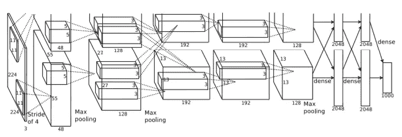
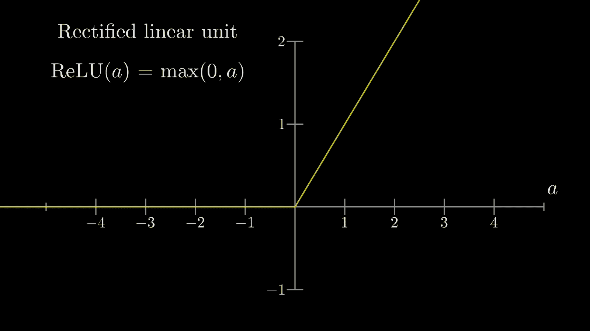
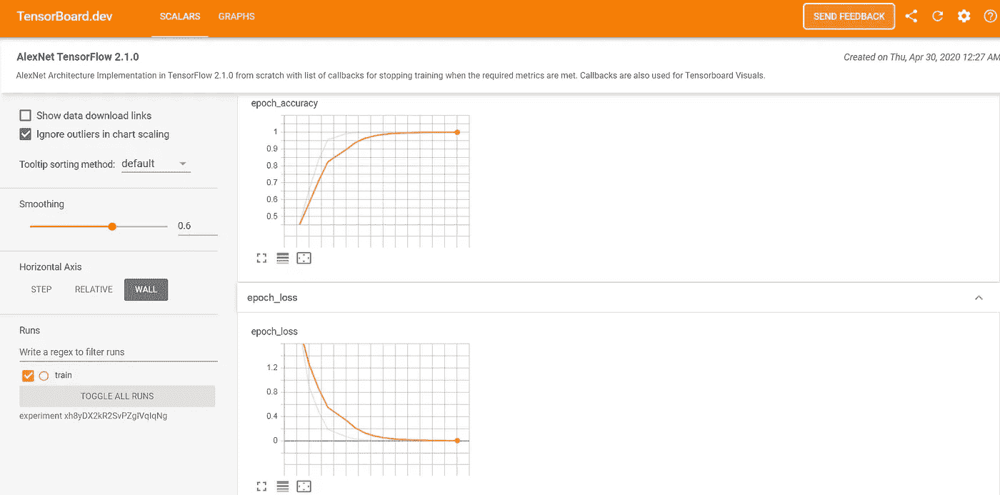
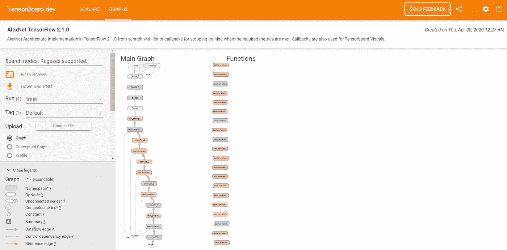
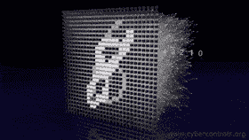

# 为了我们自己的分类任务，在 TensorFlow 2.1.0 中从头开始训练 AlexNet。

> 原文：<https://medium.com/analytics-vidhya/alexnet-tensorflow-2-1-0-d398b7c76cf?source=collection_archive---------3----------------------->

“人工智能是新的电力。”—吴恩达


揭秘深度学习

H *大家好！这是我在 Medium 网站上的第一篇帖子。来这里真的花了很长时间。我是一名汽车软件测试工程师，有电气工程背景。嗯，我知道你现在脑子里想的是* ***“他用深度学习搞什么鬼”。*** *等等吧，* *我等会儿再回答因为先有要事。*

我将从头开始创建 AlexNet 并在 five Flowers 数据集上训练它。本节将专门讨论在 [TensorFlow](https://www.tensorflow.org/) 2.1.0 中创建 [AlexNet](https://papers.nips.cc/paper/4824-imagenet-classification-with-deep-convolutional-neural-networks.pdf) ，这是一个端到端的开源机器学习平台。

# ***为什么选择 TensorFlow 2.x？***

TensorFlow 2.x 让 ML 应用的开发变得容易多了。通过将 Keras 紧密集成到 TensorFlow 中，缺省情况下的急切执行，以及 Pythonic 函数执行。

> 不像在 TensorFlow 1.x 中那样，您不再需要创建会话来运行计算图，而是直接查看代码的结果，而不需要创建会话。
> 
> 那多酷啊！

# AlexNet

AlexNet 是发表在计算机视觉上的一篇有影响力的论文，采用 CNN 和 GPU 来加速深度学习。根据作者的谷歌学术个人资料，截至 2020 年，AlexNet 的论文已被引用超过 61015 次。

AlexNet 是 ILSRVC-2012 的大赢家。该网络展示了**使用广泛可用的游戏**GPU 在大规模数据集上快速训练大型神经网络**的潜力。**

> 高计算能力和大型数据集的可用性 is❤️️
> 耶！深度学习正在腾飞的原因之一。
> “打破里氏震级的地震移位！”



研究论文中给出的 AlexNet 架构

## **Alex net 的六大理念**

**1。 *ReLU 非线性***

***ReLU*** *是所谓的不饱和激活。这意味着对于正向激活，梯度永远不会接近零，因此，训练会更快。换句话说，当激活(a)为负时 ReLu(a) = 0，当激活(a)为正时 ReLu(a) = a.*



**ReLU 可视化**

***2。用于训练的多个 GPU***

***3。局部响应归一化***

***4。数据扩充***

***5。测试时间数据扩充***

*拍摄单个测试图像的五个裁剪(4 个角&中心)及其水平翻转，对这 10 个增强图像进行预测。随后，对预测进行平均，以做出最终预测。*

***6。*辍学**

它在训练时使用 0.5 的辍学。这意味着在正向传递期间，该层所有激活的 50%被设置为零，并且也不参与反向传播。**在测试过程中，没有单个神经元像实时推理中那样被丢弃**。


辍学者的直觉

# TensorFlow 实现

> 是的，终于实现了！你刚刚发现了一个对你有用的小理论。老实说，为自己工作是一种享受。人，**就是这么回事，**我们去拿吧。

***使用环境:***

编辑:[py charm IDE](https://www.jetbrains.com/pycharm/)
*OS:Windows 10(64 位)
GPU:Nvidia GeForce GTX 1050
CPU:Intel i7–8750h*

培训时间:大约 17 分钟

# 我们在做什么？

1.  导入必要的包。
2.  获取数据集并分析它们。
3.  定义模型架构，耶！！！！！***AlexNet****来了…*
4.  为我们的深度学习模型的训练过程预处理数据集中的图像。
5.  用损失函数和优化器对其进行编译以用于训练。
6.  定义培训时要使用的回调。
7.  最后，我们训练模型并保存它。
8.  TensorBoard.dev 中训练过程和模型的可视化
9.  对训练好的模型进行评估。
10.  验证数据集的重要性。

第一步:
我将从导入必要的包开始。TensorFlow，NumPy，pathlib，Datetime。我会把版本打印出来供参考。

入门指南

```
Tensor Flow Version: 2.1.0
numpy Version: 1.18.2
```

**第二步:**

在这一节中，我已经指定了解压缩后的[数据集](https://storage.googleapis.com/download.tensorflow.org/example_images/flower_photos.tgz)的目录。

I)然后打印图像总数。
ii)通过读取数据集中子目录的名称，将类名打印为列表。iii)打印班级总数。

解压缩后数据集的文件夹结构如下所示。

```
flower_photos
|__daisy
|__dandelion
|__roses
|__sunflowers
|__tulips
|__LICENSE.txt
```

获取数据

```
3670
['daisy' 'dandelion' 'roses' 'sunflowers' 'tulips']
5
```

**第三步:**

这里我们定义一个 *AlexNet* 的模型架构。

I)如您所见，在每个卷积层之后使用批量归一化，而不是局部响应归一化。ii)在两个完全连接的层上，没有添加脱落层，而是在注释部分给出，因此如果你愿意，你可以调整它。像步幅和内核大小这样的参数被稍微调整了一下(*耶！我们正在成为深度学习的实践者*，然而内核的数量与 AlexNet 保持相同。

> 我没有添加一个脱落层的原因是，有时，它在神经网络的反向传播中表现得很奇怪。
> 
> 使用批量标准化的好处不仅仅是减少过度拟合，例如，通过为网络优化器提供使用更高学习速率的能力来加速训练。
> 
> 正如吴君如解释的那样，我说的是那些**“小小的婴儿步伐”** ❤️

AlexNet 架构

**第四步:**

在本节中，我们准备用于训练的数据，这意味着在将数据输入神经网络之前对其进行预处理。定义批次大小、高度、宽度和每个时期的步数。稍后调整大小，并根据需要使用 ImageDataGenerator 对图像进行预处理，这让您可以动态地完成所有工作，这是 Keras 的一个好礼物。

> 我怎么强调 ImageDataGenerator 对深度学习有多有用都不为过。

> ImageDataGenerator 接受原始数据，根据我们的需要用我们给出的参数对其进行随机转换，并只返回*新的、转换后的数据供训练时使用。*

为培训准备数据

```
Found 3670 images belonging to 5 classes.
```

**第五步:**

在本节中，我们将使用我们准备的数据来训练我们的深度学习模型。我们指定损失函数和优化器。要了解更多关于随机梯度优化，以及它如何不同于正常梯度下降看看下面的视频。

编译和总结模型

```
Model: "sequential"
_________________________________________________________________
Layer (type)                 Output Shape              Param #   
=================================================================
conv2d (Conv2D)              (None, 55, 55, 96)        34944     
_________________________________________________________________
batch_normalization (BatchNo (None, 55, 55, 96)        384       
_________________________________________________________________
max_pooling2d (MaxPooling2D) (None, 27, 27, 96)        0         
_________________________________________________________________
conv2d_1 (Conv2D)            (None, 27, 27, 256)       2973952   
_________________________________________________________________
batch_normalization_1 (Batch (None, 27, 27, 256)       1024      
_________________________________________________________________
conv2d_2 (Conv2D)            (None, 27, 27, 384)       885120    
_________________________________________________________________
batch_normalization_2 (Batch (None, 27, 27, 384)       1536      
_________________________________________________________________
conv2d_3 (Conv2D)            (None, 27, 27, 384)       1327488   
_________________________________________________________________
batch_normalization_3 (Batch (None, 27, 27, 384)       1536      
_________________________________________________________________
conv2d_4 (Conv2D)            (None, 27, 27, 256)       884992    
_________________________________________________________________
batch_normalization_4 (Batch (None, 27, 27, 256)       1024      
_________________________________________________________________
max_pooling2d_1 (MaxPooling2 (None, 13, 13, 256)       0         
_________________________________________________________________
flatten (Flatten)            (None, 43264)             0         
_________________________________________________________________
dense (Dense)                (None, 4096)              177213440 
_________________________________________________________________
dense_1 (Dense)              (None, 4096)              16781312  
_________________________________________________________________
dense_2 (Dense)              (None, 5)                 20485     
=================================================================
Total params: 200,127,237
Trainable params: 200,124,485
Non-trainable params: 2,752
_________________________________________________________________
```

获得对随机梯度下降的直觉。

**第六步:**

这里我们定义了模型训练时要使用的回调函数。

定义模型训练时要使用的回调

**第七步:**

最后，我们训练模型。值得注意的是，即使当我们指定 epochs = 50 时，模型也只训练了 17 个 epochs，这是因为当达到一定程度的准确性和损失时，我们使用回调来停止训练。

> 很长一段时间，我都在说训练模型，嗯！那是什么意思？
> 这意味着我们的模型是**学习神经元的权重**，以将输入映射到输出。我们正在处理的是一个监督学习问题。也就是说，我们向神经网络展示，对于这个输入，这是输出。然后，我们的模型使用输入和输出数据进行学习，优化器将尝试减少我们指定的损失。
> 该模型可用于对我们将实时提供的图像进行预测。

保存模型是很重要的，因为以后您可以使用它在任何您想要的地方部署它。我们可以使用它来部署在轻量级嵌入式设备上，如 Raspberry Pi，通过将其转换为 [TFLite](https://www.tensorflow.org/lite) 模型来移动设备。或者你甚至可以使用 [TensorFlow.js](https://www.tensorflow.org/js) 在浏览器上部署它

定型和保存模型。

我的博客越来越长了🤯😅 *…所以你可以在这里* 找到培训进度[](https://drive.google.com/file/d/1xwyT1GcV4P2INzvt-tP2wH8f8eW9W5sw/view?usp=sharing)

***第八步:***

*TensorBoard 是一个使实现透明的好工具。这样你就可以请其他的*深度学习者*来调试你的模型，或者演示为什么你的模型表现良好。
您可以按照 cmd 中的以下命令将其上传到 TensorBoard.dev 并获取 TensorBoard 可视化的链接。*

*PS:“日志”是培训期间将存储的日志目录。*

> *关于 TensorBoard 有趣的事情是，你可以跟踪你的模型在训练后的表现。酷！*

```
*tensorboard dev upload --logdir logs \
    --name "AlexNet TensorFlow 2.1.0" \                               
    --description "AlexNet Architecture Implementation in TensorFlow 2.1.0 from scratch with list of callbacks for stopping training when the required metrics are met. Callbacks are also used for Tensorboard Visuals."*
```

*这里可以看到张量板可视化[](https://tensorboard.dev/experiment/xh8yDX2kR2SvPZgIVqIqNg/)**。***

****

****精度** (y 轴)对**时期** (x 轴)和**损耗** (y 轴)对**时期** (x 轴)的曲线图**

****

**张量板上的模型图**

****第九步:****

****

**示例:神经网络识别[手写数字](http://yann.lecun.com/exdb/mnist/)**

**在本节中，我们将评估模型性能。尽管我可以在训练文件本身中完成，但我是在一个单独的文件**中完成的，只是为了让您知道我们可以在以后使用保存的模型对实时数据进行推断或评估。** 我在[谷歌图片](https://www.google.com/imghp?hl=en)为 5 个班级的每一个班级随机下载了 10 张图片(总共 50 张)。将它存储在与训练数据集相同的目录结构中，以便使用 ImageDataGenerator 进行评估。**

```
**Test_set
|__daisy
|__dandelion
|__roses
|__sunflowers
|__tulips**
```

**代码与模型训练中已经解释过的代码相同。但不同的是，我们加载的是一个已保存的模型。后来，使用我们从网上获得的测试数据来做推断，以找出我们的模型在**看不见的数据上表现如何。****

**然后打印精度。**

**对训练模型的评估**

```
**48
['daisy' 'dandelion' 'roses' 'sunflowers' 'tulips']
5
Found 50 images belonging to 5 classes.Model: "sequential"
_________________________________________________________________
Layer (type)                 Output Shape              Param #   
=================================================================
conv2d (Conv2D)              (None, 55, 55, 96)        34944     
_________________________________________________________________
batch_normalization (BatchNo (None, 55, 55, 96)        384       
_________________________________________________________________
max_pooling2d (MaxPooling2D) (None, 27, 27, 96)        0         
_________________________________________________________________
conv2d_1 (Conv2D)            (None, 27, 27, 256)       2973952   
_________________________________________________________________
batch_normalization_1 (Batch (None, 27, 27, 256)       1024      
_________________________________________________________________
conv2d_2 (Conv2D)            (None, 27, 27, 384)       885120    
_________________________________________________________________
batch_normalization_2 (Batch (None, 27, 27, 384)       1536      
_________________________________________________________________
conv2d_3 (Conv2D)            (None, 27, 27, 384)       1327488   
_________________________________________________________________
batch_normalization_3 (Batch (None, 27, 27, 384)       1536      
_________________________________________________________________
conv2d_4 (Conv2D)            (None, 27, 27, 256)       884992    
_________________________________________________________________
batch_normalization_4 (Batch (None, 27, 27, 256)       1024      
_________________________________________________________________
max_pooling2d_1 (MaxPooling2 (None, 13, 13, 256)       0         
_________________________________________________________________
flatten (Flatten)            (None, 43264)             0         
_________________________________________________________________
dense (Dense)                (None, 4096)              177213440 
_________________________________________________________________
dense_1 (Dense)              (None, 4096)              16781312  
_________________________________________________________________
dense_2 (Dense)              (None, 5)                 20485     
=================================================================
Total params: 200,127,237
Trainable params: 200,124,485
Non-trainable params: 2,752
_________________________________________________________________1/2 [==============>...............] - ETA: 3s - loss: 1.4212 - accuracy: 0.7188
2/2 [==============================] - 5s 2s/step - loss: 1.1020 - accuracy: 0.7000
accuracy:70.00%**
```

**万岁！ **70%精度**。对于一个在训练时甚至没有使用验证集的模型来说，这是公平的。嗯！对于一个模型来说，通过让它对没有接触到的数据进行更好的归纳，它有可能在看不见的数据上表现得更好。**

> **然而，我们做了很好的工作，为从网上随机下载的花卉图片建立了 5 类分类模型。**

****第十步:****

> **我们的模型可能对训练数据有一点过度拟合。如果它在测试数据上表现不好。因此，我们需要在训练时使用验证数据，这样我们就可以轻松地调试我们的模型。我们还应该考虑调整网络的参数和超参数。**

**可以在 ImageDataGenerator 中指定 validation_split，以使用可用数据的一部分作为验证集。**

## **参考资料:**

> **💭“冬天来了。”**

**链接到花卉数据集是[这里](https://storage.googleapis.com/download.tensorflow.org/example_images/flower_photos.tgz)。
此处为[到随机下载的测试图像数据集的链接。
链接到保存的模型是](https://drive.google.com/file/d/1r1wMFZ6khj11a5WppqD7U-UsHyuL5EQW/view?usp=sharing)[这里的](https://drive.google.com/file/d/1qecUu7ptWbPvJo6NM_OyVBbyTeVnAVs0/view?usp=sharing)。
链接到仓库是[这里是](https://github.com/PraveenKumar-Rajendran/AlexNet_TF2.1.0)。
链接到 AlexNet 的论文是[这里](https://papers.nips.cc/paper/4824-imagenet-classification-with-deep-convolutional-neural-networks.pdf)。**

# **完成事情**

> **大多数读者没能坚持到博客结束，但你做到了，因为你是特别的，不会放弃阅读。**

**我希望我教会了你一些东西。如果你觉得这篇文章很有用，那么**请鼓掌**并拿着它一会儿，以便我的博客能更好地接触到需要它的人。
如果您有任何疑问、澄清、改进建议，请在 LinkedIn 上联系我，并在 GitHub 上提出问题。**

**阿哈！我差点忘了回答你一开始就想到的问题。没问题，我明白了！嗯，我的职业是软件测试员，但这并不能阻止我做我想做的事情。**

> **"当某件事足够重要时，即使机会对你不利，你也要去做。"——埃隆·马斯克**

 **[## 普拉文作品集

### 写一些我喜欢的人是我不经意的事情，那时他们都很矮。希望能进化一下。它…

praveenkumar-raje ndran . github . io](https://praveenkumar-rajendran.github.io/)** **[](https://www.linkedin.com/in/praveenkumar-rajendran/) [## Praveenkumar Rajendran -汽车嵌入式软件测试工程师- SL 公司| LinkedIn

### 具有电气工程背景的热情的学习者和工程师。外部照明软件测试仪

www.linkedin.com](https://www.linkedin.com/in/praveenkumar-rajendran/)** **[](https://github.com/PraveenKumar-Rajendran) [## PraveenKumar-Rajendran -概述

### 在 GitHub 上注册你自己的个人资料，这是托管代码、管理项目和构建软件的最佳地方…

github.com](https://github.com/PraveenKumar-Rajendran)**