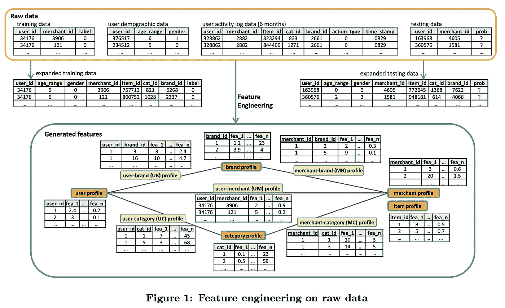

# 发明算法是经理最好的朋友

> 原文：<https://medium.com/analytics-vidhya/algorithm-of-invention-is-the-managers-best-friend-63ec53c3e295?source=collection_archive---------18----------------------->

## 或者如何在算法上创新

[40 种创新模式](https://www.quality-assurance-solutions.com/Triz-Inventive-Principles-1.html)

我的第一个教育与机械工程有关，尽管我参与数据科学超过 16 年，但当我作为数据科学经理工作时，来自工程的许多想法使我能够做出更强有力的决定。

我记得我在大学的第四年，我们的教授(36 岁的理学博士)慢慢走过一个巨大的老式自习室，里面有直接来自哈利波特电影的大长椅。他是一个非常简洁和优秀的讲师，这就是为什么他对发明的[算法的介绍是我参加过的最精彩的课程，现在我正在我的日常数据科学工作中使用它。从今以后，我想告诉你更多关于数据科学的自动化，以及如何使用它来计划 ML 项目的发展。](http://www.modern-triz-academy.com/pillars_triz.html)

因为这篇文章会很长，所以让我给出一个简短的计划:

*   首先，我将介绍一些来自一般形态学分析的概念和 Zwicky 盒作为这一理论最显著的概念
*   然后，我将展示一些 Zwicky box 如何用于数据科学的例子，并通过著名的 Kaggle 竞赛的获奖解决方案进行说明
*   一篇文章的中心部分致力于 *ML 遗产的理念—* 每个模型(尤其是最流行的)都有一个很少重新审视的庞大概念层，通过改进它可以“免费”提高模型的性能，即不需要太多的功能工程、试错和调整
*   最后，我将提供利用 legacy 作为 Zwicky 轴心的具体例子，然后以发人深省的事情结束。

# 茨威基盒基础

通用形态分析(GMA)是由[弗里茨·兹维基](https://en.wikipedia.org/wiki/Fritz_Zwicky)——加州理工学院(Caltech)的瑞士天体物理学家和航空航天科学家——开发的，作为一种结构化和调查多维、不可量化、创新的复杂问题中包含的全部关系的方法。

Zwicky 将这种方法应用于各种领域，如天体物理物体的分类，喷气和火箭推进系统的开发，以及太空旅行和殖民的法律方面。他成立了形态学研究协会，并在大约 30 年的时间里热情地推进“形态学方法”——从 20 世纪 40 年代到他 1974 年去世。

Zwicky 盒(如下图所示)是普通形态学的一个关键概念:

摘自[http://www.swemorph.com/pdf/gma.pdf](http://www.swemorph.com/pdf/gma.pdf)

该方法首先确定和定义要研究的复杂问题的参数(或维度)，并为每个参数分配一系列相关的“值”或条件。形态学盒子(也称为“Zwicky 盒子”)是通过在一个 n 维矩阵中相互设置参数来构建的(见图 1a)。n 维盒子的每个单元包含来自每个参数的一个特定“值”或条件，并因此标出复杂问题的特定状态或配置。

例如，想象一个简单的复杂问题，我们将它定义为由三个维度组成——比如说“颜色”、“纹理”和“尺寸”。为了符合图 1a，让我们进一步定义前两个维度，每个维度由 5 个离散的“值”或条件组成(例如，颜色=红色、绿色、蓝色、黄色、棕色)，第三个维度由 3 个值组成(大小=大、中、小)。然后，Zwicky 盒中有 5x5x3 (= 75)个单元，每个单元包含 3 个条件，即每个维度一个条件(例如红色、粗糙、大)。整个三维矩阵是一个*类型域*，包含所有(形式上)可能涉及的关系。

这个具体的例子只使用了三维，但是在实际问题中，你可以根据需要自由地创建任意多的维度和轴。看看工程中的具体例子:

摘自 http://www.swemorph.com/ma.html

这个表怎么看？灰框表示轴，蓝框表示防空洞要求的一种可能选择，在这种情况下，防空洞应该为小城市设计，具有人道主义目标，大而不拥挤，有新的建筑，没有具体的维护要求，优先考虑有需要的人。通过选择不同的细胞我们可以立即得到一些其他的庇护，非常方便。

# 数据科学中的 Zwicky 盒

到目前为止还不错，但是……这在数据科学中行得通吗？当然是的！

让我们考虑两个 ML 比赛作为例证。第一个目标是确定哪些电子商务买家可以转化为固定的忠实买家，然后锁定他们，以降低促销成本，提高投资回报率(ROI)。在 2015 年国际人工智能联合大会(IJCAI)上，阿里巴巴举办了一场基于 2014 年 Tmall.com“双 11”购物活动销售数据的重复购买者预测国际比赛。让我们来看看论文的中心图，它概述了获胜的解决方案:

竞赛的获胜者是如何设法创造出许多特色的

在他们的论文中，作者称 Zwicky 轴为轮廓，甚至在轴上应用操作符来生成特征。论文提出了*交互、平均、多样性、新近性、*和许多其他轴，因此为了清楚地说明，让我们考虑如何使用 Zwicky box 来生成特征。

假设我们的轴是*用户*和*商家*，操作者是*总计数*(即我们使用过去的全部数据进行计数，而没有过去的周/日等限制)。然后通过在*用户*轴上应用计数运算符，我们可以得到这些特征:

为商家创建类似的功能非常简单(即商家和柜台是我们的轴) :

为了实现 *recency* 轴，我们可以通过某个时间框架(比如最近一周)来约束 count 操作符。然后通过结合*用户、商家、*和*新近度*轴，我们可以很容易地得到各自的特征:

以这种方式继续下去，一个人可以在几分钟内获得成千上万个特征的想法！显然不是所有的都同样有用，所以特征选择是 ML 建模管道的重要部分，但是对于初学数据的科学家来说，仅仅是产生特征的想法是一件乏味且难以管理的事情。从今以后，让这个过程自动化是非常有意义的。

事实上，如果上面的这些操作符是二元和关联的，那么通过引入平凡轴(简单地保持特征不变而不生成)，我们甚至可以在轴上形成 Zwicky *幺半群*，从而自动生成特征*(关于幺半群的更多细节，请参见这篇[精彩文章](https://notes.asaleh.net/posts/monoid-pattern-in-python/))。通过这样做，一个成功的解决方案的作者已经创建了 1000 多个特性，并且测试了更多的特性。*

*对我来说，这种类型的另一个出色的例子是[脸书缺失链接预测挑战](http://www.kaggle.com/c/FacebookRecruiting/)。获胜的解决方案也隐式地使用 Zwicky box 来生成特征。这是最主要的特征，你能在那里发现 Zwicky 轴吗？*

**

*要阅读完整的故事，请阅读[埃德温·陈的 10 个地方解决方案](https://blog.echen.me/2012/07/31/edge-prediction-in-a-social-graph-my-solution-to-facebooks-user-recommendation-contest-on-kaggle/)*

# *但这真的只是关于特征工程吗？*

*当然不是。一般形态分析是一种综合的方法，“只是一种有序的看待事物的方式”(正如茨威基曾经说过的)，从今以后，它可以应用于自动化整个创造力的过程，因此，它广泛应用于工程，艺术和许多其他领域，创造力是一个基石。但是让我们定义一些轴来建设性地回答我们的问题。*遗留*作为轴心怎么样？*

*遗留和可重用性是工程和数据科学的基石。几乎所有的普通数据科学家都不假思索地调用 model.fit()，这种行为不会带来任何不好的结果。但有时你必须停下来，开始打破常规思考，因为回报可能会很丰厚。*

*一个非常常见的挑选低挂果实的管理决策是设计尽可能简单的模型(线性、kNN 或类似的),甚至避免任何建模，尝试一些手动调谐旋钮。但是仔细看看:如果你可以采用目前生产中更强大的模型，只需一个小的修改就能彻底改变它，那会怎么样？*

*看看这一系列的概念(“graph”“random walk”->“list of visited nodes”->“word 2 vec”->“embedding”)，让我们发现微小但强大的改进。首先引起我注意的是取样:*

**

*https://cvgl.stanford.edu/papers/song_cvpr16.pdf*

*整个 word2vec 很长一段时间都是围绕对比损失展开的，这段代码是高度优化的，并且是用 C++编写的，所以对于大多数数据科学家来说，在这里进行更改并不容易。因此，他们只需在项目中导入 word2vec 代码，并享受结果的速度和可预测性。很多图嵌入(像 DeepWalk)也导入 word2vec 代码，瞧！SkipGram 的隐藏机制现在深深地隐藏在许多层地面(和灰尘)下。*

*但是，如果您简单地用一些现代的东西(如提升的结构化嵌入)来代替对比损失，您可以获得高达 15%的收益:*

**

*来自 https://cvgl.stanford.edu/papers/song_cvpr16.pdf[的](https://cvgl.stanford.edu/papers/song_cvpr16.pdf)*

*这不仅仅是 word2vec 类代码中的采样方法，在其他条件相同的情况下，可以对其进行修改以提供如此强大的改进。另一个卓有成效的概念是学习率。如果我们使用众所周知的循环 LR，而不是普通的多项式 LR 调度(也是 word2vec 的常见调度),会发生以下情况:*

**

*让我提醒你这个想法:让学习率在一个值的范围内变化，而不是采用一个线性或指数递减的值。你可以通过设定一个明确的学习率范围来做到这一点，然后不去做任何线性或指数变化，而是从定义的范围内周期性地改变学习率。*

*通过实现这个逻辑(并且不改变其他任何东西)，我们可以得到以下结果:*

**

*模型#4(表格的最后一行)是一些生产模型，其中仅应用了循环学习率策略(其他没有修改)。但是 F1 已经从 0.85(针对 v.1.1 车型)提升到 0.89 了！不错吧。*

*再举一个例子，考虑用固定大小的向量来表示图形及其组成部分(节点、边和一些相关的辅助信息)的多种方式，例如 word2vec。*

*我喜欢图形(我的博士论文是关于多模态图形嵌入的)，从今以后，我选择了我最喜欢的论文来追踪它的历史，以便找出某人如何能写得更快。这篇论文是关于[图注意网络](https://arxiv.org/abs/1710.10903)的，其思想是建立一个用于图结构数据分类的模型。作者已经通过计算所谓的“T2”潜在的“T3”节点表示实现了这个目标，这些节点表示是由“T4”在它们邻居的“T5”上参与的。*

*我不打算深入探究这种方法的细节，而是想强调一下*方式* **纸张是如何构造的。这是一张由作者制作的幻灯片，介绍了*图形注意力*的核心概念:***

**

*因此，作者使用共享变换矩阵 W 和非线性激活函数(LeakyReLU)将节点(和相关特征)映射到某个潜在空间，并使用以下公式定义关注系数:*

**

*这看起来像是 softmax 函数在嵌入式节点上的一个相当简单的应用，分母中的和是在所讨论的节点的最近邻居之上。*

*在这里，我解释了一些事情，就好像有人一直在创造这张纸，从一开始就被 Zwicky box 所保护。但事实并非如此——这个过程是高度进化的，并不简单。*

*让我们阅读 OpenReview 评论来了解更多关于受害者的信息。正如我的研究显示，至少有一半的文章是作为对大量评论的回应而写的，但不是根据一些最初的概念。这篇论文确实与评论者进行了长期的斗争，他们中的许多人指出，作者通过用一种注意机制取代每一层的聚合和采样功能来改进 GraphSAGE，这种整体取代是对新颖性的唯一贡献。连 LeakyRELU 都是在审稿人的压力下被引入模型的！*

*如果我们将 legacy 作为一个轴，我们可以发现泄漏的 ReLU 是一个非常过时的损失函数(可能是 eLU，SELU，并且在论文撰写时肯定是 pReLU，这取决于问题和数据)。串联是另一件事，它可以被自我关注取代(而作者用平均取代了串联)。但更重要的是，如果注意力被用作 Zwicky 轴，然后像激活函数和其他一些次要的东西被用作共同的“成分”，那么这篇论文可能会早两年被发明出来。*

*事实上，这是我们概念的时间表，是我用谷歌学术和一些审查建立的:*

**

*注意力作为一个神经科学概念存在了很长时间(至少自 90 年代初以来)，到图形注意力网络论文发表时(2018 年)，注意力[已经由 Ruslan Salahutdinov 在其著名的“*用视觉注意力*学习生成模型”论文中引入](https://arxiv.org/abs/1312.6110)到深度学习世界。*

*但是在鲁斯兰的作品之后不久，注意力扩散到了 NLP 领域和 [skipgram with attention](https://www.cs.cmu.edu/~ytsvetko/papers/emnlp15-attention.pdf) 以及超过 12 种其他类型的注意力被创造出来[一个出色的证明](/@joealato/attention-in-nlp-734c6fa9d983)。著名的自我关注[从 2016 年](https://arxiv.org/pdf/1601.06733.pdf)(阿成的论文)开始就有了，到 2018 年初就知道了很多其他类型的关注。这意味着，[图形注意力网络](https://arxiv.org/pdf/1710.10903.pdf)可能是在 2016 年或更早的时候发明的！*

*作为另一个例子，考虑 *max-margin* 作为支持向量机的基础，它已经在 1963 年被引入。到 2013 年[没有多少人尝试](https://arxiv.org/pdf/1709.07604.pdf)引入这个概念，比如说，嵌入图形！*

*考虑到这一点，想象一下，如果我们有意识地创新，使用发明算法将点点滴滴联系起来，创造论文和想法，我们会进步得多快！*

*我很高兴找到一些论文，很明确地利用了遗产，这是我最喜欢的一篇:[https://arxiv.org/pdf/1904.03751.pdf](https://arxiv.org/pdf/1904.03751.pdf)*

*因此，即使对于一个从业者来说，在想法空间中操作*也是非常有用的，而不是在纸上空间。如果你的团队只能克隆一些论文的代码，而没有任何进步来反映最新的艺术状态，这将整个团队置于落后于所有竞争对手的位置(你是在一个论文空间中操作的，受到你选择的论文中所说内容的约束)。在考虑将模型推广到生产之前，至少必须尽可能地摆脱遗留问题，因为在我们这个动态开放的世界中，论文发表后一切都可能发生变化。**

*例如，看一下陈论文的引文:你可以清楚地看到相当强的 NLP 偏向。这意味着即使在今天，也没有多少人意识到注意力过度集中是多么强大，与 NLP 无关的科学家正在错过这个机会。注意力过度注意力绝对是 Zwicky 轴，特别是对于图形相关的应用！*

*如果我要提出一些客观标准来分类科学论文，我会建议检查提交的论文是否属于某个 Zwicky 幺半群。如果它的想法可以很容易地用一些轴分解，除了这些轴之外，它没有什么可说的，我会宣布这篇论文为 *Zwickian，*，根据会议的级别，这可能是拒绝的理由。相比之下，一些论文是*的基础*，不能被简化成一些故事，通过轴来讲述。例如，Salahutdinov 的论文是*探索*多种方法来吸引对 CV 模特的关注，甚至不仅仅是关注。因此，至少对我来说，这篇论文是基本的。*

# *结论*

*数据科学和创新理论必须成为最好的朋友。碰巧的是，数据科学避开了“大”科学或普通科学，但当然这种差距必须主动最小化，因为否则数据科学就有与软件工程过于相似的风险。正如我们将在未来的帖子中看到的，数据科学的发展通常遵循技术发展的共同规律，因此它的发展可以被控制和加速。*

*第二，如果以一种适当的、系统的方式来考虑，ML 遗产**就是**力量。如果不考虑遗留问题，就很难定期、频繁地实现合理的性能提升。*

*Zwicky 盒子或者发明的算法是下一个大炒作吗？是也不是。*

*可以肯定的是，比如说，谷歌学术可以公开进行公共批量分析，这将极大地加速科学进步，因为那时写论文将是一项持续的时间努力——只需使用一些科学网络来揭示茨威基轴，应用这些来构建概念并评估它们的新颖性，当你达到梦想中的会议的新颖性水平时就停止。毕竟，如果你仔细观察，这种新颖性水平是非常低的:一篇 DeepWalk 论文的作者只是以非常直接的方式将 SkipGram 应用于图，并没有做出任何与图具体相关的贡献(毕竟，将一组随机行走作为 SkipGram 的输入的想法是表面上的)，但这篇论文仍然在 SIGKDD 和其他大中型会议上被接受。*

*不难看出这会适得其反！*

*考虑同样的 DeepWalk:论文的分支，引入深度图性质，到 2017 年才开始！到那时，其他作者已经挤得水泄不通，这是太快成功，这是不容易错过的。他们在某种程度上使用了 Zwicky 盒，因为否则，他们必须处理图论中过于复杂的概念。*

*所以，发明算法是一把双刃剑。只有当斧子足够强大时，它才能正常工作。从长远来看，这对普通科学是有害的，因为现在没有多少人梦想成为另一个爱因斯坦。但是正如我们在上面看到的，对于 DS 经理来说，发明算法可能是救命稻草！*

*我们会见证由算法引导的可预测的垂直科学进步的日子吗？*