# 异常检测的算法选择

> 原文：<https://medium.com/analytics-vidhya/algorithm-selection-for-anomaly-detection-ef193fd0d6d1?source=collection_archive---------1----------------------->

异常可以被定义为与数据集中的大多数观察值相差很大的观察值，认为它们是由不同的、非正常的生成过程产生的。异常是指与数据集中的其他观测值偏离太多而引起怀疑的任何观测值。简而言之，异常是数据集内*罕见*和*显著不同*的观察结果。

异常检测算法现在被用于入侵检测、欺诈检测、数据泄漏预防、数据质量、监视和监控等许多应用领域。正如我们所看到的，这些是各种各样的应用，有些需要非常快速、接近实时的异常检测，而有些则由于遗漏异常的高成本而需要非常高的性能。异常检测技术最常用于检测欺诈，其中恶意尝试/交易通常不同于大多数名义案例。下面概述了不同类型的异常情况:

**点异常**:较大数据集中的单个异常实例

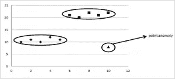

**集体异常:**如果一个异常情况被表示为一组许多实例，这被称为集体异常。

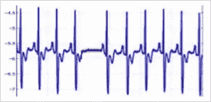

**语境异常:**在语境异常中，点可以被看作是正常的，但当考虑到给定的语境时，点变成了异常。

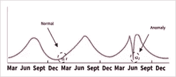

# **异常检测算法**

异常检测的解决方案可以构建在所有三种类型的机器学习方法中——监督、半监督和非监督，这取决于可用数据的类型。当异常已知并且标记数据可用时，监督学习算法可用于异常检测。当必须手工贴标签时，这些方法特别昂贵。支持向量机(SVM)或人工神经网络(ANN)等不平衡分类算法可用于监督异常检测。

半监督异常检测使用仅由没有任何异常的正常数据组成的标记数据。基本思想是，学习正常类的模型，并且任何与该模型的偏离都可以说是异常。流行的算法:自动编码器，高斯混合模型，核密度估计。

无监督学习方法最常用于检测异常，下图概述了主要的算法家族和可用于异常检测的算法。

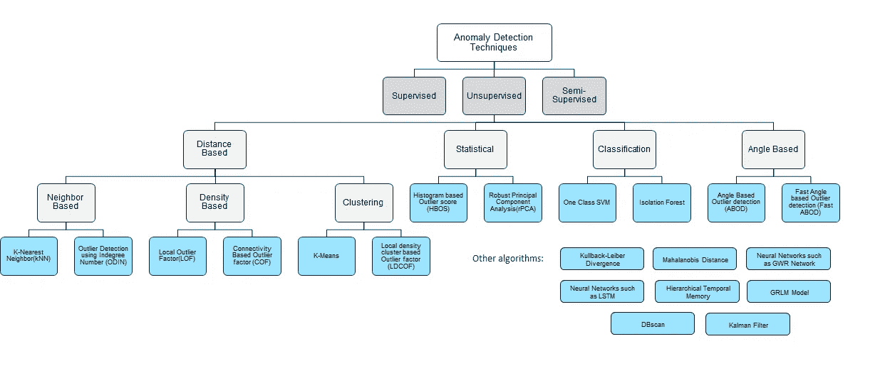

**K-最近邻(kNN):** kNN 是一种基于邻居的方法，主要用于识别异常值。对于每个数据点，检查整组数据点以提取具有最相似特征值的 k 个项目:这些是 k 个最近邻(NN)。然后，如果 NN 的大部分先前被分类为异常，则数据点被分类为异常。

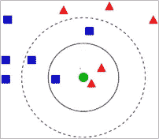

k-神经网络

**局部异常值因子(LOF):** 局部异常值因子是一种基于密度的方法，旨在发现局部异常。对于每个数据点，计算 NN。然后，使用计算的邻域，局部密度被计算为局部可达性密度(LRD)。最后，通过将数据点的 LRD 与先前计算的神经网络的 LRD 进行比较来计算 LOF 分数。

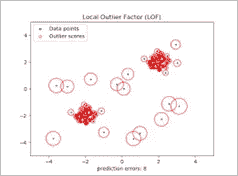

**局部异常因素**

**基于连通性的异常值因子(COF):** 基于连通性的异常值因子(COF)在数据点密度的计算上不同于 LOF，因为它也考虑了数据点之间的联系。在这种程度上，该方法采用最短路径方法，该方法使用最小生成树来计算链接距离

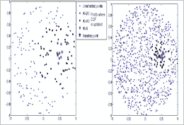

**基于连通性的异常因素**

**K-Means:** K-means 聚类是一种流行的聚类算法，它将数据点按其特征值分组为 K 个聚类。聚类内每个数据点的得分计算为到其质心的距离。远离其聚类质心的数据点被标记为异常。

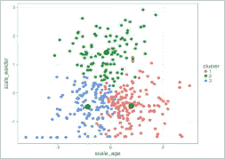

k 均值聚类

**稳健主成分分析(rPCA):** 主成分分析是一种常用于检测数据集中的子空间的技术。它还用作异常检测技术，使得与正常子空间的偏差可以指示异常情况。一旦确定了主成分，主要成分显示出与大多数数据的整体偏差，而使用次要成分可以显示较小的局部偏差。

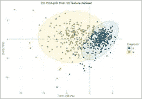

**稳健主成分分析**

**一类 SVM:** 一类支持向量机算法旨在学习一个决策边界来对数据点进行分组。它可用于无监督异常检测，使用数据集训练单类 SVM，然后根据数据点与确定的决策边界的归一化距离对每个数据点进行分类

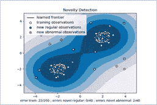

**一班 SVM**

**隔离林:**隔离林将数据点构建为隔离树的节点，假设异常是特征值与预期数据点相差很大的罕见事件。因此，异常比预期的数据点更容易被隔离，因为它们更靠近树根而不是树叶被隔离。由此可见，数据点可以被隔离，然后根据其与树根的距离进行分类。

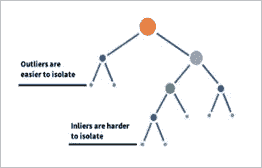

**隔离林**

**基于角度的离群点检测(ABOD):** 基于角度的离群点检测(ABOD)将数据关联到高维空间，使用一个数据点到其他点之间的角度的方差作为异常得分。基于角度的离群点检测(ABOD)方法为识别高维空间中的离群点提供了一个很好的选择

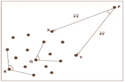

**基于角度的异常检测**

**Mahalanobis 距离:** Mahalanobis 方法仅标记离群值的距离空间。Mahalanobis 距离适用于针对由单个高斯形聚类组成的多元数据集的异常检测任务。模型参数是数据的均值和逆协方差矩阵。

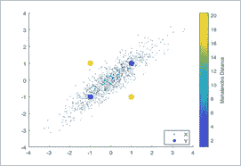

**马氏距离**

**自组织映射等神经网络:**也称为按需生长(GWR)网络，它是一种基于重构的非参数神经网络。它将输入空间中的自适应拓扑图形拟合到数据集。使用这种技术可以正确识别严重的异常值和密集的异常值云。

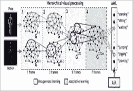

**高斯混合模型:**高斯混合模型(GMM)将给定数量的高斯分布拟合到数据集。使用期望最大化算法来训练该模型，该算法迭代地最大化似然性的下限。通过数据探索评估混合物的成分数量可能是复杂的

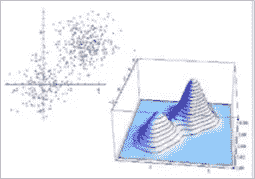

**自动编码器:**自动编码器是一种特殊类型的神经网络，它将输入值复制到输出值。关键思想是训练一组自动编码器来学习数据的正常行为，并在训练后使用它们来识别异常情况或异常。

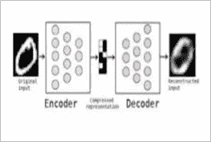

# **算法对比评估**

异常检测算法的选择是一项复杂的活动，需要考虑多种因素:*异常类型、可用数据、性能、内存消耗、可伸缩性和健壮性*。

**异常检测模型的性能**指标主要基于分配给给定数据点的布尔异常/预期标签，如精确度、召回率、F 值、准确度和 AUC。下图来自研究论文:*用于入侵检测的无监督异常检测算法的定量比较*，显示了算法家族相对于性能指标的相对性能。

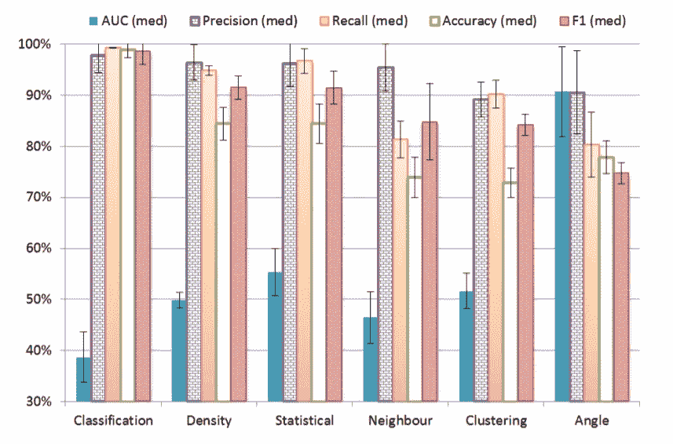

**训练&预测时间:**模型的可扩展性和消耗可以通过增加数据集大小和维度时不同方法所需的计算和预测时间来判断。下面的图表来自论文:*离群点检测算法的比较评估:实验和分析，*强调了算法在增加特征数量、训练时间和预测时间方面的相对性能。

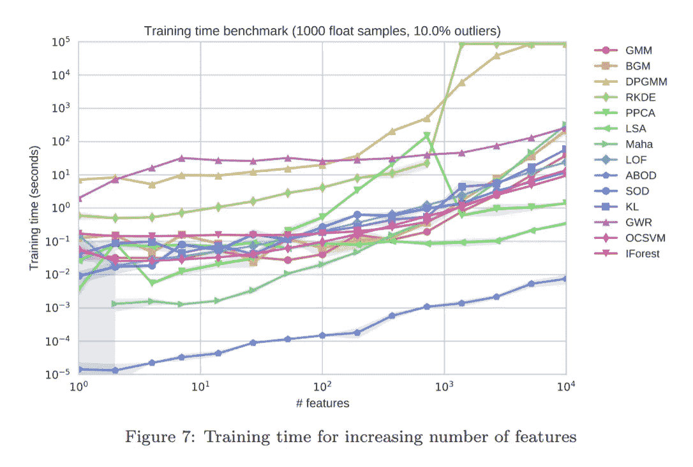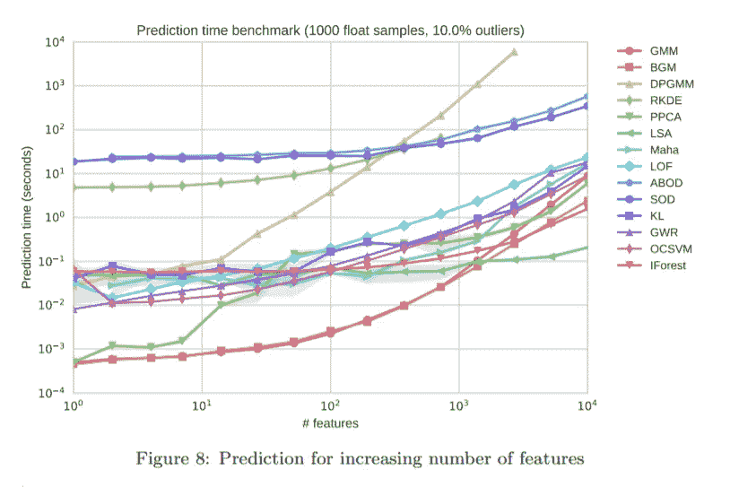

**健壮性&可扩展性:**很多异常检测方法都遭遇了维数灾难。检查每个算法对维数灾难的抵抗力是很重要的，在维数灾难中，我们在增加数据集维数的同时保持背景噪声的固定水平。来自论文的下图:*离群点检测算法的比较评估:实验和分析，*突出了算法在增加特征数量和平均精度方面的相对性能。

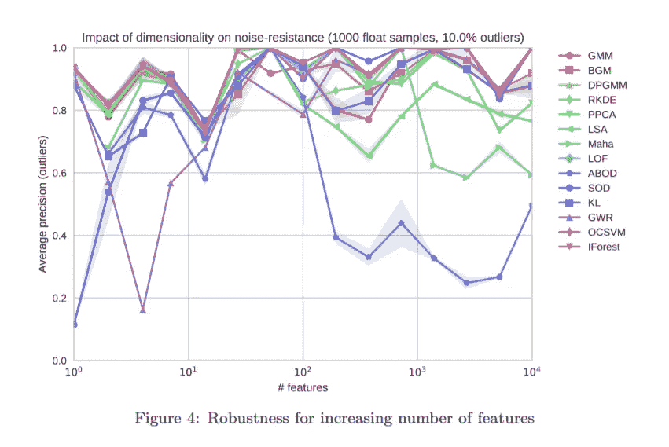

**内存使用:**一些算法对内存有很高的要求，因此在选择算法时应仔细考虑可用的硬件和可扩展性要求。来自论文的下图:*离群点检测算法的比较评估:实验和分析，*强调了算法在增加特征数量和内存使用方面的相对性能。

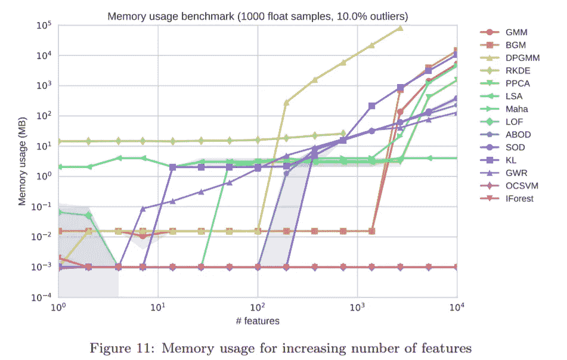

类似地，另一篇论文*多变量数据的无监督异常检测算法的比较评估*发表了对公开可用数据集的异常检测算法的比较通用评估的多个发现。下表包含来自本文的建议，其中在来自多个应用领域的 10 个不同数据集上评估了 19 个不同的无监督异常检测算法。

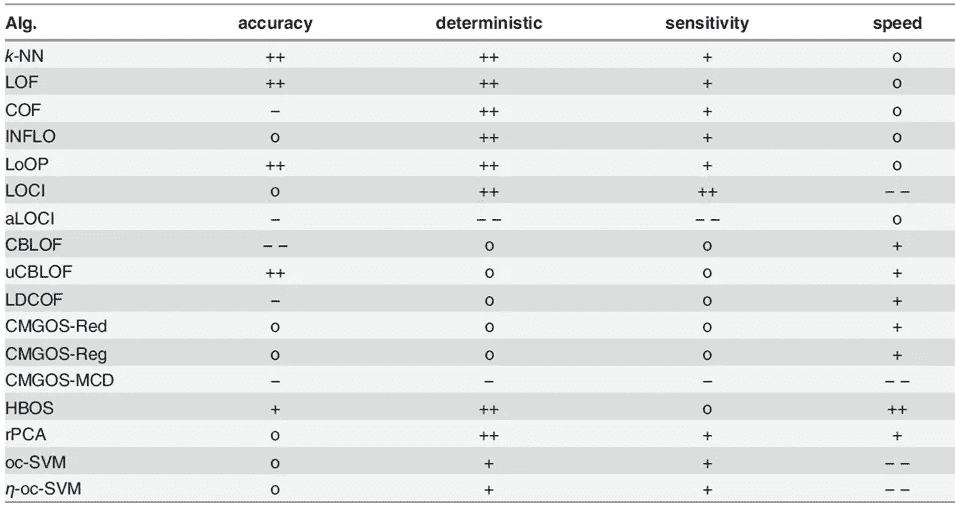

准确性——性能测量；确定性——评分的稳定性；灵敏度——模型对参数的灵敏度；速度——大型数据集的计算时间；—代表很差；o 代表平均值；++代表非常好

# 参考资料:

*   异常值检测算法的比较评估:实验和分析 Remi Dominguesa，Maurizio Filipponea，Pietro Michiardia，Jihane Zouaoui[https://www . research gate . net/publication/320025854 _ A _ comparative _ evaluation _ of _ outlier _ detection _ algorithms _ Experiments _ and _ analyses](https://www.researchgate.net/publication/320025854_A_comparative_evaluation_of_outlier_detection_algorithms_Experiments_and_analyses)
*   入侵检测的无监督异常检测算法的定量比较[https://www . research gate . net/publication/332816423 _ Quantitative _ Comparison _ of _ Unsupervised _ Anomaly _ Detection _ Algorithms _ for _ Intrusion _ Detection #:~:text = Quantitative %20 Comparison % 20 of % 20 Unsupervised % 20 异常% 20 检测% 20 算法% 20 for % 20 入侵% 20 检测，-Conference % 20 paper % 20(PDF&text =异常% 20 检测% 20](https://www.researchgate.net/publication/332816423_Quantitative_comparison_of_unsupervised_anomaly_detection_algorithms_for_intrusion_detection#:~:text=Quantitative%20comparison%20of%20unsupervised%20anomaly%20detection%20algorithms%20for%20intrusion%20detection,-Conference%20Paper%20(PDF&text=Anomaly%20detection%20algorithms%20aim%20at,the%20above%20deviations%20are%20observed.)
*   使用自动编码器的异常检测
*   多变量数据的无监督异常检测算法的比较评估 Markus Goldstein，sei ichi Uchida[https://www . semantic scholar . org/paper/A-Comparative-Evaluation-of-Unsupervised-Anomaly-Goldstein-Uchida/355692 EB 86 b 06 A 0a 23 af 45 c 106 cf b 02 c 95 BF 380 e](https://www.semanticscholar.org/paper/A-Comparative-Evaluation-of-Unsupervised-Anomaly-Goldstein-Uchida/355692eb86b06a0a23af45c106cfb02c95bf380e)
*   基于角度的离群点检测算法
*   PyOD 异常检测。