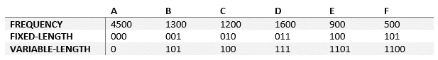

# 上下文#3 中的算法:霍夫曼码

> 原文：<https://medium.com/analytics-vidhya/algorithms-revisited-part-3-huffman-codes-7a60eca91d3b?source=collection_archive---------13----------------------->

> 你有没有想过像 WinRAR 或 WinZip 这样的数据压缩程序是如何工作的？你有没有问过自己，如果我们可以压缩数据，为什么不首先以那种方式存储和使用它？如果是这样，欢迎阅读本系列的第三章:**霍夫曼码。**

所以，我刚刚在 [HackerRank](https://www.hackerrank.com/dashboard) 解决了我离开近两年后的第 200 个问题，顺便提一下关于[霍夫曼解码](https://www.hackerrank.com/challenges/tree-huffman-decoding/problem)的问题，发现自己写了这个帖子。让我先问一个问题:如何修改你电脑中的数据以减少占用空间？由用**较少的位来表示相同的数据。**

*干得好，夏洛克，这是我们想不到的！但是不要太骄傲，因为最简单的想法通常是最有说服力的。考虑一个包含 10.000 个字符的文本文件。假设你用 8 位来存储一个字符，那么这个文本将在你的计算机中占据 80.000 位。但是如果我们能找到一种方法，用更少的比特来存储一个字符，我们就能降低文件的存储需求。*

**前缀码**

让我们稍微简化一下约束条件，这样我们就可以进行一些计算了。我们仍然有一个 10.000 字符长的文本，但我们只有从 a 到 f 的 6 个字母。如果我们对每个字符使用**固定长度代码**，我们可以用 3 位表示 6 个字母，整个文本将占用 30.000 位内存。

正如你所猜测的，还有其他方式来表现人物。我们可以使用**变长码**，而不是每个字符使用 3 位，通过存储的方式，变长码可以显著提高性能。为了实现这一点，我们将遵循两条规则:

*   文本中**出现频率较高的字符**将用较少的位数表示
*   代表字符的代码字应**可明确解码**

下面的例子直接摘自麻省理工学院的[算法简介](https://www.amazon.com.tr/Introduction-Algorithms-Thomas-H-Cormen/dp/0262033844)一书，这是一本令人惊叹的书，强烈建议任何对算法感兴趣的人阅读。在表格中，您可以看到我们文本中每个字母的**字母频率**、**定长**和**变长**表示。



使用**可变长度**代码，如果你想写单词“add ”,你需要写 *0 111 111* ,这比其对应的 *000 011 011* 的**固定长度**少需要 2 位。让我们计算一下，使用频率和可变长度代码来表示 10.000 个字符长的文本。


我们将文本的空间需求从 30.000 位减少到了 22.400 位，比%25 的改进稍多一点。更高的百分比是可以实现的，但是对于这个例子来说已经足够好了。

**构造霍夫曼码**

现在我们来谈谈我们是如何推导出**变长**码的。使用**明确可解码的**代码非常重要，因为否则，你将无法知道你的算法在解压缩阶段应该产生哪个字符。

一棵**二叉树**将帮助我们导出我们的变长码。在每一步，我们取频率最低的两个字母，将它们合并到一个父节点下，并将它们的总频率分配给它们的父节点(一个**优先级队列**可以帮助我们做到这一点)。我们将继续这样做，直到所有的字母合并到一个词根下。这是为我们的文本文件示例构建的最终树(频率以百分比给出*):*


一旦树被构建，你需要做的就是跟随边上的**位来获取一个字母的相应变长码**。这样，我们获得了一个**明确的**策略来解码每个字母，因为每个字母只有一条路径。

> 这里有一件额外的事情需要注意:因为我们对频率最高的字母使用最少的位数，这是一个**贪婪算法**。你可以在我的上一篇文章中阅读更多关于贪婪算法的内容。

现在让我们写一些代码。压缩文本应该很容易:你需要做的就是用相应的代码替换每个字符。所以，我只分享解压函数，我用来解决我在帖子开头提到的 [HackerRank](https://www.hackerrank.com/challenges/tree-huffman-decoding/problem) 问题。

```
void decodeHuffman(HuffmanTreeNode* root, string encoded) { HuffmanTreeNode* runner = root;
    for (char current : encoded) { if (current = '0') {
            runner = runner->left;
        } else {
            runner = runner->right;
        } if (runner->isLeaf()) {
            cout << runner->data;
            runner = root;
        }
    }
}
```

我们遍历编码字符串中的每个字符(可以是“0”或“1”)，并在构造的树中采用相应的路径。每当我们遇到一个**叶节点**，就知道找到了一个字母。然后，我们重置指针，并做同样的事情，直到整个文本被解码。

如此简单的东西却如此有效，这不是很神奇吗？霍夫曼码提供了一种非常简单快速的**无损压缩**方法，这启发了更多的压缩算法。

如果我们可以对数据进行**无损压缩**，那么为什么不总是在我们的计算机中使用压缩数据呢？因为压缩的数据不太容易处理。事实上，如果我们想要处理压缩的数据，我们需要一直做额外的操作，这样效率不会很高。例如，当我们使用**固定长度代码**来存储我们的文本时，我们知道每个字母与前一个和后一个字母的距离**正好是 3 位**。使用**变长码**时，不先解码能说出下一个字母有多少位吗？当然不是。这就是为什么我们使用固定格式来存储数据，即使它们包含一些冗余。

> 今天就到此为止，剩下的时间我会听铁娘子。我希望这篇短文能给你启发，下一节再见。