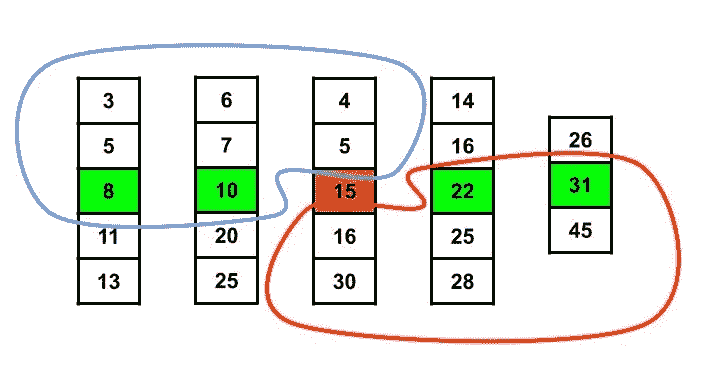

# 上下文#5 中的算法:顺序统计

> 原文：<https://medium.com/analytics-vidhya/algorithms-revisited-part-5-order-statistics-e9de74e64c3?source=collection_archive---------11----------------------->

> 如果我让你在一组无序的数字中找出第 k 个最小或最大的元素，你会怎么做？对数字进行排序？天啊，你真无聊…

当被要求寻找第 k 个最小元素时，大多数程序员立即用排序来回答。这是为什么呢？嗯，**因为简单！所有你需要做的就是调用一个*排序*函数，然后你就可以开始了。但是我们能做得更好吗？*我想如果我们不能……*我就不会写这个了**

让我们从寻找集合中最小/最大的元素开始。遍历所有元素一次就足以找到最小的元素。

```
int findSmallest(vector<int> elements) { int smallest = INT_MAX;
    for (int current : elements) {
        if (current < smallest) {
            smallest = current;
        }
    } return smallest;
}
```

当然，求第 k 个最小元素没这么简单。但我写这个是因为找到最小的元素和找到第 n 个最小的元素是一回事，所以我们试图开发一个通用算法，它将为每个 k 值工作。

> 很快，我们就会发现，寻找第 k 个最小元素也可以在 **O(n)** 时间复杂度内实现。

# 随机选择

在我之前关于[随机化算法](/swlh/algorithms-revisited-part-4-randomized-algorithms-f7677e292458?source=friends_link&sk=7e483ec89fee69d49657e3657d1d030f)的文章中，我展示了一个改善快速排序最坏情况的策略。在本节中，我们将采用相同的策略，但是我们将编写一个**随机选择**算法，而不是编写一个随机快速排序算法。

在**随机化快速排序**中，我们围绕随机选择的枢纽元素对集合中的元素进行分区，这样，左边分区中的每个元素都小于枢纽，而右边分区中的每个元素都大于枢纽。


如果我们对左边和右边的小块不断重复这个操作，我们最终会得到一个有序的集合。随机选择算法遵循非常相似的方法，但是这次我们不需要对整个集合进行排序。注意，我们只需要集合中的第 k 个元素，所以只要我们能够将正确的元素放入第 k 个索引中，其余的元素如何在集合中分布就与我们无关了。

随机化快速排序在每一步都递归地划分左侧和右侧。但是随机选择只对其中一个进行分区，这取决于枢轴索引是小于还是大于 *k* 。

下面给出了随机选择的算法，假设我们已经有了分区算法。如果你将它与[之前的文章](/swlh/algorithms-revisited-part-4-randomized-algorithms-f7677e292458?source=friends_link&sk=7e483ec89fee69d49657e3657d1d030f)进行比较，你会发现我们现在做的是一个递归调用，而不是两个。

```
int randomizedSelect(vector<int> nums, int left, int right, int k) { if (left == right) {
        return nums[left];
    } int pivot = randomizedPartition(nums, left, right);
    int size = pivot - left + 1; // count is the number of elements in the left partition
    if (k == size) {
        return nums[size];
    } else if (k < size) {
        return randomizedSelect(nums, left, pivot - 1, k);
    } else {
        return randomizedSelect(nums, pivot + 1, right, k - size);
    }
}
```

随机选择算法的**预期运行时间为 O(n)** 。用数学方法证明这一点并不容易，但是如果你感兴趣的话，你可以在[斯坦福的幻灯片](https://web.stanford.edu/class/archive/cs/cs161/cs161.1138/lectures/09/Small09.pdf)中找到。请注意，该算法的最坏情况运行时间是指数级的，因为我们可能会非常不走运，并且分区在每一步都需要 O(n)。

> 这就是我们试图用随机算法解决的问题，但我想这还不够好。然后让我们检查另一个可以保证在 O(n)中运行的选择算法。

# 中位数

现在让我们讨论如果我们选择了**中位数**作为枢纽元素会发生什么。Median 是中间元素，因此围绕它进行划分将保证将集合均匀地分成两个子集。

选择中间值的程序如下。*剧透警告，你不会喜欢这样的。*

1.  将集合分成 5 个元素的组。
2.  通过对组进行排序，找到每个组的中值。
3.  递归地找到这些中间值的中间值。



请注意，该算法没有找到精确的中值，而是找到了一个近似的中值。还要注意，左上角(蓝色)的每一项都小于中值，右下角(红色)的每一项都大于中值。

算法的其余部分以相同的方式工作，您围绕中间值的中间值划分输入集，并根据元素 k 的位置继续进行左或右划分。

为什么这个算法在 O(n)中运行的证明不是很简单，所以我们在这里不打算这样做。如果你想进一步阅读，你可以使用麻省理工学院的幻灯片。

在实践中，中值的计算非常重要，即使它是在 O(n)中运行的，所以它不是真正的首选。您可能希望使用随机选择算法，它在大多数情况下会优于中位数选择。也有一些技术根据输入集将两种方法结合起来。

> 所以你是说这不值得努力。你猜怎么着只管对元素进行排序，我都不在乎！