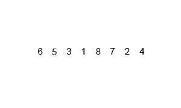
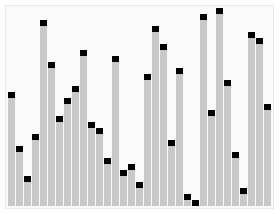

# JavaScript 算法

> 原文：<https://medium.com/analytics-vidhya/algorithms-with-javascript-75b867b74865?source=collection_archive---------11----------------------->

# JavaScript 算法的一天——里程碑 2(第 6 天——第 2 周)

今天，我们将简要讨论一些简单、基本但最常用的任何编程语言的算法，包括 JavaScript。我们将涵盖——阶乘和斐波那契等数学算法，线性搜索和二分搜索法等搜索算法，冒泡排序、选择排序、插入排序、合并排序、快速排序和堆排序等排序算法，以及它们的实现。所以，让我们跳进这篇有趣的文章。

## 1.阶乘

在数学中，正整数的阶乘 ***n*** ，用 ***n 表示！*** ，是所有小于等于 ***n*** 的正整数的乘积:

> **n！= n x(n-1)x(n-2)x(n-3)x…x 3 x 2 x 1**

举个例子，

> **5！= 5 x 4 x 3 x 2 x 1 = 120**

同样，
*6！= 720, 7!= 5040, 8!= 40320, 9!= 362880, 10!= 3628800*

***除外 *0！***= 1*(按惯例为空品)**

***迭代阶乘- JavaScript***

**

***递归阶乘- JavaScript***

**

# *2.斐波那契数*

*在数学中，斐波纳契数列是以下整数序列中的数字，称为斐波纳契数列，其特征在于前两个数字之后的每个数字都是前两个数字之和:*

> ***0，1，1，2，3，5，8，13，21，34，55，89，144，…***

****我发现这个很有趣:*** *一个由边长为连续斐波那契数的正方形组成的瓷砖**

**

> ***斐波纳契螺旋:**通过在斐波纳契镶嵌中画出连接正方形对角的圆弧而产生的黄金螺旋的近似；[4]这一个使用大小为 1、1、2、3、5、8、13 和 21 的正方形。*

**

***迭代阶乘- JavaScript***

**

***递归阶乘- JavaScript***

**

# *3.线性搜索*

*线性搜索或顺序搜索是一种在列表中查找目标值的方法。它按顺序检查目标值列表中的每个元素，直到找到匹配项或搜索完所有元素。线性搜索以最坏的线性时间运行，并且最多进行 n 次比较，其中 n 是列表的长度。*

**

> *线性搜索的**时间复杂度**是 **O(n)** 在**最坏情况下**我们正好检查每个元素一次。*

***线性搜索- JavaScript***

**

***为什么线性搜索效率不高** 毫无疑问，线性搜索很简单。但是因为它逐个比较每个元素，所以很耗时，因此效率不是很高。如果我们必须从 1，000，000 个数字中找出一个数字，而这个数字位于最后一个位置，那么线性搜索技术将变得非常乏味。*

*所以我们也要学习冒泡排序、快速排序等更高效的算法。*

# *4.二进位检索*

*一种简单的搜索算法，通过将搜索间隔重复分成两半来搜索排序后的数组。以覆盖整个阵列的间隔开始。*

*如果搜索关键字的值小于间隔中间的项目，则将间隔缩小到下半部分。否则缩小到上半部分。重复检查，直到找到值或间隔为空。*

****

> ***二分搜索法**的思想是利用数组排序的信息，将**时间复杂度**降低到 **O(log n)** 。*

***二分搜索法— JavaScript***

**

# *5.冒泡排序*

*冒泡排序是一种简单的排序算法，它重复遍历要排序的列表，比较每对相邻的项目，如果它们的顺序不对(升序或降序排列)，就交换它们。重复遍历列表，直到不需要交换，这表示列表已排序。*

**

***冒泡排序的时间复杂度:***

**最佳- n**

**平均值- n**

**最差- n**

***冒泡排序- JavaScript***

**

# *6.选择排序*

*选择排序是一种排序算法，特别是就地比较排序。它的时间复杂度为 O(n ),这使得它在大型列表上效率很低，并且通常比类似的插入排序的性能差。*

*选择排序以其简单性而著称，在某些情况下，特别是在辅助存储器有限的情况下，它比更复杂的算法具有性能优势。*

**

***选择排序的时间复杂度:***

**Best - O(n )**

**平均值- O(n )**

**最差- O(n )**

***选择排序- JavaScript***

**

# *7.插入排序*

*插入排序是一种简单的排序算法，它的工作原理就像我们手中的扑克牌排序一样。它一次构建一个最终排序的数组(或列表)。在大型列表上，它的效率比快速排序、堆排序或合并排序等更高级的算法要低得多。*

****

***插入排序的时间复杂度:***

**Best - O(n)**

**平均值- O(n )**

**最差- O(n )**

***选择排序- JavaScript***

**

# *8.合并排序*

*合并排序是一种高效、通用、基于比较的排序算法。大多数实现产生稳定的排序，这意味着实现在排序的输出中保持相等元素的输入顺序。*

> *合并排序是一种分治算法，由约翰·冯·诺依曼在 1945 年发明。*

*合并排序的一个例子。首先将链表划分为最小单元(1 个元素)，然后将每个元素与相邻链表进行比较，对两个相邻链表进行排序合并。最后，所有的元素被排序和合并。*

**

*一种递归合并排序算法，用于对 7 个整数值的数组进行排序。这些是模拟合并排序(自顶向下)的步骤。*

**

***归并排序的时间复杂度:***

**Best - n log(n)**

**平均值- n 对数(n)**

**最差- n 对数(n)**

***合并排序- JavaScript***

**

# *9.快速排序*

*快速排序是一种分治算法。快速排序首先将一个大数组分成两个更小的子数组:低位元素和高位元素。然后，快速排序可以对子数组进行递归排序*

****步骤有:****

> *从数组中选择一个元素，称为**枢轴**。*
> 
> ***分区**:对数组重新排序，使所有值小于轴心的元素排在轴心之前，而所有值大于轴心的元素排在轴心之后(两者值相等)。分割完成后，枢轴处于其最终位置。这称为分区操作。*
> 
> ***递归**将上述步骤应用于具有较小值的元素的**子数组**，并分别应用于具有较大值的元素的**子数组**。*

*快速排序算法的动画可视化。水平线是枢纽值。*

**

***快速排序的时间复杂度:***

**最佳- n 对数(n)**

**平均对数(n)**

**最差- n**

***快速排序- JavaScript***

**

# *10.堆排序*

*Heapsort 是一种基于比较的排序算法。Heapsort 可以被认为是一种 ***改进的选择排序*** :与该算法一样，它将其输入划分为一个排序区域和一个未排序区域，并通过提取最大元素并将其移动到排序区域来迭代缩小未排序区域。改进包括使用堆数据结构而不是线性时间搜索来寻找最大值。*

****

***堆排序的时间复杂度:***

**最佳- n 日志(n)**

**平均- n 对数(n)**

**最差- n 对数(n)**

***堆排序- JavaScript***

****

***今天就到这里……感谢阅读。快乐学习:)***

****资源参考:****

*【https://github.com/trekhleb/javascript-algorithms】T5[T6](https://github.com/trekhleb/javascript-algorithms?fbclid=IwAR1_ulw28fQyQeDHxKpjXx5jlEx6UTI9MSv6pW4dLgfSDZEHbICX7GQ-zrw)*

*[*https://www.freecodecamp.org/news/linear-search/*](https://www.freecodecamp.org/news/linear-search/)*

*[*https://en.wikipedia.org/wiki/Binary_search_algorithm*](https://en.wikipedia.org/wiki/Binary_search_algorithm)*

*[*https://www.geeksforgeeks.org/binary-search/*](https://www.geeksforgeeks.org/binary-search/)*

*[https://reactgo.com/binary-search-algorithm-javascript/T21](https://reactgo.com/binary-search-algorithm-javascript/)*

*[*https://www . w3 resource . com/JavaScript-exercises/searching-and-sorting-algorithm/index . PHP*](https://www.w3resource.com/javascript-exercises/searching-and-sorting-algorithm/index.php)*