# Windows 中的 Alias 及其使用 Python 的有趣应用程序

> 原文：<https://medium.com/analytics-vidhya/alias-in-windows-and-its-fun-applications-using-python-5e3208b8c6b1?source=collection_archive---------5----------------------->

正义的别名

我想知道我怎么可能让 python 脚本在每次打开命令行时自动运行。我相信它会有一些有趣的应用。

我想象打开命令行并编写

todo“学习 Ableton Live 10”

将“学习 Ableton Live 10”添加到待办事项列表(。txt 文件)。

但是我怎么能做到呢？我的意思是，很明显，命令行不能识别' todo '命令，我怎么能通过点击' todo '来调用 python 脚本呢…

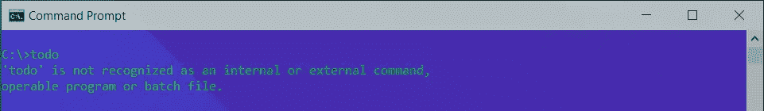

这就是“别名”出现的原因！

# 什么是别名？

别名，顾名思义，为现有名称提供了一个替代名称。对于已定义的数据对象，别名通常是一个更容易理解的名称。

为了让你们理解别名的概念，我将说“sup”是“wassup”的别名，而“wassup”本身是“what's up”的别名😛

所以我们基本上是在谈论在编程中制作我们自己的行话。听起来是不是已经很酷了？😎

# 别名有什么用？

如果你在 Windows 命令行中输入“cls ”,或者在 Linux 终端中输入“clear ”,然后按回车键，它会清除所有内容。我们可以创建一个别名“c”来执行同样的任务。

此外，我们经常有一个目录，我们经常需要通过终端使用“cd”命令来访问它。每当我们打开一个新的终端进入那个目录时，使用“cd”命令就变得非常令人沮丧，尤其是当目录有一个非常长的路径时。这是设置别名的另一个合适的用例。

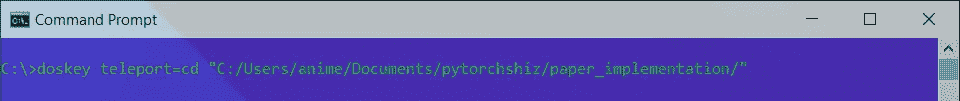

同样，我们可以为对命令行有效的各种不同的命令创建别名。

# 如何在 Windows 中创建别名？

现在让我们学习如何创建别名。在看到我之前使用的两个例子后，你可能已经知道如何创建别名了。

你答对了！

我们使用“doskey”命令创建一个别名。我们写“doskey”，然后是别名，后面是等号(' = ')，再后面是别名应该运行的命令。

# 别名怎么叫？

一旦我们创建了别名，调用它们就像在命令行中键入别名并按回车键一样简单！

现在让我们看看我们之前创建的别名“传送”。

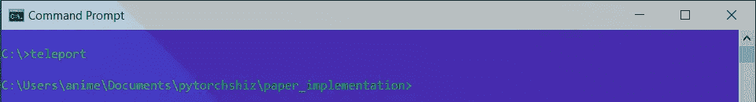

# 为 Python 程序创建别名？

既然我们知道了如何创建别名，那么弄清楚如何为调用 python 脚本创建别名似乎就很简单了。

我们使用“doskey”命令，并使用等号(“=”)将用于运行特定 python 脚本的命令分配给一个别名。

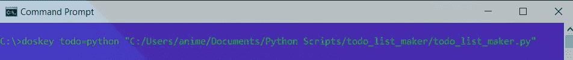

这里，我的别名“todo”应该运行名为“todo_list_maker.py”的 python 脚本，该脚本位于“C:/Users/anime/Documents/Python Scripts/todo _ list _ maker/”。

python 脚本“todo_list_maker.py”从命令行获取输入(待办事项列表项)并将其放入 todo_list.txt 中

但是我们如何将参数传递给 python 脚本呢？

其实挺简单的。我们需要做的就是在别名分配步骤的末尾添加一个美元符号和一个星号(" $* ")，如下所述。它允许在调用别名时传递 python 脚本的输入。

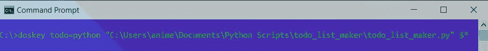

我已经使用了 [argparser](https://docs.python.org/3/howto/argparse.html) 来解析来自 todo_list_maker.py 命令行的参数

下面提到的是 python 脚本‘todo _ list _ maker . py’

下面是我们需要在命令行中使用的命令，以调用别名“todo”并在待办事项列表中添加待办事项列表项。

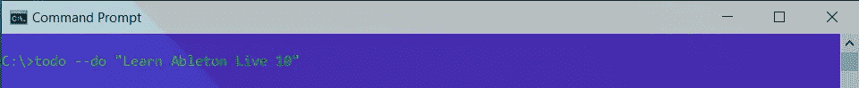

正如所料，它会生成一个待办事项列表。txt 文件)在桌面上(默认情况下)

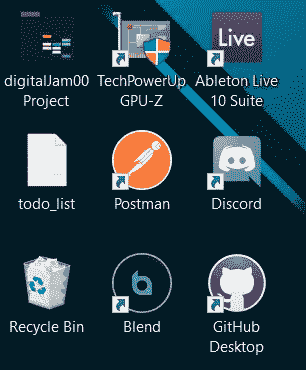

并在其中添加待办事项列表项。

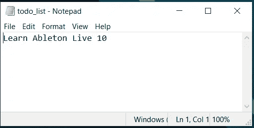

这就是我们如何为调用 python 脚本创建别名，并通过别名传递参数。

但是我想在这个博客中补充最后一条信息。当我们尝试在新的命令行中调用别名时，它们不起作用。这可以通过创建批处理或 BAT 文件(.bat 文件)，它将保存每次打开新的命令行终端时运行的命令。

在 Windows 中，批处理文件是按顺序存储命令的文件。命令行解释器将文件作为输入，并以相同的顺序执行存储的命令。批处理文件只是一个文本文件，用。bat 文件扩展名。它可以使用记事本或任何其他文本编辑器编写。

因此，我们创建一个 BAT 文件，并将其保存在计算机上的任何位置(注意这个位置，因为您很快就会用到它)。以下是我制作的 BAT 文件。每当打开一个新的命令行时，它将首先执行“echo”命令，然后执行“doskey”命令。

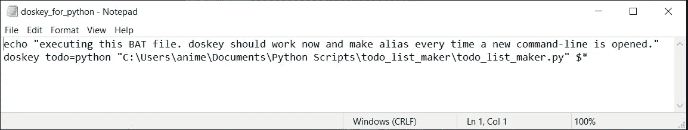

现在，我们转到 Windows 搜索选项，键入“cmd ”,然后单击“打开文件位置”选项。

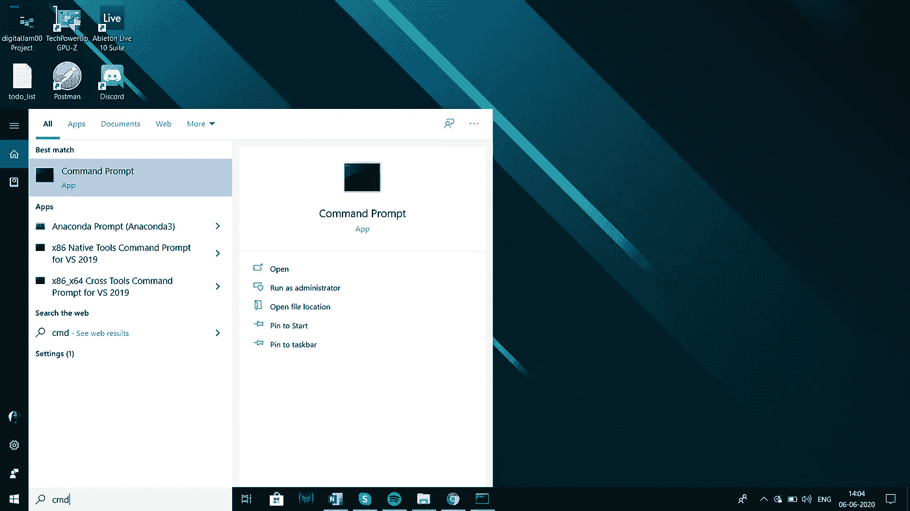

然后，我们右键单击“命令提示符”图标，并选择“属性”选项。

然后，我们选择“快捷方式”选项卡并添加

“目标”字段中的“/k C:\ Users \ anime \ doskey _ for _ python . bat”(/k path _ of _ the _ bat _ file)。

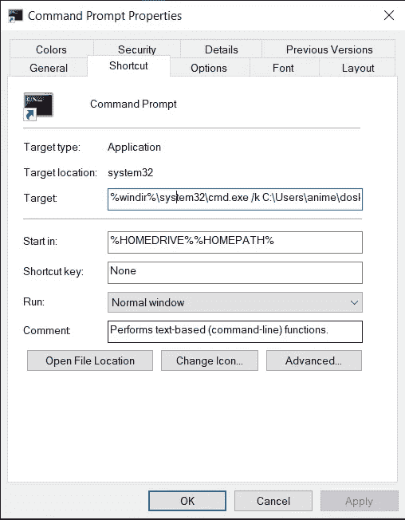

点击“应用”和“确定”,我们就完成了。

现在，每当我们打开一个新的命令行，BAT 文件就会被执行，我们的别名就可以使用了。即使我们重启了电脑，情况也是如此，这正是我们想要的。

这样，我们的“todo”命令终于可以在命令行中使用了，可以在待办事项列表中添加新的待办事项列表项。

我们现在可以将 alias 的思想与 python 带来的无限功能结合起来，让有趣的命令完成有用的任务！

# 密码

你可以在我的 GitHub 账号上找到这个“todo list maker”应用的代码，点击这个链接[**https://GitHub . com/n0obcoder/fun-with-python/tree/master/todo _ list _ maker**](https://github.com/n0obcoder/fun-with-python/tree/master/todo_list_maker)

README.md 文件为 todo_list_maker.py 提供了一个不错的文档。请随意探索它，并为它添加更多的功能🙂

我写这篇博客是因为我通过阅读别人的博客学到了很多东西，我觉得我也应该尽可能多地写下并分享我的学习和知识。所以，请在下面的评论区留下你的反馈，让我知道如何改进我未来的博客！:D

我也是一个独立的音乐艺术家，喜欢在空闲时间演奏和录制音乐。也许你可以看看我的艺人页面，表示支持:)
[Spotify 上的 8 楼和声！](https://open.spotify.com/artist/7G2BgSnludIYl1gFyJKG6X?si=Bv5L4ZAVQrmIsl5SgGRAUw)