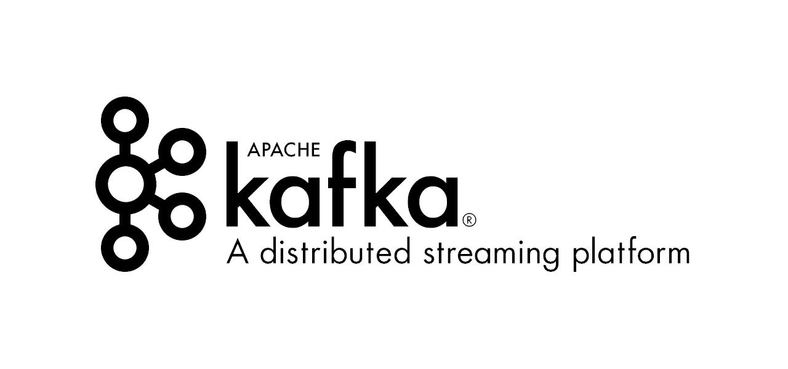
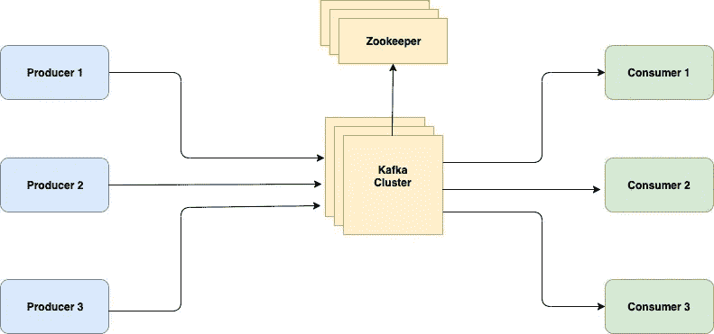
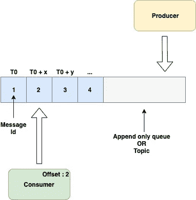
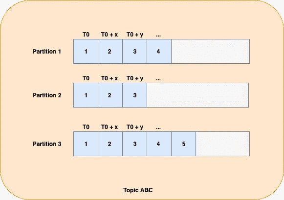
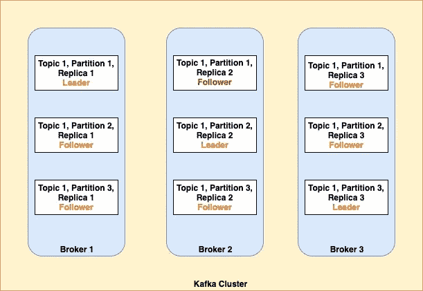

# 关于阿帕奇卡夫卡的一切

> 原文：<https://medium.com/analytics-vidhya/all-about-apache-kafka-67819094a1b2?source=collection_archive---------17----------------------->

什么是阿帕奇卡夫卡？



Kafka 是一个开源的流处理平台，用于构建实时数据管道。我们也称之为高吞吐量分布式消息服务。它也被称为“分布式提交日志”。

阿帕奇卡夫卡的一些特征是

1.  它是水平可扩展的，即如果需要，可以增加代理的数量来处理负载。
2.  它是容错的，即系统/集群可以像代理一样承受一定数量组件的不可用性。
3.  它具有非常高的吞吐量，即可以同时处理大量的消息。
4.  它可以以非常低的延迟处理数据，即实时工作
5.  已经被很多大公司使用，比如 LinkedIn、优步、VMware，还有很多其他公司。
6.  可用于[事件源](https://martinfowler.com/eaaDev/EventSourcing.html)

## **历史**

Apache Kafka 是 LinkedIn 开发的。它于 2011 年初开源。它是以弗朗兹·卡夫卡命名的。卡夫卡的名字来源于 Kafkaesque，意思是噩梦般的情况。因为 LinkedIn 开发者对如此多的数据和基础设施也有类似的感觉。因此，他们给了“卡夫卡”这个名字，这是非常贴切的。

## 它与传统系统有何不同？

传统系统处理大量数据的方式有很多

1.  原木运输
2.  ETL 过程(提取、转换和加载)
3.  消息传递(传统方法)
4.  数据库层的复制

虽然有几种方法，但没有一种像卡夫卡那样有效。所有这些系统都有一定的缺陷。

1.  日志传送和数据库复制:非常特定于数据库。跨数据库使用非常困难。日志传送传输速率、传输大小会对性能产生一些影响。它高度依赖于数据库模式。如果源数据库中的模式发生变化，需要在我们希望进行复制的所有数据库中修改新的模式。
2.  ETL 方法:执行 ETL 需要领域知识。工具也非常昂贵。
3.  消息传递:大多数消息传递系统不是分布式的。因此，处理规模非常困难。许多传统的消息传递系统缺乏容错能力。消息大小和消费者行为(尤其是他们消费的速度)可能会影响整个系统。
4.  中间件的使用:很难创建。根据新的需求对中间件进行更改可能会很乏味。难以管理和保持一致性。

# 体系结构



这是 Apache Kafka 的架构，它作为一个信息系统工作。让我们看看阿帕奇卡夫卡的不同组成部分

1.  代理:它是处理读写操作的组件。它在执行任务时是高效和优化的。一个代理每秒可以处理数百万次读/写操作。它可以处理数 TB 的数据，而不会有任何性能损失。代理是短暂的，所以所有与 quorum 相关的信息和集群细节都使用 ZooKeeper 保存。我们可以在设置中有任意数量的代理。因此，很容易实现缩放。
2.  控制者:在所有经纪人中选择一个作为控制者。这一决定是基于它们的性能、它们所具有的负载、活跃性和几个其他因素做出的。它的职责是监控其他经纪人的可用性，可以交给他们完成某项任务。它还维护需要由其他代理处理的任务相关信息。它还不断检查其他经纪人的进展。当分配工作时，它会要求其他代理创建一个法定人数。作为领导者，成功创造法定人数的经纪人得到工作。然后，领导者与其追随者(在该领导者下工作的对等体)一起执行复制任务，以处理故障场景。
3.  ZooKeeper:它也是一个分布式服务，用于维护一个分布式节点集群的元数据。它还负责帮助卡夫卡的领袖选举。它还有助于维护系统启动时(即引导时)所需的配置信息。它有助于维护分布式系统的健康状态。它维护分布式系统中节点的组成员资格，例如 kafka 集群中的代理成员资格。
4.  生产者:是生成消息的应用程序。它将消息传递给代理。可以有多个生产者同时工作。生产者完全不了解消费者。这使得卡夫卡“松散耦合”。
5.  消费者:应用程序从代理获取消息并处理该消息。可以有多个消费者同时工作。它不知道生成消息的生产者。它维护偏移量来标记已经被处理的消息。

# 装置

我们将在 ubuntu 机器上看到 Kafka 的安装。可以参考 apache kafka 提供的文档进行安装。

1.  获取二进制文件

```
wget http://mirrors.estointernet.in/apache/kafka/2.3.0/kafka_2.12-2.3.0.tgz
```

2.提取文件

```
tar -xvf kafka_2.12-2.3.0.tgz
```

在 **lib** 目录中，kafka 维护了所有它需要的库。在那个目录中，它还保存了 zookeeper jar。所以，我们不需要单独安装 zookeeper。它是独立的。

在 **config** 目录下，保存了所有的配置文件。`server.properties`用于维护代理配置，`zookeeper.properties`用于维护 zookeeper 配置，还有其他几个配置文件。

在 **bin** 文件夹中，保存了使用 kafka 所需的所有脚本，如`kafka-server-start.sh`启动 Kafka 服务器、`kafka-topics.sh`进行主题级配置等。

3.启动动物园管理员

```
bin/zookeeper-server-start.sh config/zookeeper.properties
```

4.启动卡夫卡

```
bin/kafka-server-start.sh config/server.properties
```

> 如果想在 Kubernetes 上部署 Apache Kafka，请访问此链接[**https://medium . com/@ aishwarymuz/Apache-Kafka-deployment-on-Kubernetes-5695 ACA 260 f**](/@aishwarymuz/apache-kafka-deployment-on-kubernetes-5695aca260f)

# 卡夫卡主题

卡夫卡的主题就像一个邮政地址，所有的信息都将被传递到那里，感兴趣的人将从那里获得信息。它是一个逻辑实体，用于对消息进行分类。它是一种队列类型的数据结构。我们可以在 Kafka 集群上定义许多主题，每个主题代表并保存特定类型的消息。

一个主题也可以跨越多个卡夫卡经纪人。及时存储在 kafka topic 中的所有记录/消息都是不可变的，即主题本质上是仅附加的。主题中的消息有一个全局排序。



卡夫卡的主题

在上图中，T0 是 id #1 的消息到达的时间。过了一段时间 x，id 为#2 的消息来了，以此类推。生产者继续在主题中推送消息，消费者从主题中获取消息。消费者维护一个指针(称为 Offset ),帮助它处理新到达的消息。可能有许多生产者和消费者在同一主题上工作。

主题中的每条消息都有三个内容

1.  标识号(Id)
2.  时间戳:消息到达的时间
3.  实际消息内容

一个主题只能由一个消费者组中的一个消费者访问。来自其他消费者群体的消费者可以同时访问相同的主题。他们将保持他们自己的补偿，该补偿可能不同于属于不同消费者群体的任何其他消费者。

## 主题的划分



在 kafka 系统中创建的任何主题都至少有一个分区，即分区的默认数量是 1。为了实现并行性和更好的吞吐量，我们可以增加任何主题的分区数量。在物理上，主题的每个分区都以日志文件的形式出现在 kafka 代理上，主题就出现在这个代理上。然而，分区有其自身的成本。在为一个主题创建了多个分区之后，没有保留全局排序。分区也给 zookeeper 增加了负担。我们为主题创建的分区越多，领导者选举的故障转移时间就越长。

为了控制任何主题的分区数量，我们可以在`config/server.properties`文件中设置`num.partitions`的值，即代理配置。默认值为 1。我们还可以改变已经创建的主题的分区数量。为了应用这些改变，我们需要使用`bin/kafka-topics.sh`脚本。

```
bin/kafka-topics.sh --zookeeper <Zookeeper_URI> --alter --topic <Topic_Name> --partitions 10
```

**卡夫卡是如何处理分区的？**

当我们请求创建一个具有一定数量分区的主题时，比如说 3 个分区，需要执行一系列步骤

1.  Zookeeper 检查 kafka 代理的状态，如健康、负载等。对于每个分区，zookeeper 决定应该选择哪个代理作为领导者。
2.  然后 zookeeper 将分区分配给这些代理。
3.  然后，这些代理在其文件系统中创建各自的日志目录。目录的格式类似于{主题名称}-{分区}。例如，如果主题名称是 ABC，并且配置了三个分区，我们将得到类似于`**/path_to_log_directory/ABC-0**` **、** `**/path_to_log_directory/ABC-1**` **和** `**/path_to_log_directory/ABC-2**` **的目录。**
4.  然后，每个代理维护关于分区位置的信息，即哪个分区在哪个代理上。同样的信息也出现在 Zookeeper 中。当生产者在一些分区上执行一些操作，但是他所联系的代理不是领导者时，这是有帮助的。在这种情况下，代理将返回元数据，帮助生产者联系维护该分区领导者的正确代理。
5.  然后，代理将状态发送回动物园管理员。这有助于将一致意见保持在适当的状态。

## 实现容错

为了实现容错，我们为主题的每个分区创建多个副本。我们维护的副本数量被称为**复制因子**。在任何给定时间，我们都可以通过检查 ISR(同步副本)来检查任何主题的复制状态。在所有复制品中，选择一个作为领导者。该主副本负责处理所有读/写操作。如果由于网络故障、代理不可用或任何其他原因，该主副本在任何特定时间不可用，则其他副本将被提升为主副本。复制因子保证 N-1 代理容错。

领导者的工作是选择对等体，并为复制日志和实现所需的复制因子(即冗余级别)创建法定人数。当 ISR 与复制因子匹配时，我们认为主题及其分区是健康的。如果由于某种原因无法创建法定人数，并且 ISR 低于所需值，我们需要手动解决该问题并检查该问题。

> 注意:如果我们有许多代理，而 ISR 少于预期，Kafka 将尝试添加一些其他代理来代替失败的代理，并开始将日志复制到这个新选择的代理中。

为了控制复制因子，我们可以在`config/server.properties`文件中设置`default.replication.factor`的值，即代理配置。



卡夫卡中一个主题的分割与复制

## kafka 如何处理数据保留？

正如我上面提到的，对于一个主题的每个分区，都有一个保存数据的日志文件。该日志文件位于该分区所在的同一个代理上。主题的每个日志文件被进一步划分为一个段文件。这些片段只不过是信息的集合。这些段文件将数据作为键和值保存。保留是在分段级别/主题级别而不是消息级别提供的。Kafka 提供了两种类型的保留策略

1.  基于时间的保留策略
2.  基于大小的保留策略

在基于时间的保留策略中，Kafka 定期清理主题范围内的旧内容。我们将在下一节中看到清理操作的类型。它是通过在 server.properties 中使用`log.retention.ms`指定的，该选项的默认值是 7 天。

我们也可以在稍后的时间点按主题级别指定它。参见下面的命令

```
./bin/kafka-topics.sh --zookeeper <ZooKeeper_Endpoint> --alter --topic <Topic_Name> --config retention.ms=<Time_In_Millis>
```

在基于大小的保留策略中，Kafka 检查保存数据的日志文件的大小。如果大小超过配置中指定的值，Kafka 将开始清除文件中的内容，直到其大小低于指定的值。在 server.properties 中使用`log.retention.bytes`来指定，默认情况下对此没有限制。

我们也可以在稍后的时间点按主题级别指定它。参见下面的命令

```
./bin/kafka-topics.sh --zookeeper <ZooKeeper_Endpoint> --alter --topic <Topic_Name> --config retention.bytes=<Time_In_Millis>
```

**清理是如何进行的？**

虽然在 Kafka 中，我们可以保留大量数据，但在某个时间点之后，我们需要执行清理，因为 Kafka 并不意味着消息会持续很长时间。对于更长时间的消息持久性，我们通常使用数据库。卡夫卡提供了两种类型清理操作

1.  **删除** : Kafka broker 将在考虑保留策略后删除消息。`log.retention.ms`和`log.retention.bytes`是主要的决定因素。
2.  **压缩:** Kafka broker 将保留任何消息的单一和最新副本。因为消息有一个键和值。当消息再次出现在日志中时，密钥再次相同。因此，在后台会有一个清理线程一直运行，执行这种压缩。它主要用于当我们想要获得 Kafka 系统在崩溃/失败之前的最后状态时，在应用程序重启后重新加载缓存。我们进行活动采购时也会用到它。我们需要了解几个重要的配置选项，例如

a.`***cleanup.policy=compact***` 启用日志压缩

b.`***delete.retention.ms***` 在消费者到达主题标题之前，消费者可以看到逻辑删除(标记为删除的消息)的持续时间。只有当清理政策是`compact`时才有意义。

c.`***log.cleaner.threads***` 它决定了将要执行清理操作的线程数量。清理线程使用日志文件的脏比率来决定首先处理哪个日志文件。

```
dirty ratio = number of bytes in the head / total number of bytes in the log(tail + head)
```

d.`***log.cleaner.min.compaction.lag.ms***` 用于保证在消息被压缩之前必须经过的最短时间。

> 要了解更多关于阿帕奇卡夫卡压缩的内容，请访问此链接:[https://kafka.apache.org/documentation/#compaction](https://kafka.apache.org/documentation/#compaction)
> 
> [https://towards data science . com/log-compacted-topics-in-Apache-Kafka-B1 aa1e 4665 a 7](https://towardsdatascience.com/log-compacted-topics-in-apache-kafka-b1aa1e4665a7)

## 要了解更多关于生产者，请访问此链接

[https://medium . com/@ aishwarymuz/all-about-Apache-Kafka-710 E1 f0b 395](/@aishwarymuz/all-about-apache-kafka-710ee1f0b395)

## 注意:如果您发现有任何遗漏或错误，请告诉我。

**其他一些好文章:** [https://AWS . Amazon . com/blogs/big-data/best-practices-for-running-Apache-Kafka-on-AWS/](https://aws.amazon.com/blogs/big-data/best-practices-for-running-apache-kafka-on-aws/)