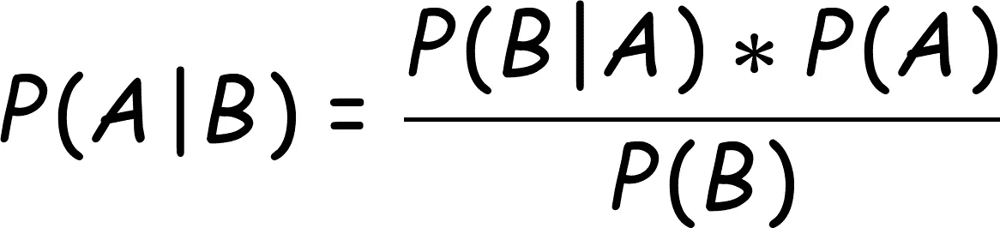

# 关于贝叶斯定理的一切！

> 原文：<https://medium.com/analytics-vidhya/all-about-bayes-theorem-f4d1d6ee4485?source=collection_archive---------22----------------------->

来源:[格尔德·奥特曼](https://pixabay.com/users/geralt-9301/?utm_source=link-attribution&utm_medium=referral&utm_campaign=image&utm_content=4776833)来自[皮克斯拜](https://pixabay.com/?utm_source=link-attribution&utm_medium=referral&utm_campaign=image&utm_content=4776833)

有没有想过根据其他事件来计算一个事件的概率，这应该很有趣吧！如果到目前为止你还没有想出尝试上述场景，我会帮助你，并解释它是如何可能的，而且它太有趣了。

> 在数学世界中，如果我们试图根据一个事件的发生来找出另一个事件发生的概率，我们在两个事件之间用 **"|"** 符号来表示。例如， **P(开心|看了一部电影)**，其中“P”代表概率，内部两个是事件，上面的等式表示一个人看了一部电影后开心的概率【我在与一个人的上下文中举了这个例子】。

## 贝叶斯定理方程

**作者图片**

在上面给定的图像中，“A”和“B”是事件，为了找到事件“A”发生的概率，假设事件“B”已经发生，通过上面的等式计算，其中“P”总是代表“概率”

> *贝叶斯定理*基于 4 个概念，即“可能性”、“先验概率”、“边际概率”、“T16”、“后验概率”！

## 先验概率

它表示一个事件(我们的假设)在另一个事件发生之前发生的概率，或者我们可以说在观察到证据之前。

## 边缘概率

它表示一个事件(实际事件/证据或我们认为已经发生的事件)在我们假设的所有可能性中发生的概率。

## 可能性

如果我们认为我们的假设是真的，它表示一个事件是真的/或发生的概率，或者我们可以说另一个事件(超出假设)已经发生。

## 后验概率

它表示一个事件发生的概率(我们的假设),假设另一个事件已经发生。

> 如果我们从上面列出的 4 个参数中得到前 3 个参数，我们可以很容易地使用贝叶斯定理预测最后一个参数。

## 示例:

考虑一下，我们必须找出一个人看完电影后感到快乐的概率。

首先考虑下面给出的概率:

1.  p(快乐)= 0.9
2.  p(看电影)= 0.95
3.  P(看电影|开心)= 0.5 < = it means that a person will watch a movie if it is happy.

***现在，我们要计算 P(看电影|开心)***

在上述情况下使用贝叶斯定理，我们肯定可以计算出我们想要的结果。

**P(开心|看电影)= [ P(看电影|开心)* P(开心)] / P(看电影)**

**P(开心|看电影)=** (0.5 * 0.9) / (0.95) = 0.4736

以上是根据以上数据计算出的一个人看完一部电影后开心的概率。

***我希望这篇文章能很好地解释贝叶斯定理。非常感谢你给我时间。***