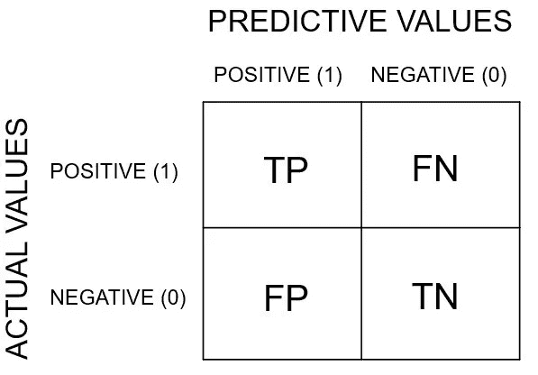

# 关于混乱矩阵的一切！

> 原文：<https://medium.com/analytics-vidhya/all-about-confusion-matrix-1f2ef028c52d?source=collection_archive---------28----------------------->

有没有想过阅读一个名字中有“混乱”的矩阵？我知道这很令人困惑。但是不要担心，我是来解决困惑的&我会详细解释困惑矩阵的每个部分。

## 混淆矩阵介绍

混淆矩阵只是判断我们分类模型的一种方式。对于一个非常基本的理解，混淆矩阵的每一个框只包含由混淆矩阵支持的我们的模型的每种类型的预测的计数。

它经常用于模型评估，即检查我们的模型表现如何，或者我们可以说我们的模型预测值有多好。

**混淆矩阵中值的类型:**

1.  **真阳性**
2.  **真阴性**
3.  **假阳性(1 型错误)**
4.  **假阴性(2 型错误)**

**2×2 混淆矩阵表示法**

*为了有一个非常基本的了解，我在这里展示了 2 x 2 混淆矩阵。*

> 正确的预测总是在混淆矩阵的左对角线，混淆矩阵总是一个方阵。

## 正确肯定

> 这个类别有实际上为真的值的计数，并且我们的模型也预测它们为真。

例如，如果最初值为真，我们的模型也声明该值为真。所以，我们可以断定这个预测是正确的。从上图中，你可以认为预测值是 1 &真实值也是 1。

## 正确否定

> 这个类别有实际上为假的值的计数，并且我们的模型也预测它们为假。

例如，如果最初值是假的，我们的模型也声明值是假的。所以，我们可以断定这个预测是正确的。从上图中，你可以认为预测值是 0 &真实值也是 0。

## 假阳性

它们在模型中也被称为**类型 1 错误**。

> 这个类别有实际上为假的值的计数，但是我们的模型预测它们为真。

这些是我们的模型预测错误的值。

***举例:***

*   如果最初值是假的，我们的模型声明值是真的。
*   假设有一个人完全没事&他去做了冠状病毒测试，但测试报告说这个人感染了冠状病毒。

上面的例子解释了假阳性的情况。

## 假阴性

他们也被称为模型中的**2 型错误**。(最危险的预测)

> 这个类别有实际上为真的值的计数，但是我们的模型预测它们为假。

这些是我们的模型预测错误的值。

***举例:***

*   如果最初值为真，那么我们的模型声明值为假。
*   假设有一个人感染了冠状病毒&他去做了冠状病毒测试，但测试报告说这个人完全没事。因此，在这种情况下，它会愉快地回家&很有可能会将病毒传播给他人。

上面的例子解释了假阴性的情况，从例子中我们可以清楚地看到假阴性计数是多么危险。

## 结论

最重要的是，以尽可能好的方式列出并解释了值的类型&很清楚，哪个值计数应该是模型的最小值。

你能猜出我说的是哪个值吗？是的，你答对了，答案是假阴性。

***希望，上面的博客用最好的方式清楚地解释了题目*** `***Confusion Matrix***` ***！***