# 使用 Seaborn 实现数据可视化

> 原文：<https://medium.com/analytics-vidhya/all-about-data-visualization-using-seaborn-f3d5eb04ec16?source=collection_archive---------18----------------------->

**数据科学的数据可视化——什么和为什么？**

数据可视化是获取统计数据并将其放入可视化元素(如地图或图形)中的行为。数据可视化使相当大的和微小的数据更容易被人脑理解，可视化也使感知数据类别中的模式、趋势和异常值变得简单。

数据可视化很重要，因为可视化表示的数字在呈现给企业所有者或利益相关者时更有吸引力。Tableau 表示，“[数据可视化]是需要培养的最有用的专业技能之一。你越能直观地传达你的观点，你就能越好地利用这些信息。”

**数据可视化包**

它基本上有 3 个包:-

*   这是最基本的软件包，用于绘制简单和标准的图形，如条形图、饼图等。这里绘图很快
*   这是一个建立在 matplotlib 之上的包，支持许多复杂的图形，如箱线图、对线图等
*   这是一个高级的软件包，帮助我们获得一些与图形相关的很酷的特性

本文涵盖了使用 seaborn 库的可视化，seaborn 库主要用于数据科学领域。

**导入库**

使用 seaborn 进行数据可视化的第一步是导入正确的包以及 NumPy 和 Pandas 库。见下图。

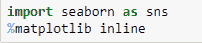

使用 Seaborn 可以创建什么样的图形？

对于**单变量分布**，可使用以下图表:-

*   **Distplot-** 查看单变量分布最简单的方法是绘制一个 Distplot。默认情况下，它会给出一个直方图并拟合一个核密度估计值。人们可以添加或删除 KDE，甚至可以添加一个地毯图，在每个观察点画一个垂直刻度。

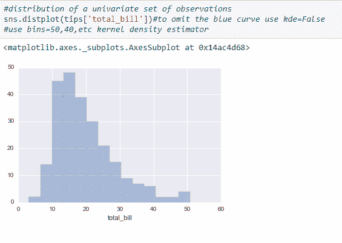

*   **与 KDE 的距离图**

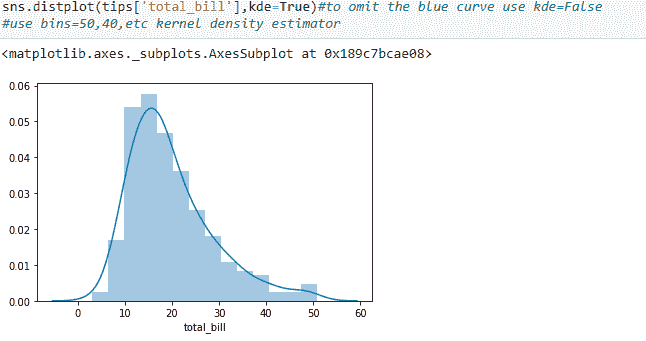

*   **带地毯的散点图**

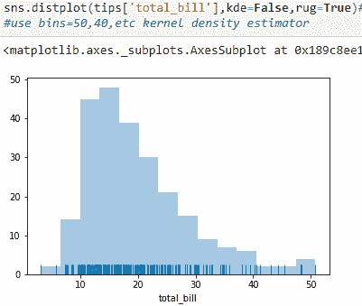

对于**双变量分布**，可使用以下图表

*   **使用散点图绘制联合图-** 查看二元分布最常见的方法是绘制散点图。Jointplot 允许我们匹配最多两个 distplots。它显示了两个变量之间的关系。在这里你的同类可以是任何情节。

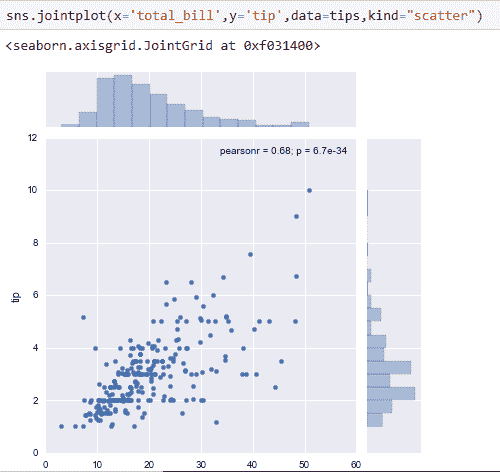

*   **使用十六进制的接头图-**

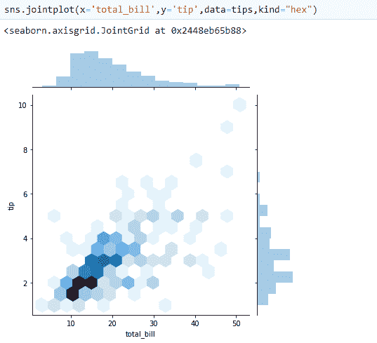

*   **使用 KDE 的接头图**

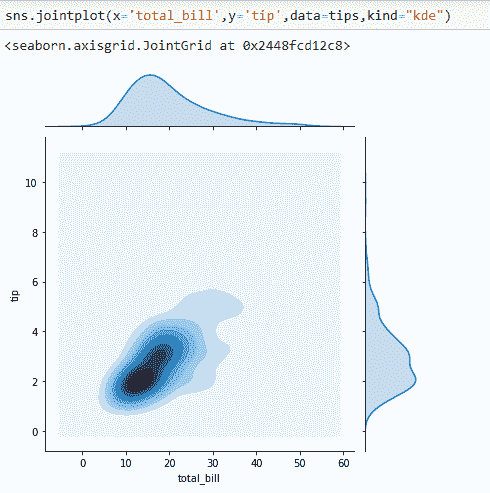

*   **使用回归的 Jointplot】**

对于**成对** **二元分布**可以使用以下图表

*   **Pairplot-** 该图将绘制整个数据帧中的成对关系。默认情况下，它还会在对角轴上绘制每个变量的单变量分布。

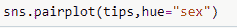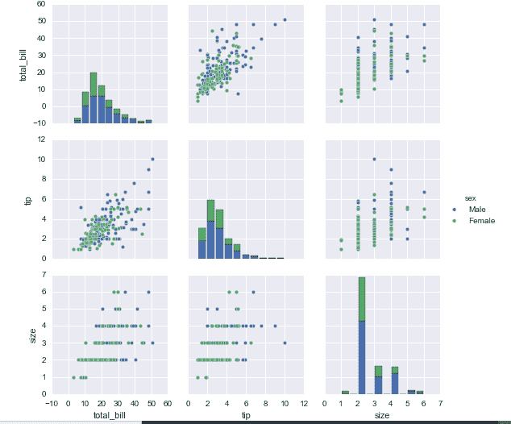

对于使用分类数据绘制的**,可使用以下图表**

*   **带状图** -在带状图中，散点图点通常会重叠。这使得很难看到数据的完整分布。一个简单的解决方案是使用一些随机“抖动”来调整位置(仅沿着分类轴)。

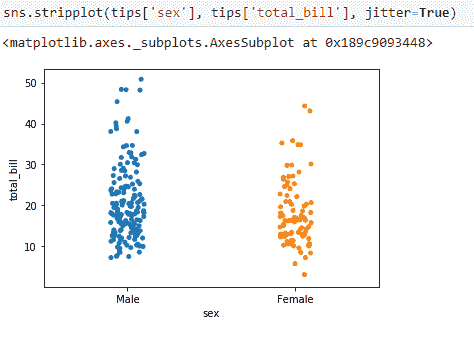

*   **Swarmplot-** 一种不同的方法是使用函数 Swarmplot()，该函数使用避免重叠点的算法将每个散点图点定位在分类轴上。

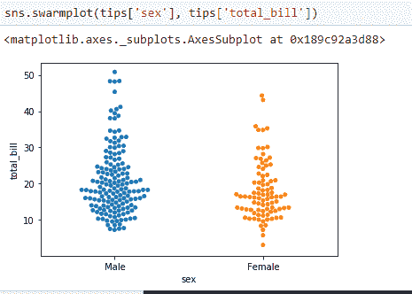

*   **柱形图-** 柱形图是一个通用图，允许您基于某个函数(默认为平均值)聚合分类数据。条形图在量化轴范围内包含 0，当 0 是量化变量的有意义值，并且您想要与之进行比较时，它们是很好的选择。

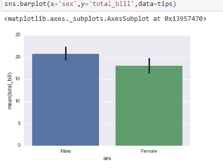

*   **计数图-** 计数图与柱状图相同，除了估计器明确计数出现的次数。这就是为什么我们只传递 x 值？

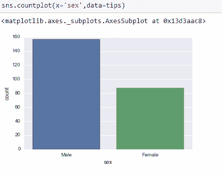

*   **point plot-**point plot()函数提供了可视化相同信息的另一种方式。该函数还将估计值编码为另一个轴上的高度，但它并不显示完整的条形图，而是绘制点估计值和置信区间。此外，pointplot 连接来自相同色调类别的点。这就很容易看出主关系是如何作为第二个变量的函数而变化的。

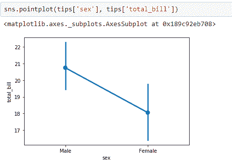

*   **箱线图和小提琴图-** 这些用于显示分类数据的分布。箱线图(或盒须图)以一种便于变量之间或分类变量水平之间比较的方式显示定量数据的分布。

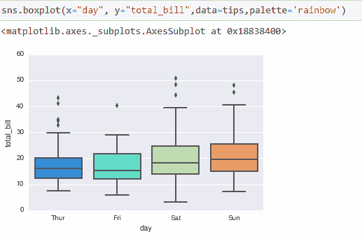

*   **因子图-** 用于多面板分类图。可以给出各种类型的输入，如点、条、数、框、小提琴或带。

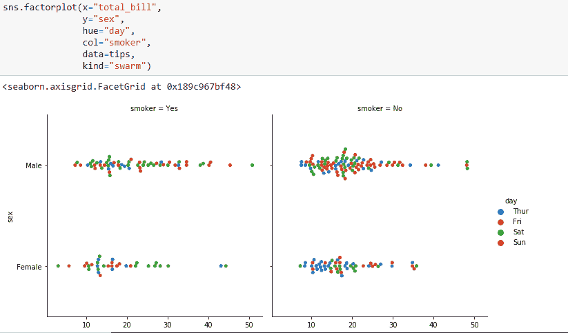

*   **回归图-**seaborn 中的回归图主要用于添加一个可视化的向导，帮助在探索性数据分析期间强调数据集中的模式。顾名思义，回归图在两个参数之间创建一条回归线，有助于可视化它们的线性关系。

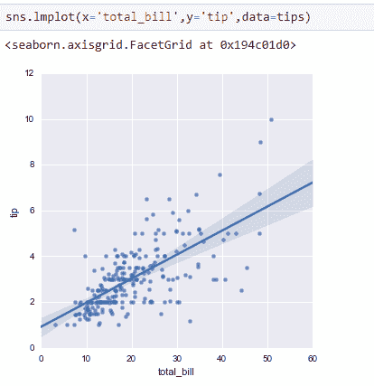

**总结！**

在本文中，我们了解了 seaborn 库可以准备的不同类型的可视化。还有更多的内容有待探索，但这些是数据科学领域中最基本和最常用的图。