# 所有关于梯度下降及其变体

> 原文：<https://medium.com/analytics-vidhya/all-about-gradient-descent-and-its-variants-d095be1a833b?source=collection_archive---------7----------------------->

这篇文章向您解释了梯度下降算法的变体，这些变体用于优化任何深度学习问题的解决方案。如果你想深入了解梯度下降，那么我推荐你[这个](https://developers.google.com/machine-learning/crash-course/reducing-loss/gradient-descent)。

假设你在一座山的山顶上，你想到达山的最低点的一个湖。你会往哪边走？？？

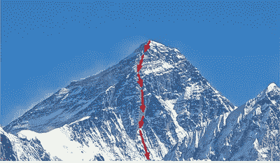

梯度下降

最简单的方法是检查你站的地方，找到地面下降最多的地方，然后开始向那个方向移动。这条路很有可能会带你去湖边。这就是上图所描绘的。从图形上看，它可以如下所示:

峰值用红色区域表示成本高的区域，而最低点用蓝色区域表示成本或损失最小的区域。在任何深度学习问题中，我们都试图找到一个模型函数，它给出的预测与实际值相比损失最小。假设我们的模型函数有两个参数，那么在数学上，我们希望找到参数θ1 和θ2 的最佳值，使我们的损失最小。上图中显示的损失(J(θ))空间告诉我们，如果我们为参数选择一个特定值，我们的算法将如何执行。这里，θ1 和θ2 是我们的 x 和 y 轴，而损耗对应于 z 轴绘制。

梯度下降法则指出，我们应该移动的方向应该与梯度成 180 度。如果有人想知道为什么要朝那个特定的方向前进，我已经在 [**这篇文章**](/@anjana7718/why-we-move-opposite-to-gradients-in-gradient-descent-9077b9aa68e4) 中回答了。换句话说，与梯度方向相反。这里梯度是偏导数的向量。我们的模型函数相对于θ1 和θ2 或权重(w)的δ。以下是普通梯度下降算法的更新规则。这里η是学习率，它是常数。

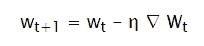

普通梯度下降的更新规则

很多时候，我们会遇到这样的情况，即使模型没有达到全局最小值，它也会在训练过程中停滞不前并停止学习。这通常发生在训练参数位于缓坡区域从而难以导航的时候。这是因为这些区域的梯度非常小。那么我们如何解决这个问题呢？？？

**基于动量的梯度下降**

假设你被反复要求朝同一个方向移动，那么你对自己的移动有了一些信心，开始朝那个方向加快步伐。类似于球在斜坡上滚动时获得动量。如果我们在训练中使用相同的类比，我们可以假设，如果我们的梯度在特定方向上持续下降，那么我们可能正在向正确的方向移动，并开始获得信心，在那个方向上迈出更大的步伐。这种获得动量的类比用于基于动量的梯度下降。

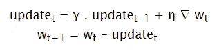

基于动量梯度下降的更新规则

更新参数负责先前的更新，并且如果梯度连续地在相同的方向上，则给我们动量。超参数γ和η控制过去历史和当前梯度的贡献。与普通梯度下降相比，这有助于模型更快地收敛。

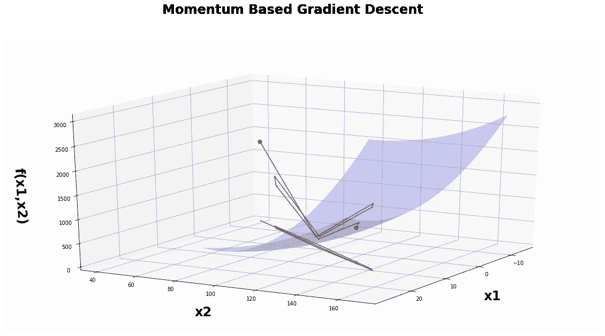

基于动量的梯度下降

这里出现的问题是，动量逐渐增加到梯度开始在极小值谷来回振荡的程度。正如我们在上面看到的，当动量带着它走出谷底时，它每次都超过全局最小值。因此，在最终收敛之前，需要进行许多 U 形转弯。尽管有这些 u 形转弯，它仍然比普通梯度下降法收敛得更快。怎么才能解决这个振荡问题呢？？

**内斯特罗夫梯度下降**

内斯特罗夫加速梯度下降建议，与其通过动量和梯度向前移动，为什么不先使用动量移动，检查该点的梯度，然后从初始点相应地向前移动。这解决了极小值谷中的多次振荡问题。

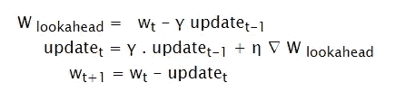

内斯特罗夫加速梯度下降的更新规则

如下图所示，我们使用以前的更新历史计算 W-look ahead，并计算该点的梯度。如果梯度方向反转，说明我们已经超越了极小值。

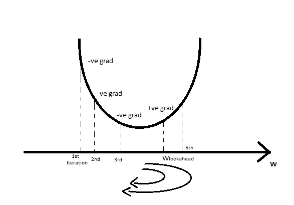

NAG 前瞻计算

因此，最终的权重更新将在展望未来时考虑历史和梯度。如果它们的符号相反(当最小值被超过时发生)，权重的更新量将会减少，从而降低振荡的程度，如下所示。

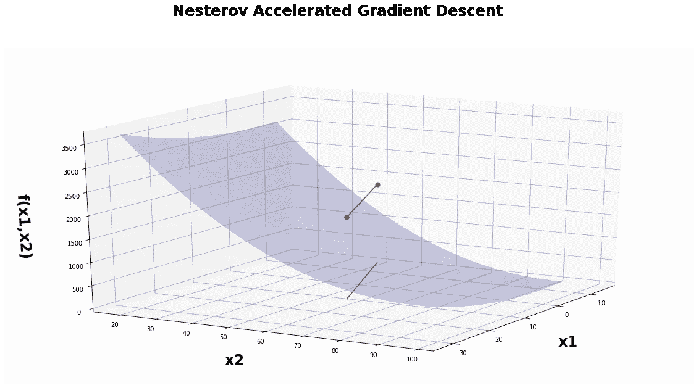

内斯特罗夫加速梯度下降

到目前为止，我们已经看到了单特征问题的梯度优化。假设我们有多维特征，那么可以利用相同的方法同时找到每个特征的优化。

现在你能说出这里梯度下降的行为表明了什么吗:

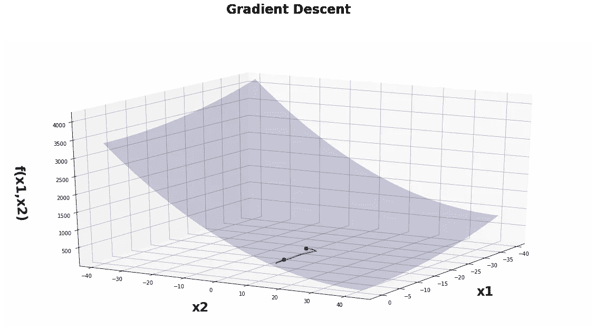

x1 特征稀疏的多变量数据上的梯度下降

可以观察到，最初在 x1 的方向上有许多更新。在点模型了解到没有必要在这个方向上继续移动，因为这里没有最小值。因此，它决定向 x2 的方向前进，并最终达到最小值。

x1 方向上的频繁更新表明该模型接收了大量具有 x1 值的数据点和较少的具有 x2 值的数据点。因此，与特征 x1 相比，特征 x2 似乎是稀疏的。这种稀疏性在包含多达 1000 个特征的神经网络中很常见。

因此，我们可以看到，稀疏特征给模型的学习带来了问题，因为没有足够的值供模型学习。我们可以肯定地说，稀疏特征可能没有密集特征重要，因为它们被记录的次数很少。这在大多数情况下可能是正确的，但在某些情况下，密集要素可能会携带一些有用的信息。其中一个例子是阿米尔·汗的电影。虽然他两年拍一部电影，但是这部电影成功的几率非常高。因此，稀疏数据可能也是一个重要的特性。那么我们如何解决学习稀疏特征的问题呢？？？？

是否有可能为每个参数设置不同的学习速率，以考虑到特性的频率？？？

**AdaGrad —自适应梯度下降**

AdaGrad 代表自适应渐变。它与参数的更新历史成比例地衰减参数的学习速率。因此更多的更新意味着更多的衰退。通过使用特定的学习率，我们可以确保尽管稀疏，x2 也能获得更高的学习率，从而获得更多的更新。

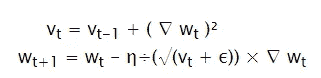

AdaGrad 的更新规则

此外，它确保了如果 w 经历了大量更新，则其有效学习率会因为分母的增长而降低。

虽然这有助于学习稀疏参数，但是梯度有可能变得太低，从而完全停止学习。考虑下图:

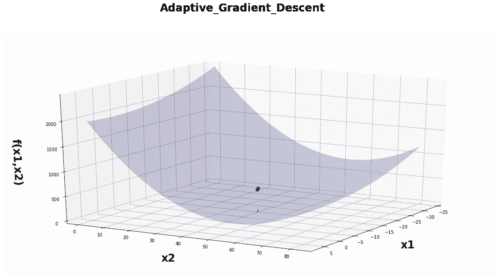

阿达格拉德因渐变消失而被卡住

这里学习已经停止，因为学习率已经减少到模型根本没有梯度的程度。随着时间的推移，有效学习率将降低，从而不再对 x2 进行更新。我们能避免这种情况吗？？

RMS — Prop

阿达格拉德非常积极地降低学习率。结果，一段时间后，由于学习速率的衰减，频繁参数将开始接收非常小的更新。那么为什么不衰减衰减参数呢？为了做到这一点，我们衰减分母，以防止其快速增长。

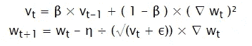

RMS 的更新规则-正确梯度下降

我们可以在下图中观察到，与梯度下降相比，RMS-Prop 的训练时间要少得多。

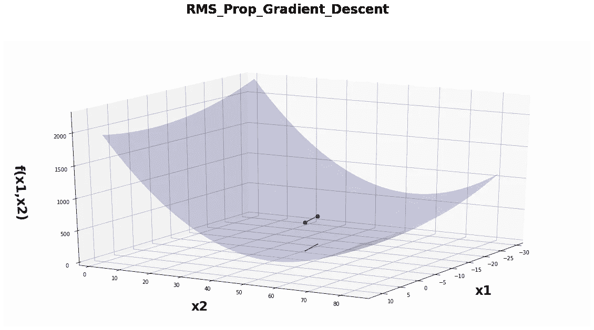

RMS-Prop 优化

此外，当 AdaGrad 由于学习速率衰减而停滞不前时，RMS-Prop 通过降低衰减来解决这个问题。

**亚当梯度下降**

现在，考虑到我们在上面学到的一切，使用动量来加快收敛，并衰减关于特征的参数，我们为什么不结合这两种方法并使用它。

因此，我们尽 RMS-Prop 所能解决 AdaGrad 问题，并使用梯度的累积历史。这就是亚当优化算法所做的。

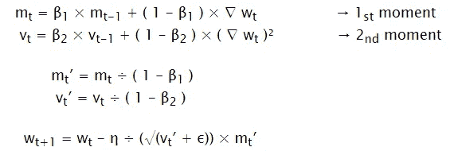

Adam 优化的更新规则

Adam 代表自适应矩，因为它利用一阶和二阶矩进行模型收敛。

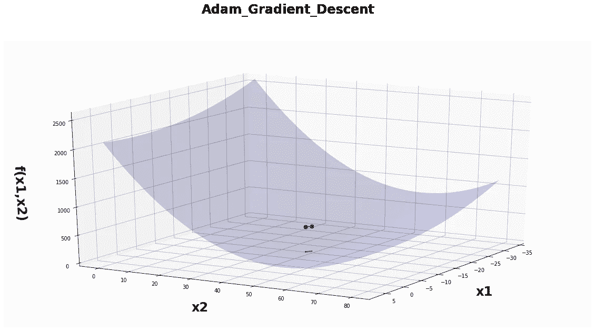

亚当优化

如上图所示，与上述方法相比，Adam 收敛所需的时间要少得多。Adam 是目前最好的优化算法，适用于当今几乎所有的问题。

上述算法定义了可用于实现优化或全局最小值的各种方法。它们考虑了参数和超参数，用于优化学习和权重更新。要记住的另一件事是在训练期间每个时期要传递多少数据。

**香草渐变下降**

更新权重的理想方式是在传递一次完整的数据集之后。这就是香草梯度下降所做的。尽管仅在计算完整数据集的损失之后执行权重更新是理想的，但是对于一个较小的权重更新，我们正在执行数千次计算。这导致时间减少，并使用大量内存进行模型优化。

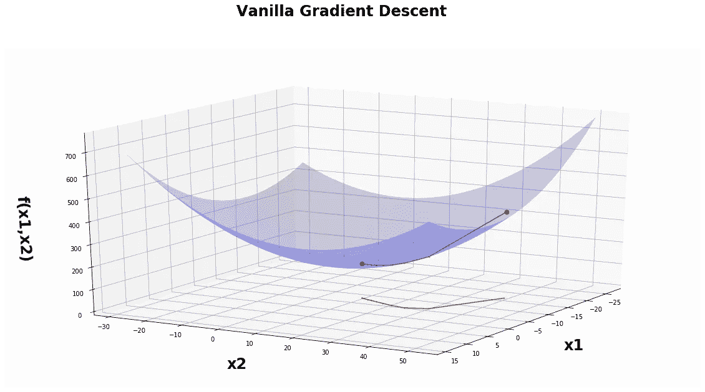

N(数据集大小)= 5 的普通梯度下降

克服这种巨大计算量的一种方法是在通过每个数据点并计算损失之后更新权重。这样，权重在一个时期中被更新 N 次，其中 N 是数据集的大小。这被称为**随机梯度下降**。

下图显示了随机梯度下降算法。我们可以清楚地看到，每次权重更新后都会出现大量振荡。

N = 5 的随机梯度下降

由于模型使用一个数据点计算整个数据集的梯度，因此会出现随机梯度下降的问题。这就好比说，如果扔一枚硬币，正面朝上，正面的概率是 1，反面的概率是 0。我们从总体中抽取单个数据，并假设整个总体的行为与该点相似。

执行梯度更新的理想方式是考虑权重更新所有点的损失。那么我们如何实现这一点呢？？？

我们可以在传递较小的一组或一批数据点之后执行更新，而不是在每个数据点执行更新。这就是**小批量梯度下降**的作用。它对一批数据点进行采样，计算这些点的损失，最后更新权重。因此，如果批大小是 k 个数据点，则在每次迭代中通过 N/k 批 k 个数据点，并且在每个时期结束时执行 N/k 次权重更新。

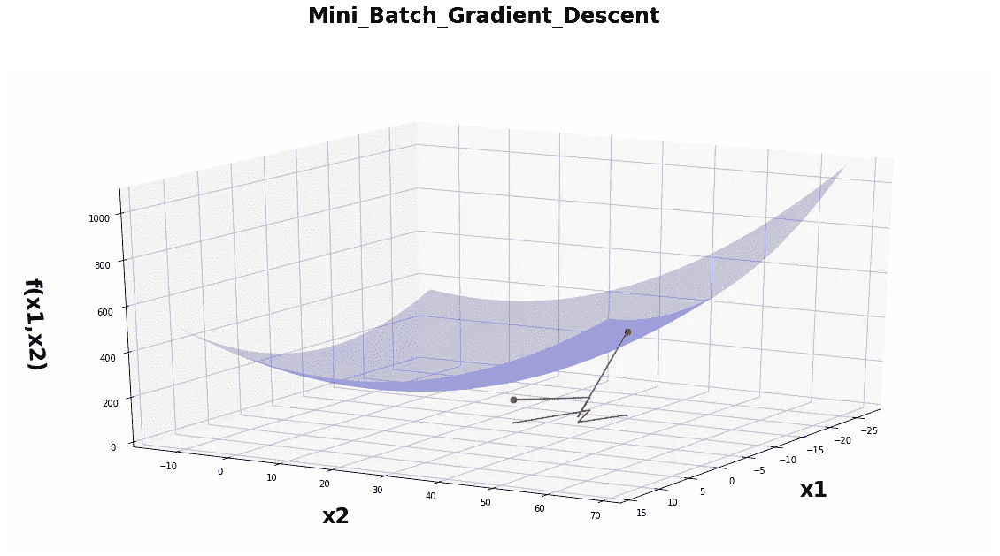

N = 5 和 K = 3 的小批量梯度下降

因此，我们可以清楚地看到振荡的减少和更快的优化。

至此，我们已经了解了对传统梯度下降算法的改进。我希望你喜欢阅读这篇文章，并精通梯度下降及其变种。

这里是[代码](https://github.com/anjana7/Gradient-Descent-Variants)的 git hub 链接。

深度学习— NPTEL by 米特什·哈普拉
https://www.youtube.com/watch?v=aPfkYu_qiF4&list = plyqspqzte 6m 9 gcgajvqbc 68 hk _ JKGBAYT

菲利浦·萨尔瓦托
[绘制 3d 渐变图 https://gist . github . com/feli pes Salvatore/C2 E1 c 09 dfcb 8710 b 847 e 2457620 f 8204](https://gist.github.com/felipessalvatore/c2e1c09dfcb8710b847e2457620f8204)