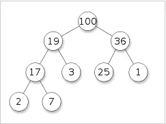
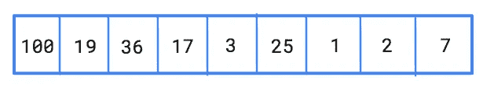
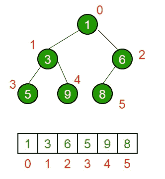
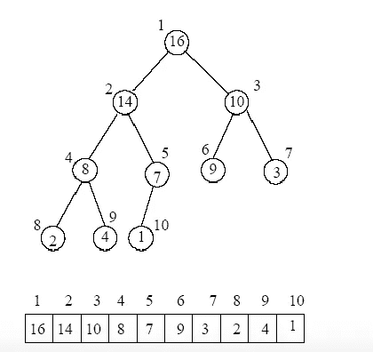

# 关于堆的一切—第 9 天(Python)

> 原文：<https://medium.com/analytics-vidhya/all-about-heaps-day-9-python-da23d50d0e44?source=collection_archive---------6----------------------->


照片由[帕特·惠伦](https://unsplash.com/@patwhelen?utm_source=medium&utm_medium=referral)在 [Unsplash](https://unsplash.com?utm_source=medium&utm_medium=referral) 上拍摄

今天我们将回顾堆数据结构。

堆是基于树的数据结构，这表明堆将有一个根节点和一些子节点。我们通常使用二进制堆。二进制有一个左子和一个右子。下图是堆数据结构的一个示例。



[堆数据结构](https://en.wikipedia.org/wiki/Heap_(data_structure))。

为了将节点插入堆中，我们使用 push 函数，为了从堆中移除根，我们使用 pop 函数。当需要插入一个新节点时，它被插入到堆结构的末尾。当我们从堆结构中弹出时，根元素从堆结构中移除。一旦根被删除，重构是必要的，以保留堆的结构。

如果我们想以数组的形式表示我们的堆，索引' **k** '将保存根节点，然后它的左子节点存储在索引' **2k + 1'** ，它的右子节点存储在索引' **2k + 2 '。**

上述堆将表示如下:



堆的数组表示

根据我们的需求，我们可以有一个最小堆或者最大堆。

最小堆和最大堆有什么区别？

在最小堆中，根节点将小于子节点。

最小堆的一个例子如下:



[最小堆](https://www.geeksforgeeks.org/binary-heap/)

在最大堆中，根节点将大于子节点。

最大堆的一个例子如下:



[最大堆量](http://www.cse.hut.fi/en/research/SVG/TRAKLA2/tutorials/heap_tutorial/taulukkona.html)

为什么我们需要最小堆或最大堆？

排序是堆的应用之一。当我们创建一个最小堆或最大堆时，我们很容易按照升序或降序排列我们的元素。

堆的其他应用是什么？

1.  我们可以使用堆创建一个优先级队列。在优先级队列中，每个元素都有一个与之相关联的优先级。基于这个优先级，我们可以确定元素在队列中的位置。
2.  我们可以得到数组中第 k 个最大/最小的元素。

让我们开始分类。

要执行堆排序，我们需要遵循 2 个步骤。

1.  构建堆—构建堆是一种通过未排序的输入数组创建树状数据结构的方法。
2.  Heapify —它类似于构建堆，但是假设树是部分排序的。

算法:

1.  我们的第一步是构建堆，调用 heapify，并跟踪当前的根。
2.  根的左侧子节点是 2*i+1，其中 I 是根索引，根的右侧子节点是 2*i+2。
3.  既然我们在构建 max heap，我们的根应该大于子。如果根比子节点小，则与根交换子节点的位置。
4.  一旦构建了 max-heap，就删除根节点并将其放在数组的末尾。
5.  对数组中的其余元素运行上述步骤。
6.  一旦我们遍历了整个数组，我们的结果就是排序后的数组。

代码如下:

```
class heapSortExample:
   def heapify(self, arr, n, root_index):
        largest = root_index
        left = 2*root_index + 1
        right = 2*root_index + 2

        if left < n and arr[left] > arr[largest]:
            largest = left
        if right < n and arr[right] > arr[largest]:
            largest = right

        if largest != root_index:
            arr[root_index], arr[largest] = arr[largest], arr[root_index]
            self.heapify(arr, n, largest) def heapSort(self, arr):
        n = len(arr)
        k = 2
        for i in range(int(n*0.5-1), -1, -1):
            self.heapify(arr, n, i)
        # One by one extract elements 
        for i in range(n-1, 0, -1): 
            arr[i], arr[0] = arr[0], arr[i] # swap 
            if i == (n-k): 
                print(arr[i])
                break
            self.heapify(arr, i, 0) 

        return arrif __name__ == "__main__":

    arr = [4, 0, 5, 1, 6, 2, 8]
    s = heapSortExample()
    arr1 = s.heapSort(arr)
    print(arr1)
```

复杂性

**时间复杂度**

堆化所需的时间是 O(logN)，但是我们需要遍历整个数组来得到一个排序后的数组。遍历整个数组需要 O(N)的时间。整体而言，heapsort 的时间复杂度为 O(NlogN)。

**空间复杂度**

因为我们没有使用额外的空间来执行排序，所以空间复杂度是 O(1)。

在 python 中，我们可以使用 heapq 库来创建优先级队列。除了创建堆，我们还可以通过这个库找到第 k 个最大/最小的元素。你可以通过这个[链接](https://docs.python.org/3.0/library/heapq.html)了解本库的不同功能。

如果对这篇文章有任何反馈或建议，请务必告诉我。