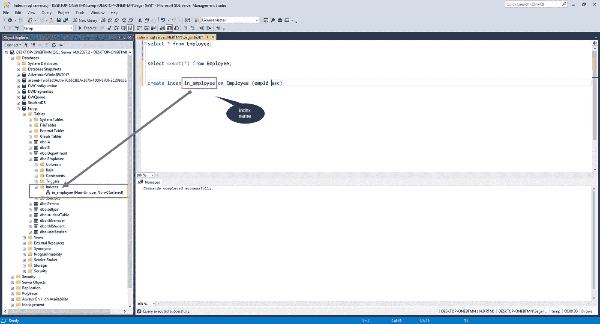
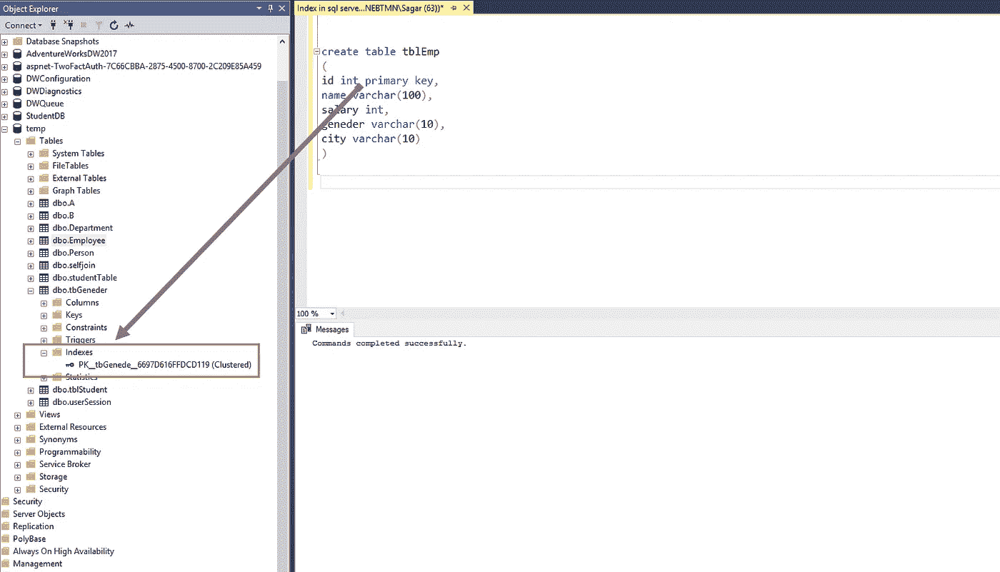
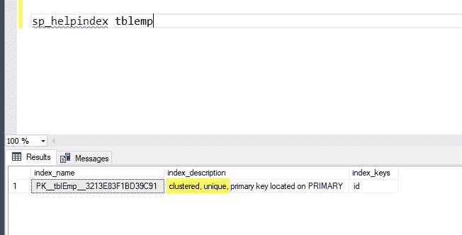
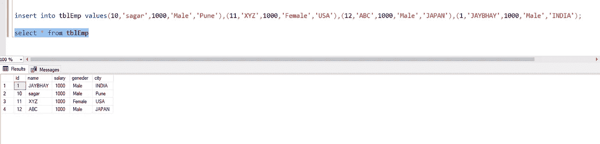
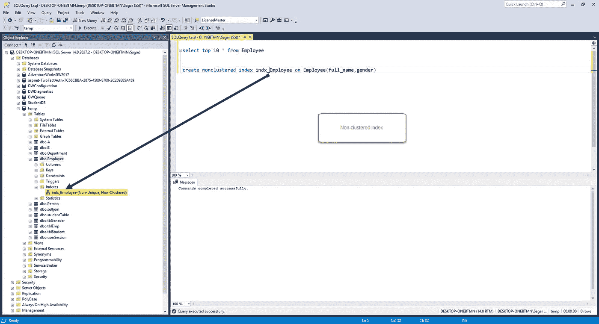
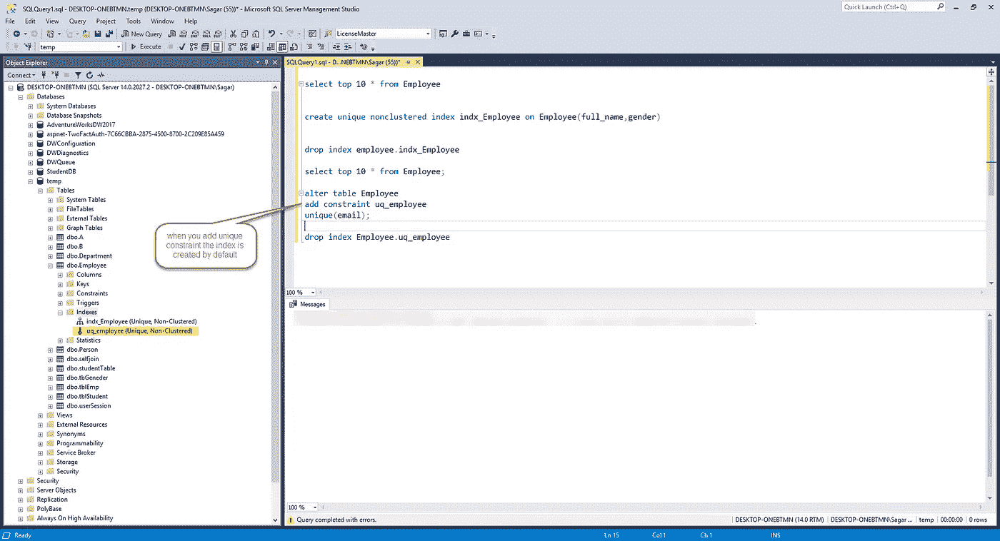

# SQL Server 2020 中的索引

> 原文：<https://medium.com/analytics-vidhya/all-about-index-in-sql-server-2020-sagar-jaybhay-219a092f05ce?source=collection_archive---------20----------------------->


SQL SERVER SAGAR JAYBHAY

在本文中，您将了解什么是 SQL Server 中的索引。此外，您将了解到唯一和非唯一索引之间的区别。

索引用于快速查找表中的数据。在视图和表上创建索引。它类似于图书索引。

如果您应用索引，它将大大提高查询性能。如果没有索引，那么查询引擎从头到尾检查每一行，这将需要很长时间，这称为表扫描。

**您可以通过两种方式在**[**SQL server**](https://www.microsoft.com/en-in/sql-server/sql-server-2019)**中创建索引。1)通过查询 2)图形界面。**

索引是一种特殊的数据结构，它与表和视图相关联，借助于它可以提高查询的性能。

常规语法:

```
Create index index_name on table_name (column_name asc)
```

例子

```
create index in_employee on Employee (empid asc)
```

上面的查询在 empid 列的 employee 表上创建了一个 in_employee 索引。



使用下面的命令找出在表上创建的所有索引

```
sp_helpindex Employee
```

在这个**中，sp_heplindex** 是一个系统存储过程。

## 怎么降指数？

```
Drop index tablename.index_name;
 -- Example
Drop index employee.index_name
```

# SQL Server 中存在不同类型的索引。

# 聚集索引

聚集索引决定了表中数据的物理顺序。因为它决定了物理顺序，所以表只能有一个聚集索引。

如果您的列包含主键约束，并且在该表上，如果您创建索引，则它会自动标记为聚集索引。

假设您创建了一个表，在一列上创建了一个主键，然后它会自动在该列上创建聚集索引，如下图所示。



```
create table tblEmp
(
id int primary key,
name varchar(100),
salary int,
gender varchar(10),
city varchar(10)
)
```



当您的表包含聚集索引时，它被称为聚集表。如果表没有聚集索引，那么数据行存储在一个无序的结构中，这个结构称为堆。

聚集索引以一种特殊的结构组织数据，因此它被称为 B 树。

如下图所示，我们以随机的方式插入数据，但是当我们选择这些数据时，你可以看到它们是有序的。

```
insert into tblEmp values(10,'sagar',1000,'Male','Pune'),(11,'XYZ',1000,'Female','USA'),(12,'ABC',1000,'Male','JAPAN'),(1,'JAYBHAY',1000,'Male','INDIA');

select * from tblEmp
```



因此，这意味着聚集索引自动按排序顺序组织数据。

创建索引时，索引或聚集可以包含多列。所以这个索引我们称之为复合聚集索引。

如果您的列允许 null，则您不能在该列上创建聚集索引。

《出埃及记》

**电话簿:按字母顺序排列。**

# 非聚集索引:

它类似于书中的索引。非聚集索引存储在一个地方，而实际数据存储在另一个地方。这个非聚集索引有指向数据存储位置的指针。

因为它分别存储索引和数据，所以您可以在表上添加多个索引。

在索引本身中，数据以升序或降序存储，这不会影响该表中的数据存储功能。

您可以在表上添加尽可能多的索引。

《出埃及记》

**一本教科书**

```
create nonclustered index indx_Employee on Employee(full_name,gender);
```



# 唯一索引和非唯一索引:

**唯一索引**:用于强制各列值的唯一性。

默认情况下，primary key 约束创建唯一键或唯一聚集索引。

如果您看到唯一性是聚集索引和非聚集索引的属性。

```
create unique nonclustered index indx_Employee on Employee(full_name,gender)
```

# 唯一索引和唯一约束之间有什么区别？

在这一点上，这两者没有太大的区别。使用 unique 约束时，会自动创建 unique 索引。

在我们的 employee 表中，我们在 email 列上添加了惟一的约束。要添加唯一的约束，我们需要修改表。

```
alter table Employee add constraint uq_employee unique(email);
```



参见上图，在运行查询时，索引被创建。

# 何时使用唯一约束？

当我们需要数据完整性时，我们需要使用自动创建唯一索引的唯一约束。无论您创建唯一索引还是添加唯一约束，数据验证的方式都是一样的。

# SQL 中索引的优缺点是什么？

**优点**:

1.  索引用于快速查找数据。
2.  带有 where 子句的 select、update、delete 语句可以从索引中受益。
3.  此外，order by 子句和 group by 子句也受益于这些索引。

**缺点**:

1.  需要额外的磁盘空间:聚集索引不需要额外的存储。每个非聚集索引都需要额外的空间，因为它是从单独的表中存储的。所需的空间量取决于表的大小以及选择多少列来创建索引。
2.  Insert、update、delete 语句变得很慢:这意味着 Delete、Update 查找记录所需的时间要少得多，但是当一个表很大并且有多个索引时，则需要更新这些索引，在这种情况下，太多的索引更新实际上会损害性能。
3.  覆盖查询:-假设您在选择查询中选择了表中的所有列，并且所有这些列都存在于索引中，则不进行查找，但是如果这些列不存在于索引列中，则需要进行查找。