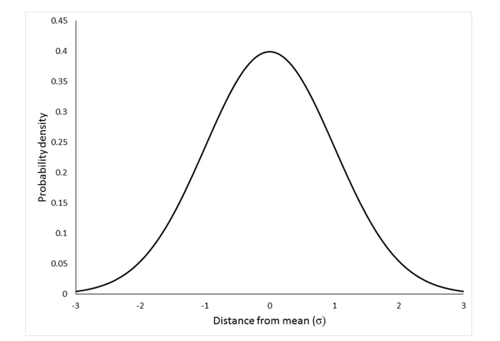

# 关于机器学习中的朴素贝叶斯定理！

> 原文：<https://medium.com/analytics-vidhya/all-about-na%C3%AFve-bayes-theorem-in-machine-learning-93a82720264c?source=collection_archive---------22----------------------->

## **简介:是一种机器学习分类算法，作用于概率，对数据进行分类！**

来源[坦纳博瑞克](https://unsplash.com/@tannerboriack)经由 [Unsplash](https://www.unsplash.com)

曾经想过自动分类，这里有一个简单的贝叶斯算法可以帮你做到。

> 在机器学习中有许多分类问题，这要求你将特征分类到适当的类中。要做到这一点，有许多可能的方法，“朴素贝叶斯”是其中之一。

这个算法基于**【Bayes 定理】** &也是理解这个算法的前提。下面是理解算法的博客链接。

 [## 关于贝叶斯定理的一切！

### 有没有想过根据其他事件来计算一个事件的概率，这应该很有趣吧！如果…

medium.com](/analytics-vidhya/all-about-bayes-theorem-f4d1d6ee4485) 

## 朴素贝叶斯的解释

在内部，它使用贝叶斯定理来计算给定某些特征的事件的概率&基于该概率，数据集的记录被分类到输出类别之一。

> 朴素贝叶斯有三种类型:
> 
> 伯努利
> 
> 多项式
> 
> 高斯的

## 伯努利朴素贝叶斯；

如果数据(仅要素)仅包含布尔值，如 0 & 1 或 yes & no，则使用这种类型的朴素贝叶斯。在这种情况下，任何要素只能有 2 个可能的值。

例如，欺诈的存在与否取决于仅包含两种不同类型值的任意数量的特征。

就像这样，如果有一个数据集有“n”个仅包含 2 个不同值的要素(显然，对于分类 1，编码会将它们转换为二进制要素)，在这种情况下最好使用伯努利朴素贝叶斯。

## 多项式朴素贝叶斯

如果数据(仅要素)有两个以上不同的值，并且这些值本质上是离散的，则使用这种类型的朴素贝叶斯。

例如，一张纸币属于哪一种货币类别，根据具有两个以上不同离散值的“n”个特征来决定或分类。

## 高斯朴素贝叶斯

如果数据(仅要素)有两个以上不同的值，并且这些值本质上是连续的，则使用这种类型的朴素贝叶斯。最好的情况是应用这种类型的朴素贝叶斯的正态分布。

**作者图片**

## 朴素贝叶斯算法示例

考虑到一个人是否会自己创业的分类问题，做出这一决定的特征只有“年龄”和“性别”，输出将是**“是”或“否”**。

你能猜出在这个场景中应该使用哪个朴素贝叶斯吗？是的，你猜对了，这将是**高斯朴素贝叶斯**。

现在，让我们考虑以下数据来解决我们的问题:

*   记录总数= 100
*   创业的人= 55
*   没有创业的人= 45

让我们把“年龄”和“性别”都看作特征“X”。我们要找出 **P(开始营业| X)** & **P(未开始营业| X)**&根据概率，我们将特征 X 赋给指定的类别。

根据贝叶斯定理，

> **P(开始营业| X) =[** **P(X |开始营业)* P(开始营业)] / P(X) = >等式(1)**
> 
> 其中 **P(创业| X) =后验概率，**
> 
> **P(X |开始营业)=可能性，**
> 
> **P(开始业务)=先验概率，&**
> 
> **P(X) =边际概率**

p(开业)=开业人数/总人数= 55 / 100 = 0.55 **= >等式(2)**

> 为了求 P(X)，我们取一个随机半径的圆，取该圆上的观测值，然后除以观测值总数。*假设有 5 个观察值位于圆内，*

因此，P(X) = 5 / 100 = 0.05 **= >方程(3)**

> 为了找到 P(X | Start Business)，我们考虑找到 P(X)时的圆&在这个圆中，我们检查对应于“Start Business”类别的观察次数，然后用它除以“Start Business”类别的观察总数。*假设圆圈中有 3 个观察值对应于“创业”类别，*

因此，P(X |创业)= 3 / 55 = 0.0545 **= >等式(4)**

从上面所有的等式中，我们可以很容易地得出结论

**P(创业| X) = [ 0.0545 * 0.55 ] / 0.05 = 0.6(近似值)**

> 同样，P 的概率**(不开展业务| X)** 可以用上面的策略求出，当我们有了这两个概率，我们就可以很容易地比较它们，&然后我们就可以把特定的特性“X”归入指定的类别。

***我希望这篇文章以最好的方式解释了算法&涵盖了所有方面。非常感谢您为我的文章投入时间。***