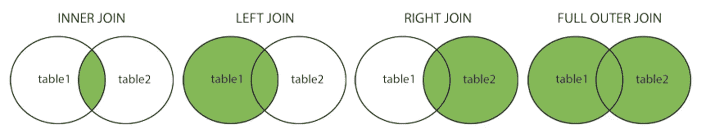

# 关于 SQL 连接的所有内容

> 原文：<https://medium.com/analytics-vidhya/all-about-sql-joins-492dfa7f8a5e?source=collection_archive---------4----------------------->

最近在一次采访中，我被要求解释 SQL 中的`JOIN`和`LEFT JOIN`之间的区别。不可否认，我已经有一段时间没有考虑不同的 SQL 连接了，我在回答这个问题时有点笨拙。所以我借此机会深入研究 SQL 连接。

# 什么是 SQL 连接？

SQL 联接是一种基于两个或多个表之间的公共列来组合它们的行的方法。

让我们用一本书和作者的例子来分解一下，作者可以有很多本书，一本书属于一个作者。

`authors`表有一个`id`主键、`name`和`age`:

```
**authors** *id   |   name              |   age*
1    |   James Patterson   |   72
2    |   Dan Brown         |   55
3    |   JK Rowling        |   54
4    |   David Baldacci    |   59
```

`books`表有一个`id`主键、`title`、`page_count`和`author_id`，这是一个引用作者`id`的外键:

```
**books**
*id    |   title                    |   pages      |   author_id*
1     |   Along Came a Spider      |   435        |   1
2     |   The Da Vinci Code        |   454        |   2
3     |   The Lost Symbol          |   528        |   2
4     |   HP & Sorcerer's Stone    |   309        |   3
5     |   HP & Chamber of Secrets  |   341        |   3
```

外键用于形成两个表之间的关系，其中外键引用另一个表的主键。外键是我们用来将两个表连接在一起的公共列。

如果我们想要查询所有的书籍并包含作者信息，我们需要将两个表连接在一起。

# SQL 联接的类型

有四种类型的 SQL 联接:

*   `(INNER) JOIN`返回两个表中匹配的所有行
*   `LEFT (OUTER) JOIN`返回左表中的所有行和右表中的匹配行
*   `RIGHT (OUTER) JOIN`返回右表中的所有行和左表中匹配的行
*   `FULLL (OUTER) JOIN`返回其中一个表中匹配的所有行

在编写 SQL 查询时，括号中的单词是可选的。还要注意，SQLite 不支持`RIGHT JOIN`和`FULL JOIN`。

记住这一点的一个好方法是考虑维恩图:



来自[https://www.w3schools.com/sql/sql_join.asp](https://www.w3schools.com/sql/sql_join.asp)的 SQL 连接图

# 如何使用 SQL 连接

回到我们的书和作者的例子，我们可以把`(INNER) JOIN`表中的`books`和`authors`表中的`author_id`:

```
SELECT *
FROM authors
JOIN books
ON authors.id = books.author_id *id| name       | age| id| title                  | pages | author_id*
1 | JPatterson | 72 | 1 | Along Came a Spider    | 435   | 1
2 | Dan Brown  | 55 | 2 | The Da Vinci Code      | 454   | 2
2 | Dan Brown  | 55 | 3 | The Lost Symbol        | 528   | 2
3 | JK Rowling | 54 | 4 | HP & Sorcerer's Stone  | 309   | 3
3 | JK Rowling | 54 | 5 | HP & Chamber of Secrets| 341   | 3
```

请注意作者戴维·鲍尔达奇(`authors`表中`4`的`id`)没有包含在我们的结果中，因为没有一本书的`books`表中有`4`的`author_id`。要包含在`(INNER) JOIN`的结果中，两个表中必须有一个匹配。

如果我们将其与`LEFT (OUTER) JOIN`进行比较:

```
SELECT *
FROM authors
LEFT JOIN books
ON authors.id = books.author_id*id| name      | age| id | title                  | pages | author_id*
1 | JPatterson| 72 | 1  | Along Came a Spider    | 435   | 1
2 | Dan Brown | 55 | 2  | The Da Vinci Code      | 454   | 2
2 | Dan Brown | 55 | 3  | The Lost Symbol        | 528   | 2
3 | JK Rowling| 54 | 4  | HP & Sorcerer's Stone  | 309   | 3
3 | JK Rowling| 54 | 5  | HP & Chamber of Secrets| 341   | 3
4 | DBaldacci | 59 |null| null                   | null  | null
```

现在作者戴维·鲍尔达奇包含在我们的结果中，因为它存在于左边的表中。我们左边的表是`authors`，在`LEFT (OUTER) JOIN`中，我们返回来自`authors`表的所有行和来自`books`表的所有行，它们在`authors`表中匹配(即所有`books`带有一个`author_id`)。

加盟愉快！

# 来源

[](http://www.sql-join.com/) [## SQL 连接说明

### 解释什么是 SQL 连接的资源，不同连接类型的例子，以及技术性的 ETL 文档…

www.sql-join.com](http://www.sql-join.com/) [](https://www.w3schools.com/sql/sql_join.asp) [## SQL 连接

### JOIN 子句用于根据两个或多个表之间的相关列来组合它们中的行。让我们看一个…

www.w3schools.com](https://www.w3schools.com/sql/sql_join.asp)  [## 一对多关系中 SQL 连接的副作用

### 我告诉我的朋友，他是一名数据分析师转数据 PM，我正在学习 SQL 以及如何连接表和他的第一个…

medium.com](/@aresnik11/side-effects-of-sql-joins-in-one-to-many-relationships-8fc2c00d7597)