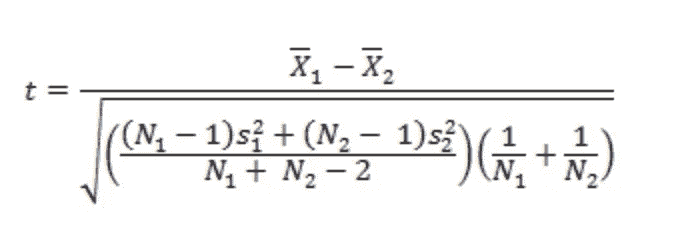

# 关于 T 型测试的一切——去神秘化

> 原文：<https://medium.com/analytics-vidhya/all-about-t-tests-demystified-6034a854433f?source=collection_archive---------31----------------------->

t 检验是统计领域中最广泛使用的假设检验之一。鉴于这些种类繁多，我们经常会混淆什么时候使用什么。在这篇文章中，我试图涵盖 t-test 的“如何，何时，何地”。

当数据中有一个测量变量时，应用 t 检验。嗯，测量变量，顾名思义，就是你可以测量的东西。它们的其他名称包括“数字”或“定量”变量。

不多说了，我们开始吧..

# 一个样本 t 检验/学生 t 检验

该测试用于确定测量变量的平均值与其理论预期值之间是否存在统计上的显著差异。

我举一个*来自物理学的例子*让大家容易掌握。假设您已经对一个新的亚原子粒子的质量进行了多次观察，现在您想知道数据中的平均质量是否符合粒子物理学标准模型预测的质量？这里的无效假设是计算的平均质量等于理论质量。

[测试统计量](https://support.minitab.com/en-us/minitab-express/1/help-and-how-to/basic-statistics/inference/supporting-topics/basics/what-is-a-test-statistic/#:~:text=A%20test%20statistic%20is%20a,expected%20under%20the%20null%20hypothesis.)可以使用以下公式计算:

> ts=(X-μ)/(s/√n)

(其中 X 是样本均值，μ是零假设下的期望均值， *s* 是样本标准差， *n* 是样本量)

从 [t 表](https://www.researchgate.net/figure/Student-t-distribution-table_tbl2_236673256)中读取将需要一个计算的 t 值和自由度(这里是 *n-1* )

t 检验*假设*观察值遵循正态分布。对于一个样本 t 检验，具有较少观察值的严重偏斜数据不会给出可靠的结果。因此，您可能需要应用某种数据转换，如对数转换、平方根转换，以满足先决条件。

尽管如此，如果你的数据是异常的，你可以使用非参数检验，如**曼-惠特尼检验**

# 双样本 t 检验

当您想要找出两组中测量变量的平均值之间是否存在统计上的显著差异时，可以使用该测试。这种情况下的零假设是，两个均值相等。

例如，人们认为 7 岁到 11 岁的男孩和女孩每天花在运动上的平均时间是一样的。你可以用这个测试来验证这个假设。

t 检验统计量可以使用以下公式计算:

其中 *N* 为样本大小， *s* 为样本标准差， *X* 为样本均值

这里涉及到许多假设:

1.  两组的数据都是独立的，并且遵循正态分布
2.  两组之间的数据应该有相等的方差(同方差)

如果应用数据转换后仍不满足上述假设，您应该考虑**曼恩-惠特尼 U 检验**(也称为曼恩-惠特尼-威尔科森检验/威尔科森秩和检验/威尔科森双样本检验)或**韦尔奇 t 检验。**(我将在接下来的文章中解释这些测试)

# 配对 t 检验

当您有一个测量变量和两个分类变量时，使用此测试。一个分类变量应该只有两个类别(如男性/女性或之前/之后)，这样您就可以获得多对观察值。它测试配对中的平均差是否不等于 0。

一个很好的例子可以是药物的临床试验，其中一个分类变量描述一组患者，而其他分类变量具有两个值，即“治疗前”和“治疗后”

此处的无效假设是，患者组在治疗前后的测量变量(如血压)均值没有显著差异，暗示药物无效。

t 检验统计量可以使用以下公式计算:

> ts=(dₐ)/(sₐ/√n)

其中，dₐ是样本均值差异， *sₐ* 是差异的标准差。

配对 t 检验只有一个假设，即配对之间的观察值的**差**应该是正态分布的。如果差异非常不正常，最好使用 **Wilcoxon 符号秩检验**

那都是乡亲们！

如果你喜欢这篇文章，确保你点击了拍手按钮。我将在下一篇文章中写关于方差分析的内容。敬请期待！