# 关于决策树中的所有决策…

> 原文：<https://medium.com/analytics-vidhya/all-about-the-decisions-in-decision-trees-b6dc71b39c50?source=collection_archive---------21----------------------->

我读过很多关于决策树的文章，但这些文章并没有涵盖其中的所有主题。所以，我想为什么不把我所知道的关于他们的一切自己写出来。作为奖励，我会把我被问到的关于他们的所有面试问题都加上去。

> 面试问题提醒 1:
> 
> 你能告诉我关于决策树和你最近在哪里使用它们吗？

**决策树的定义**

> **决策树**是一种决策支持工具，它使用决策及其可能结果的树状模型，包括偶然事件结果、资源成本和效用。
> 
> —维基百科

从上面的句子中我们可以了解到，他们使用某种基于树的结构来做出某些决定或得出结论。他们使用逻辑条件来得出结论，这是我们在日常生活中都会用到的。

**例子:**我们约好了一起吃晚餐，还有一场两小时后开始的电影。剧院附近的所有餐馆都会出现在我们的脑海中，因为旅行是最重要的(将它视为过滤我们数据的第一个逻辑条件，或者用 DTs 术语来说是一个**拆分**)，接下来要考虑的条件是食物的供应时间(这将是第二个拆分，我们的选项会被进一步过滤)，等等，直到我们得出最终结果。现实世界并非如此，当我们得出结论时，电影实际上已经开始了。

这些结论可以是多类分类变量或连续变量。换句话说，它的意思是 **DTs** (让我们称决策树为 DTs，希望它不变)，可以用在目标变量是分类/连续的数据上。

让我们回到定义的基于树的模型部分，我们想到的是树、树枝、树叶和树根。(让我们忽略茎，花几分钟，我的意思是你认为深花代表结果或预测值。想想吧。)

> 面试问题提醒 2:
> 
> DT 的用的是哪种算法？

使用 DT 算法的历史。

[**ID3**](https://en.wikipedia.org/wiki/ID3_algorithm)→(D3 的扩展)
[**c 4.5**](https://en.wikipedia.org/wiki/C4.5_algorithm)→(ID3 的继承者)
[**CART**](https://en.wikipedia.org/wiki/Predictive_analytics#Classification_and_regression_trees_.28CART.29) →(分类和回归树)
[**CHAID**](https://en.wikipedia.org/wiki/Chi-square_automatic_interaction_detection) →(卡方自动交互检测在计算分类树时进行多级拆分)
[**火星**](https://en.wikipedia.org/wiki/Multivariate_adaptive_regression_spline) →(多元自适应回归样条)

出了上面，我们主要用下面的。

1.  CART(分类和回归树)→使用 ***基尼指数*** 作为度量标准。
2.  ID3(迭代二分法 3) →使用 ***熵函数*** 和 ***信息增益*** 作为判据。

让我们讨论一下这些算法中使用的标准，这将使我们有更好的理解。

但首先是一些 DT 术语。

1.  **根节点:**它代表整个群体或样本，并进一步分成两个或更多同类集合。
2.  **拆分:**是将一个节点分成两个或两个以上子节点的过程。
3.  **决策节点:**当一个子节点分裂成更多的子节点时，则称之为决策节点。
4.  **叶/端节点:**节点不分裂称为叶或端节点。

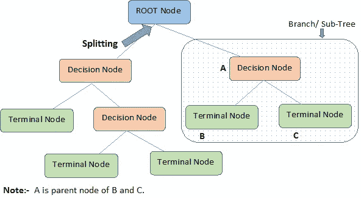

5.**剪枝:**当我们删除一个决策节点的子节点时，这个过程叫做剪枝。你可以说分裂的相反过程。

6.**分支/子树:**整个树的一个子部分称为分支或子树。

7.**父节点和子节点:**被分成子节点的节点被称为子节点的父节点，而子节点是父节点的子节点。

**纯度在 DT** 中借助于树形图。

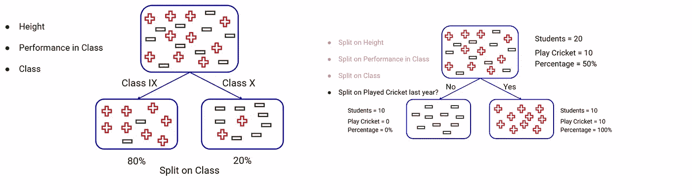

不纯与纯节点

**如何在 DT 中选择最佳拆分点？**

DT 分割所有可用变量上的节点，但选择导致最同质节点的分割，其中杂质较低。先说基尼杂质。

1.  **基尼杂质**

基尼系数= 1-基尼系数

**Gini** 是节点中随机选取的点属于同一类的概率。如果概率高，杂质就低。如果这个概率是 1，那么我们节点中的所有点都是一类，并且是纯的。DT 的主要目标是实现纯节点。

基尼系数基本上是根据节点的同质性来决定选择哪个变量进行分割。基于杂质值，我们选择用于分裂的变量，杂质越低，子节点的同质性越高。这一点非常重要，因为第一次分割中使用的变量非常重要。

> 面试问题提醒 3:
> 
> 模型如何帮助降维？

计算基尼系数的步骤:

a)基尼=每个等级/类别的概率平方和:

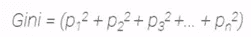

b)计算子节点的基尼系数:

c)为了计算分割的基尼系数，取该分割的两个子节点的加权基尼系数。这里，权重是节点中所有点的计数/父节点中点的总数。

变量的加权基尼系数:

= (w1 * g1)+ (w2 * g2)+ ……+(wn * gn)

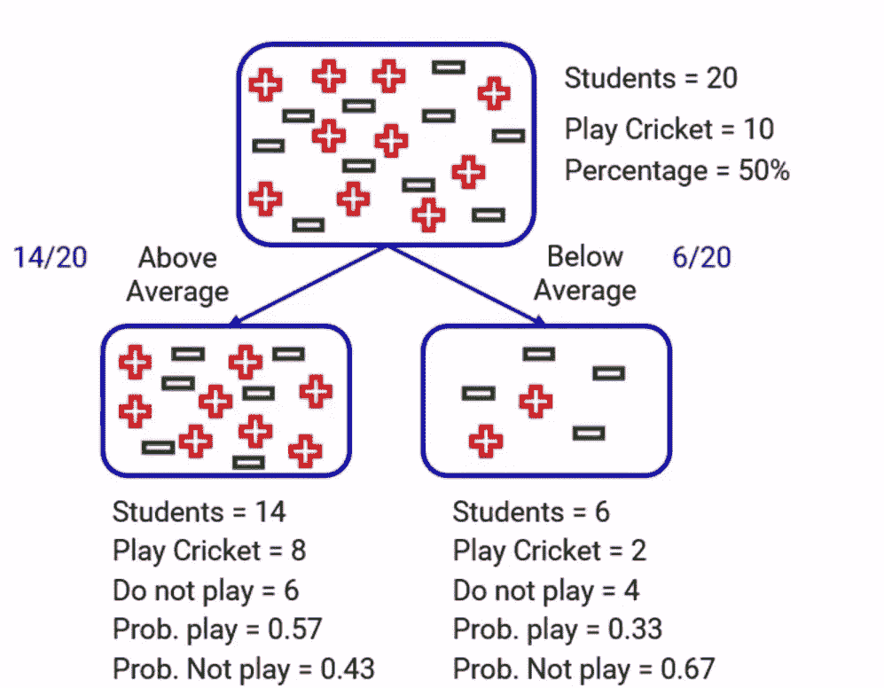

基于类别变量表现的基尼系数计算。

子节点**的基尼系数高于平均值**

= 1-基尼= 1-(每个等级/类别的概率平方和)

子节点中的学生总数= 14

游戏概率= 8/14 =0.571

不玩的概率= 6/ 14 = 0.428

=**1-((0.571 * 0.571)+(0.428 * 0.428))= 1-(0.326+0.183)= 0.491**

子节点**的 Gini 杂质低于平均值**

子节点中的学生总数= 6

游戏概率= 2/6 =0.333

不玩的概率= 4/ 6= 0.667

=**1-((0.333 * 0.333)+(0.667 * 0.667))= 1-(0.518)= 0.482**

分割的加权基尼系数:

=(高于平均值的子节点的权重*高于平均值的子节点的 gini 杂质)+(低于平均值的子节点的权重*低于平均值的子节点的 gini 杂质)

如前所述，权重是节点中所有点的计数/父节点中点的总数。

子节点的权重高于平均值= 14/20

低于平均值的子节点权重= 6 /20

分割的加权基尼系数=**(14/20)*(0.491)+(6/20)*(0.482)**

**= 0.343 + 0.144 = 0.487**

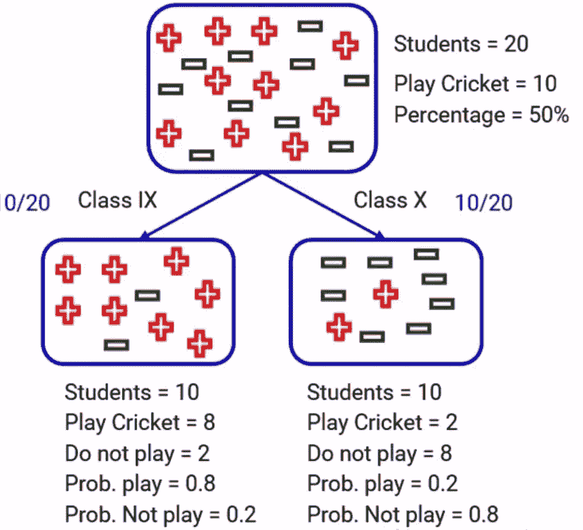

基于阶层变量的基尼系数计算。

子节点类别 IX 的 Gini 杂质= 1-(0.8*0.8+0.2*0.2) = 0.32

子节点**级的 Gini 杂质 X = 1-(0.2*0.2 + 0.8*0.8) = 0.32**

用于分割的加权基尼系数=**(10/20)*(0.32)+(10/20)*(0.32)**

**= 0.16 + 0.16 = 0.32**

因为当我们使用类别变量进行划分时，基尼系数较低。那就将**中的*选一个*中的**。

**2。卡方度量**

这个度量实际上观察或检查子节点和它们的父节点之间是否有任何统计显著性。它是每个节点中目标变量的实际和预期频率之间的标准化差异的平方和的度量。

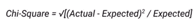

“实际”表示父节点中的分布,“预期”是子节点中的分布。

用外行人的话来说，卡方就是某个类在父节点和子节点两者中分布的差异(偏差)。差异越大，卡方值越高，则同质节点的数量越多。

计算分割卡方的步骤:

a)为每个子节点计算每个类的期望值

b)使用上述公式计算每个子节点的卡方。

c)使用该分裂的每个子节点的卡方总和来计算 splot 的卡方。

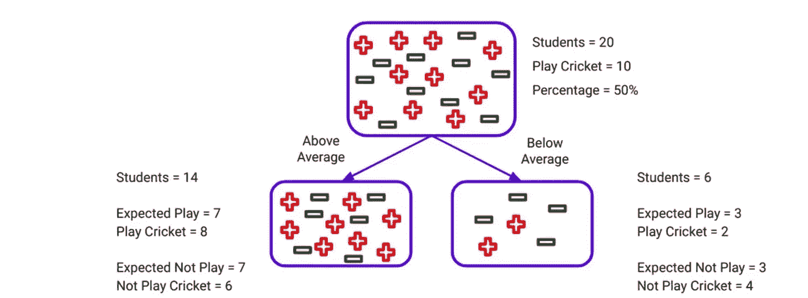

在课堂上表现不一

高于平均值的卡方检验:

实际间隙= 8

实际未播放= 6

预期间隙= 7

预期不播放= 7

卡方(play) = sqrt((实际-预期)/预期)= sqrt((8–7)/7)

= sqrt(1/7)= sqrt(0.1428)=**0.37**

卡方(非玩耍)= sqrt((实际-预期)/预期)= sqrt((6–7)/7)

= sqrt(1/7)= sqrt(0.1428)=**0.37**

低于平均值的卡方检验:

实际游戏= 2

实际未播放= 4

预期间隙= 3

预期不播放= 3

卡方(play) = sqrt((实际-预期)/预期)= sqrt((2–3)/3)

= sqrt(1/3)= sqrt(0.333)=**0.57**

卡方(非玩耍)= sqrt((实际-预期)/预期)= sqrt((4–3)/3)

= sqrt(1/3)= sqrt(0.333)=**0.57**

拆分的总卡方是该拆分的每个子节点的卡方之和。

对于拆分的总卡方=**0.37+0.37+0.57+0.57 = 1.88**

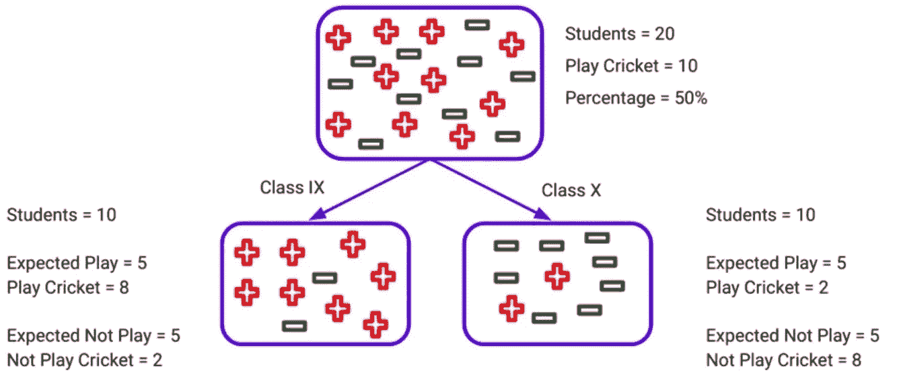

对类变量进行拆分

IX 的卡方检验:

卡方(play)= sqrt((8–5)/5)= sqrt(9/5)= sqrt(1.8)= 1.34

卡方(非播放)= sqrt((2–5)/5)= sqrt(9/5)= sqrt(1.8)= 1.34

X 的卡方检验:

卡方(play)= sqrt((2–5)/5)= sqrt(9/5)= sqrt(1.8)= 1.34

卡方(非播放)= sqrt((8–5)/5)= sqrt(9/5)= sqrt(1.8)= 1.34

分割的总卡方=**1.34+1.34+1.34+1.34 = 5.36**

由于类的卡方更大，这意味着通过类进行分割会产生更多同质节点，因此我们将使用类变量进行分割。

**3。信息增益**

> 信息增益是分割前后熵差的量度。
> 
> 熵是对数据中不确定性的度量。
> 
> 信息增益的公式是:
> 
> **信息增益= 1-熵**

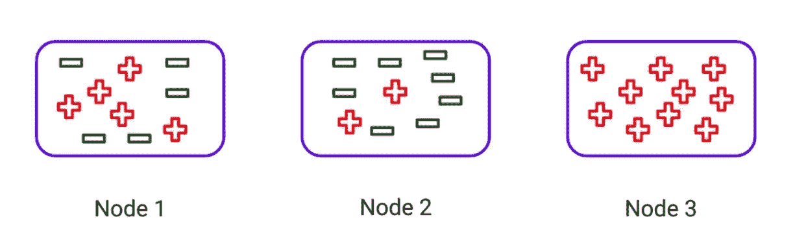

当我们考虑上面的三个节点时，我们可以容易地理解 N **ode 3** 是最纯的节点，并且熵或不确定性将非常低，因为所有的数据点都属于同一类。所以信息增益会很高，使其成为非常适合拆分的选项变量。

现在考虑节点 2，因为它是两个类别的混合，但是具有不相等的分布，所以熵将高于节点 3 的熵。

现在考虑节点 1，与其他节点相比，它是所有节点中最不纯的节点，具有高不确定性或熵。因此，信息增益会很低，而且不均匀。

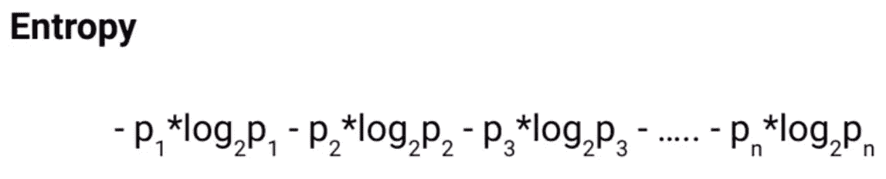

这里 p1，p2…pn 是假设有 n 个类的节点中每个类的百分比。

计算分割熵的步骤:

a)计算父节点的熵。

b)计算子节点的熵。

c)计算分裂的加权平均熵。这里，权重是节点中所有点的计数/父节点中点的总数。

> 如果一个子节点的熵大于父节点的熵，我们将不考虑这种分裂，因为它返回更多的不纯节点。

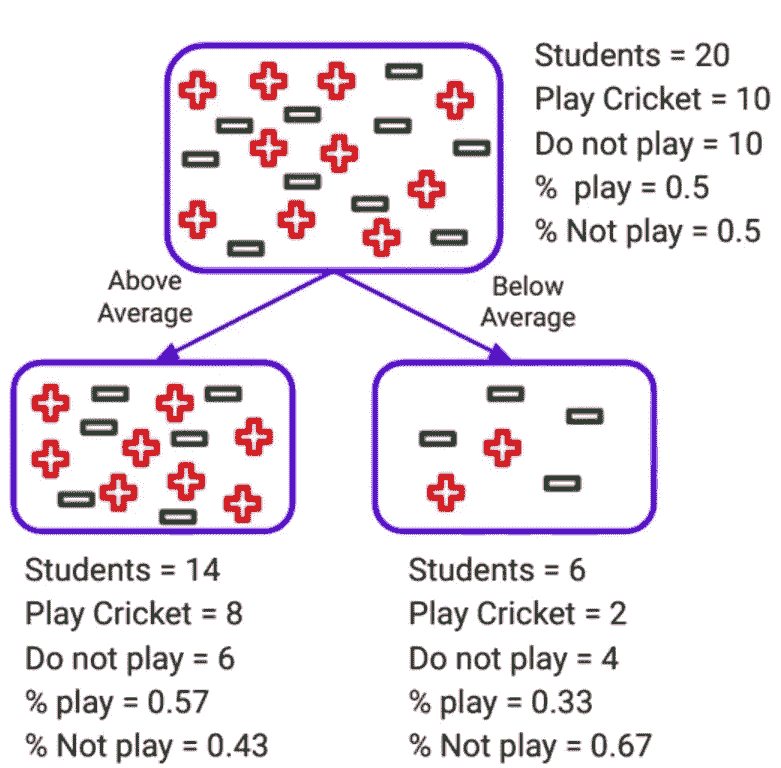

在课堂上表现不一

父节点的熵:

=-(%播放)*日志(%播放)-(%不播放)*日志(%不播放)

**=-(0.5)(log(0.5))-(0.5)(log(0.5))= 1**

高于平均水平的子节点的熵:

=-(%播放)*日志(%播放)-(%不播放)*日志(%不播放)

**=-(0.57)(log(0.57))-(0.43)(log(0.43))= 0.98**

低于平均值的子节点的熵:

=-(%播放)*日志(%播放)-(%未播放)*日志(%未播放)

**=-(0.57)(log(0.57))-(0.43)(log(0.43))= 0.98**

加权熵:

=(高于平均值的子节点的权重*高于平均值的子节点的熵)+(低于平均值的子节点的权重*低于平均值的子节点的熵)

如前所述，权重是节点中所有点的计数/父节点中点的总数。

子节点的权重高于平均值= 14/20

低于平均值的子节点权重= 6 /20

分裂的加权熵=**(14/20)*(0.98)+(6/20)*(0.91)**

**=0.686+0.273 = 0.959**

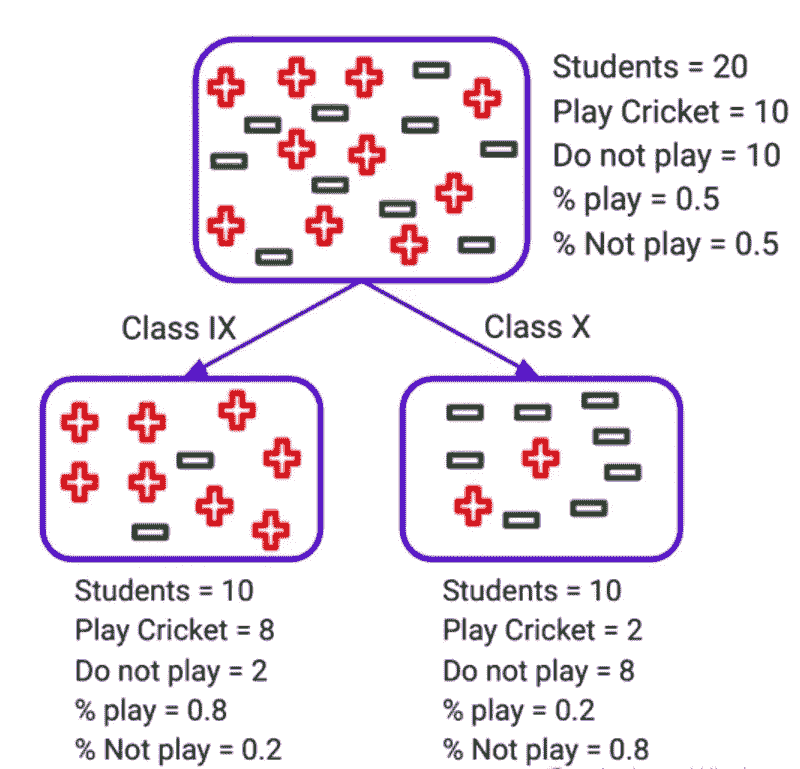

对类变量进行拆分

父节点的熵:=-(0.5)(log(0.5))-(0.5)(log(0.5))= 1

IX 子的熵=-(0.8)(log(0.8))-(0.2)(log(0.2))= 0.722

X 子的熵=-(0.2)(log(0.2))-(0.8)(log(0.8))= 0.722

分割的加权熵=(10/20)*(0.722)+(10/20)*(0.722)

= **0.722**

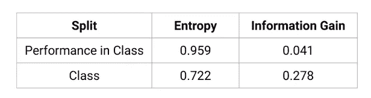

> 当我们比较熵和信息增益(1-熵)时，我们可以看到，信息增益越高(不确定性或熵越小)，节点就越均匀。

因此，上述指标或标准用于分类目标变量，对于连续目标变量，我们有不同的方法。

**4。方差减少**

> **统计学中的方差** (σ2)是对一个数据集中数字之间的分布的度量。

根据定义，方差是衡量数据分布的尺度。因此，我们可以假设方差越高，数据越分散或不均匀；方差越低，数据越均匀。

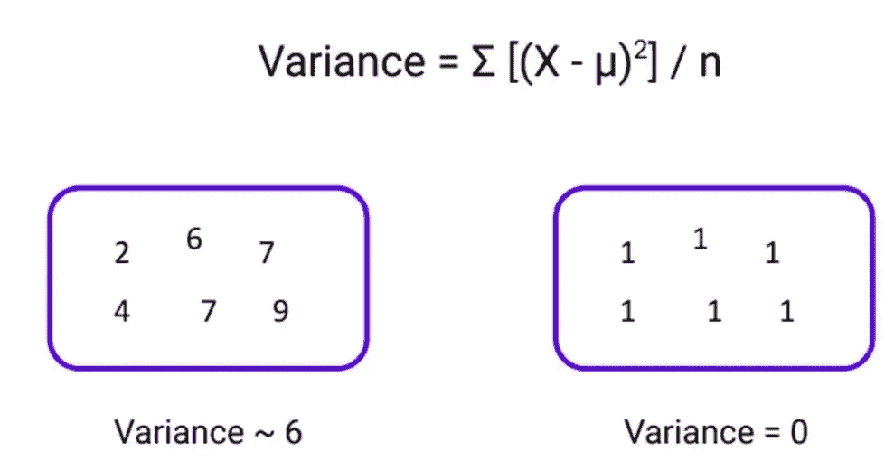

根据上面提到的方差公式，图中第一个节点的方差为 6，数据点的范围为(2，9)。而第二个节点的方差为 0，所有点都为 1。因此，方差越低，节点越同质。

计算分割差异的步骤:

a)计算子节点的方差。

b)方差=((X1-μ)/n)+((X2-μ)/n)+((X3-μ)/n)+……。+((Xn-μ) /n)

n 是点数

c)将每个分裂的方差计算为每个子节点的加权平均方差。这里，权重是节点中所有点的计数/父节点中点的总数。

因为目标应该是连续的，所以让我们用 1 和 0 代替例子中的+和-。

戏剧→1

不玩→0

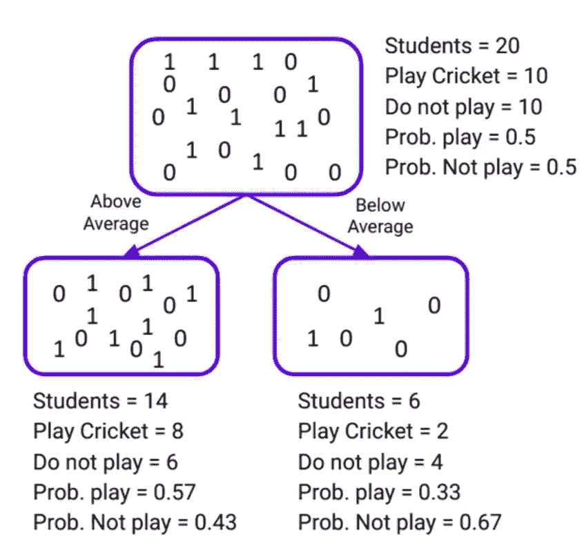

在课堂上表现不一

高于平均水平的节点:

平均值= (8*1+6*0)/14 =8/14 =0.57

方差=(8 *(1–0.57)+6 *(0–0.57))/14 = 0.245

低于平均节点:

平均值= (2*1+4*0)/6=2/6 =0.33

方差=(2 *(1–0.33)+4 *(0–0.33))/14 = 0.222

分割的加权平均方差= (14/20)*0.245 + (6/20)*0.222

= **0.238**

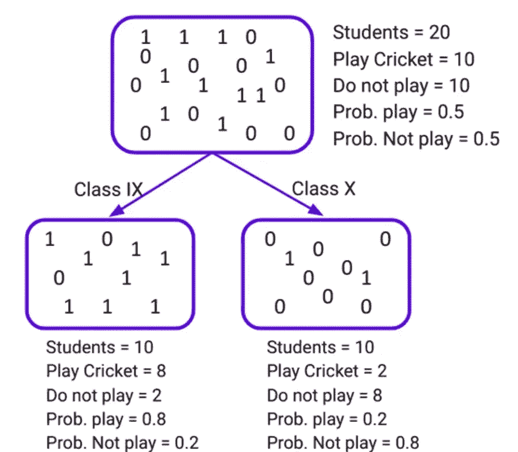

对类变量进行拆分

IX 节点:

平均值= (8*1+6*0)/14 =8/10=0.8

方差=(8 *(1–0.8)+6 *(0–0.8))/14 = 0.16

x 节点:

平均值= (2*1+8*0)/6=2/10 =0.2

方差=(2 *(1–0.2)+4 *(0–0.2))/10 = 0.16

分割的加权平均方差=(10/20)*(0.16)+(10/20)*(0.16)=**0.16**

> 方差越低，节点越均匀。

让我们讨论一下所有上述指标的性质。

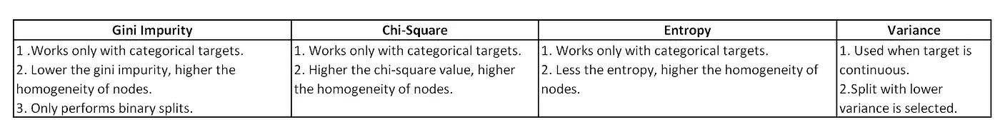

# 感谢阅读！

希望你们都能理解。:)