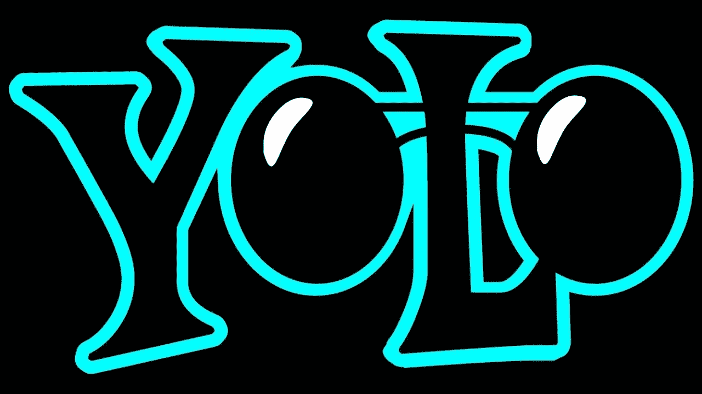
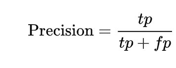
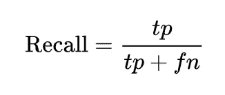
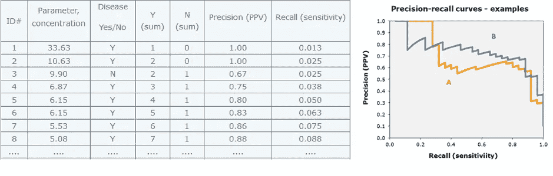
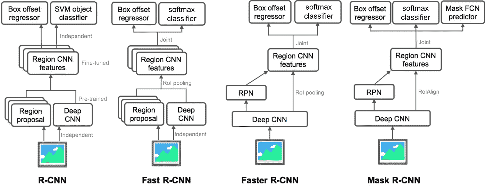
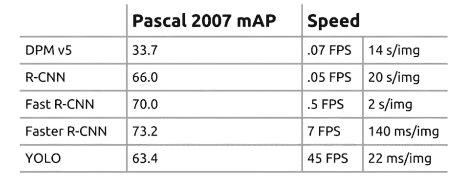

# 关于约洛斯的一切——第一部分——一点历史

> 原文：<https://medium.com/analytics-vidhya/all-about-yolos-part1-a-bit-of-history-a995bad5ac57?source=collection_archive---------5----------------------->

我很确定；每个计算机视觉爱好者都一定听说过 [YOLO](https://pjreddie.com/darknet/yolo/) ，这是一种实时物体检测器，可以识别物体以及这些物体在图像或视频中的位置。显然，人们谈论的要么是 YOLO 的一个版本，要么是 YOLO 的部分概念，要么是如何用代码使其工作。我在网上找不到一个完整的关于 YOLO 的资料来源。与识别算法相比，检测算法，在这种情况下，Yolo，不仅预测类别标签，而且还检测对象的位置。因此，它不仅将图像分类到一个类别中，而且还可以检测图像中的多个对象。

这个 5 部分的系列旨在解释 YOLO 的一切，它的历史，它是如何版本化的，它的架构，它的基准，它的代码，以及如何让它为自定义对象工作。

以下是该系列的链接。

**关于 YOLOs 的一切——第一部分——一点历史**

[**关于 YOLOs — Part2 —第一个 YOLO**](/@rehan_ahmad/all-about-yolos-part2-the-first-yolo-2b5db7d78411)

[**关于 YOLOs 的一切——第三部分——更好更快更强 YOLOv2**](/@rehan_ahmad/all-about-yolos-part3-the-better-faster-and-stronger-yolov2-9c0cf9de9758)

[**全部关于 YOLOs — Part4 — YOLOv3，一个增量改进**](/@rehan_ahmad/all-about-yolos-part4-yolov3-an-incremental-improvement-36b1eee463a2)

[**关于 YOLOs —第 5 部分—启动并运行**](/@rehan_ahmad/all-about-yolos-part5-how-to-code-it-up-937f05cc9ae9)

在我们讨论对象检测算法之前，让我们先来看两个主要的度量标准。

一个是 [**平均精度** - **图**-](/@jonathan_hui/map-mean-average-precision-for-object-detection-45c121a31173)。为了理解这一点，让我们来看几件事。

**精度**:

简单地说，我们可以将精度定义为真阳性(真预测)(TP)与预测阳性总数(总预测)的比值。公式给出如下:

例如，假设我们有 20 幅图像，我们知道这 20 幅图像中有 120 辆汽车。

现在，让我们假设我们将这些图像输入到一个模型中，它检测到 100 辆汽车(这里模型说:我在这 20 幅图像中找到了 100 辆汽车，并且我已经在每辆汽车周围画出了边界框)。

为了计算这个模型的精度，我们需要检查模型已经淹没的 100 个盒子，如果我们发现其中 20 个是不正确的，那么精度将是=80/100=0.8

**回忆:**

如果我们再次查看精度示例，我们会发现它没有考虑数据中的汽车总数(120)，因此如果有 1000 辆汽车而不是 120 辆，并且模型输出 100 个检测值中有 80 个是正确的，则精度将再次为 0.8。

为了解决这个问题，我们需要定义另一个称为召回的指标，它是真实阳性(真实预测)和真实阳性总数(汽车总数)的比率。公式是这样给出的

在我们的例子中，召回率=80/120=0.667。我们可以注意到，回忆衡量的是我们检测数据中所有对象的好坏。

**平均精度和平均平均精度(地图):**

平均精度的一个简单定义是精度-召回曲线下的面积。

AP 将精确和召回结合在一起。**图**是为所有类别计算的 AP 的平均值。

另一个指标是**速度**，即每秒处理的帧数(FPS)。

# **直到 YOLO**

> *准确的物体检测仍然相当缓慢。*

在很长一段时间里， [**DPMv5(可变形零件模型)**](http://www.cse.psu.edu/~rtc12/CSE586/lectures/dpmlecture.pdf) 就像是物体检测中的黄金标准，需要 14 秒来处理一张 33.7 的贴图。这与实时性相差甚远。

然后在 2014 年， **R-CNN** 问世，大幅提升了精确度(66 地图)，但处理时间延长了约 20 秒。想象一下在像自动驾驶汽车这样的应用程序中的这些时间。这辆车在 20 秒内看不到每一帧。之后的很多工作都集中在让 R-CNN 更快。这导致**快速 R-CNN** 在准确性(70°地图)和处理时间(2 秒/图像)方面的改进。尽管这些指标与以前的算法相比有了显著的改进，但它们在实时性方面仍然较慢。这导致了与 YOLO 同时开发的更快的 R-CNN**，它以 73.2mAP 和每秒 7 帧的 140 ms/图像购买了接近实时的检测速度。**

图片来源:[https://lilianweng.github.io/](https://lilianweng.github.io/)

然后是 2015 年的 **YOLO** ，在速度上有了巨大的提高，使其成为实时的。 **YOLO** 的指标是 63.4 张地图的精确度和 22 毫秒/图像，即每秒 45 帧。就在这个时候，整个 **YOLO** 的议论开始了。

对比图表

在下一篇博客中，让我们看看第一个 YOLO 算法是如何工作的。

**资源:**

https://arxiv.org/pdf/1506.02640.pdf[YOLO](https://arxiv.org/pdf/1506.02640.pdf)

YOLOv2 和 yolo 9000:[https://arxiv.org/pdf/1612.08242.pdf](https://arxiv.org/pdf/1612.08242.pdf)

约洛夫 3:[https://arxiv.org/pdf/1804.02767.pdf](https://arxiv.org/pdf/1804.02767.pdf)

> *关于我*

我是 [Wavelabs.ai](https://wavelabs.ai/?source=post_page---------------------------) 的资深 AI 专家。我们 Wavelabs 帮助您利用人工智能(AI)来彻底改变用户体验并降低成本。我们使用人工智能独特地增强您的产品，以达到您的全部市场潜力。我们试图将尖端研究引入您的应用中。

欢迎访问 [Wavelabs.ai](https://wavelabs.ai/?source=post_page---------------------------) 了解更多信息。

嗯，这都是在这个职位。感谢阅读:)

保持好奇！

你可以通过 [LinkedIn](https://www.linkedin.com/in/rehan-a-18675296?source=post_page---------------------------) 联系我。