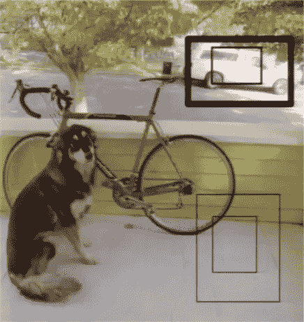
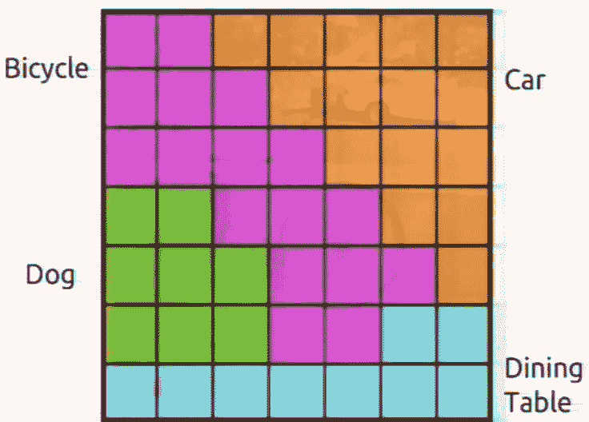

# 关于约洛斯的一切——第二部分——第一个 YOLO

> 原文：<https://medium.com/analytics-vidhya/all-about-yolos-part2-the-first-yolo-2b5db7d78411?source=collection_archive---------6----------------------->

在 YOLO 之前，有两个主要的对象检测框架，DPM(可变形部分模型)和 R-CNN，两者都是基于区域的分类器，其中，作为第一步，它们将找到区域，并且对于第二步，将这些区域传递给更强大的分类器以对它们进行分类。这种方法需要查看图像数千次来进行检测。YOLO 开始了一个项目，通过建立一个单一的神经网络来优化这种方法，该网络采用单一的图像，并在单次传递中返回检测结果和类别。这就是为什么双关语“**你只看一次**”

这个 5 部分的系列旨在解释 YOLO 的一切，它的历史，它是如何版本化的，它的架构，它的基准，它的代码，以及如何让它为自定义对象工作。

以下是该系列的链接。

[**关于 YOLOs — Part1 —一点历史**](/@rehan_ahmad/all-about-yolos-part1-a-bit-of-history-a995bad5ac57)

**关于 YOLOs 的一切——第二部分——第一个 YOLO**

[**关于 YOLOs 的一切——第三部分——更好更快更强 YOLOv2**](/@rehan_ahmad/all-about-yolos-part3-the-better-faster-and-stronger-yolov2-9c0cf9de9758)

[**全部关于 YOLOs — Part4 — YOLOv3，一个增量改进**](/@rehan_ahmad/all-about-yolos-part4-yolov3-an-incremental-improvement-36b1eee463a2)

[**关于 YOLOs —第 5 部分—启动并运行**](/@rehan_ahmad/all-about-yolos-part5-how-to-code-it-up-937f05cc9ae9)

# **方法**

拍摄一幅图像，想象在该图像上覆盖一个网格。网格中的每个单元负责预测一些不同的事情。

第一件事是，它将预测一些边界框，以及每个边界框的置信度值(框包含对象的概率)。

> 注意:可能有一些网格单元附近没有任何对象，但仍然会预测一些边界框，但这些边界框的可信度将非常低。

> 注意:线条的粗细表示置信度值

当网格中的每个单元试图预测一些边界框时，我们可以看到图像中所有对象的地图，其中的框按照它们的置信度值排序。这张地图基本上显示了图像中物体的位置，但不一定知道物体是什么。

下一步是对每个单元格预测分类概率。需要注意的是，这可能并没有说这个网格单元包含了那个对象。这是一个**条件概率**表示如果单元格中有一个对象，那么这个对象就是那个类。

下一步，我们将这些条件概率与包围盒的置信度相乘，从而得到所有包围盒，这些包围盒按照它们包含该对象的实际概率进行加权。这张地图显示了一堆对分类对象的检测，其中很多都有相当低的置信度值。

为了获得对象的单个最佳检测，我们执行 [**非最大值抑制**](https://www.pyimagesearch.com/2014/11/17/non-maximum-suppression-object-detection-python/) ，其基本上抑制非最大值。即所有的低置信度值保持最佳值不变。

该参数化固定了每个像元预测的输出大小。对于每个边界框，它预测 4 个坐标和 1 个置信度值以及一些类别概率。这使得它具有可管理的参数来预测，并且可以用一个神经网络训练成一个完整的检测管道。

这种无缝单一网络与典型分类网络花费的时间一样多，使得 YOLO 非常快，并且还实现了“只看一次”的部分目标。

## **训练流程**

让我们谈一谈培训。我们得到一个带有真实标签的图像。第一项工作是将每个地面实况标签与我们想要在该检测的测试时间预测的适当网格单元相匹配。

为此，我们取边界框的中心，并且该中心落入的任何网格单元将负责该检测。

因此，我们调整该细胞的类预测，以符合地面真相。我们还必须调整该单元格的边界框建议。

因此，我们查看单元的预测框，并找出哪个与我们的地面真实标签重叠最多，并增加置信度和调整坐标。

我们还会查看其他边界框并降低置信度。对于所有没有基本事实检测与其重叠的单元，我们降低置信度值，因为它们没有任何对象。

要注意的是，我们不调整这些单元的类概率或坐标，因为它们不包含对象。

训练主要使用计算机视觉中的一些标准技巧，在 ImageNet 上进行预训练，学习率递减的 SGD 和广泛的数据扩充等。

这就结束了对 YOLO 如何工作的解释。我希望这给出了算法如何工作以及训练是如何完成的一个整体画面。

在本系列的下一篇博客中，我们来看看 YOLOv2，一个更好、更快、更强的版本。

**资源:**

https://arxiv.org/pdf/1506.02640.pdf YOLO

YOLOv2 和 yolo 9000:[https://arxiv.org/pdf/1612.08242.pdf](https://arxiv.org/pdf/1612.08242.pdf)

约洛夫 3:【https://arxiv.org/pdf/1804.02767.pdf】T2

> *关于我*

我是 [Wavelabs.ai](https://wavelabs.ai/?source=post_page---------------------------) 的资深 AI 专家。我们 Wavelabs 帮助您利用人工智能(AI)来彻底改变用户体验并降低成本。我们使用人工智能独特地增强您的产品，以达到您的全部市场潜力。我们试图将尖端研究引入您的应用中。

欢迎访问 [Wavelabs.ai](https://wavelabs.ai/?source=post_page---------------------------) 了解更多信息。

嗯，这都是在这个职位。感谢阅读:)

保持好奇！

你可以在 [LinkedIn](https://www.linkedin.com/in/rehan-a-18675296?source=post_page---------------------------) 上联系我。