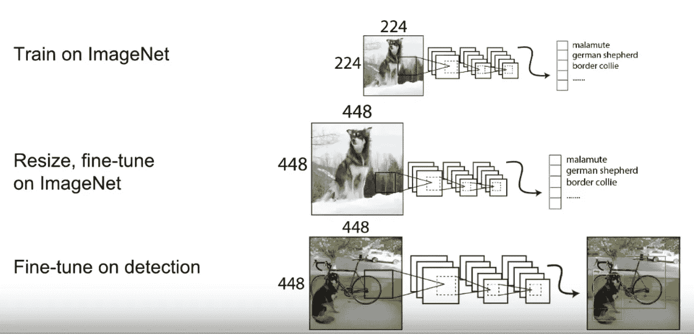
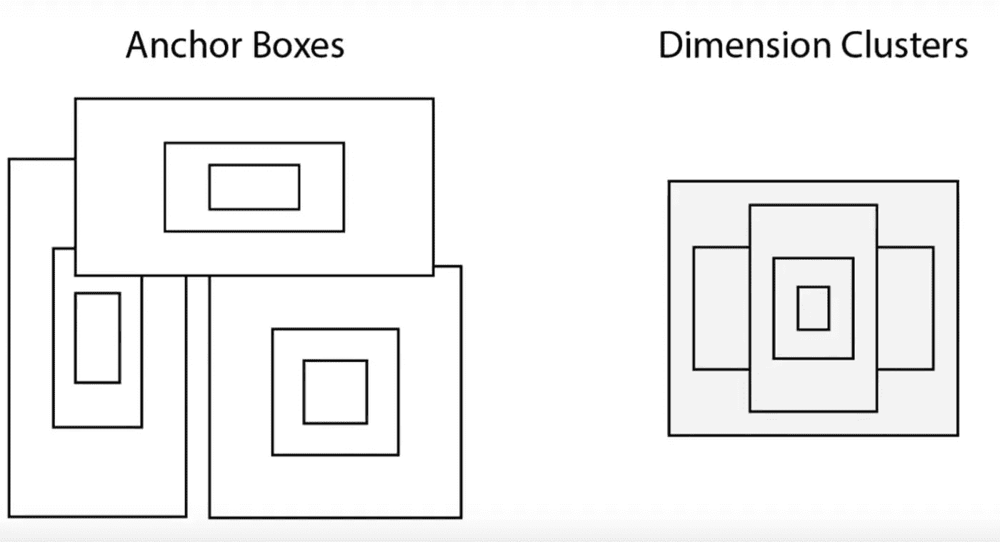
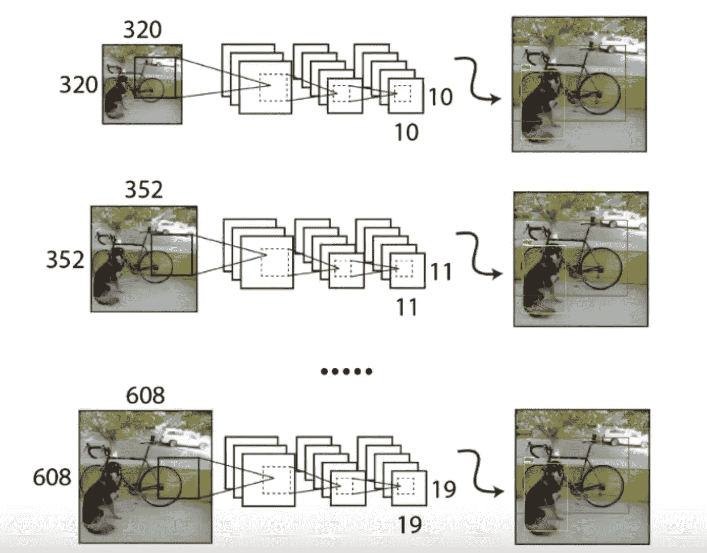
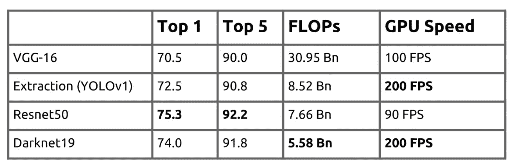
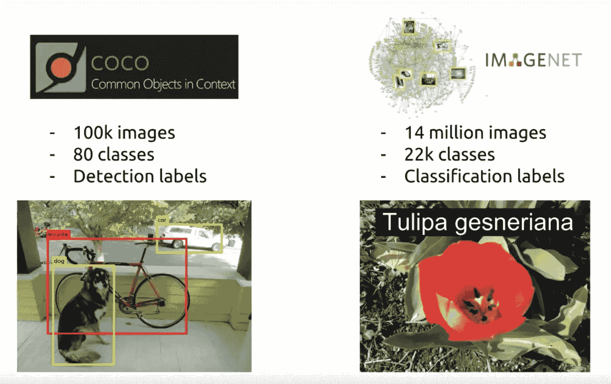
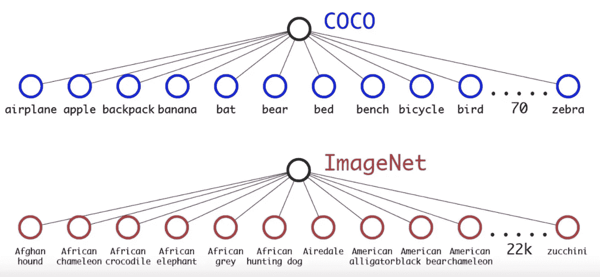
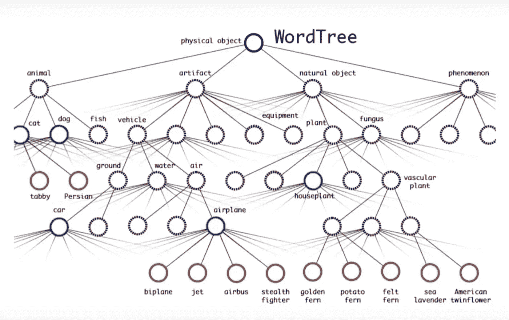
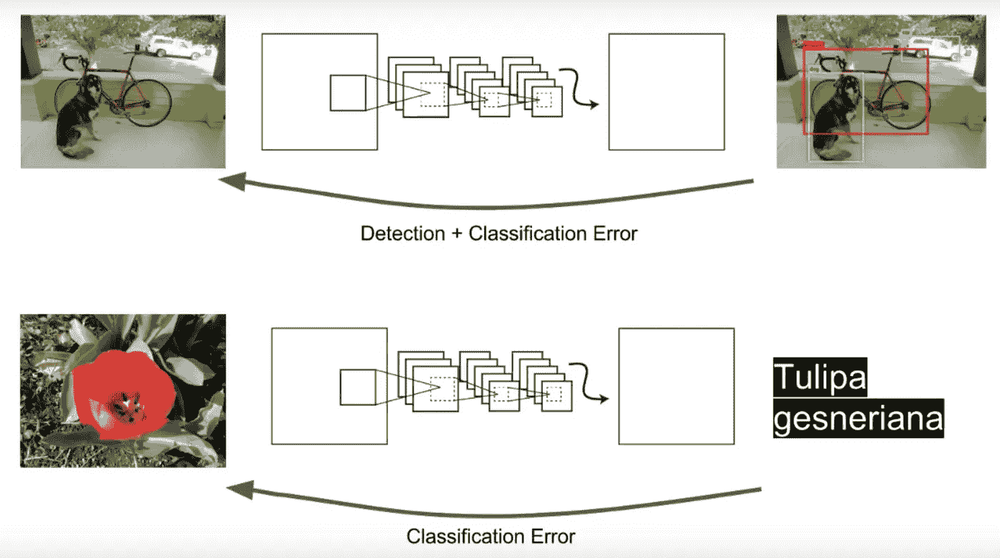
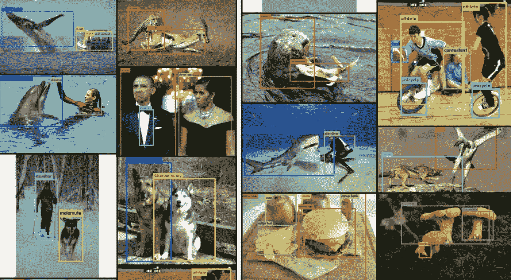

# 关于 YOLOs 的一切——第三部分——更好、更快、更强的 YOLOv2

> 原文：<https://medium.com/analytics-vidhya/all-about-yolos-part3-the-better-faster-and-stronger-yolov2-9c0cf9de9758?source=collection_archive---------8----------------------->

YOLOv2 项目开始让 YOLO 在准确性方面更好，在速度方面更快，在能够分类更多类别方面更强。

这个 5 部分的系列旨在解释 YOLO 的一切，它的历史，它是如何版本化的，它的架构，它的基准，它的代码，以及如何让它为自定义对象工作。

以下是该系列的链接。

[**关于 YOLOs 的一切— Part1 —一点历史**](/@rehan_ahmad/all-about-yolos-part1-a-bit-of-history-a995bad5ac57)

[**关于 YOLOs — Part2 —第一个 YOLO**](/@rehan_ahmad/all-about-yolos-part2-the-first-yolo-2b5db7d78411)

**关于 YOLOs 的一切——第三部分——更好、更快、更强 YOLOv2**

[**关于 YOLOs — Part4 — YOLOv3，一个增量改进**](/@rehan_ahmad/all-about-yolos-part4-yolov3-an-incremental-improvement-36b1eee463a2)

[**关于 YOLOs —第 5 部分—启动并运行**](/@rehan_ahmad/all-about-yolos-part5-how-to-code-it-up-937f05cc9ae9)

# 丰富

在精确度方面，这里有一些渐进的改进。

1.  **微调 448*448 分类器**:执行大量图像检测任务的标准方式是在 ImageNet 上预先训练网络，通常是 224*224 图像大小，并在我们打算做的任务上进行微调。为了检测，我们通常将网络的大小调整得相当大，以便能够检测场景中较小的对象。这种方法的问题是，算法在较小图像上学习的特征可能无法很好地在较大图像上操作。因此，在 YOLOv2 中，他们添加了一个额外的层，以便在调整大小之后，在微调之前，他们在 ImageNet 的更大图像上训练网络。这使得精确度提高了+3.5 倍。

2.**锚盒**:在 YOLO 的原始版本中，它通过末端回归直接预测 X，Y 坐标以及宽度和高度。但其他系统，如更快的 R-CNN 和 SSD，采用具有 3 种不同比例和 3 种不同纵横比的锚框概念，并计算这些预先给定的锚框的偏移，以预测对象的框。这使得算法只学习偏移和选择盒子的大小比自己学习这些信息更容易。YOLOv2 采用了锚框的想法，但它不是预定义锚框，而是查看训练数据的边界框，并在这些框上运行 k-means 聚类，基本上得出一组更符合现实的维度聚类。这使得训练从一个真正好的地方开始。一种初始化技术。使用这些维度聚类获得了高达+5mAP 的精度。

3.**多尺度训练**:一般来说，在训练检测器的时候，会考虑一个单一的长宽比，通常是 448*448，推理图像会被调整大小以匹配这个长宽比。在 YOLOv2 中，网络将在整个训练过程中以 32 的倍数随机调整大小。每次调整层的大小时，它的后续层也会调整大小。这似乎大大提高了性能。作为一个副产品，我们可以在测试时改变图像的大小，并且在不改变权重的情况下获得检测结果。这使我们能够在不改变网络的情况下获得不同尺度的检测。这提供了+1.5mAP 的改进

在速度方面，这里有一些渐进的改进。

## **黑暗 19**

与大多数人认为的相反，速度不仅仅是 FLOPS(浮点运算)。VGG-16 有更多的卷积层和更多的触发器，使得延迟很高，这对实时性不利。在 YOLOv1 中，使用了一种称为提取网络的新网络，减少了 FLOPS，将 GPU 速度提高到 200 FPS，并超过了 VGG-16 的分类精度。对于 YOLO 的第二个版本(YOLOv2 ),使用了称为 Darknet19 的新分类网络，它比 YOLOv1 更好，具有更高的精度和更少的 FLOPS，而处理时间一样快。

在新类方面，这里是一些增量改进。

## 单词树

典型的数据集分为两类。检测数据集如 COCO 有 80 个类，分类数据集如 ImageNet 有 22k 个类，每个图像有一个标签，没有边界框。

对新类别进行训练的一个选项是收集一组图像，用类别和边界框坐标对其进行标记，并传递到模型权重的训练循环中，以更新到合并的新类别。

YOLOv2 试图将这两种数据集结合在一起，其中单个网络应该能够从检测数据集了解什么是对象以及对象在场景中的位置，并从分类数据集了解一些更细粒度的类别。这使得 YOLOv2 摆脱了 80 类的限制，能够从单个神经网络中检测数千类。

通常，通过在末端层对所有类别应用 SoftMax 来预测类别概率。

为了将这两个数据集组合在一起，用类似 wordnet 的层次结构实现了一个树形结构，以构建一个单词树。现在不是让一个单一的 SoftMax 来决定哪个类，而是进入一个更精细的类来说明对象是什么。

对于训练部分，来自 COCO 和 ImageNet 的图像都被传递到网络中，并且每当网络看到具有标签和边界框坐标的图像时，检测和分类误差都被反向传播，并且当它只看到没有边界框的图像和标签时，它只反向传播分类误差。

这种联合训练检测和分类数据集的聪明方法产生了惊人的结果。突然之间，YOLOv2 能够检测和分类成千上万的物体。

这些总结了 YOLOv2 中的改进。在下一篇文章中，我们来谈谈所有 YOLOs 中的明星——yolov 3

**资源:**

https://arxiv.org/pdf/1506.02640.pdf[YOLO](https://arxiv.org/pdf/1506.02640.pdf)

YOLOv2 和 yolo 9000:[https://arxiv.org/pdf/1612.08242.pdf](https://arxiv.org/pdf/1612.08242.pdf)

约洛夫 3:[https://arxiv.org/pdf/1804.02767.pdf](https://arxiv.org/pdf/1804.02767.pdf)

> *关于我*

我是 [Wavelabs.ai](https://wavelabs.ai/?source=post_page---------------------------) 的资深 AI 专家。我们 Wavelabs 帮助您利用人工智能(AI)来彻底改变用户体验并降低成本。我们使用人工智能独特地增强您的产品，以达到您的全部市场潜力。我们试图将尖端研究引入您的应用中。

欢迎访问 [Wavelabs.ai](https://wavelabs.ai/?source=post_page---------------------------) 了解更多信息。

嗯，这都是在这个职位。感谢阅读:)

保持好奇！

你可以通过 [LinkedIn](https://www.linkedin.com/in/rehan-a-18675296?source=post_page---------------------------) 联系我。