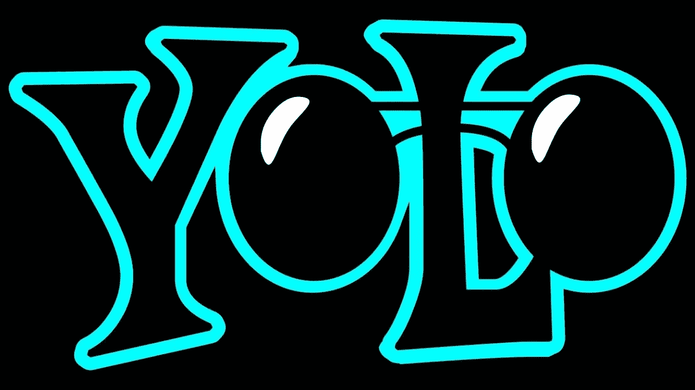

# 关于 YOLOs —第 4 部分— YOLOv3，一个渐进的改进

> 原文：<https://medium.com/analytics-vidhya/all-about-yolos-part4-yolov3-an-incremental-improvement-36b1eee463a2?source=collection_archive---------7----------------------->

迄今为止，它是所有 YOLO 算法中速度最快、最准确的。

这个 5 部分的系列旨在解释 YOLO 的一切，它的历史，它是如何版本化的，它的架构，它的基准，它的代码，以及如何让它为自定义对象工作。

以下是该系列的链接。

[**关于 YOLOs 的一切— Part1 —一点历史**](/@rehan_ahmad/all-about-yolos-part1-a-bit-of-history-a995bad5ac57)

[**关于 YOLOs — Part2 —第一个 YOLO**](/@rehan_ahmad/all-about-yolos-part2-the-first-yolo-2b5db7d78411)

[**关于 YOLOs 的一切——第三部分——更好更快更强 YOLOv2**](/@rehan_ahmad/all-about-yolos-part3-the-better-faster-and-stronger-yolov2-9c0cf9de9758)

**关于 YOLOs-part 4-yolov 3 的所有信息，这是一项渐进式改进**

[**关于 YOLOs —第 5 部分—启动并运行**](/@rehan_ahmad/all-about-yolos-part5-how-to-code-it-up-937f05cc9ae9)

# 算法

演职员表:[https://www.cyberailab.com/](https://www.cyberailab.com/)

首先，在训练期间，YOLOv3 网络被馈入输入图像以预测对应于 3 个尺度的 3D 张量(这是最后的特征图)，如上图中的中间一个所示。这三种秤设计用于检测不同尺寸的物体。这里我们以音阶 13x13 为例。对于这个比例，输入图像被分成 13×13 个网格单元，每个网格单元对应于 3D 张量内的 1×1×255 个体素。这里，255 来自(3x(4+1+80))。图的右侧显示了 3D 张量中的值，如边界框坐标、对象得分和类别置信度。

第二，如果物体的地面真值包围盒的中心落在某个网格单元(即鸟图像上红色的那个)，这个网格单元负责预测物体的包围盒。对于该网格单元，相应的客观性分数为“1 ”,对于其他单元，则为“0”。对于每个网格单元，它被分配有 3 个不同大小的在先盒子。它在训练期间学习的是选择正确的框并计算精确的偏移/坐标。但是网格单元如何知道选择哪个盒子呢？有一个规则，它只选择与地面真实边界框重叠最多的框。

最后，如何选择这 3 个先前盒子的初始大小？在训练之前，作者使用 K-均值聚类将来自 COCO 数据集的总包围盒分类为 9 个聚类。这导致从 9 个集群中选择 9 个尺寸，3 个尺寸用于 3 个尺度。该先验信息有助于网络学习精确地计算盒子偏移/坐标，因为直觉上，盒子尺寸的错误选择使得网络学习起来更困难和更长。

*以上解释归功于*

*让我们仔细看看这些改进。*

# *YOLOv3 的改进*

## *边界框*

*边界框预测部分类似于 YOLOv2，因为，在 x，y 坐标和宽度和高度被预测。*

**

## ***每个图像更多的边界框***

*对于相同大小的输入图像，YOLO v3 比 YOLO v2 预测更多的边界框。例如，在 416 x 416 的原始分辨率下，YOLO v2 预测 13 x 13 x 5 = 845 个盒子。在每个网格单元，使用 5 个锚来检测 5 个盒子。*

*另一方面，YOLO v3 以 3 种不同的比例预测盒子。对于 416×416 的相同图像，预测的框的数量是 10，647。这意味着 **YOLO v3 预测的盒子数量是 YOLO v2 预测的 10 倍。你很容易想象为什么它比 YOLO v2 慢。在每个尺度上，每个网格可以使用 3 个锚点预测 3 个盒子。因为有三个秤，所以总共使用 9 个锚箱，每个秤使用 3 个锚箱。***

## *类别预测*

*对于类别预测，不像 YOLOv2 中那样使用 SoftMax，而是使用独立的逻辑分类器，并且使用二元交叉熵损失来促进其他更复杂的领域数据集中的多标签分类的非重叠标签。*

## *跨销售的预测*

*与 YOLO 和 YOLO2 预测最后一层的输出不同，YOLOv3 预测三种不同比例的盒子，如下图所示。*

*YOLO 与小物体搏斗。然而，使用 YOLOv3，我们看到小对象有更好的性能，这是因为使用了捷径连接。*

****

*像要素金字塔网络一样，从这些比例中提取要素。最后一层预测边界框、对象和类别预测。特征图取自前 2 层，并被上采样 2 倍。还从网络的早期获取特征图，并使用级联将其与上述上采样的特征合并。这就像编码器-解码器架构。这允许我们从向上采样的特征中获得更有意义的语义信息，从早期的特征图中获得更细粒度的信息。*

*在 YOLOv3 中也使用 K-means 聚类来寻找更好的边界框先验。在 COCO 数据集的情况下，9 个锚盒。*

## *特征提取器*

*与 YOLOv2 中的暗网 19 不同，它使用了 YOLOv3 暗网 53。更深更好。据作者说，这比 Resnet101 和 Resnet 152 要好。*

**

# *体系结构*

*这里是 YOLOv3 的网络架构图。它是一个基于特征学习的网络，采用 75 个卷积层作为其最强大的工具。没有使用完全连接的层。这种结构使得处理任何尺寸的图像成为可能。此外，没有使用池层。相反，步长为 2 的卷积层用于对特征图进行下采样，向前传递大小不变的特征。此外，类雷斯网结构和类 FPN 结构也是提高其准确性的关键。*

**

*演职员表:[https://www.cyberailab.com/](https://www.cyberailab.com/)*

***YOLOv3** 比 SSD，FPN，以及其他任何两级更快的 R-CNN 变种都要好得多，性能和 DSSD 差不多。*

****

*我们对 YOLO 的理论之旅到此结束。在[的下一篇](/@rehan_ahmad/all-about-yolos-part5-how-to-code-it-up-937f05cc9ae9)文章中，让我们看看如何对其进行编码，并使其定制为在您自己的数据集上工作。*

***资源:***

*https://arxiv.org/pdf/1506.02640.pdf YOLO*

*YOLOv2 和 yolo 9000:[https://arxiv.org/pdf/1612.08242.pdf](https://arxiv.org/pdf/1612.08242.pdf)*

*约洛夫 3:[https://arxiv.org/pdf/1804.02767.pdf](https://arxiv.org/pdf/1804.02767.pdf)*

> **关于我**

*我是 [Wavelabs.ai](https://wavelabs.ai/?source=post_page---------------------------) 的资深 AI 专家。我们 Wavelabs 帮助您利用人工智能(AI)来彻底改变用户体验并降低成本。我们使用人工智能独特地增强您的产品，以达到您的全部市场潜力。我们试图将尖端研究引入您的应用中。*

*欢迎访问 [Wavelabs.ai](https://wavelabs.ai/?source=post_page---------------------------) 了解更多信息。*

*嗯，这都是在这个职位。感谢阅读:)*

*保持好奇！*

*你可以通过 LinkedIn 联系我。*