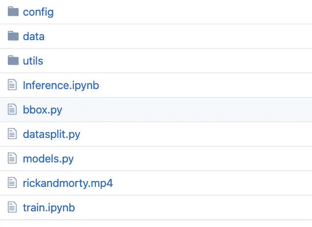
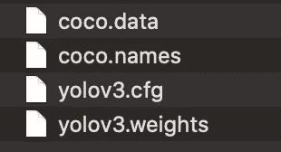

# 关于 YOLOs 的一切——第五部分——如何编写代码

> 原文：<https://medium.com/analytics-vidhya/all-about-yolos-part5-how-to-code-it-up-937f05cc9ae9?source=collection_archive---------9----------------------->


在这篇文章中，我将解释如何使用 YOLOv3 的普通版本来检测 COCO 数据集中的对象，以及如何为自己的用例定制自己的数据集。

这里的 Yolo 检测代码是基于[埃里克·林德诺伦](https://github.com/eriklindernoren/PyTorch-YOLOv3)对[约瑟夫·雷德蒙和阿里·法尔哈迪论文](https://pjreddie.com/media/files/papers/YOLOv3.pdf)的实现。

以下是该系列的链接。

[**关于 YOLOs — Part1 —一点历史**](/@rehan_ahmad/all-about-yolos-part1-a-bit-of-history-a995bad5ac57)

[**关于 YOLOs — Part2 —第一个 YOLO**](/@rehan_ahmad/all-about-yolos-part2-the-first-yolo-2b5db7d78411)

[**关于 YOLOs 的一切——第三部分——更好更快更强 YOLOv2**](/@rehan_ahmad/all-about-yolos-part3-the-better-faster-and-stronger-yolov2-9c0cf9de9758)

[**关于 YOLOs — Part4 — YOLOv3 的一切，一个增量的改进**](/@rehan_ahmad/all-about-yolos-part4-yolov3-an-incremental-improvement-36b1eee463a2)

**关于 YOLOs 的一切——第 5 部分——启动和运行**

请在我的 [gitrepo](https://github.com/gotorehanahmad/yolov3-pytorch) 中找到项目文件夹。

在项目文件夹中，您会发现一个名为 **config** 的子文件夹，其中包含配置文件、类名和环境变量，还有包含数据集的 **data** 文件夹和包含一些有用的 python 函数的 **utils** 文件夹。



首先，下载 YOLOv3 权重文件，并通过运行以下命令将其放在项目的 config 文件夹中。(我已经在回购中添加了一个. sh 文件来完成此操作)

```
wget [https://pjreddie.com/media/files/yolov3.weights](https://pjreddie.com/media/files/yolov3.weights)
```

下载后，config 文件夹的内容应该如下所示。



# 如何让 YOLOv3 启动并运行以检测 COCO 对象？

让我们看看推理 COCO 对象的香草 YOLO 的实现。

*   导入所需的模块。

```
from models import *
from utils import *import os, sys, time, datetime, random
import torch
from torch.utils.data import DataLoader
from torchvision import datasets, transforms
from torch.autograd import Variableimport matplotlib.pyplot as plt
import matplotlib.patches as patches
from PIL import Image
```

*   加载预训练的配置和权重，以及对 [**Darknet**](https://github.com/pjreddie/darknet) 模型进行训练的 COCO 数据集的类名。img_size、conf_thres 和 num_thresold 是可以基于用例进行调整的参数。

> 注意:将模型设置为 eval 模式以进行推理。

```
config_path='config/yolov3.cfg'
weights_path='config/yolov3.weights'
class_path='config/coco.names'
img_size=416
conf_thres=0.8
nms_thres=0.4# Load model and weights
model = Darknet(config_path, img_size=img_size)
model.load_weights(weights_path)
model.cuda()
model.eval()
classes = utils.load_classes(class_path)
Tensor = torch.cuda.FloatTensor
```

*   写一个函数来执行给定图像的基本检测。请查看注释了解代码的作用。主要是对图像进行预处理。

```
def detect_image(img):
    # scale and pad image
    ratio = min(img_size/img.size[0], img_size/img.size[1])
    imw = round(img.size[0] * ratio)
    imh = round(img.size[1] * ratio)
    img_transforms=transforms.Compose([transforms.Resize((imh,imw)),
         transforms.Pad((max(int((imh-imw)/2),0), 
              max(int((imw-imh)/2),0), max(int((imh-imw)/2),0),
              max(int((imw-imh)/2),0)), (128,128,128)),
         transforms.ToTensor(),
         ])
    # convert image to Tensor
    image_tensor = img_transforms(img).float()
    image_tensor = image_tensor.unsqueeze_(0)
    input_img = Variable(image_tensor.type(Tensor))
    # run inference on the model and get detections
    with torch.no_grad():
        detections = model(input_img)
        detections = utils.non_max_suppression(detections, 80, 
                        conf_thres, nms_thres)
    return detections[0]
```

*   现在是使用这个函数得到推论的代码。这适用于 COCO 数据集中的任何对象。同样，大部分代码处理图像的预处理和边界框的绘制。

```
# load image and get detections
img_path = "images/blueangels.jpg"
prev_time = time.time()
img = Image.open(img_path)
detections = detect_image(img)
inference_time = datetime.timedelta(seconds=time.time() - prev_time)
print ('Inference Time: %s' % (inference_time))# Get bounding-box colors
cmap = plt.get_cmap('tab20b')
colors = [cmap(i) for i in np.linspace(0, 1, 20)]img = np.array(img)
plt.figure()
fig, ax = plt.subplots(1, figsize=(12,9))
ax.imshow(img)pad_x = max(img.shape[0] - img.shape[1], 0) * (img_size / max(img.shape))
pad_y = max(img.shape[1] - img.shape[0], 0) * (img_size / max(img.shape))
unpad_h = img_size - pad_y
unpad_w = img_size - pad_xif detections is not None:
    unique_labels = detections[:, -1].cpu().unique()
    n_cls_preds = len(unique_labels)
    bbox_colors = random.sample(colors, n_cls_preds)
    # browse detections and draw bounding boxes
    for x1, y1, x2, y2, conf, cls_conf, cls_pred in detections:
        box_h = ((y2 - y1) / unpad_h) * img.shape[0]
        box_w = ((x2 - x1) / unpad_w) * img.shape[1]
        y1 = ((y1 - pad_y // 2) / unpad_h) * img.shape[0]
        x1 = ((x1 - pad_x // 2) / unpad_w) * img.shape[1]
        color = bbox_colors[int(np.where(
             unique_labels == int(cls_pred))[0])]
        bbox = patches.Rectangle((x1, y1), box_w, box_h,
             linewidth=2, edgecolor=color, facecolor='none')
        ax.add_patch(bbox)
        plt.text(x1, y1, s=classes[int(cls_pred)], 
                color='white', verticalalignment='top',
                bbox={'color': color, 'pad': 0})
plt.axis('off')
# save image
plt.savefig(img_path.replace(".jpg", "-det.jpg"),        
                  bbox_inches='tight', pad_inches=0.0)
plt.show()
```

*   上面的脚本处理图像检测。现在让我们看看如何让它为**视频**工作。

```
videopath = 'video/sample_video.mp4'%pylab inline 
import cv2
from IPython.display import clear_outputcmap = plt.get_cmap('tab20b')
colors = [cmap(i)[:3] for i in np.linspace(0, 1, 20)]
# initialize 
vid = cv2.VideoCapture(videopath)
#while(True):
for ii in range(40):
    ret, frame = vid.read()
    frame = cv2.cvtColor(frame, cv2.COLOR_BGR2RGB)
    pilimg = Image.fromarray(frame)
    detections = detect_image(pilimg)    img = np.array(pilimg)
    pad_x = max(img.shape[0] - img.shape[1], 0) * 
            (img_size / max(img.shape))
    pad_y = max(img.shape[1] - img.shape[0], 0) * 
            (img_size / max(img.shape))
    unpad_h = img_size - pad_y
    unpad_w = img_size - pad_x
    if detections is not None:
        unique_labels = detections[:, -1].cpu().unique()
        n_cls_preds = len(unique_labels)
        for x1, y1, x2, y2, conf, cls_conf, cls_pred in detections:
            box_h = int(((y2 - y1) / unpad_h) * img.shape[0])
            box_w = int(((x2 - x1) / unpad_w) * img.shape[1])
            y1 = int(((y1 - pad_y // 2) / unpad_h) * img.shape[0])
            x1 = int(((x1 - pad_x // 2) / unpad_w) * img.shape[1])                color = colors[int(cls_conf.item()) % len(colors)]
            color = [i * 255 for i in color]
            cls = classes[int(cls_pred)]
            cv2.rectangle(frame, (x1, y1), (x1+box_w, y1+box_h),
                         color, 4)
            cv2.rectangle(frame, (x1, y1-35), (x1+len(cls)*19+60,
                         y1), color, -1)
            cv2.putText(frame, cls + "-" + str(cls_conf.item()), 
                        (x1, y1 - 10), cv2.FONT_HERSHEY_SIMPLEX, 
                        1, (255,255,255), 3)    fig=figure(figsize=(12, 8))
    title("Video Stream")
    imshow(frame)
    show()
    clear_output(wait=True)
```

> 注意:通过将视频路径更改为 IP 摄像机流，上述代码也可以用于实时流。

# **如何微调 vanilla YOLOv3 模型以适用于自定义对象？**

让我们看看我们自己的用例的定制培训 YOLOv3。他们有多种方法来实现这一点。但是下面的步骤解释了我在网上找到的最简单的方法。

# 先决条件

## 数据

第一步是创建您的训练数据，即使用您希望检测发生的边界框和类别标签来标记图像。

有很多工具可以做到这一点。我发现最简单的方法是使用[标签](https://github.com/tzutalin/labelImg)。这是一个图形化的图像注释工具。您可以使用 pip 命令进行安装。

```
pip install labelImg
```

点击[链接](https://pythonlearning.org/2019/12/02/labelimg-a-graphical-image-annotation-tool-and-label-object-bounding-boxes-in-images/)找到一个关于如何使用它的很好的教程。

给图像加标签很简单，就是给边界框坐标和类别加标签。因此，对于每个图像，生成的标签(。txt 文件)将只有一行。这就是所谓的 YOLO 格式。

> 注意:使用标签工具标记图像时，请确保选择 YOLO 格式。

```
#class x y width height
1 0.351466 0.427083 0.367168 0.570486
```

一旦图像被加了标签。txt 文件)生成后，运行脚本来拆分数据集以进行训练和验证。请只运行一次以下 python 代码来实现这一点。 **datasplit.py** 是 [repo](https://github.com/gotorehanahmad/yolov3-pytorch) 中带有该代码的文件。

```
import glob
import os
import numpy as np
import syscurrent_dir = "./data/artifacts/images"
split_pct = 10  # 10% validation set
file_train = open("data/artifacts/train.txt", "w")  
file_val = open("data/artifacts/val.txt", "w")  
counter = 1  
index_test = round(100 / split_pct)  
for fullpath in glob.iglob(os.path.join(current_dir, "*.JPG")):  
  title, ext = os.path.splitext(os.path.basename(fullpath))
  if counter == index_test:
    counter = 1
    file_val.write(current_dir + "/" + title + '.JPG' + "\n")
  else:
    file_train.write(current_dir + "/" + title + '.JPG' + "\n")
    counter = counter + 1
file_train.close()
file_val.close()
```

这将创建两个文件，train.txt 和 val.txt，其中包含所有图像的完整路径，90%在 train 中，10%在 val 中。

完成后，请确保在以下文件夹结构中获取数据集。

```
*Main Folder*
--- *data*
    --- *dataset name*
        --- *images*
            --- img1.jpg
            --- img2.jpg
            ..........
        --- *labels*
            --- img1.txt
            --- img2.txt
            ..........
        --- train.txt
        --- val.txt
```

## **配置**

现在来看看 *config/* 文件夹中的配置文件。首先， ***coco.data*** 大概是这样的:

```
classes = 80 # number of classes goes here
train=data/alpha/train.txt # the path of the train.txt goes here
valid=data/alpha/val.txt # the path of the val.txt goes here
names=config/coco.names # edit the names file with class labels
backup=backup/ # Keep this parameter as it is
```

根据您的自定义数据集编辑这些值。编辑“classes ”,以包含您的用例中要检测的类的数量。Train 和 valid 分别保存到 train.txt 和 val.txt 的路径。编辑***【coco . names】***带有班级标签的文件。它应该列出类的名称，每行一个(对于注释文件，第一个对应于 0，第二个对应于 1，依此类推)

```
class1
class2
...
```

> 注意:没有使用 backup 参数，但它似乎是必需的。

现在对于 **yolov3.cfg** 文件。这包含了 YOLOv3 算法的架构细节。

在第一个`[net]`部分，调整`batch`值和`subdivisions`，以适应您的 GPU 内存。批量越大，训练越好，越快，但占用的内存也越多。您也可以在这里调整`learning_rate`。

> 对于一个 11Gb 内存的 Nvidia GPU 来说，一批 16 和 1 细分就不错了。

还有两个重要的东西需要改变，那就是`classes`和最终图层`filters`的值。而且你要在**文件中的三个**不同的地方做。

如果你搜索这个文件，你会发现 3 个`[yolo]`部分。在这个部分中，将`classes`设置为模型中的类的数量。

您还必须将[yolo]正上方的[卷积]部分中的`filters`值更改为以下值。

```
filters = (classes + 5) x 3
```

所有上述设置就绪后，您现在就可以开始训练模型了。

# 密码

## 训练循环的实现

*   导入库

```
from __future__ import divisionfrom models import *
from utils.utils import *
from utils.datasets import *
from utils.parse_config import *import os
import sys
import time
import datetime
import argparseimport torch
from torch.utils.data import DataLoader
from torchvision import datasets
from torchvision import transforms
from torch.autograd import Variable
import torch.optim as optim
```

*   参数设置

```
epochs = 20
image_folder = "data/dataset/images"
batch_size = 16
model_config_path = "config/yolov3.cfg"
data_config_path = "config/coco.data"
weights_path = "config/yolov3.weights"
class_path = "config/coco.names"
conf_thres = 0.8
nms_thres = 0.4
n_cpu = 0
img_size = 416
checkpoint_interval = 1
checkpoint_dir = 'checkpoints'
use_cuda = True
```

*   如果可能，使用 CUDA

```
cuda = torch.cuda.is_available() and use_cuda
```

*   将数据配置和参数存入内存

```
# Load classes
os.makedirs("checkpoints", exist_ok=True)
classes = load_classes(class_path)# Get data configuration
data_config = parse_data_config(data_config_path)
train_path = data_config["train"]# Get hyper parameters
hyperparams = parse_model_config(model_config_path)[0]
learning_rate = float(hyperparams["learning_rate"])
momentum = float(hyperparams["momentum"])
decay = float(hyperparams["decay"])
burn_in = int(hyperparams["burn_in"])
```

*   启动模型并开始训练。

```
# Initiate model
model = Darknet(model_config_path)
model.load_weights(weights_path)if cuda:
    model = model.cuda()
model.train()
```

*   获取数据加载器，并设置优化器

```
# Get dataloader
dataloader = torch.utils.data.DataLoader(
    ListDataset(train_path), batch_size=batch_size, shuffle=False, num_workers=n_cpu
)Tensor = torch.cuda.FloatTensor if cuda else torch.FloatTensor# Get optimizer
optimizer = torch.optim.Adam(filter(lambda p: p.requires_grad, model.parameters()))
```

*   现在是主要的训练循环。

```
for epoch in range(epochs):
    for batch_i, (_, imgs, targets) in enumerate(dataloader):
        imgs = Variable(imgs.type(Tensor))
        targets = Variable(targets.type(Tensor), requires_grad=False)optimizer.zero_grad()loss = model(imgs, targets)loss.backward()
        optimizer.step()print(
            "[Epoch %d/%d, Batch %d/%d] [Losses: x %f, y %f, w %f, h %f, conf %f, cls %f, total %f, recall: %.5f, precision: %.5f]"
            % (
                epoch,
                epochs,
                batch_i,
                len(dataloader),
                model.losses["x"],
                model.losses["y"],
                model.losses["w"],
                model.losses["h"],
                model.losses["conf"],
                model.losses["cls"],
                loss.item(),
                model.losses["recall"],
                model.losses["precision"],
            )
        )model.seen += imgs.size(0)if epoch % checkpoint_interval == 0:
        print("saving")
        model.save_weights("%s/%d.weights" % (checkpoint_dir, "latest"))
```

上面的循环训练并将权重文件保存在模型的文件夹中，用于每个纪元，以纪元编号作为名称。它还打印一堆损失，以监控训练的进度。

## 推理的实现

*   导入库

```
from models import *
from utils import *
import cv2
import os, sys, time, datetime, random
import torch
from torch.utils.data import DataLoader
from torchvision import datasets, transforms
from torch.autograd import Variableimport matplotlib.pyplot as plt
import matplotlib.patches as patches
from PIL import Image
import imutils
from imutils.video import WebcamVideoStream
```

*   设置参数。要使用新模型进行检测，请用 config 文件夹中的 yolov3.weights 文件替换在 **models** 文件夹中生成的最新权重文件。确保推理代码中的权重路径指向最新的权重路径。

```
num_classes = 1
config_path='config/yolov3.cfg'
weights_path='checkpoint_19.weights'
class_path='config/coco.names'
img_size=416
conf_thres=0.95
nms_thres=0.95
```

*   加载模型并设置为 eval 以进行推理

```
# Load model and weights
model = Darknet(config_path, img_size=img_size)
model.load_weights(weights_path)
# model.cuda()
model.eval()
classes = load_classes(class_path)
Tensor = torch.FloatTensor
```

*   定义加载类和检测图像的函数。

```
def load_classes(path):
    """
    Loads class labels at 'path'
    """
    fp = open(path, "r")
    names = fp.read().split("\n")[:]
    return namesdef detect_image(img):
    # scale and pad image
    ratio = min(img_size/img.size[0], img_size/img.size[1])
    imw = round(img.size[0] * ratio)
    imh = round(img.size[1] * ratio)
    img_transforms = transforms.Compose([ transforms.Resize((imh, imw)),
         transforms.Pad((max(int((imh-imw)/2),0), max(int((imw-imh)/2),0), max(int((imh-imw)/2),0), max(int((imw-imh)/2),0)),
                        (128,128,128)),
         transforms.ToTensor(),
         ])
    # convert image to Tensor
    image_tensor = img_transforms(img).float()
    image_tensor = image_tensor.unsqueeze_(0)
    input_img = Variable(image_tensor.type(Tensor))
    # run inference on the model and get detections
    with torch.no_grad():
        detections = model(input_img)
        detections = utils.non_max_suppression(detections, num_classes, conf_thres, nms_thres)
    return detections[0]
```

*   现在是推理循环。

```
videopath = 'video/sample_video.mp4'%pylab inline 
import cv2
from IPython.display import clear_outputcmap = plt.get_cmap('tab20b')
colors = [cmap(i)[:3] for i in np.linspace(0, 1, 20)]
# initialize 
vid = cv2.VideoCapture(videopath)
#while(True):
for ii in range(40):
    ret, frame = vid.read()
    frame = cv2.cvtColor(frame, cv2.COLOR_BGR2RGB)
    pilimg = Image.fromarray(frame)
    detections = detect_image(pilimg)    img = np.array(pilimg)
    pad_x = max(img.shape[0] - img.shape[1], 0) * 
            (img_size / max(img.shape))
    pad_y = max(img.shape[1] - img.shape[0], 0) * 
            (img_size / max(img.shape))
    unpad_h = img_size - pad_y
    unpad_w = img_size - pad_x
    if detections is not None:
        unique_labels = detections[:, -1].cpu().unique()
        n_cls_preds = len(unique_labels)
        for x1, y1, x2, y2, conf, cls_conf, cls_pred in detections:
            box_h = int(((y2 - y1) / unpad_h) * img.shape[0])
            box_w = int(((x2 - x1) / unpad_w) * img.shape[1])
            y1 = int(((y1 - pad_y // 2) / unpad_h) * img.shape[0])
            x1 = int(((x1 - pad_x // 2) / unpad_w) * img.shape[1])                color = colors[int(cls_conf.item()) % len(colors)]
            color = [i * 255 for i in color]
            cls = classes[int(cls_pred)]
            cv2.rectangle(frame, (x1, y1), (x1+box_w, y1+box_h),
                         color, 4)
            cv2.rectangle(frame, (x1, y1-35), (x1+len(cls)*19+60,
                         y1), color, -1)
            cv2.putText(frame, cls + "-" + str(cls_conf.item()), 
                        (x1, y1 - 10), cv2.FONT_HERSHEY_SIMPLEX, 
                        1, (255,255,255), 3)    fig=figure(figsize=(12, 8))
    title("Video Stream")
    imshow(frame)
    show()
    clear_output(wait=True)
```

请在我的[**git-repo**](https://github.com/gotorehanahmad/yolov3-pytorch)**中找到用于训练和推理的 jupyter 笔记本。**

我希望本系列文章能让您清楚地了解关于 YOLO 的一切，并让您开始自己的实现。

如果你想看某个特定主题的博客，请在回复部分提出来。我会尽力的:)

**资源:**

https://arxiv.org/pdf/1506.02640.pdf

YOLOv2 和 yolo 9000:[https://arxiv.org/pdf/1612.08242.pdf](https://arxiv.org/pdf/1612.08242.pdf)

约洛夫 3:【https://arxiv.org/pdf/1804.02767.pdf】T2

> *关于我*

我是 [Wavelabs.ai](https://wavelabs.ai/?source=post_page---------------------------) 的资深 AI 专家。我们 Wavelabs 帮助您利用人工智能(AI)来彻底改变用户体验并降低成本。我们使用人工智能独特地增强您的产品，以达到您的全部市场潜力。我们试图将尖端研究引入您的应用中。

欢迎访问 [Wavelabs.ai](https://wavelabs.ai/?source=post_page---------------------------) 了解更多信息。

嗯，这都是在这个职位。感谢阅读:)

保持好奇！

你可以在 [LinkedIn](https://www.linkedin.com/in/rehan-a-18675296?source=post_page---------------------------) 上联系我。