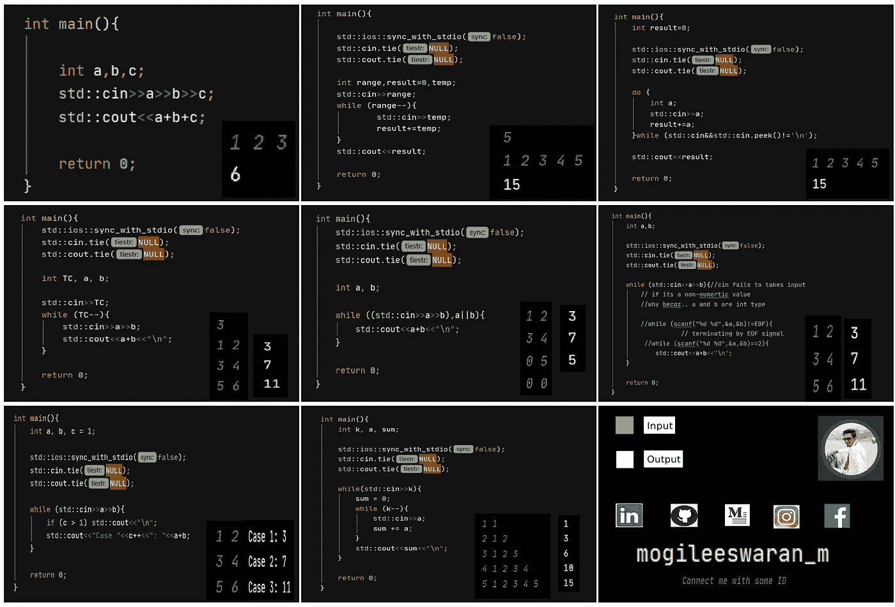
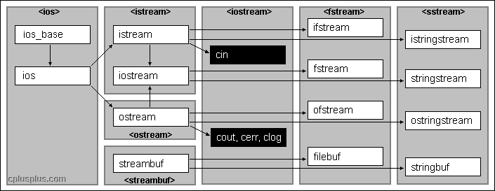
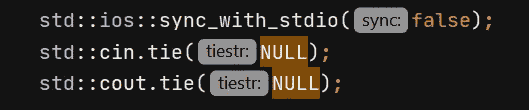
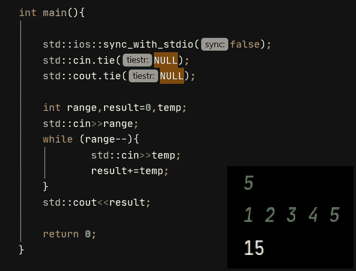
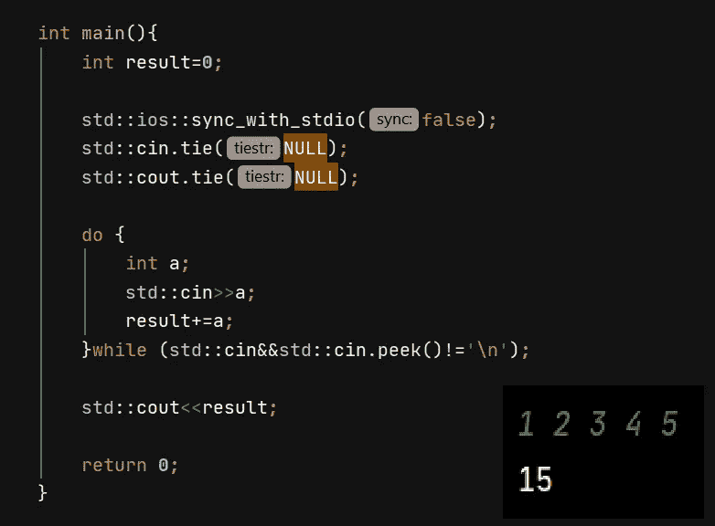
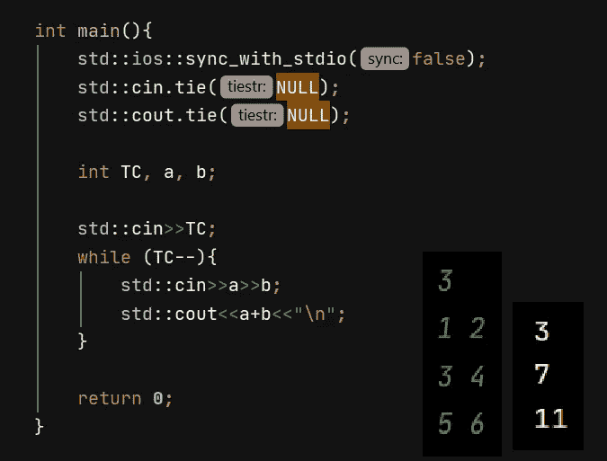
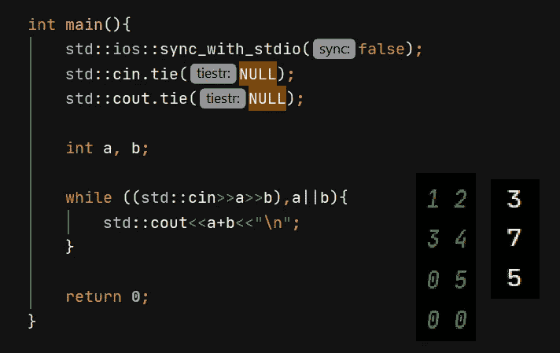
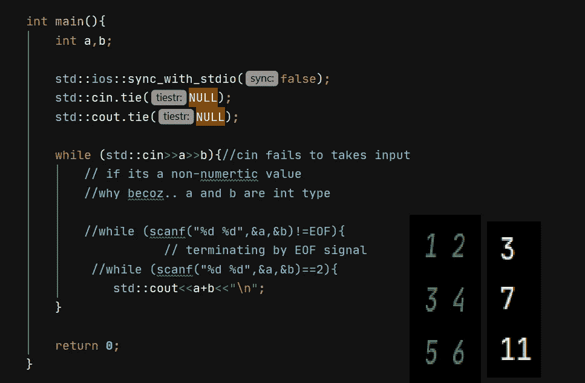
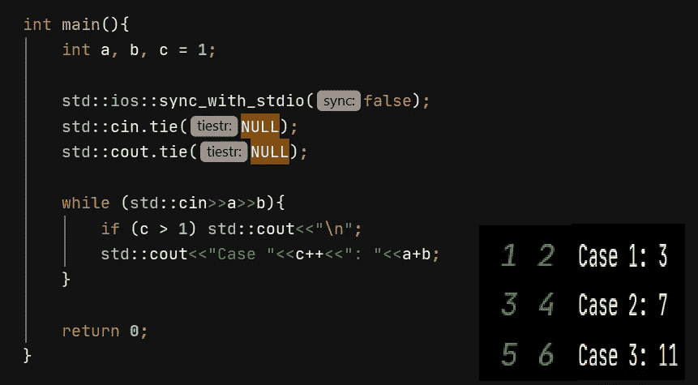
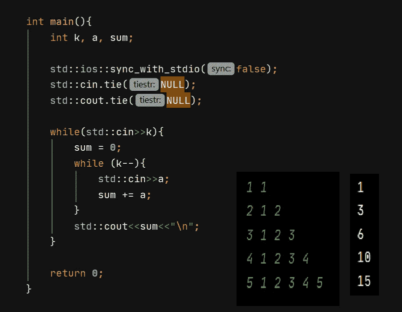

# C++中所有有效的输入和快速 I/O 技术||竞争编程的完整输入/输出 C++指南。

> 原文：<https://medium.com/analytics-vidhya/all-efficient-input-taking-and-fast-i-o-techniques-in-c-a-complete-input-output-c-guide-for-3d2e40640e49?source=collection_archive---------1----------------------->



[在 GitHub](https://github.com/Mogileeswaran/CPP-Input-output-cheat-sheet-by-mogileeswaran-m) 上下载，高清图片和 PDF 版本([链接](https://github.com/Mogileeswaran/CPP-Input-output-cheat-sheet-by-mogileeswaran-m)

# 获得基本知识

**#include <必须包含 iostream>T5，没有 iostream I/O 操作无法进行。包含 iostream 会自动包含**

**<stream><on stream><IOs><IOs FWD><streambuf>**

C++的输入和输出是以流或字节序列的形式进行的。istream 和 ostream 都在 ios 下。



[https://www.cplusplus.com/img/iostream.gif](https://www.cplusplus.com/img/iostream.gif)

## 标准输入流(CIN):

*   它是一个预定义的对象或 istream 类的实例。
*   Istream 连接到输入设备，即键盘，以接受输入。
*   这里流提取(>>)操作符用于提取字节序列。

## 标准输出流(COUT):

*   它是一个预定义的对象或 ostream 类的实例。
*   ostream 连接到输出设备，即显示屏。
*   这里流插入(<


basic way of input taking

Declare a variable with appropriate data type, take input and perform operations.

# FAST I/O

In competitive programming it is important to read input as fast as possible and operations has to be performed faster there performance matters.

***我们可以让快一点的更快。怎么…？***



> 通过在代码中添加这几行代码。说明👇

# STD::IOs::sync _ with _ stdio(false)；

C++ iostream 标准流与其对应的标准 C 流是同步的。通过添加 IOs _ base::sync _ with _ stdio(false)；默认情况下是这样的。

它避免了同步。如果禁用同步，则允许 C++流拥有自己独立的缓冲区。

# std::cin.tie(空)；

简单地说，它从 cout 解绑 cin，这意味着输出仅在需要时或当缓冲区满时才刷新/显示在控制台上。(避免冲洗)

## 示例:

先了解一下流行语。

*   buffer-> buffer 只是一个临时的占位符，操作执行起来更快。
*   刷新->将缓冲数据存储到永久存储器。

**Buffer flush 或 flush Buffer->Buffer 表示临时存储 flush 表示永久保存。**

**例如:**

*   在 facebook 中，如果我们上传一张照片，我们选择它，我们描述它，我们标记它，如果我们点击发布它，直到它存储在临时占位符上。
*   在编辑图片时，也就是说，在我们点击保存之前，我们所做的更改会保存在………。

而不是用**endl；**用 **"\n"** 为什么因为它引起脸红。

# 所有输入技术

## 1.基于范围的输入获取



```
int main(){
  std::ios::sync_with_stdio(false)**;** std::cin.tie(NULL)**;** std::cout.tie(NULL)**;** int range**,**result=**0,**temp**;** std::cin>>range**;** while (range--){
            std::cin>>temp**;** result+=temp**;** }
    std::cout<<result**;** return **0;** }
```

在这里，范围作为输入，在 while 循环中，直到零，它才接受输入。

## 2.在“\n”之前未知的输入数



```
int main(){
    int result=0;  std::ios::sync_with_stdio(false);
    std::cin.tie(NULL);
    std::cout.tie(NULL);
    do {
        int a;
        std::cin>>a;
        result+=a;
    }while (std::cin&&std::cin.peek()!='\n');
    std::cout<<result;
    return 0;
    }
```

**。peek()** 返回输入序列中的下一个字符。通过使用该程序终止。

## 3.给出了测试用例的数量



```
int main(){    std::ios::sync_with_stdio(false)**;** std::cin.tie(NULL)**;** std::cout.tie(NULL)**;** int TC**,**a**,**b**;** std::cin>>TC**;** while (TC--){
        std::cin>>a>>b**;** std::cout<<a+b<<"\n"**;** } return **0;** } 
```

## 4.直到两个整数都为零



```
int main(){ int a=0,b=0; 
   std::ios::sync_with_stdio(false);
    std::cin.tie(NULL);
    std::cout.tie(NULL); while((cin>>a>>b),a||b){
        cout<<a+b<<"\n";
    }
    return 0;
}
```

## 5.EOF/未知测试用例



```
int main(){
    int a,b;    std::ios::sync_with_stdio(false);
    std::cin.tie(NULL);
    std::cout.tie(NULL);
    while (std::cin>>a>>b){//cin fails to takes input
// if its a non-numertic value
        //why becoz.. a and b are int type
        //while (scanf("%d %d",&a,&b)!=EOF){
                   // terminating by EOF signal
         //while (scanf("%d %d",&a,&b)==2){
            std::cout<<a+b<<"\n";
    }
    return 0;
}
```

## 6.带有箱号的输出

案例[编号]:[答案]



```
int main(){
    int a**,**b**,**c=**1;** std::ios::sync_with_stdio(false)**;** std::cin.tie(NULL)**;** std::cout.tie(NULL)**;** while (std::cin>>a>>b){
        if(c>**1**) std::cout<<"\n"**;** std::cout<<"Case "<<c++<<": "<<a+b**;** }
    return **0;** }
```

## 7.可变数量的输入

对于每个输入行，取“K ”,取同一行中 K 个输入。



```
int main(){
    int k**,**a**,**sum=**0;**std::ios::sync_with_stdio(false);
std::cin.tie(NULL);
std::cout.tie(NULL);
while (std::cin>>k){
sum=**0;** while (k--){
            std::cin>>a**;** sum+=a**;** }        std::cout<<sum<<"\n"**;** }
    return **0;** }
```

# 谢谢你..！