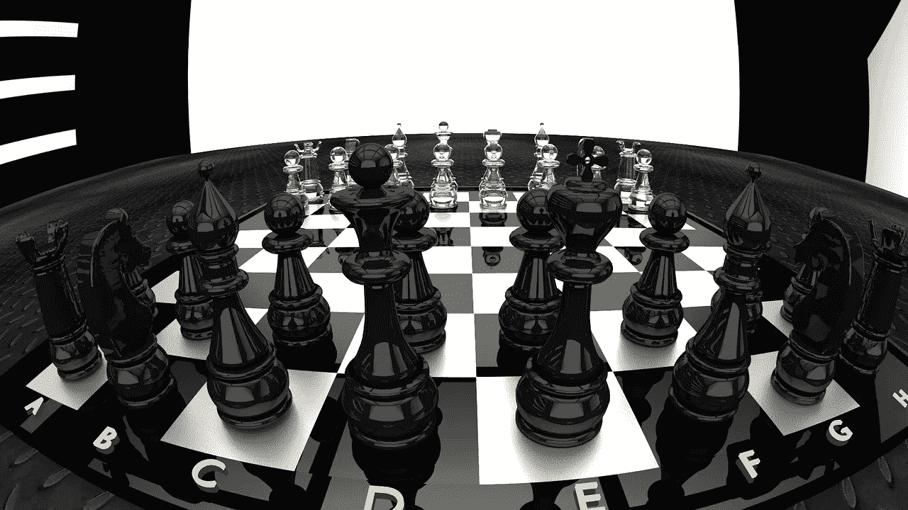
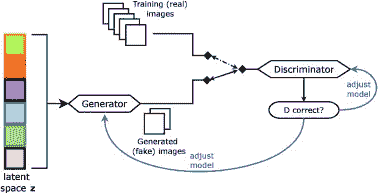

# 有了生成性对抗网络就万事大吉了！

> 原文：<https://medium.com/analytics-vidhya/all-is-well-that-ends-well-with-generative-adversarial-networks-f3db3347c999?source=collection_archive---------20----------------------->

图片来源:Pixabay

生成对抗网络[11]或更普遍地称为 GANs，是当今流行的最有趣的神经网络框架或思想之一。这个想法是伊恩·古德菲勒在蒙特利尔大学与约舒阿·本吉奥合作时提出的。

顾名思义，生成式对抗性网络背后的思想源于玩一个游戏的想法。就像在国际象棋比赛中，有两个玩家作为对手互相比赛以赢得比赛。类似地，在一个生成性对抗网络[11]中有两个参与者，即生成者和鉴别者，他们相互竞争以获胜。

让我举一个例子来帮助更好地解释这一点。想象一下我们的目标是检测假图像的情况。生成器和鉴别器都是神经网络。生成器是一个学习如何从噪声或潜在空间生成假图像的网络。另一方面，鉴别器是一个网络，它学习区分假生成的图像和给定的原始图像。这两个网络同时训练，并试图通过从对手指出的各自错误中学习来超越对方。因此，这导致了一场双方都成为对手的游戏。这个过程一直持续到达到我们称之为纳什均衡的状态。纳什均衡是一种理想状态，其中任一网络的状态变化都不会对另一网络产生太大影响。用外行人的话来说，这种状态指的是两个网络都已经达到平衡点的情况，在这种情况下，它们能够分别独立地生成图像和检测真伪。

生成性对抗网络图解。图片来源:[https://www . science direct . com/science/article/ABS/pii/s 105381191830658 x](https://www.sciencedirect.com/science/article/abs/pii/S105381191830658X)

然而，在训练生成性对抗网络时存在几个问题[11]。*稳定失败*就是这样一个问题。当被训练的 GANs 不稳定时，出现。换句话说，在训练 GAN 时实现纳什均衡或可接受的稳定性水平存在问题。对于鉴别器和发生器来说，在模型收敛到稳定平衡之前，行为很可能开始时不稳定并来回移动。如果 GAN 模型未能实现这种平衡，那么我们需要检查并解决原因，以提高培训效率。

> 我们如何检测 gan 的不稳定性？
> 
> 当您查看生成的图像样本时，如果您发现即使经过几个时期后它们的质量仍然很差，那么您的 GAN 很可能是不稳定的！
> 
> 当您发现发生器和鉴频器模型损耗曲线随时间变化有很大差异时，您的 GAN 不稳定的可能性就会增加。

稳定性失败的两个可能原因是模式崩溃和收敛失败。

> **稳定 GAN 训练问题:**
> 
> 模式崩溃
> 
> 收敛失败

*模式崩溃*是指 GAN 专注于生成属于一个或两个特定类别的图像，而不是学习生成所有类别的图像的现象。例如，假设您有数字 0 到 9 的图像。这里，每个数字代表一个类别。你训练一个 GAN，然后意识到它生成的图像只有 1 或 2 个数字，而不是所有的数字。

还可以通过查看模型损耗的线图来识别模式崩溃。随着发电机模型的更新和从一种发电模式跳到另一种具有不同损耗的模型，线图将显示损耗随时间的振荡，最明显的是发电机模型的振荡。

> **如何检测模式崩溃？**
> 
> 当发生器(可能还有鉴频器)的损耗预计会随时间振荡时[12]，这表明模式崩溃。
> 
> 当期望生成器模型从潜在空间中的不同点生成相同的输出图像时[12]。
> 
> **如何防止模式崩溃？**
> 
> 限制生成器的潜在维度的大小，这样模型将只生成有限类别的可行输出。

训练 GAN 的下一个问题是*收敛失败。当 GAN 未能将发生器和鉴频器训练到可接受的性能水平时，出现此。这意味着发生器正在生成鉴别器可以容易识别的坏图像，从而使鉴别器的损耗很快为零，而发生器的损耗要么保持不变，要么在一段时间内持续增加。*

> **检测收敛失败的方法:**
> 
> 鉴频器的损耗要么为零，要么非常接近零[12]。
> 
> 在某些情况下，发电机的损耗也可能上升，并在同一时期继续上升[12]。

训练 GAN 时要记住的另一件事是它对[超参数](https://towardsdatascience.com/intuitive-hyperparameter-optimization-grid-search-random-search-and-bayesian-search-2102dbfaf5b)的敏感度。GANs 对超参数的微小变化极其敏感，即微小的调整会对生成的结果或图像质量产生巨大的变化。因此，在调整超参数时，我们需要非常小心。

既然我们已经了解了困扰 GANs 训练过程的问题，让我也告诉你一些我在这里发现的[有见地的技巧，这些技巧由 Soumith Chintala 等人[13]确定，可能有助于你训练你的 GANs。](https://github.com/soumith/ganhacks)

> **sou Smith chint ala 等人[13]列出了一些训练 GAN 时需要记住的有用技巧，包括:**
> 
> 使用随机种子
> 
> 标准化输入，比如在-1 和 1 之间
> 
> 使用标签平滑。
> 
> 在将真实图像和生成的图像输入鉴别器之前，向它们添加噪声。
> 
> 尝试使用 Adam 优化器
> 
> 尝试从高斯分布中取样
> 
> 如果需要，使用批量标准化通常可以稳定训练
> 
> 在训练生成器和鉴别器时，使用像 Dropout 这样的正则化技术来防止过度拟合

现在，你知道如何训练你的 GAN 和避免什么事情。了解如何评估您的 GAN 的性能非常重要。在评估生成器时，我们主要需要记住两种东西:图像质量和图像多样性。评估所生成图像的质量及其在所涵盖类别方面的差异，对于了解 GAN 的工作质量至关重要。

为了基于这两个参数来评估 GAN，所使用的评估度量主要有两种:定量和定性。

定量指标通常涉及使用预定义的启发式算法来计算生成图像的分数。另一方面，定性度量通常涉及某种人工干预和启发式方法，如果有的话。因此，人们通常使用定量和定性指标的组合来评估他们的 GAN 的性能。

> **定量评估指标:**
> 
> 初始得分
> 
> 弗雷歇起始距离
> 
> 瓦瑟斯坦距离
> 
> 特征匹配
> 
> 精确
> 
> 回忆
> 
> f 分数
> 
> **定性评估指标:**
> 
> 最近的邻居
> 
> 评级和偏好判断
> 
> 评估模式丢弃和模式折叠

请注意，这份清单绝非详尽无遗。还存在许多定量和定性的评估指标。我只是列举了几个受欢迎的。度量标准的使用也高度依赖于您正在处理的问题的类型，因此应该非常谨慎地选择。如果您想了解有关这些评估指标的更多信息，请考虑查看下面的**“资源”**部分中给出的资源。

既然我们已经了解了 gan 的基本知识，如何训练它们以及使用什么样的评估指标，那么让我也来提一下当今研究领域中最流行的几种 gan 吧！

> **今天非常流行的一些甘是:**
> 
> DCGAN [1]
> 
> 条件氮化镓〔2〕
> 
> 周期根[3]
> 
> WGAN(瓦瑟斯坦甘)〔4〕
> 
> 像素 2 像素[5]
> 
> StyleGAN [6]
> 
> 最小平方氮化镓〔7〕
> 
> 能源基础甘[8]和开始[9]
> 
> 自我关注甘[10]

你可以从下面的参考资料中找到这些 gan。

我希望，这篇文章能帮助你理解什么是 GAN，以及训练 GAN 需要什么。

祝你好运训练你的第一根甘！

感谢您的阅读！

**参考文献:**

[1]拉德福德，a .，梅斯，l .，&钦塔拉，S. (2015)。深度卷积生成对抗网络的无监督表示学习。 *arXiv 预印本 arXiv:1511.06434* 。

[2]米尔扎和奥辛德罗(2014 年)。条件生成对抗网。 *arXiv 预印本 arXiv:1411.1784* 。

[3]朱，J. Y .，朴，t .，伊索拉，p .，&埃夫罗斯，A. A. (2017 年)。使用循环一致对抗网络的不成对图像到图像翻译。IEEE 计算机视觉国际会议论文集(第 2223-2232 页)。

[4]阿尔乔夫斯基，m .，钦塔拉，s .，&博图，L. (2017 年 7 月)。沃瑟斯坦生成对抗网络。在*机器学习国际会议*(第 214–223 页)。

[5] Michelsanti，d .，& Tan，zh . h .(2017 年)。用于语音增强和抗噪声说话人确认的条件生成对抗网络。 *arXiv 预印本 arXiv:1709.01703* 。

[6]王，x .，&古普塔，A. (2016 年 10 月).使用风格和结构对立网络的生成图像建模。在*欧洲计算机视觉会议*(第 318–335 页)。查姆·施普林格

[7]毛，x，李，q，谢，h，刘，R. Y，王，z .，，S. (2017)。最小二乘生成对抗网络。IEEE 计算机视觉国际会议论文集(第 2794-2802 页)。

[8]赵，马休，m .，，乐村，Y. (2016)。基于能量的生成对抗网络。 *arXiv 预印本 arXiv:1609.03126* 。

[9]贝特洛博士、舒姆博士和梅斯博士(2017 年)。开始:边界平衡生成对抗网络。 *arXiv 预印本 arXiv:1703.10717* 。

[10]张，h .，古德菲勒，I .，&奥登纳，A. (2018)。自我关注生成对抗网络。arXiv 预印本 arXiv:1805.08318 。

[11] Goodfellow，I .、Pouget-Abadie，j .、Mirza，m .、Xu，b .、Warde-Farley，d .、Ozair，s .、… & Bengio，Y. (2014 年)。生成对抗网络。在*神经信息处理系统的进展*(第 2672-2680 页)。

**更多资源:**

[**Yann le Cun**](https://medium.com/u/586743efc8fb?source=post_page-----f3db3347c999--------------------------------)**Quora 上的回答很好的解释了 GANs！**

 [## 深度学习领域最近和潜在即将到来的突破是什么？

### 回答(第 1 题，共 6 题):深度学习领域最近有很多有趣的发展，可能太多了，我无法描述…

www.quora.com](https://www.quora.com/What-are-some-recent-and-potentially-upcoming-breakthroughs-in-deep-learning) 

**理解甘的一个非常书从是:**

[12]“杰森·布朗利(Jason Brownlee)的《使用 python 的一般对抗性网络》(General adversant Networks with python)是一本关于 GAN 的令人惊叹的书，是任何想要很好地了解 GAN 的人的必读之作。

 [## 生成性对抗网络(GANs)简介

### 生成对抗网络，简称 GANs，是一种使用深度学习方法的生成建模方法…

machinelearningmastery.com](https://machinelearningmastery.com/what-are-generative-adversarial-networks-gans/) 

【13】如何训练一个甘？让 GANs 发挥作用的技巧和诀窍。

【https://github.com/soumith/ganhacks 号

【https://www.youtube.com/watch?v=9JpdAg6uMXs 

***【14】理解盗梦分数:***

 [## 如何实施初始分数(IS)来评估 GANs

### 生成对手网络，简称 GANs，是一种深度学习神经网络架构，用于训练和识别

machinelearningmastery.com](https://machinelearningmastery.com/how-to-implement-the-inception-score-from-scratch-for-evaluating-generated-images/) 

***【15】理解 FID:***

 [## GAN——如何测量 GAN 性能？

### 在 GANs 中，生成器和鉴别器的目标函数通常衡量它们做得有多好…

medium.com](/@jonathan_hui/gan-how-to-measure-gan-performance-64b988c47732) 

[https://machine learning mastery . com/how-to-implementation-the-frechet-inception-distance-FID-from-scratch/](https://machinelearningmastery.com/how-to-implement-the-frechet-inception-distance-fid-from-scratch/)

***【16】理解瓦塞尔斯坦距离:***

[https://en.wikipedia.org/wiki/Wasserstein_metric](https://en.wikipedia.org/wiki/Wasserstein_metric)

***【17】杰森·布朗利对 GANS 评价标准的理解:***

[https://machine learning mastery . com/how-to-evaluate-generative-adversarial-networks/](https://machinelearningmastery.com/how-to-evaluate-generative-adversarial-networks/)