# 闪光的未必都是金子

> 原文：<https://medium.com/analytics-vidhya/all-that-glitters-is-not-gold-305970e2da6c?source=collection_archive---------20----------------------->

承认吧，我们喜欢线性回归！穿过数据点云的一条神奇的直线是我们所渴望的。我们发现了一个具有低均方根误差(RMSE)、高调整 R 平方的线性模型，并且我们声称已经估计了数据的真实性质。我希望事情能这么简单。听说过这句谚语吗，闪光的不都是金子？我也想强调这一点。

在这篇文章中，我们所做的就是根据风速(以米每秒为单位)来预测发电量(以兆瓦为单位)。在我们深入研究数据之前，让我们先思考一下。风车产生的电力会如何随风速而变化？我们的思维是线性的，还是指数的？我们不是很像吗？请坚持你的想法。

让我将数据随机分为两个部分，训练数据(70%) —我们构建模型的部分和测试数据(30%) —我们评估构建的模型的部分。该数据集可通过以下链接访问:

[https://www . tableau . com/learn/tutorials/点播/trend-lines？播放列表=484037](https://www.tableau.com/learn/tutorials/on-demand/trend-lines?playlist=484037)

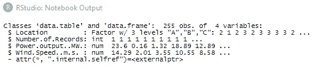

在我们的例子中，重要的变量是功率输出和风速

培训数据的汇总统计如下:

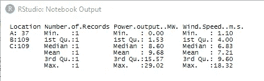

发电量在 0-30 兆瓦之间变化，另一方面，风速在 1.10-18.32 毫秒之间变化

一些基本的数据可视化证实了响应和预测变量之间的高度相关性，如下所示:

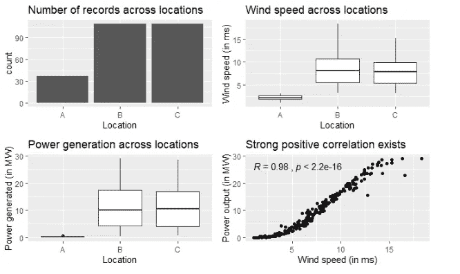

0.98 的相关系数，正如我们所想(或者没有)。

在我预测任何事情之前，让我建立我的**基线模型**。如果我没有风速信息，我将使用平均发电量作为最佳估计值，如下所示:

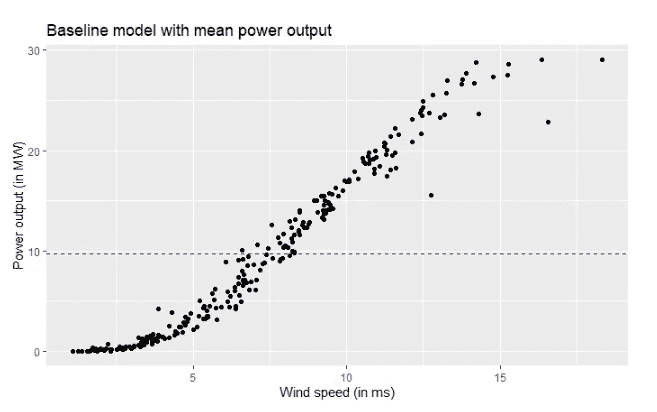

我知道这将是一个可悲的模式，但嘿，我呼吁这是有原因的基线！

让我们在基线之后运行我们最喜欢的模型——线性回归。

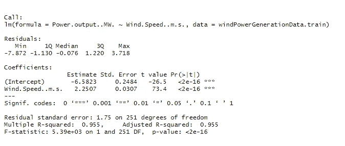

这就是我所说的，调整后的 R 平方为 0.955

模型预测的变量之间的估计关系为:

*功率输出= -6.5832 + 2.2507 *(风速)*

解读时间:以米每秒为单位的风速每增加一个单位，发电量就增加 2.2507 兆瓦。有道理，对吧？

打住，在你怀疑这是不是数据分析师的工资之前，让我扔一句话来证明我们的存在。 **Homoscadesticity！当然，这是一个令人生畏的词，但它复杂吗？没有。它的意思是，你建立的模型应该是一致的，没有偏见的。进一步简化，你的模型必须在**预测值**的整个范围内随机分布**残差**。我们怎么检查呢？残差 v/s 预测(拟合)值图。在此之前，先回顾一下残差:**

**残差=实际值—预测值**

因此，残差> 0 表示模型预测不足。剩余< 0 implies that the model has overpredicted the value and a residual = 0 indicates that actual and predicted values by the model match.

A residual of zero is desired, but almost never attained.

Now that we know what residuals imply, let’s jump onto the residuals v/s fitted plot for the linear model above:

The predictions as seen in the residual v/s fitted plot is inconsistent and exhibits heteroscedasticity

This can also be seen on plotting the model on the scatter plot:

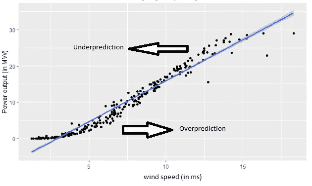

The blue line is the linear regression model built

As one would eyeball, (easier in this case, not possible in multi-dimensional planes) the model overpredicts the power generated for lower wind speeds and under predicts for higher speeds constantly. Could we improve? Yep, let’s give it a shot. Let us look at the distribution of wind speed and power output.

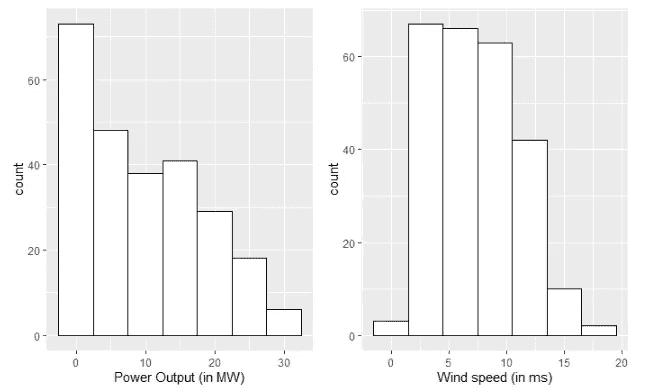

Power output is skewed to the right, so is wind speed. Would log transformation de-clutter something?

Log transforming the wind speed leads to a scatter plot as below:

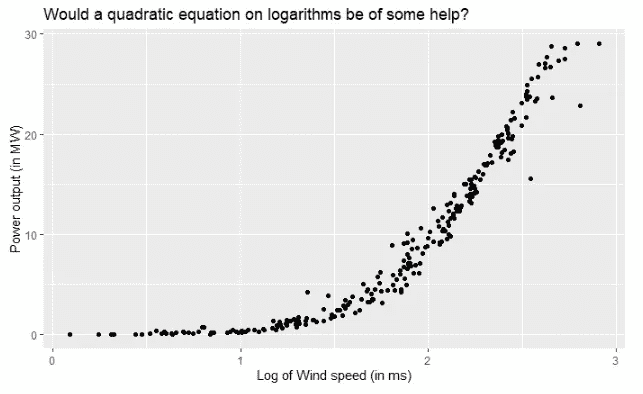

A quadratic model on the logarithm of wind speed in is trained as below:

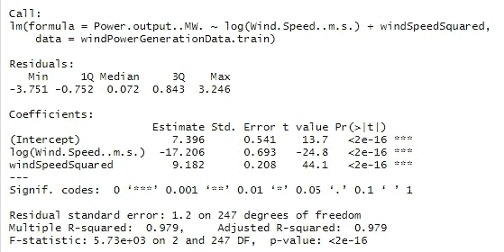

Significant predictors, high R-squared of 0.979\. Are we overfitting?

The estimated quadratic relation between the response and the predictor variable is as below:

*功率输出= 7.40–17.20 * Ln(风速)+ 9.18 * (Ln(风速))*

调整后的 R 平方明显偏高，这让我们担心过度拟合的模型在暴露于测试数据时可能表现不佳。交叉验证来拯救？

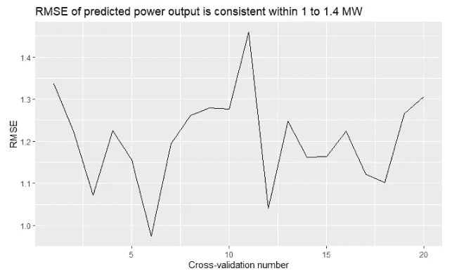

对数据集进行交叉验证，在所有随机创建的用于测试的褶皱上产生 1 到 1.4 之间的 RMSE。这个模型似乎并没有过度拟合。

现在让我们来看看残差 v/s 拟合图，以检查在对数项上建立模型是否有助于减少异方差。该图如下所示:

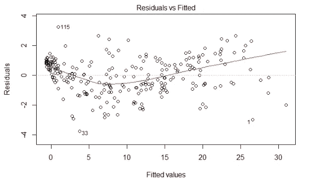

该模型确实显示出一些改进

在剩余 v/s 拟合图中似乎确实有一些改进，但是随着风速的增加，似乎出现了一种趋势。将构建的模型强加到散点上的操作如下:

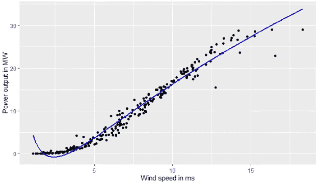

预测值用蓝线表示

基于残差图，二次模型显示了较小的改进。当我们将模型暴露在测试环境中时，我们必须使用 RMSE 值来度量模型的性能吗？

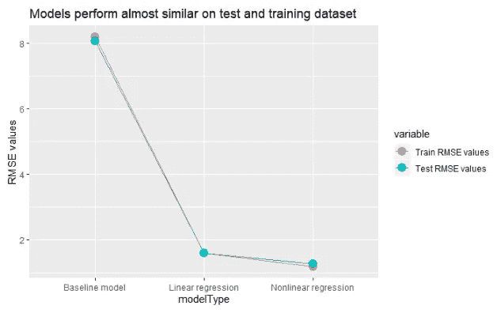

从上面的折线图来看，线性模型无疑是对基线的改进。线性模型显示的异方差迫使我们使用二次对数模型来估计变量之间的关系。二次模型似乎在异方差方面有所改善，RMSE 值较低。然而，该模型在较高风速下表现不佳，因为发电量处于平稳状态。

或许，有更好的模式。也许吧！

可以使用下面的链接访问该项目的源代码:

[https://github . com/rohitTheSupplyChainGuy/发光的不一定是金子](https://github.com/rohitTheSupplyChainGuy/all-that-glitters-is-not-gold)