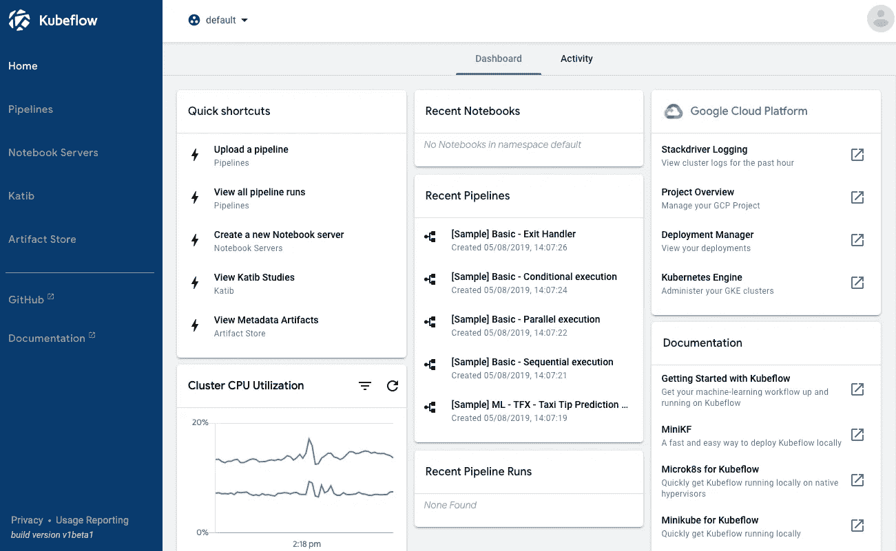

# GCP 的一切:机器学习决策金字塔

> 原文：<https://medium.com/analytics-vidhya/all-things-gcp-machine-learning-decision-pyramid-82260c798a88?source=collection_archive---------12----------------------->

## 了解哪些谷歌云工具最适合你。

谷歌云 ML 决策金字塔

> 注意:这篇文章的灵感来自于[莎拉·罗宾逊](https://medium.com/u/7f2ab73b39f8?source=post_page-----82260c798a88--------------------------------)在她的[推特](https://twitter.com/SRobTweets/status/1100404525058404352)上，一段 5 分钟的简短视频解释由谷歌云平台上传到 [Youtube](https://youtu.be/pm_-pVPvZ-4) 。
> 
> 本文将详细解释这些工具及其用途。

# **简介**

大多数云提供服务提供许多工具和服务供用户使用，这有利于用户开始他们的开发过程。尽管这些工具根据用户的喜好在许多抽象层次上有所不同，但这对用户来说也是难以承受的。

许多用户发现很难找到满足他们需求的最佳工具，这在机器学习阶段可以很好地看到。

许多用户希望在他们的产品中使用机器学习，像 GCP、AWS Azure 等云提供商都知道这一点。由于这种需求，根据用户的需求和专业知识，他们可以提供现成的机器学习工具，用户可以通过几行代码或 [*根本没有代码来完成复杂的机器学习任务！*](https://www.theverge.com/2018/1/17/16901126/google-cloud-ai-services-automl)

基于专业知识的 Google 云平台 ML 工具理解

对于这篇文章，我选择了 GCP，为什么不呢？从 ML 工具的角度来看，Google Cloud 拥有最有用的 ML 工具包，支持广泛的专业知识。

让我们从底层开始理解每个堆栈。

# *** ML 需要数据科学家**

# ML 框架

1.  像 [Tensorflow](https://www.tensorflow.org/) 、 [Pytorch](https://pytorch.org/) 、 [Sklearn](https://scikit-learn.org/) 、 [XG Boost](https://xgboost.readthedocs.io/en/latest/) 等框架已经很受数据科学家的欢迎了。
2.  这些框架有助于使用现成的代码/功能，通过几行代码创建机器学习或神经网络。
3.  使用最流行的框架的文档和许多教程使它成为数据科学家的首选。
4.  此外，如果需要，你可以很容易地修改代码，并可以根据需要定制框架。

## **支持最流行的 GCP 框架**

[**谷歌计算引擎**](https://cloud.google.com/compute)

1.  您可以创建自己的虚拟机实例，并根据需要启动系统。
2.  你将拥有你的操作系统的粒度能力，它的版本，python 版本，你需要的框架，等等。

## 开始吧

*   [用于机器学习的谷歌云实例](/giscle/setting-up-a-google-cloud-instance-for-deep-learning-d182256cb894)
*   [谷歌计算引擎中的深度学习](https://blog.kovalevskyi.com/deep-learning-images-for-google-cloud-engine-the-definitive-guide-bc74f5fb02bc)

GCP 计算引擎创建新实例

# [深度学习虚拟机映像](https://cloud.google.com/deep-learning-vm/)

1.  您将获得预安装的框架，以便与配置的 Python 或 R 环境一起使用。
2.  您可以根据您的框架或环境选择[虚拟机映像](https://cloud.google.com/ai-platform/deep-learning-vm/docs/images)。
3.  像计算引擎一样，您可以为实例指定内核和 RAM 的数量。

4.如果需要，GPU 和 JupyterLab 的支持也是现成的。

## 开始吧

*   [深度学习虚拟机控制台](https://console.cloud.google.com/marketplace/details/click-to-deploy-images/deeplearning)
*   [深度学习 VM 文档](https://cloud.google.com/ai-platform/deep-learning-vm/docs)

深度学习虚拟机映像—使用配置创建新实例

# [Kubeflow](https://www.kubeflow.org/)

1.  当我们需要将我们的训练模型部署到生产中时，这是最常用的。
2.  因为我们本地 env 中有不同的配置。和生产环境。我们的许多 ML 任务在转移到生产环境时会中断。用于[部署](https://siliconangle.com/2018/11/07/kubeflow-shows-promise-standardizing-ai-devops-pipeline/)并服务于我们的 ML 模型。
3.  这个问题以前由开发人员在 ML 以外的应用程序中解决过，他们创建了 Kubernetes。
4.  因为 ML 上对 Kubernetes 这样的编排平台的需求，形成了 [Kubeflow](https://www.kubeflow.org/docs/about/kubeflow/) 。

## 开始吧

*   [GCP 的端到端 kube flow](https://www.kubeflow.org/docs/gke/gcp-e2e/)
*   [Codelabs — Kubeflow](https://codelabs.developers.google.com/codelabs/kubeflow-introduction/index.html?index=..%2F..index#0)

Kubeflow UI

# [**云 ML 引擎**](https://cloud.google.com/ai-platform-notebooks/)

1.  类似深度学习 VM 镜像，GCP 有 [AI 笔记本](https://cloud.google.com/ai-platform-notebooks/)。一键轻松部署笔记本电脑的人工智能环境。
2.  这款 AI 笔记本可以从 [BigQuery](https://cloud.google.com/bigquery) 无缝拉取数据，使用 Cloud [Dataproc](https://cloud.google.com/dataproc) 对其进行转换，并利用 AI 平台服务或 Kubeflow 进行分布式训练和在线预测。
3.  您可以在自己选择的容器上运行一个笔记本实例。

## 开始吧

*   [AI 平台文档](https://cloud.google.com/ai-platform/docs)

人工智能笔记本—一键访问 JupyterLab

# *对数据有所了解

# [BQML](https://cloud.google.com/bigquery-ml/docs)

1.  这里有数据(*如果不是大查询有的是* [*公共数据集*](https://cloud.google.com/bigquery/public-data) *玩*)。您已经将数据加载到了 [BigQuery](https://cloud.google.com/bigquery) 中，现在您想要从数据中执行 [ML](https://yourstory.com/2018/10/masterclass-developer-google-democratising-ml) ，但是您所学的只是基本的 SQL。BQML 来拯救我们了。
2.  在 BigQuery 内部，我们有 BQML(大查询机器学习)，可以很容易地从 Big Query 本身训练和预测 ML 模型。

3.运行 ML 模型进行训练的示例代码看起来像

[https://gist . github . com/2796 gaur av/1663 D6 f 7 a2 B3 e 366 c 256d 0 B2 EFA 84508](https://gist.github.com/2796gaurav/1663d6f7a2b3e366c256d0b2efa84508)

4.您可以评估您的模型度量和性能，如果一切正常，您可以在 BigQuery 控制台中使用它进行预测。

## 开始吧

*   [BQML 文档](https://cloud.google.com/bigquery-ml/docs)
*   C [odelab — BQML](https://codelabs.developers.google.com/codelabs/bqml-intro/index.html#0)

使用 SQL 的 BigQuery 训练

# *完全不了解

# [AutoML](https://cloud.google.com/automl)

1.  在 [AutoML](https://cloud.google.com/automl) 中，你必须提供你想要执行 ML 的数据，仅此而已！
2.  AutoML 甚至消除了 BQML 的复杂性，并提供了可用于数据集的最先进的 ML 模型。
3.  AutoML 有许多工具，例如

*   [汽车视觉](https://cloud.google.com/vision/overview/docs/#automl-vision)

*应用程序中的视觉检测功能，包括图像标记、人脸和地标检测、光学字符识别(OCR)以及明确内容的标记。*

*   [AutoML 视频智能](https://cloud.google.com/video-intelligence/automl/docs/)

*根据您自己定义的标签对视频中的镜头和片段进行分类，或者跟踪镜头和片段中的多个对象*

*   [AutoML 自然语言](https://cloud.google.com/natural-language/automl/docs/)

*构建和部署定制的机器学习模型，用于分析文档、对文档进行分类、识别文档中的实体或评估文档中的态度。*

*   [自动翻译](https://cloud.google.com/translate/automl/docs/)

*让您创建自己的自定义翻译模型。*

*   [AutoML 表格](https://cloud.google.com/automl-tables/docs/)

*以大幅提高的速度和规模，在结构化数据上构建和部署最先进的机器学习模型。*

## 开始吧

*   [自动 ML 单据](https://cloud.google.com/automl/docs/)
*   [深入了解 Auto ML 的工作原理](https://www.fast.ai/2018/07/23/auto-ml-3/)

自动 ML 如何工作

# [毫升原料药](https://cloud.google.com/products/ai/)

1.  这些是 Google 提供的 API，当提供适当的输入时，它们将返回 ML 预测任务。

2. [ML Api 的](https://cloud.google.com/products/ai/)包括

*   [视觉人工智能](https://cloud.google.com/vision/)
*   [视频 AI](https://cloud.google.com/video-intelligence/)
*   [云语音转文字 API](https://cloud.google.com/speech-to-text/)
*   [云文本到语音转换 API](https://cloud.google.com/text-to-speech/)
*   [对话流程](https://cloud.google.com/dialogflow/)
*   [云推理 API](https://cloud.google.com/inference/)
*   [建议 AI (beta)](https://cloud.google.com/recommendations/)
*   [云汽车](https://cloud.google.com/automl/)

## 开始吧

*   [Codelabs — ML Api 的](https://codelabs.developers.google.com/codelabs/cloud-ml-apis/index.html?index=..%2F..index#0)

一些 GCP ML Api

# 结论

> 随着越来越多的开发和研究在 ML/ AI 领域完成，越来越多的人对利用它感兴趣。
> 
> 随着不同背景的人对这个领域感兴趣，毫无疑问，ML 服务提供商将制造越来越简单的“复杂”工具，这些工具将面向更广泛的用户。
> 
> 如果我们在所有这些方面后退一步，我们还可以认为，如果机器学习日益变得简单，那么公司/组织/个人就有可能不再依赖数据科学家来制作 ML 模型，而这一领域在个人中创造的“炒作”可能会破灭。
> 
> 这只是一个推测，如果是真的，我们离完全依赖计算机完成人工智能任务还很遥远……或者我们真的是这样吗？

> 对于任何澄清，评论，帮助，赞赏或建议，只需在评论中发布，我会帮助你。
> 
> 如果你喜欢，你可以跟着我。

 [## Gaurav Chauhan -中等

### 阅读 Gaurav Chauhan 在媒体上的文章。hopscotch.health 的数据科学家，每天，Gaurav Chauhan 和数千人…

medium.com](/@gauravc2708) 

> 此外，如果你想要更多基于数据科学、人工智能或数据管道的内容，可以在我的社交媒体上连接我。

*   [领英](https://www.linkedin.com/in/gauravc2708/)
*   [电子邮件](http://gauravc2708@gmail.com/)
*   [推特](https://twitter.com/2796gaurav)
*   [中等](/@gauravc2708)