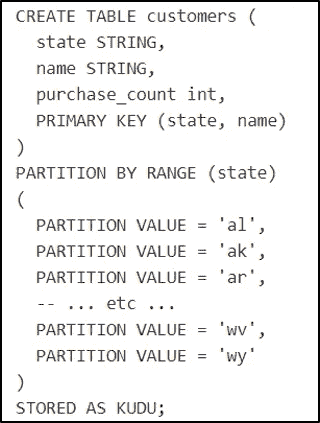
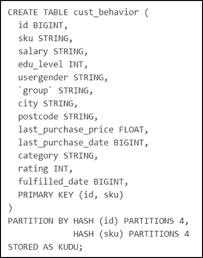
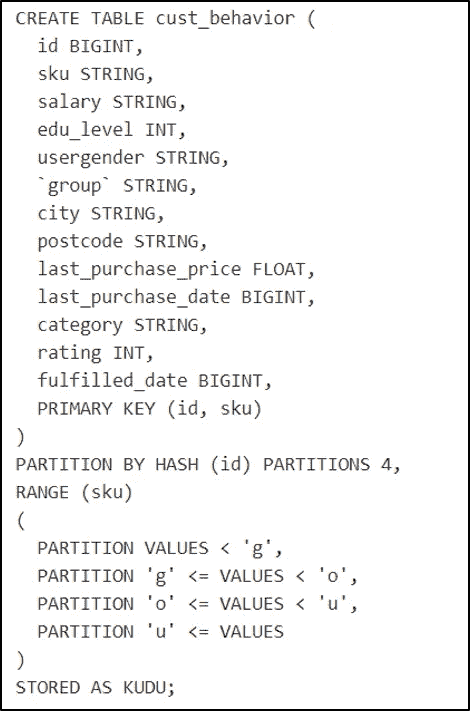

# 关于阿帕奇·库杜你需要知道的

> 原文：<https://medium.com/analytics-vidhya/all-you-need-to-know-about-apache-kudu-c27ec2acbf09?source=collection_archive---------10----------------------->

> 在本文中，我将描述和简化您应该知道的关于 Apache Kudu 的一切，因为您已经知道了基本的术语，并且您已经使用过分布式系统。通过这种方式，我将简化我从与 kudu 一起工作、阅读和研究不同来源的经验中学到的东西。

标志；徽标

# **cloud era 为什么要打造阿帕奇 Kudu？**

Kudu 集群存储的表看起来就像您习惯使用的关系数据库(SQL)中的表。

# **我认为库都被创造出来的原因:**

1.为了填补 HDFS 和 HBASE 在流处理方面的空白，越来越多的公司需要控制流处理(我认为批处理已经过时)。与 HBASE 不同，Kudu 可以更高效地实时扫描大量数据

2.与 HBASE 相比，Kudu 允许对特定记录进行操作，并且扫描功能更快

3.大量数据仍然难以控制，并且容量继续增长。对于某些设备来说，Hadoop 和其他平台可能很复杂。

4.开发团队在不断变化，许多用例需要关注实时生成的数据，以便进行实时分析。

# **库都建筑精要**

*   阿帕奇库杜正在成长，我认为它还没有达到一个成熟的阶段来开发它所拥有的潜力
*   Kudu 与 Impala 和 Spark 融为一体，非常棒。
*   在 Kudu 中创建表与我们在关系数据库中创建的表非常相似，也就是说，您必须在表中定义一个或多个主键(PK ),并且主键一旦创建就不能更改。
*   与其他数据库不同，Apache Kudu 有自己的文件系统来存储数据。也就是说，由于 Kudu 将其存储在自己的文件系统中，因此在 HDFS 将无法查询该表的信息。这些信息只能通过 SQL 查询来访问。另一方面，如果表结构存储在 HDFS 路径中，这主要发生在我们创建外部表时，在完全删除表的情况下，我们可以转到“创建表”中定义的 HDFS 路径并检索创建结构

# **分区**

至于分区，Kudu 在这一点上有点复杂，可能会成为一个真正令人头痛的问题。选择分区类型总是取决于我们的主板的开发需求。定义正确的分区将在未来为我们解决许多问题，主要是当数据量增长和读写查询的延迟受到影响时。

# **那么我该如何选择分区呢？**

Kudu 有两种分区类型；这些分区是范围分区和散列分区。

**按范围分区:**

它将允许很好地访问您在表的范围内指定的基于时间的查询。要按范围进行分区，我们必须在表中定义范围内包含的时间段或间隔。如果我们在表中不存在的区域中插入记录，会发生什么情况？这些记录将不会被插入。

按范围划分。来源:https://kudu.apache.org/docs/kudu_impala_integration.html

值得注意的是，按范围划分提供了脚本的良好分布。对于给定的范围，所有插入的数据将到达所有服务器，每个服务器包含返回相同数量指标的传感器子集。如果一个范围内的传感器比另一个范围内的多，这将导致分区不平衡并影响性能。在散列分区的情况下，这个问题不会发生

**哈希分区:**

散列分区是在表中定义的 PK 类型字段上完成的。Kudu 通过对指定列的值应用散列函数，将每个记录分成固定数量的容器，因此分区中不会出现不平衡。

对于需要维护两种分区类型(散列和范围)的表，我推荐这种做法。这两者的结合允许良好的写入解释(因为哈希脚本扩展到多个

分区)和良好的读取解释(大型扫描可以跨多个服务器并行执行)

当分区级别为 8 个容器时，表的性能可能会很好，但是当分区级别为 15 个容器时，同一个表的性能可能会更差，而当分区级别为 24 个时，同一个表的读写时间可能会更短。执行分区调优是令人困惑的，正如我之前所说的，它总是取决于每种情况。

哈希分区。来源:https://kudu.apache.org/docs/kudu_impala_integration.html

通过范围和散列进行分区。来源:[https://kudu.apache.org/docs/kudu_impala_integration.html](https://kudu.apache.org/docs/kudu_impala_integration.html)

# **可以动态分区吗？**

Kudu 中不存在动态分区，在我看来这是一个主要的限制，因为在生产环境中，容量总是会增加，表的数据存储被限制在 10GB。因此，在数据增长的情况下，需要迁移这些表中的数据，这可能需要时间(有不同的迁移备选方案)。

# **最后，我留给大家一系列与 Kudu 合作时必须考虑的事项:**

*   Kudu 中不允许使用 Char、Varchar、Date 和 Array 类型。
*   Kudu 表不能超过 300 列。
*   列名不得超过 256 个字符，并且必须是有效的 UTF-8 字符串。
*   一列最多只能存储 54Kb
*   在向集群添加新节点的情况下，Kudu 不会重新分配平板服务器以确保平衡，在这种情况下，您必须手动移动已经创建的平板服务器，或者您必须删除并重新创建表
*   不支持 Sqoop
*   Kudu 管理员可以为数据迁移启用配置单元支持
*   查询必须通过 Impala 引擎进行，因此，有绝对的依赖性

我希望你喜欢这篇文章，并且它是有帮助的。

*请留下你的意见*