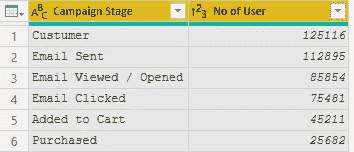
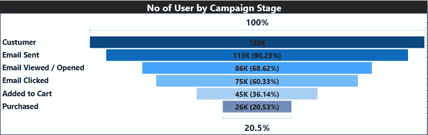
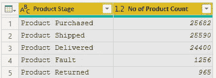
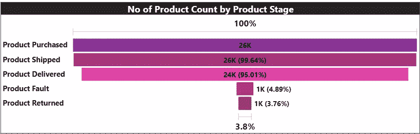

# 你所需要知道的漏斗图

> 原文：<https://medium.com/analytics-vidhya/all-you-need-to-know-about-funnel-chart-bb6a02004f66?source=collection_archive---------8----------------------->

[https://images.app.goo.gl/bjGeE8NJeyqYRLk66](https://images.app.goo.gl/bjGeE8NJeyqYRLk66)

这篇文章让你完全理解什么时候使用漏斗图，漏斗图的好处，并试图用一个著名的电子商务巨头的简单例子来解释。

漏斗图在销售和营销领域发挥着非常重要的作用。

漏斗图用于表示业务中的各个阶段，当需要进行层级分析时。

让我们理解一个场景，举一个简单的例子

示例-

*(请注意仅为理解目的而举的例子)*

亚马逊即将推出大十亿周优惠，为此他们需要向所有客户传达这一信息。现在的问题是，他们如何与客户沟通？

让我们假设他们试图想出一个向所有客户发送电子邮件的计划。

举一个简单的表格形式的例子

十亿美元大促销活动的推广阶段

1.  客户数量:12.5 万
2.  发送给客户的电子邮件:112K(考虑活跃用户)
3.  客户查看的电子邮件:86K
4.  在 85，000 名客户中，75，000 名点击了电子邮件并转到了网站
5.  45，000 名客户将产品添加到购物车进行购买
6.  有 2.6 万名顾客购买了正在销售的产品(大十亿周)

你对此的观察是什么？？我们如何判断电子邮件是否是一个好的沟通方式？

现在解决方案来了，我们需要找出**转化率**。

在我们考虑的例子中，我想说，在 12.5 万个客户中，有 2.6 万个客户进行了销售。

**转换率**=(26K/125k)* 100 =**20.5%**

Power BI 漏斗图可视化

在上面的例子中，公司期望有更宽的漏斗尺寸，这在内部意味着有更高的转化率百分比。购买越多，销售越多。

这是漏斗图的好处-

1.  漏斗的形状揭示了流程/活动的健康状况
2.  暴露瓶颈
3.  可以有针对性地改进中间过程步骤

现在让我们换个角度来看，

什么？如果是这个例子-

交付产品部门所涉及的阶段

考虑交付产品部门的流程-

1.  购买的产品:26K
2.  发货产品:25K
3.  在 25，000 个出货产品中，有 24，000 个产品已经交付
4.  1.2K 产品被报告出现故障，965 个产品被退回

Power BI 漏斗图可视化

在本例中，公司希望漏斗尺寸越小越好，这在内部表示退回的产品比例越小，以保持其品牌和声誉。

结论-

通过实例对漏斗图的理解做了简单的尝试。我们看到了漏斗图的两面(头部和尾部)。漏斗图仍然是展现业务流程步骤或阶段的绝佳视觉工具之一。字面上让我们知道阶段的瓶颈。