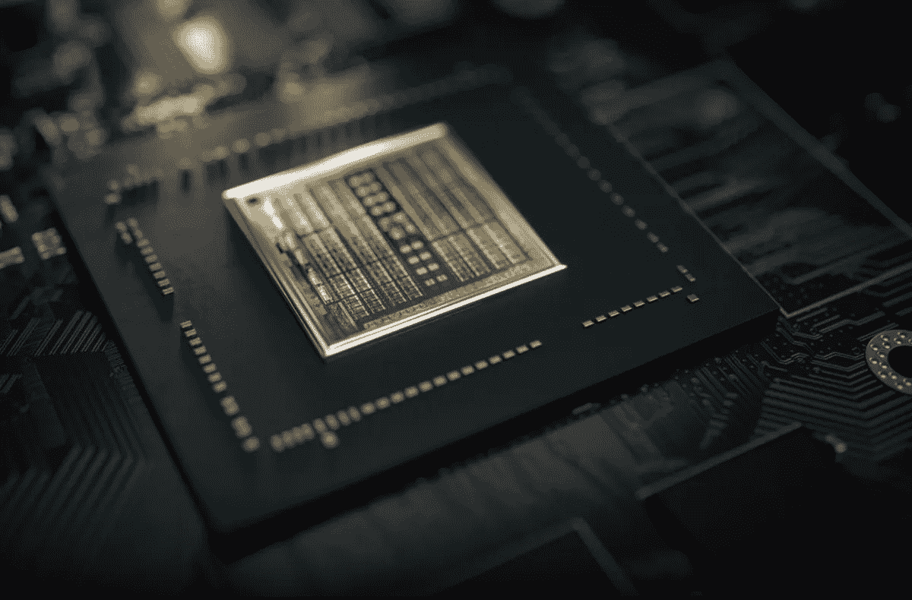
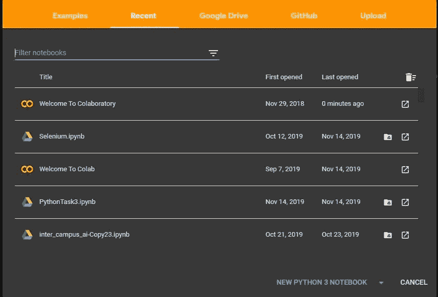
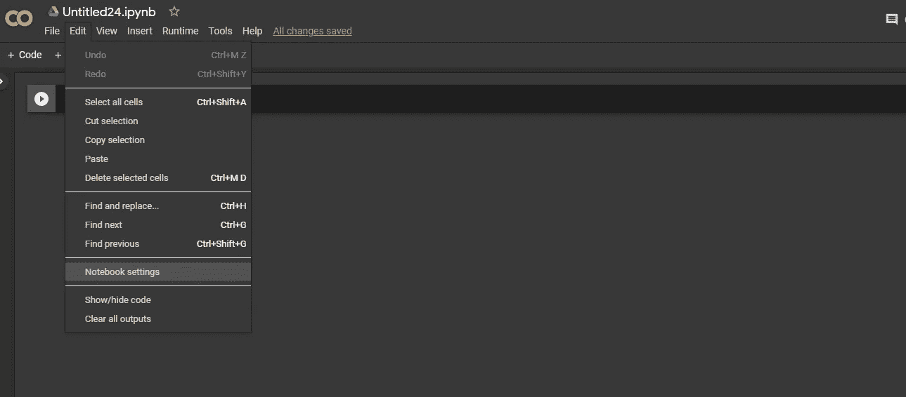
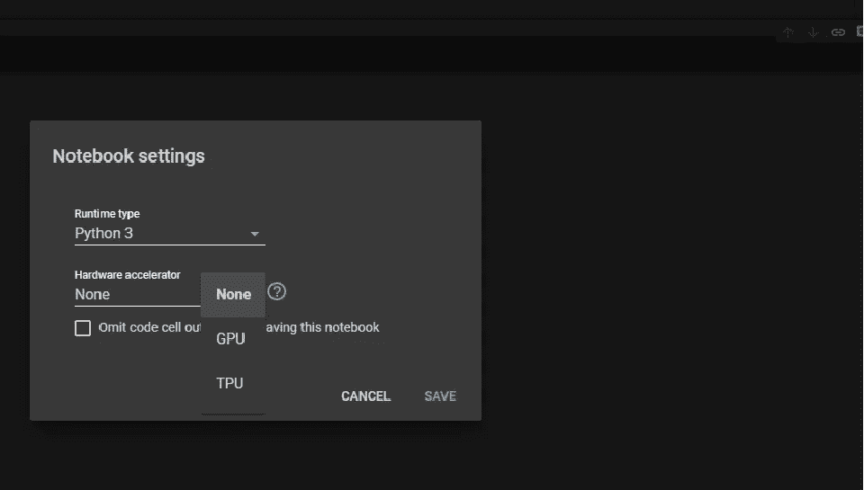

# 作为机器学习的初学者，你需要了解的所有关于 GPU 的知识

> 原文：<https://medium.com/analytics-vidhya/all-you-need-to-know-about-gpus-as-a-beginner-in-machine-learning-d0fc0c8670fc?source=collection_archive---------16----------------------->

让我带你进入 GPU 的世界。

你可能听说过 GPU 是人工智能的新手或者根本没听说过。从长远来看，作为一名人工智能开发者，关于它以及如何使用它的知识将会对你有所帮助。

现在，这个 GPU 是什么？

图形处理单元(GPU)是一种专门的电子电路，设计用于快速操纵和改变存储器，以加速在帧缓冲器中创建图像，用于输出到显示设备。GPU 用于嵌入式系统、手机、个人电脑、工作站和游戏控制台。

你可能想知道它如何适应机器学习，它与 CPU 有什么不同吗？第二个问题的答案是肯定的，GPU 不同于 CPU。顾名思义，CPU 是中央处理器:这意味着它是主处理器。GPU 是一个协处理器，旨在协助 CPU。为了回答第一个问题，我会给你我对 GPU 的定义。

> GPU 是一种人工智能加速器，用于更快地处理人工智能( [AI](https://searchenterpriseai.techtarget.com/definition/AI-Artificial-Intelligence) )任务。

现在这个定义解释了 GPU 和机器学习是如何互相契合的。

我们为什么要用 GPU？

训练深度学习模型是计算密集型的。由于 GPU 的并行计算能力，或者说一次做很多事情的能力，它们擅长训练和推断模型。简单来说，我们用 GPU 训练模型更快。

作为一个新手，要知道很多平台都提供免费的 GPU 来训练你的模型。像 [Kaggle](https://www.kaggle.com/) 和[谷歌联合实验室](https://colab.research.google.com/)这样的平台为其用户提供了一个免费的单个 12GB 英伟达特斯拉 K80 GPU(如果这让你感到困惑，不要担心，你不需要在旅程的早期就知道所有类型)。该 GPU 的性能比运行在 CPU 上的内核高 12.5 倍。

如何激活此 GPU 当使用 Google 协作室时，请按照以下步骤操作:

1.  访问[谷歌合作实验室](https://colab.research.google.com/)，点击*新建 PYTHON 3 笔记本*创建一个新笔记本。

2.然后在笔记本创建完成后，在左上方，你会看到*编辑，*点击它并进入*笔记本设置*。就像这张照片一样。

3.点击它，你会看到*硬件加速器，*点击它，你会看到无，GPU 和 TPU。选择 GPU 作为硬件加速器。

4.我们差不多准备好了。保存此笔记本设置后，您将在屏幕的右上角看到 Connect，选择它，您的笔记本将由 Google 云计算引擎上的免费 GPU 驱动。

瞧啊。这就是如何在 colaboratory 上激活 GPU。你正在成为一名机器学习工程师。请注意，这个 GPU 持续 12 个小时后，所有的进展将会丢失。所以在编码的时候，尽量把所有东西都保存在你的 Google Drive 里。我会写一篇文章来解释如何将 Google Drive、Kaggle 和 Colab 全部链接到一个笔记本中。

要激活 Kaggle 上的 GPU，请遵循此处的说明[。](https://www.kaggle.com/dansbecker/running-kaggle-kernels-with-a-gpu)

当你在你的机器学习之旅中前进的时候，GPU 就会变得清晰。英特尔、IBM、谷歌、Azure、亚马逊等云平台提供了比特斯拉 K80 GPU 更快的 GPU，而且价格相对便宜。你应该去看看你最感兴趣的平台。

感谢阅读！请在下面留下你的建议和评论。干杯！！