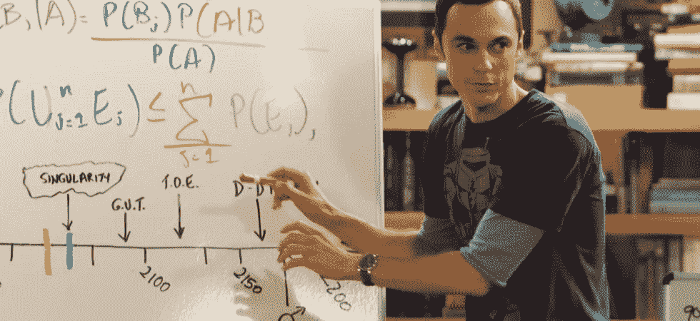
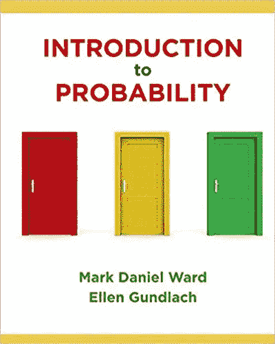
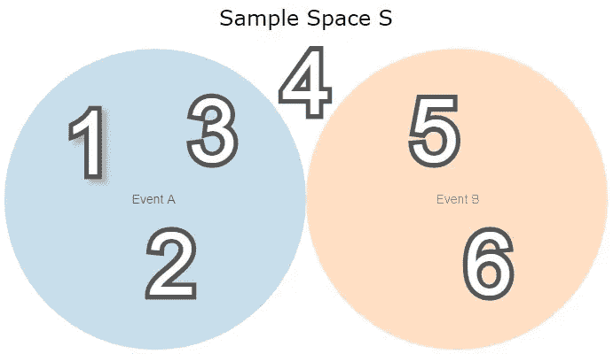
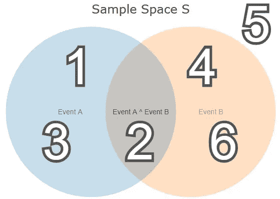
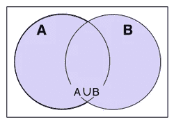
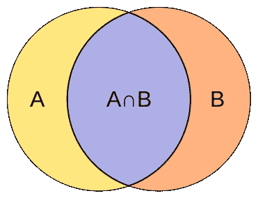
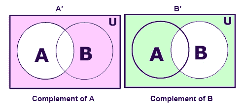
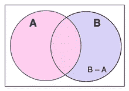
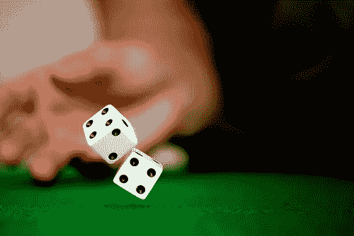

# 关于概率你需要知道的一切——第 1.1 章:随机性

> 原文：<https://medium.com/analytics-vidhya/all-you-need-to-know-about-probability-chapter-1-1-randomness-71a91d1ca99?source=collection_archive---------15----------------------->

## 数学

什么是结果和事件，独立性和条件概率意味着什么，以及我们如何使用贝叶斯定理来更新我们对世界的信念。

谢尔顿用贝叶斯定理。来源:生活大爆炸理论

> “根据贝叶斯定理，没有一个理论是完美的。相反，它是一项正在进行的工作，总是要接受进一步的完善和测试。”—内特·西尔弗(分析棒球和选举的美国统计学家)

来源:https://bit.ly/2yGARWx

> 这个系列大致遵循马克·丹尼尔·沃德和埃伦·冈拉克的《概率导论》一书。尽管我们也会涉及更多的话题。

## 因此，我们将涵盖以下主题:

*   第一章:随机性
*   第二章:离散随机变量
*   第三章:命名随机离散变量
*   第四章:计数
*   第五章:连续随机变量
*   第六章:命名连续随机变量
*   第七章:马尔可夫链蒙特卡罗
*   第八章:朴素贝叶斯

# 第一章:随机性

“根据贝叶斯定理，没有一个理论是完美的。相反，它是一项正在进行的工作，总是要接受进一步的完善和测试。"

## 我们如何定义随机性

什么是真正的随机？你从教授那里得到的分数是随机的还是你出生的家庭是随机的？计算机生成的这个看似随机的数字是真随机还是只是伪随机的？对于我们的定义，我们将保持简单。

> 定义 1.1:随机性是指结果和事件缺乏模式或可预测性。当某件事随机发生时，有几种可能发生的结果。所有的结果结合起来形成一个事件。

## 结果和事件

来源:https://bit.ly/346eSSN

假设我们**掷硬币两次**。每一次**抛硬币**都有**两种结果**，正面或反面。每**两次抛硬币**有 **4 种结果**，两次正面，两次反面，或先正面，后反面，或反之亦然。

**结果**

> **我们用集合符号{}**写出可能结果的样本空间 s: S={{H，H}，{T，T}，{H，T}，{T，H}}
> *#每一种可能的结果*

**事件**

一个**事件**是所有可能结果的子集，例如，所有满足两次投掷相同硬币的结果。

> 事件我们抛两个硬币，土地在同一边:
> E(同一边两次)= {{H，H}，{T，T}}
> 
> 如果我们抛两个硬币，它们没有落在同一边:
> E(不是同一边的两次)= {{H，T}，{T，H}}
> 
> 我们抛两个硬币的事件:
> E(我们抛两个硬币)= S = {{H，H}，{T，T}，{H，T}，{T，H}}
> #这种情况很明显每次我们抛两个硬币都会发生
> 
> 我们只抛一枚硬币的事件:
> E(我们抛一枚硬币)= ∅ = {} #这是不可能的，我们抛了两枚硬币

因此我们可以看到一个**事件是满足某种条件**的可能结果的集合。给定我们的样本空间，这个条件可能是也可能不是。

> 定义 1.2:所有可能的**结果**的集合被定义为**样本空间 s。**每个可能的**事件**是样本空间 **S 的子集，包括空集** ∅.

# 可能性

现在我们如何定义概率？它是某个事件发生的可能性。但是这个定义实际上并不那么简单，因为我们不知道是否所有的事件都有同样的可能性。出于我们的目的，我们将其定义如下:

> 定义 1.3:概率是一个事件发生的可能性，用有利结果与所有结果的比率来衡量，假设所有结果都有同等的可能性。

## 掷出公平的六面骰子

假设我们掷骰子，我们可以掷出 1、2、3、4、5 或 6。这意味着我们的样本空间包含 6 个不同的结果，我们将其表示为|S| = 6。同样，我们掷出偶数的事件包含三种可能的结果 2、4 和 6，我们将其表示为|E(偶数)| = 3。我们通过将有利结果的数量|E(偶数)| = 3 除以可能结果的数量|S| = 6，得到事件发生的概率。

> S = {{1}、{2}、{3}、{4}、{5}、{6}}、|S| = 6
> E(偶数)= {{2}、{4}、{6}}、|E(偶数)| = 3
> P(偶数)= |E(偶数)| / |S| = 6 / 3 = 1/2 = 50%

# 不相交和重叠事件—文氏图

## 不相交事件

假设我们有两个事件:事件 A 和事件 b。事件 A 包含骰子结果 1、2 和 3，而事件 b 包含 5 和 6。4 既不在事件 A 中，也不在事件 B 中。显然，事件 A 和 B 不重叠，它们是不相交的。

来源:我自己

现在我们应该已经非常熟悉集合符号了。😃

> S = {{1}，{2}，{3}，{4}，{5}，{6}}，|S| = 6
> 
> 事件 A = {{1}，{2}，{3}}，|事件 A| = 3
> 事件 B = {{5}，{6}}，|事件 B| = 2

## 重叠或联合事件

现在，事件 B 包含所有偶数，而事件 A 仍然包含数字 1 到 3。然而，现在它们重叠了。我们称之为联合事件，因为它们在数字 2 上相交。

来源:我自己

# 通用集合运算

既然我们对什么是集合有了坚实的理解，我们可以介绍一些集合上的常见操作。

## 联盟

并集 A ∪ B 表示 A 或 B 或两者中的所有结果。

> 例如:设 A 是掷骰子的所有偶数的集合，B 是所有小于或等于 3 的数的集合。他们的并集包含 1，2，3，4 和 6。
> 
> A = {{2}，{4}，{6}}
> B = {{1}，{2}，{3}}
> 联合:A∪ B = {{1}，{2}，{3}，{4}，{6}}

来源:https://bit.ly/2K7sBkU

## 横断

交集 A ∩ B 表示 a 和 b 中的所有结果。因此，对于不相交的事件，交集总是空集∅.

> 例如:设 A 是掷骰子的所有偶数的集合，B 是所有小于或等于 3 的数的集合。他们的机密数据库只有 2 个。
> 
> A = {{2}、{4}、{6}}
> B = {{1}、{2}、{3}}
> 相交:A ∩ B = {{2}}

来源:https://en.wikipedia.org/wiki/Jaccard_index

## 补充

集合 A 的补由 A '表示，它包含样本空间中不在集合 A 中的所有结果。因此 A 和 A '是不相交的集合。

*举例:掷骰子时所有奇数 A '的集合是所有奇数 A 的补数*

> S = {{1}、{2}、{3}、{4}、{5}、{6}}
> A = {{2}、{4}、{6}}
> A' = {{1}、{3}、{5}}

来源:[https://files . aski tians . com/cdn1/images/2017 317-165034914-9949-6-complement-of-set . png](https://files.askiitians.com/cdn1/images/2017317-165034914-9949-6-complement-of-set.png)

根据定义，集合和它的补集的并集是样本空间，它们的交集是空集。

> S = {{1}，{2}，{3}，{4}，{5}，{6}}
> A = {{2}，{4}，{6}}
> A' = {{1}，{3}，{5}}
> 
> union:a*∩*a ' = s
> intersect:a∩a ' =∅= { }

## Setminus

B 集合减去 A，记为 B\A 或 A-B，包含 B 中的所有结果，但不在 A 中

> 例如:设 A 是掷骰子的所有偶数的集合，B 是所有小于或等于 3 的数的集合。B - A 包含 B (1，2，3)中减去 2 的所有值，因为 2 在 A 中，即所有小于或等于 3 的奇数。
> 
> A = {{2}，{4}，{6}}
> B = {{1}，{2}，{3}}
> Intersect:B-A = A \ B = { { 1 }，{ 3 } }

来源:[https://en.wiktionary.org/wiki/set-theoretic_difference](https://en.wiktionary.org/wiki/set-theoretic_difference)

# 条件概率

S **托利时代！**假设你想知道你的配偶去世并留下一笔财富的概率。你会发现你的配偶去世的可能性有多大。你会发现每年有 2%的丈夫去世。你进一步搜索互联网，发现 65 岁的女性中有 50%是寡妇，到了 75 岁，这个数字上升到 67%。所以不知何故，你变富取决于你丈夫的年龄。但是你的丈夫是一个摇滚明星，二十多岁的极限运动爱好者，没有已知的健康问题(——该死！— ).所以他肯定不一般，这个 75 岁的休·海夫纳替身，你不得不打电话给你的丈夫，他甚至没有留下一毛钱(——该死的！—)当然也不是典型案例。所以追求一个有钱的男人(或女人)😉)不能以最佳方式工作。看起来最终能不能买得起那些你丈夫太便宜而不能给你买的古驰腰带和钱包也取决于其他因素。(备注:这个家伙真的认为凯特·斯派德会是一个不错的礼物。真是个失败者。😒)似乎概率在某种程度上是有条件的。所以你去媒体上读一读这个年轻英俊的家伙 [Christoph Ostertag](https://medium.com/u/f140c5aaa3b0?source=post_page-----71a91d1ca99--------------------------------) 写的一篇关于概率的文章，来学习最优决策。也许他终究是一个可以安定下来的好男人。

## 几率有多大？

> 再次考虑我们的骰子例子。我们正在玩著名的德国棋盘游戏“Mensch rgere Dich nicht”，字面意思是“人类，不要紧张”(这是一种全家人都解散的游戏的名称)，需要掷出 6 才能最终将我们的最后一个棋子移动到场地中。我们掷骰子，但是我们幼稚的朋友把它藏了起来，我们还没有看到它，我们的朋友告诉我们我们掷出了一个偶数。我们掷出 6 的可能性有多大？

# 贝叶斯定理

贝叶斯定理告诉你如何更新你对世界的信念。你以前“可能”听过这句话。(无意开玩笑)。我喜欢换一种方式思考这个问题。假设你想知道酒吧里一个你从朋友那里知道对你感兴趣的人是男是女。在没有任何证据的情况下，我们的基本假设可能是，这个人有 50%的概率是女性。现在我们得到了一些额外的信息，我们称之为证据。这个人喜欢你，而你是个男人。此外，我们知道 90%的女性是异性恋，10%的男性是同性恋。陌生人 a 是你未来宝宝的妈妈的可能性有多大？或者只是一个女性，这可能更容易。
观看来自 3blue1brown 的精彩视频，自己找出答案，然后在评论中发布你的解决方案！😃

在这个视频中，3blue1brown 展示了另一个贝叶斯定理的例子，这个例子最初来自诺贝尔经济学奖得主丹尼尔·卡内曼，他是畅销书《思考的快慢》的作者，这本书是一本关于人类非理性和行为经济学的书。

## 你可能会对我的其他一些文章感兴趣

 [## 为模糊字符串匹配建立一个可扩展的搜索引擎

### 在模糊匹配中，我们的目标是根据字符串 A 和字符串 B 的接近程度对它们进行评分。我们想找到…

towardsdatascience.com](https://towardsdatascience.com/build-a-scalable-search-engine-for-fuzzy-string-matching-751bd09f6074)  [## 你能在网上找到的深度学习的最短介绍

### 机器学习(ML)最有前景的发展是深度学习。在 DL 中，我们建立了一个人工神经网络…

medium.com](/analytics-vidhya/the-shortest-introduction-to-deep-learning-you-will-find-on-the-web-25a9975bbe1d)  [## 兑换一美元的方法:Python 中的计数(生成函数和级数乘法)

### 先举个简单的例子:我们想知道有多少种方法可以从镍币和一角硬币中得到 20 美分。

towardsdatascience.com](https://towardsdatascience.com/ways-to-change-a-dollar-counting-in-python-generative-functions-and-series-multiplication-50aae1a167e2)  [## Fibonacci:Python 中的线性递归和特征分解

### 从头开始学习线性代数及其应用

towardsdatascience.com](https://towardsdatascience.com/fibonacci-linear-recurrences-and-eigendecomposition-in-python-54a909990c7c)  [## 为什么数学家讨厌统计学和机器学习

### 简短的咆哮

medium.com](/analytics-vidhya/why-mathematicians-hate-statistics-and-machine-learning-6f5758d13cc9)  [## 通过更少的工作和不给 A F@#k

### 他们不想让你知道的一个肮脏的秘密

medium.com](/@christoph.ostertag/accomplish-more-by-working-less-and-not-giving-a-fuck-5fb3f25f550) 

> 在 Medium 上关注我，不要错过任何关于人工智能、机器学习、数学和创业的新帖子！ [**克里斯托夫**奥斯特塔格](https://medium.com/u/f140c5aaa3b0?source=post_page-----71a91d1ca99--------------------------------)

 [## Christoph Ostertag —培养基

### 阅读 Christoph Ostertag 在媒体上的文章。商业信息系统学生。我的兴趣包括…

medium.com](/@christoph.ostertag)