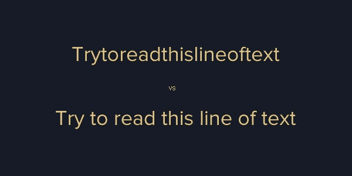
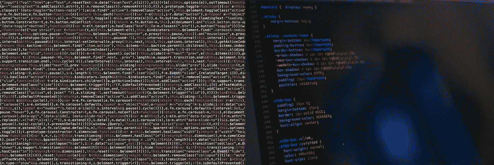
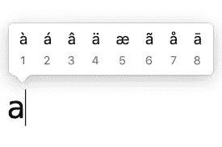
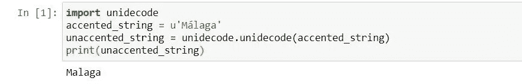
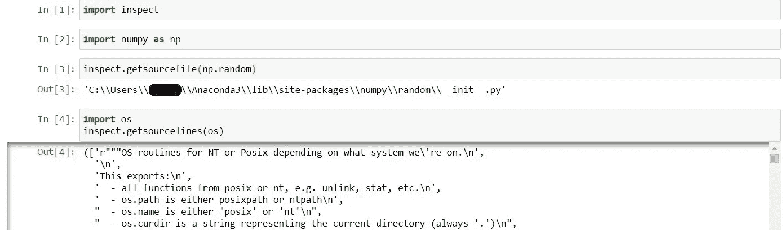
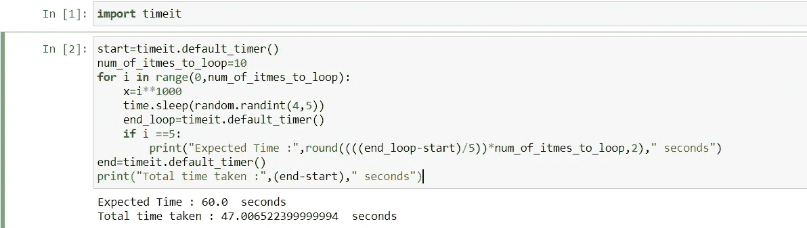

# 关于这 5 个很酷的 Python 库，你需要知道的就是！！！

> 原文：<https://medium.com/analytics-vidhya/all-you-need-to-know-about-these-5-cool-python-libraries-7c1f3618ac94?source=collection_archive---------9----------------------->

通过在 Python 中使用这些简单的库，使您的代码更有效、更具可读性。


本文将向您介绍一些可以下载的库，这些库在您的系统上占用很少的内存。这些库将使您的输出对于非技术背景的人以及其他人来说更具可读性。它可用于向现有代码添加更多功能。

其中一些可以在数据清理过程中使用，有时可以在两个单词之间没有空格的情况下分隔一个单词。其他工具可用于分析/测量每行代码或整个 python 脚本的内存使用情况，以及您希望代码完全执行所需的时间。

# **1。文字忍者**

[](https://pypi.org/project/wordninja/) [## 单词忍者

### 使用基于英语维基百科单字频率的自然语言处理对连接的单词进行概率分割。

pypi.org](https://pypi.org/project/wordninja/) 

这是一个库，用于分隔单词，这些单词之间没有空格。它用于拆分由于错误或系统错误而连接在一起的单词。它主要是将单个单词分成两个单词，这两个单词之间应该用空格隔开。您可以使用以下代码在 python 命令行或 Anaconda 提示符下输入命令来安装该软件包:

```
pip install wordninja
```

以下代码给出了如何使用它的示例代码:

```
import wordninja
wordninja.split('Trytoreadthislineoftext')>>>['Try', 'to', 'read', 'this', 'line', 'of', 'text']
```



样本示例

要了解更多关于这个包的信息，请参考这个 [Github 页面](https://github.com/keredson/wordninja)。

# 2.漂亮的打印机

[](https://pypi.org/project/prettyprinter/) [## 漂亮的打印机

### 文档语法——Python 3.5+的高亮、声明性和可组合的漂亮打印机

pypi.org](https://pypi.org/project/prettyprinter/) 

有没有想过打印一整串包含长句的表格列中的文本，或者打印一个文件中的文本行，或者打印一个 JSON 对象或者其他任何东西，比如长列表、字典、元组等等，它们比一行文本更长，以适合您的屏幕，对其他人来说会是什么样子？

****

**混乱的代码与预期的代码**

**因此，使用 python 中的 **prettyprinter** 包，您可以以可读性更好、格式更好的方式将所有长文本打印到您的控制台上。它们带有内置的语法高亮特性，这使得这个 python 包比其他包更可靠。您可以使用以下命令安装该软件包:**

```
pip install prettyprinter
```

**安装到*后，将 prettyprinter* 导入到我们当前的环境中使用:**

```
from prettyprinter import pprint
```

**例如，使用普通的打印语句打印 *" Hello，All "* 2 **0 次**将如下所示:**

```
>>> print("Hello, All "*20)
Hello, All Hello, All Hello, All Hello, All Hello, All Hello, All Hello, All Hello, All Hello, All Hello, All Hello, All Hello
, All Hello, All Hello, All Hello, All Hello, All Hello, All Hello, All Hello, All Hello, All
```

**当使用 **prettyprinter** 打印相同内容时，会产生以下结果:**

```
>>> pprint("Hello, All "*20)
'Hello, All Hello, All Hello, All Hello, All Hello, All Hello, All '
'Hello, All Hello, All Hello, All Hello, All Hello, All Hello, All '
'Hello, All Hello, All Hello, All Hello, All Hello, All Hello, All '
'Hello, All Hello, All '
```

**要了解更多关于这个包的信息或更多例子，请参考 Github 页面。**

# ****3。未解码****

**[](https://pypi.org/project/Unidecode/) [## 统一代码

### 经常发生的情况是，您有 Unicode 格式的文本数据，但是您需要用 ASCII 表示它。

pypi.org](https://pypi.org/project/Unidecode/) 

你曾经遇到过字母中带有重音的元音字母字符或文本吗？这个库可以用来清理你的数据，并将其转换为标准格式，即 ASCII 标准。



应用于一个字母的不同重音。

使用查找和替换方法(或正则表达式)删除每个字母的重音符号会创建一个很长的可能字符列表，然后也有可能遗漏其中的一些字符！！😓。

相反，使用这个 python 包，我们只需不到三行代码就可以轻松地将文档中的所有文本转换成标准文本！！😉只需使用以下命令进行安装:

```
pip install Unidecode
```

使用以下代码转换字符:

```
accented_string = u'Málaga'
# accented_string is of type 'unicode'
import unidecode
unaccented_string = unidecode.unidecode(accented_string)
# unaccented_string contains 'Malaga'and is of type 'str'
```

在 Jupyter Notebook 中运行上述代码会产生以下结果



第二个字母即 a 的重音已被去掉。

要了解更多关于这个包的信息或更多例子，请参考 [Github 页面。](https://github.com/avian2/unidecode)

# **4。检查**


Evgeni Tcherkasski 在 [Unsplash](https://unsplash.com?utm_source=medium&utm_medium=referral) 上拍摄的照片

这个小 python 包允许您更深入地研究导入的库。这个包是标准 Python 包库的内置模块。这个模块允许你获取模块内部的代码。它提供了各种其他功能，您可以在此处[查看](https://docs.python.org/3.7/library/inspect.html)了解更多详细信息。

> **提示:**你可以用这个来查看核心功能或者一个模块或者子模块的代码，它们类似的模式/工作方式可以用来开发你自己的项目。

您可以按如下方式导入模块:

```
import inspect
```

考虑这个例子，您需要知道一些公式或数学模块的实现，您可以这样来查看:

```
import inspect
import numpy as np>>>inspect.getsourcefile(np.random)Out[1]:'C:\\Users\\MediumUser1\\Anaconda3\\lib\\site-packages\\numpy\\random\\__init__.py'import os
inspect.getsourcelines(os)
```

在 Jupyter Notebook 中运行上述代码会产生以下结果:



检查模块示例

要了解更多关于包或示例的信息，请参考官方[文档页面](https://docs.python.org/3.7/library/inspect.html)。

# 5.时间


索尼娅·兰福德在 [Unsplash](https://unsplash.com?utm_source=medium&utm_medium=referral) 上拍摄的照片

我敢肯定，你们中许多长期使用 python 的人可能会遇到这个库，但是，这是一些提示和技巧，所以这个方法可以用来了解执行一段代码大约需要的时间。这个包还有各种其他的选择，比如时间，日期时间和更多或多或少的附加特性。

您可以这样安装和导入模块:

```
pip install timeit
import timeit
```

让我们用一个简单的例子来说明如何使用它来使你的代码对其他人来说更有信息性和可展示性:

```
start=timeit.default_timer()
num_of_itmes_to_loop=10
for i in range(0,num_of_itmes_to_loop):
    x=i**1000
    time.sleep(random.randint(4,5))
    end_loop=timeit.default_timer()
    if i ==5:
        print("Expected Time :",round((((end_loop-start)/5))*num_of_itmes_to_loop,2)," seconds")
end=timeit.default_timer()
print("Total time taken :",(end-start)," seconds")
```



timeit 示例

要了解更多关于软件包或示例，请参考官方[文档页面](https://docs.python.org/3/library/timeit.html)。

> 感谢您的阅读！
> 
> 请随意添加我可能遗漏的任何内容，或者在下面的评论区询问您的疑问或任何其他建议/意见。
> 
> 我希望你喜欢，请继续关注更多关于数据科学、区块链、量子计算等新技术的故事！！*😄***