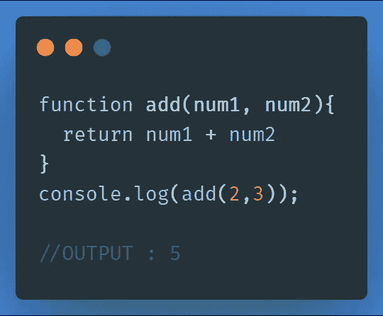
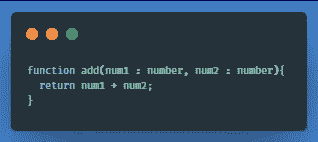
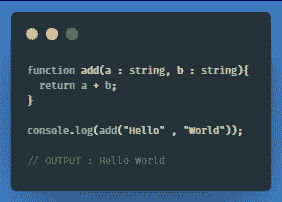
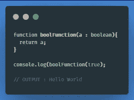
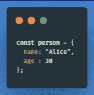
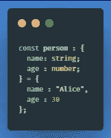
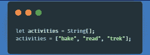

# 关于 TypeScript 的核心类型，您只需要知道。

> 原文：<https://medium.com/analytics-vidhya/all-you-need-to-know-about-typescripts-core-types-e01cd162c6cc?source=collection_archive---------28----------------------->

*当 TypeScript 第一次出现时，它真正改变了我们编写 JavaScript 代码的方式。*

**对于那些不太熟悉打字稿的人来说，这里有一个简单的介绍** *(否则跳过)*:

1.  JavaScript 超集。
2.  一种建立在 JavaScript 之上的语言。
3.  它为 JS 生态系统增加了新的特性和优势，比如“类型”

**不是什么:**

1.  一种“新”语言。
2.  JavaScript 的竞争对手。
3.  TS 不能被浏览器执行，因为为了让浏览器先理解它，它被编译成 JS。因此，它不是像 JS 那样的“浏览器语言”。

那么什么是**【类型】**呢？

嗯，类型是 Typescript 最基本的概念之一，也更容易理解。

假设我们在 JS 中有一个场景，比如:

这是意料之中的事。但是如果我们把 2 和 3 作为字符串(比如`add("2","3")`)而不是数字放进去呢？

**错误？**

没有！不会有任何错误，但是 JavaScript 会简单地连接字符串，我们的输出会是`23`

关键是，我们很容易犯这样的错误，JavaScript 无法解决它，导致意外的错误，难以捕捉！

因此，在这里，Typescript 的“类型系统”进入了画面，它确保我们只能提供某种数据类型(比如只有数字，没有字符串)。

到目前为止，我们在 Typescript 生态系统中总共有大约 7 种核心类型，我们将逐一介绍它们:

1.  ***NUMBER:*** 就像我们之前的“易错代码”一样，我们可以明确地告诉 Typescript，我们希望我们的输入仅仅是数字，而不是使用 ts 文件中语法变化的一些字符串。比如:

注意，我们添加了“num1 : number ”,这个新语法叫做“types ”,它确保我们只能传递数字而不能传递字符串，否则，它会立即抛出一个错误。

2. ***字符串:*** 类似于数字，我们也有一个字符串的“类型”，以防我们只传递字符串而不传递数字。比如:

如果我们将传递数字，它将抛出一个错误！

**3。 *BOOLEAN:*** 我们也可以指定一个 BOOLEAN 类型，以确保我们只传递布尔值，而不传递其他数据类型。

请注意，我们只能将“真”和“假”布尔值传递给布尔类型，而不能传递“真”或“假”值。

**4。*对象:*** 类型系统并不局限于数字和字符串，它还可以处理复杂的结构，比如对象。

假设我们在 JS 中有一个非常简单的对象，比如:

简单的 JS 对象

但是，我们希望确保名称应该始终是一个字符串，年龄应该始终是一个数字，因此我们可以在 TS 中使用对象的类型系统编写此代码，例如:

对象的类型系统

请注意，在上面提到的代码中，TS 是如何通过赋值来确保姓名和年龄只能是特定的数据类型的，然后我们创建了该对象。现在举例来说，如果我们试图给年龄分配一个字符串而不是一个数字，它会抛出一个错误。

5.***数组:*** 走向复杂的类型系统，现在我们有了一个数组，在这里我们可以非常容易地使用类型。

假设我们想确保我们的变量 Activities 无论如何都应该是一个数组，那么我们可以将它分配给一个数组类型，如下所示:

在这里，我们通过将 activities 变量赋给一个“type”字符串来确保它是一个字符串。

所以，这总结了 TypeScript 中所有的核心类型。

如有任何问题/建议，请联系我。

干杯 xx。