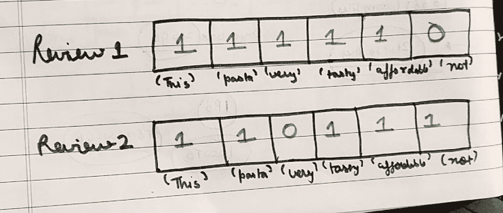

# 自然语言处理你需要知道的！(第一部分)

> 原文：<https://medium.com/analytics-vidhya/all-you-need-to-know-is-natural-language-processing-part-1-18ef6b1d3ba4?source=collection_archive---------15----------------------->

本系列涵盖了 NLP 中的所有内容，我将尝试涵盖 NLP 中的每个主题、每个问题，比如，**我们为什么需要 NLP？NLP 中的所有预处理步骤，词干化，词条化，词袋，Tf_Idf，词到向量，平均词到向量，Tf_Idf 词到向量最后可能是 BERT。**

伯特没有承诺，但除了这一系列文章将彻底涵盖一切。

## 让我们从最基本的问题开始，为什么我们需要 NLP？

典型的 NLP 任务是机器翻译(语言翻译)、文章写作、检查语法、文本分类。

让我给你一个非常基本的真实世界的例子来澄清 NLP 背后的概念，假设你是 AMAZON.COM 的一名数据科学家，你的任务是建立一个模型，对正面评论和负面评论进行分类。

所以基本上如果一个人写了一篇新的评论，我们的模型将能够分类它是积极的还是消极的。

这是一个文本分类的例子。

因此，作为一名数据科学家，你的工作是建立一个模型，而为了建立一个模型，你需要数据，所以假设你从亚马逊数据仓库获得数据，我们将学习在建立文本分类器时你可以使用的所有技术，我们将试图理解为什么特定的技术在特定的情况下是有用的。

## 在这个 NLP 系列中，我的整个目标是给你关于 NLP，关于数据科学家面临的实际现实世界问题，关于我们在 NLP 中使用的所有技术的最佳说明，所以不要担心编码部分，相信我，一旦你得到了整个想法，编写代码将非常容易，非常非常容易。

在这个系列的最后，我会告诉你为什么我不关心编码部分。

因此，要建立任何机器学习模型，有几个步骤，

1.  **数据收集**(我们假设从亚马逊数据仓库获取)。
2.  **数据预处理**

当我们处理“文本”时，这涉及到一些非常有趣的想法，

**A .标记化** -这个预处理步骤背后的想法非常简单，假设我们有一个句子，**“卡卓尔是一个非常漂亮的女孩”，**

那么什么叫标记化呢，就是把一个句子里的每一个单词都拆分，比如**【“卡卓尔”、“是”、“一个”、“非常”、“漂亮”、“姑娘”】**

**B .标准化** -假设在写评论时，一个人写 5 秒为“5 秒”，另一个人写 5 秒为“5 s”，我们知道两者是同一件事，因此为了简化模型，我们只标准化一件事，假设 5 秒< s >。

**C .替换** -有时我们需要替换一些单词，这个预处理步骤取决于我们正在处理的数据类型。

**D. Case Folding(小写)** -为了使模型简单，我们通常将评论或文本折叠成小写。

词汇化和词干化是非常重要的步骤，我知道很多人会混淆这两个术语，尽管它们非常简单。

**词干化和词汇化**都生成词根变化的单词。不同之处在于**词干**可能不是一个真实的单词，而 lemma 是一个真实的语言单词。**词干提取**遵循一种算法，通过对单词执行步骤来加快速度。

## 词干的例子是，学习变成学习，学习变成学习

## 词汇化的例子是，学习变成学习，学习变成学习

删除拼写错误的单词，我认为这是不言自明的。

**I .停用词移除** -有些词对评论的意义没有任何价值，如“是”、“和”、“到”等。所以我们从文档中删除了这些单词。

这是一些预处理技术。

现在到了重要的部分，我们需要将“文本”转换成“向量”，我们有一些漂亮的技术，比如:-

1.  TF_IDF
2.  一袋单词
3.  词到向量
4.  平均词向量比
5.  TF_IDF 字到向量

我们将涵盖每一种技术，并了解为什么一种技术不足以将“文本”转换为“矢量”。

## 单词袋(蝴蝶结)

[tf1，tf2，tf3…的集合。tfn]被称为单词包，其中 tf 是术语频率或者是包中特定单词的计数，例如，如果“优秀”在文档中出现 20 次，则其 tf(术语频率)通常将是 20。

不总是 20，当它不是 20 的时候我们会看到。

举个例子，我们有两个评论

**点评 1-这种意大利面非常好吃，而且价格实惠。**

**点评 2-这种面食不好吃，也买不起。**

现在我们来看看 BOW 是如何工作的

第一步-制作一本字典，从所有的评论中收集所有独特的单词

例- {'this':2，' pasta':2，..

。以此类推}“2”在这里表示在所有评论中“这个”出现了多少次

假设我们有 d 个独特的单词。

步骤 2-创建向量/构建一个长度为“d”的向量，比如复习 1 和复习 2

每个数字是它在回顾 1 中出现的频率，所以“this”出现一次，这就是为什么“1”，

如果一个单词会出现两次，那就是“2”。

我提醒你，“每个字都是不同的维度”。因此，对于 4 篇评论，我们将有 4 个向量，这意味着对于“d”文档，有“d”个向量。

## 现在，我们希望相似的文本必须导致更接近的向量，然后只有它将能够正确地分类文本。

这意味着，假设向量 **v1 代表“食物是美味的”**，向量 **v2 代表“食物是美味的”**，那么 v1 和 v2 之间的距离必须很小。

假设向量 **v3 代表“食物不好吃”，**现在 v1 和 v3 之间的距离一定很大。

## 让我们检查一下…

这种意大利面非常好吃，而且价格实惠。

**点评 2——这种面食不好吃，而且价格实惠。**

现在，两个评论中唯一的区别是“不是”，但它们不应该是相近的向量，因为评论 1 与评论 2 相矛盾。

**将评论转化为矢量**

**计算向量之间的距离**

所以√2 不是一个好的距离，没有我们预期的远，距离一定很大。

这就是弓的局限性

## **弓的限制**

1.  当句子有小的变化时，BOW 不能很好地工作。
2.  BOW 不考虑单词的相似性

所以基本上“好吃”和“美味”是几乎相同的词，所以必须有相同的向量，但 BOW 并不保证所有的。

## **二元弓**

现在，如果我们只把“1”放在一个特定的单词存在的地方，把“0”放在一个单词不存在的地方，而不是计算单词的频率，这就是单词的二进制包。

示例-

D1-“我知道英语和数学”

D2-“我懂英语、python 和 java”

如果我们创建一个所有单词的向量，我们会得到这个。

现在让我们研究一些有趣的话题…

## UNIGRAM

每个单词都被视为一个维度。

## 二元模型

每个维度都有一对词。

## 三线形

每个维度有三个词。

从上面的例子中，我认为 unigram、bigram 和 trigram 之间的区别很明显。

**我们为什么要谈论“N”克？**

Unigram BOW 完全丢弃序列信息。理解整个句子而不知道单词的顺序是不公平的。

一系列的单词比一个特定的单词更能让你理解一个句子。

二元模型、三元模型、n 元模型保留了一些序列。

## **但是 N 克还是有一个主要的限制**

如果你观察，你会发现双字母组的数量多于单字母组的数量，这是因为在双字母组中，一个单词重复出现两次，而在单字母组中，一个单词只出现一次。

当我们增加 N gram 中的“N”时，维数增加。

**文字袋代码**

bow 的代码非常简单，Scikit learn 为我们提供了一个非常有用的库，称为 CountVectorizer

**它将把一组文本文档转换成一个令牌计数矩阵**

## **简单的鞠躬**

***count _ vect = count vector izer()***

***final _ count = count _ vect . fit _ transform(点评['text '。*值)**

## **带 N 克的弓**

***count _ vect = count vectorizer(n _ gram =(1，2)#这是针对 bigram***

***final _ count = count _ vect . fit _ transform(点评['text '。值])***

由于这个 n 元，矩阵的维数会大大增加。

## 对于二元弓

***count _ vect = count vectorizer(n _ gram =(1，2)，Binary = ' TRUE ')# Binary bow for bigram***

如果这对你来说太难了，不要担心，我们将做一个简单的项目，我们将看到所有细节，我们将看到为什么我们不必担心代码。

在本文中，我们完成了 BOW，并了解了 BOW 的局限性，即 ***BOW 不考虑单词之间的相似性*** ，为了解决这个问题，研究人员引入了一些漂亮的概念，如 W2V(单词到向量)。

**在下一篇文章中，我们将讨论 Tf_idf、W2V、平均 W2V、TF_IDF W2V 等。**

感谢阅读…