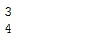

# 关于 Python 和 Pandas 中的日期时间变量，您应该知道的是

> 原文：<https://medium.com/analytics-vidhya/all-you-should-know-about-datetime-variables-in-python-and-pandas-d1081b65668f?source=collection_archive---------25----------------------->

# 数据科学中复杂而强大的日期时间世界

我仍然记得我在学习 Python 时遇到的第一个 DateTime 变量。这是一个电子商务项目，我必须弄清楚供应链——订单发货所需的时间，订单交付所需的天数等。从数据科学的角度来看，这是一个非常有趣的问题。

问题是——我不熟悉如何提取和使用 Python 中的日期和时间组件。

DateTime 特性增加了复杂性，这是一个数字变量中没有的额外层。掌握这些日期时间特性将有助于您成为一名更好(更高效)的数据科学家。绝对是帮了我大忙！

日期和时间特性在数据科学项目中无处不在。想想看，它们是有价值信息的丰富来源，因此，可以对手头的任何数据集提供一些深刻的见解。此外，当我们执行特征工程时，它们所提供的灵活性是无价的！

在本文中，我们将首先看看如何用 **Python 的 *DateTime* 模块**处理日期和时间特性，然后我们将探索 **Pandas 的**功能来实现同样的功能！

注意:我假设你熟悉 Python 和 Pandas 库。如果没有，我强烈推荐参加下面的免费课程:

*   [*用于商业分析和数据科学的 Python*](https://courses.analyticsvidhya.com/courses/python-data-science-course?utm_source=blog&utm_medium=datetime-variables-python-pandas)
*   [*用 Python 进行数据分析的熊猫*](https://courses.analyticsvidhya.com/courses/pandas-for-data-analysis-in-python?utm_source=blog&utm_medium=datetime-variables-python-pandas)

# 目录

I)日期-时间部分的重要性

ii)在 Python 中处理日期

iii)在 Python 中处理时间

iv)Python 中的日期时间

*   更新旧日期
*   从日期时间中提取工作日
*   这是星期几？
*   闰年不闰年？用日历！
*   不同的日期时间格式
*   使用 Strptime & Strftime 的高级日期时间格式
*   时间增量

v)熊猫的日期时间

*   熊猫中的 DateTime 和 Timedelta 对象
*   熊猫的日期范围
*   在 Pandas 中创建日期时间要素

# 日期-时间组件的重要性

值得重申的是，日期和时间是信息的宝库，这也是数据科学家如此喜爱它们的原因。

在我们深入文章的核心之前，我想让你亲自体验一下。看看现在的日期和时间。试着想象你能从中提取的各种信息，了解你的阅读习惯。年、月、日、小时和分钟是常见的疑点。

但是如果你再深入一点，你就可以确定你是更喜欢在工作日还是周末看书，你是一个早起的人还是一个夜猫子(我们在这里是一条船上的！)，或者说你是不是积累了所有月底要看的有趣文章！

显然，如果你在收集数据一段时间后，比如一个月，重复这个练习，这个列表会继续下去，你会逐渐了解你的阅读习惯。现在想象一下，在长时间收集信息的真实场景中，这个特性会有多有用。

日期和时间功能在数据科学问题中非常重要，这些问题涉及从销售、营销和金融到人力资源、电子商务、零售等多个行业。预测明天的股票市场将如何表现，在接下来的一周将售出多少产品，何时是推出新产品的最佳时间，公司的一个职位多久会被填补，等等。使用日期和时间数据，我们可以找到一些问题的答案。

您可以从数据中发现的难以置信的洞察力使日期和时间组件变得如此有趣！因此，让我们开始掌握 Python 中的日期时间操作。

# 在 Python 中处理日期

Python 的 [**DateTime**](https://docs.python.org/3/library/datetime.html#module-datetime) 模块中的 **date** 类处理公历中的日期。它接受三个整数参数:年、月和日。让我们来看看它是如何做到的:

您可以看到创建一个 **datetime** 类的日期对象是多么容易。从日期中提取日、月、年等特征甚至更容易。这可以使用**日**、**月**和**年**属性来完成。我们将看到如何在当前的本地日期对象上实现这一点，我们将使用 **today()** 函数创建该对象:

# 在 Python 中处理时间

[**time**](https://docs.python.org/3/library/datetime.html#datetime.time) 是 DateTime 模块的另一个类，它接受最长为微秒的整数参数，并返回一个 DateTime 对象:

您可以使用各自的属性从时间对象中提取类似于**小时**、**分钟**、**秒**和**微秒**的特征。这里有一个例子:

这只是冰山一角。在 Python 中，我们可以利用 DateTime 特性做更多的事情，这就是我们将在下一节讨论的内容。

# Python 中的日期时间

到目前为止，我们已经看到了如何使用 DateTime 模块创建日期和时间对象。但是 DateTime 模块的美妙之处在于它允许您将这两个属性结合到一个对象中， **DateTime** ！

[**datetime**](https://docs.python.org/3/library/datetime.html#datetime.datetime) 是 Python 的 *DateTime* 模块中的一个类和对象，就像日期和时间一样。参数是日期和时间属性的组合，从年开始，以微秒结束。

那么，让我们看看如何创建一个**日期时间**对象:

或者您甚至可以使用 **now()** 方法在本地日期和时间创建一个对象:

您可以继续从 DateTime 对象中提取您想要的任何值，方法是使用我们分别用于 date 和 Time 对象的相同属性。

接下来，让我们看看 DateTime 类中的一些方法。

# 更新旧日期

首先，我们将看到如何使用 **date()** 和 **time()** 方法将日期和时间从 DateTime 对象中分离出来。但是您也可以使用 **replace()** 方法替换 DateTime 对象中的值，而不必更改整个日期:

# 日期时间中的工作日

用 DateTime 函数可以做的一件很酷的事情是提取一周中的某一天！这在特征工程中特别有用，因为目标变量的值可能依赖于一周中的某一天，例如产品的销售通常在周末较高，或者在人们工作的工作日，StackOverflow 的流量可能较高，等等。

**weekday()** 方法返回一周中某一天的整数值，其中星期一为 0，星期日为 6。但是如果您希望它返回 1 到 7 之间的工作日值，就像在现实世界中一样，您应该使用 **isoweekday()** :

# 这是星期几？

好吧，你知道星期几，但是你知道今天是一年中的第几周吗？这是另一个非常重要的特性，您可以从数据集中的给定日期生成。

有时，目标变量的值在一年中的某些时候可能会更高。比如假期，电商网站上的产品销量普遍较高。

通过对由 **isocalendar()** 方法返回的值进行切片，可以得到一年中的星期:

# 闰年不闰年？使用日历！

想查一下是不是闰年？您需要使用来自 [**日历**](https://docs.python.org/3/library/calendar.html#module-calendar) 模块的 **isleap()** 方法，并将年份作为属性传递:

恭喜你——你生活在闰年！额外的一天你做了什么？哦，你错过了？放心吧！这个月花一天时间做你喜欢的事情吧！但是你要去哪里？你的日历就在这里！

这个月没空？您可以查看全年的日历:

很酷，对吧？明智地规划你的一年，抽出一些时间做你喜欢的事情！

# 日期时间格式

**日期时间**模块允许您在几个选项之间交换日期时间的格式。

首先是 ISO 格式。如果您想从 ISO 格式的日期的字符串形式创建 DateTime 对象，请使用 **fromisoformat()** 方法。如果你打算反过来做，使用 **isoformat()** 方法:

如果想将 DateTime 转换成字符串格式，可以使用 **ctime()** 方法。这将返回字符串格式的日期。如果您想从中提取日期，那么您必须使用切片:

如果这些函数都不符合您的要求，您可以使用 **format()** 方法，该方法允许您定义自己的格式:

等等，我传递给函数的参数是什么？这些被称为格式化字符串代码，我们将在下一节详细讨论它们。

# 使用 Strptime & Strftime 的高级日期时间格式

这些函数非常重要，因为它们允许您显式定义 DateTime 对象的格式。这可以为您处理日期时间特性提供很大的灵活性。

**strptime()** 从表示日期和时间的字符串创建 DateTime 对象。它需要两个参数:日期和日期呈现的格式。请看下面:

你可以像我上面做的那样使用格式化代码来定义格式。有许多格式化代码，你可以在[文档](https://docs.python.org/3/library/datetime.html#strftime-and-strptime-format-codes)中查看。

另一方面，**STFT time()**方法可用于将 DateTime 对象转换为表示日期和时间的字符串:

但是您也可以从 DateTime 对象中提取一些重要的信息，如星期名称、月份名称、周数等。正如我们在前面几节中看到的那样，这在特性方面非常有用。

# 时间增量

到目前为止，我们已经了解了如何创建 DateTime 对象以及如何对其进行格式化。但有时，您可能需要找到两个日期之间的持续时间，这是您可以从数据集获得的另一个非常有用的功能。然而，这个持续时间作为一个 [**时间增量**](https://docs.python.org/3/library/datetime.html#datetime.timedelta) 对象返回。

如您所见，持续时间以日期的天数和日期之间的秒数返回。因此，您实际上可以为您的要素检索这些值:

但是，如果您真的想要以小时或分钟为单位的持续时间呢？嗯，有一个简单的解决办法。

**timedelta** 也是 DateTime 模块中的一个类。所以，你可以用它来把你的持续时间转换成小时和分钟，就像我下面做的那样:

现在，如果你想得到 5 天后的日期呢？你只是在现在的日期上加 5 吗？

不完全是。那么你该如何着手呢？你当然使用时间增量！

timedelta 使得从 DateTime 对象中加减整数成为可能。

# 熊猫的日期时间

我们已经知道 [Pandas](https://www.analyticsvidhya.com/blog/2016/01/12-pandas-techniques-python-data-manipulation/?utm_source=blog&utm_medium=datetime-variables-python-pandas) 是一个很棒的用于数据分析任务的库。因此不言而喻，Pandas 也支持 Python 日期时间对象。它有一些处理日期和时间的好方法，比如 **to_datetime()** 和 **to_timedelta()** 。

# 熊猫中的 DateTime 和 Timedelta 对象

**to_datetime()** 方法将字符串格式的日期和时间转换为 datetime 对象:

你可能已经注意到这里有些奇怪的东西。to_datetime()返回的对象类型不是 datetime 而是 Timestamp。好吧，别担心，这只是熊猫版的 Python 的 DateTime。

我们已经知道 timedelta 给出了时间上的差异。Pandas **to_timedelta()** 方法就是这样做的:

这里，单位决定了参数的单位，无论是日、月、年、小时等等。

# 熊猫的日期范围

为了方便创建日期序列，Pandas 提供了 **date_range()** 方法。它接受开始日期、结束日期和可选的频率代码:

您可以定义要生成的期间或期间数，而不是定义结束日期:

# 在 Pandas 中创建日期时间要素

让我们也创建一系列结束日期，并创建一个虚拟数据集，从中我们可以派生出一些新的特性，并使我们对日期时间的了解取得成果。

完美！因此，我们有一个包含开始日期、结束日期和目标变量的数据集:

我们可以从日期列创建多个新特性，如日、月、年、小时、分钟等。使用如下所示的 **dt 属性**:

我们的持续时间特性很棒，但是如果我们想要以分钟或秒为单位的持续时间呢？还记得在 timedelta 部分我们是如何将日期转换成秒的吗？我们可以在这里做同样的事情！

太好了！你能看到我们根据日期创造了多少新功能吗？

现在，让我们将开始日期作为数据帧的索引。这将有助于我们轻松地分析数据集，因为我们可以使用切片来查找表示所需日期的数据:

厉害！当你想做可视化或任何数据分析时，这是非常有用的。

# 结束注释

我希望这篇关于如何用 Python 和 Pandas 操作日期和时间特性的文章对您有用。但是没有实践，一切都是不完整的。使用时间序列数据集是实践我们在本文中学到的知识的一种很好的方式。

我推荐参加在 [DataHack 平台](https://datahack.analyticsvidhya.com/contest/all/?utm_source=blog&utm_medium=datetime-variables-python-pandas)上举办的[时间序列黑客马拉松](https://datahack.analyticsvidhya.com/contest/practice-problem-time-series-2/?utm_source=blog&utm_medium=datetime-variables-python-pandas)。你可能想先浏览一下[这篇](https://www.analyticsvidhya.com/blog/2016/02/time-series-forecasting-codes-python/?utm_source=blog&utm_medium=datetime-variables-python-pandas)和[这篇](https://www.analyticsvidhya.com/blog/2018/09/multivariate-time-series-guide-forecasting-modeling-python-codes/?utm_source=blog&utm_medium=datetime-variables-python-pandas)文章，以便为那次黑客马拉松做准备。

# 你也可以在分析 Vidhya 的 Android 应用上阅读这篇文章

*原载于 2020 年 5 月 5 日 https://www.analyticsvidhya.com***。**