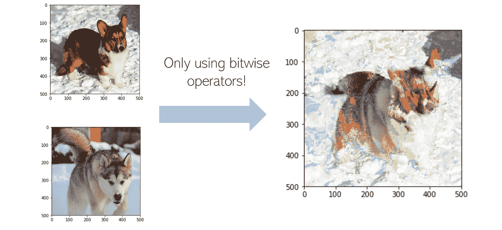

# 使用 Python 按位运算符更改和合并照片

> 原文：<https://medium.com/analytics-vidhya/altering-merging-photos-with-python-bitwise-operators-aedb3fc8b3db?source=collection_archive---------6----------------------->

## 让我们以有趣的方式学习按位运算符

现在有很多照片编辑工具，但是如果我们设法用最基本的操作来执行一些相同的操作，那不是很有趣吗？毕竟，一个小操作可以走很长的路，如果我们把它应用到每个像素。按位运算符很少用在常规的…