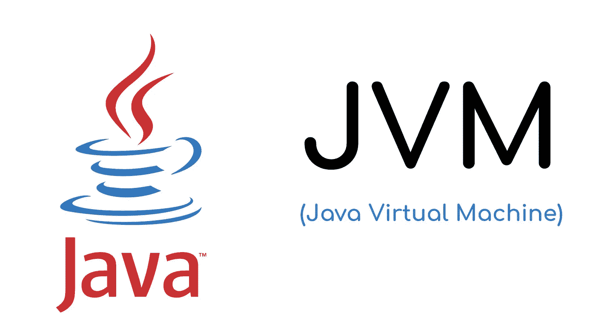
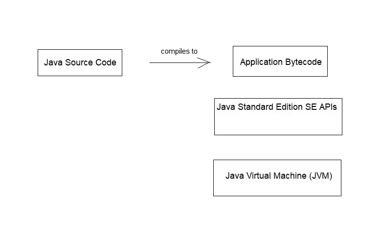

# JVM 的替代编程语言

> 原文：<https://medium.com/analytics-vidhya/alternatives-programming-languages-for-jvm-faf7db35a307?source=collection_archive---------29----------------------->

# 什么是 Java 虚拟机？

Java 虚拟机是一种虚拟机，它使计算机能够运行 Java 程序以及用其他语言编写的程序，这些程序也被编译成 Java 字节码。

现在问题来了，Java 虚拟机如何运行用其他语言写的程序？让我们借助图表来研究一下这个问题。

**Java 虚拟机概念**

# JVM 的替代编程语言

用 java 编写的源代码在 java 编译器的帮助下被编译成应用程序字节码。字节码然后在由标准库和 java 虚拟机组成的 Java 运行时中运行。

现在从图中我们可以看到，图的右手边和左手边是紧密联系在一起的。但事实是，图的右边，运行时栈，能够运行字节码，不管这个字节码来自哪里。大多数字节码是从 java 源代码编译而来的，但是人们开始创造 java 语言的替代品，可以编译成 java 字节码，因此可以在相同的虚拟机上运行。

用于获取 java 字节码的最常用的替代编程语言:

1.  斯卡拉
2.  绝妙的
3.  科特林

尽管这些是具有不同编译器的不同编程语言，但是编译用这些语言编写的源代码会产生可以在 Java 虚拟机上运行的相同字节码。这些语言可以利用 Java 标准库，也可以利用 Java 虚拟机的优势，比如速度和安全性。

# **选择其他 JVM 语言的原因**

当 java 是平台的主要语言时，JVM 选择 java 以外的编程语言的原因是什么？这背后的一些原因:

1.  生产力: Java 是一种已经发展了二十年的编程语言，我们也知道 Java 是为可读性而优化的。有些人相信更切题的编程语言，这样团队使用这些语言会更有效率。
2.  *熟悉度:*不是每个人都知道如何用 java 语言编程。还有各种现有的语言，如 Python 和 Ruby，也有与 Java 相同的实现。在这种情况下，了解这些语言的人可以了解这些语言的 JVM 版本，如 JPython 和 JRuby，而无需学习新的编程语言。
3.  *不同的编程范例:*不仅面向对象编程语言越来越出名，函数式编程也越来越流行。还有其他几种编程语言也采用了新的编程范式。

这些是人们在 Java 虚拟机中选择替代语言的一些原因。当人们不想用 java 语言编码时，他们可以选择不同的语言而不是改变平台。也因为这些可供选择的 JVM 语言和它们的思想，java 也做了很多改变。

# 一些可选的 JVM 语言

让我们简单看一下三种主要的 JVM 替代语言:

1.  *Groovy*

Groovy 是一种广泛使用的 JVM 替代语言。它是一种用于 JVM 的动态脚本语言，这意味着用 groovy 编写的代码在运行时被解释，而不是预先编译。Groovy 类似于 Python 和 Ruby 编程语言。然而，您也可以使用 groovy 编译器以字节码的形式编译 groovy 代码。由于在运行时解释 groovy 代码非常慢，因此编译代码通常会带来更好的性能。

正如我们所知，Java 是静态类型语言，这意味着，我们必须为我们在代码中使用的所有参数提供类型。然而，在 groovy 中我们不需要提供所有这些，这使得语言更加动态。后来，groovy 得到了一个*选择加入类型系统*，在这个系统中，开发者可以选择向代码添加类型注释，然后 groovy 编译器可以使用这些注释在编译时找出代码中与类型相关的问题。

groovy 语言在这一点上比 java 更加 T4，但是语法与 java 非常接近。

2. *Scala*

Scala 是一种结合了面向对象编程语言和过程编程语言的编程语言，Scala 是一种与 java 截然不同的语言。Scala 提供了函数式编程特性和高级面向对象编程语言特性。

Scala 是编译语言，Scala 编译器将 Scala 源代码编译成 Java 字节码。Scala 和 Java 一样是静态类型语言。尽管 Scala 拥有比 Java 更广泛的类型系统，以支持函数式编程特性和高级面向对象特性。

用于并发的 Akka(是一个免费的开源工具包和运行时，简化了 JVM 上并发和分布式应用程序的构建)库和用于大数据处理的 Apache Spark 库都是用 Scala 编写的。

凭借其高级的面向对象特性和函数式编程特性，Scala 非常适合使用。但是，另一方面，Scala 也被认为是复杂的，因为编译器在一些较大的代码库上可能会非常慢，这是由该语言的特性决定的。

3.*科特林*

Kotlin 是在 Scala 之后出现的，也是 JVM 语言集的新成员。Kotlin 由 Jetbrains(创建 IntelliJ，java IDE 的同一家公司)开发，并得到 Google 的支持。

Kotlin 不像 java 那样依赖于向后兼容性(指的是一个硬件或软件系统可以成功地使用来自系统早期版本或其他系统的接口和数据),所以开发人员只能从 JVM 中选择最好的想法。Kotlin 可与 java 互操作，这意味着，只要两个 Java 和 kotlin 文件同时存在，它们就可以彼此共享数据。

Kotlin 源代码不仅可以编译成 java 字节码，还可以编译成可以在浏览器上运行的 JavaScript 代码。

这三种是最常用的备选 JVM 语言，还有几十种语言可供选择。