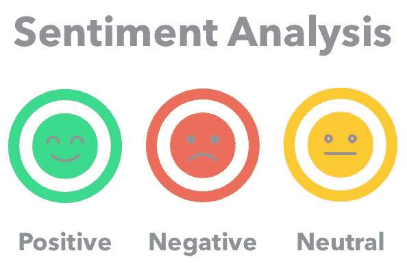
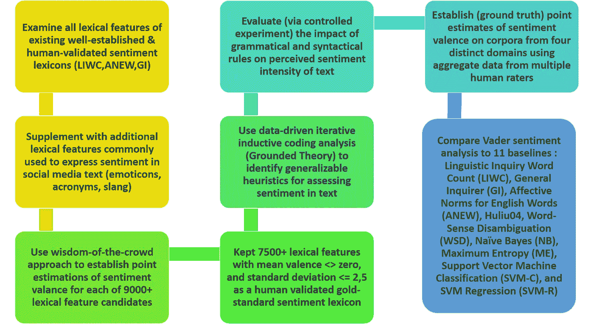
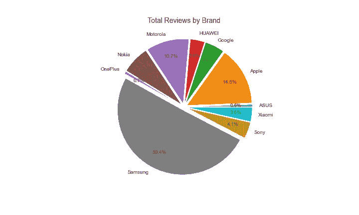
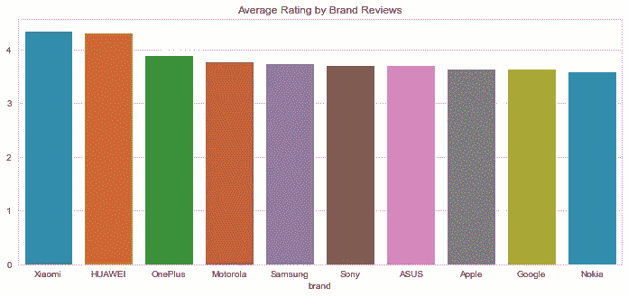
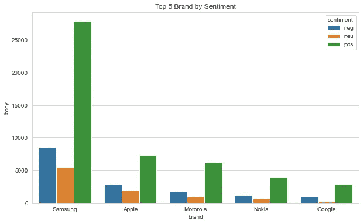
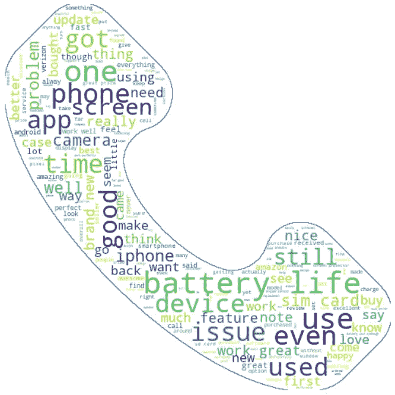
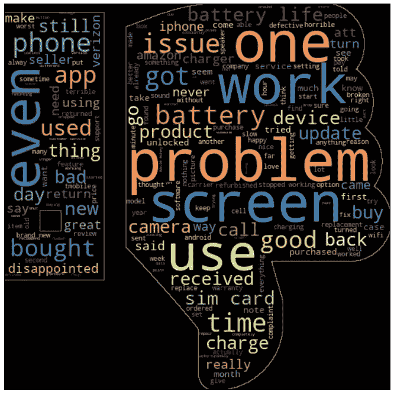

# 使用 Vader 分析的亚马逊手机评论

> 原文：<https://medium.com/analytics-vidhya/amazon-cell-phone-reviews-with-vader-analysis-444bc95d3daa?source=collection_archive---------6----------------------->

大家好！我想分享一下情感分析。这次我将尝试使用 NLTK(自然语言工具包)上的一个强大的软件包，它就是 vader 分析。在我们开始分析之前，让我们看看为什么我们需要情绪分析。

## 情感分析

情感分析是使用文本分析从互联网和各种社交媒体平台获取各种数据源的过程。情感分析的目的是从文本中获得一些洞察力，例如。评论、推文、新闻描述等等。

每一天，互联网都被来自不同来源的数百万条数据淹没。情感分析是连接整个数据的非常重要的工具。这意味着，公司将有效地从用户或消费者那里获得许多投入。

> 大多数情感分析方法采取两种形式中的一种:基于极性，其中文本片段被分类为正面或负面，或者基于价，其中考虑了情感的强度。例如，单词“good”和“excellent”在基于极性的方法中会被视为相同，而在基于化合价的方法中，“excellent”会被视为比“good”更积极。

情感分析是自然语言处理(NLP)的一个领域，它建立了一个识别和提取文本形式的观点的系统。当我们使用情感分析时，以前是非结构化的信息将被转换成更加结构化的数据。

在我们了解了一般的情绪分析之后，我们进入 **vader** 。如果你是《星球大战》的超级粉丝，维德对你来说并不陌生，那就是**达斯·维德。**但我们不谈论这个。LOL。

## 维德分析

> **VADER**(**V**alence**A**ware**D**ictionary and s**E**entiment**R**easoner)是一款基于词汇和规则的情感分析工具，专门针对社交媒体中表达的情感。它在麻省理工学院的许可下是完全开源的

这背后的原因是 VADER 对情绪的极性(情绪是积极的还是消极的)和强度(情绪是积极的还是消极的)都很敏感。VADER 考虑到这个因素，给这个词提供了一个配价分数。

VADER 的开发者使用亚马逊的机械土耳其人来获得他们的大部分评分，你可以在他们的 Github 页面上找到完整的细节。

Vader 分析的方法和过程途径

vader 分析的结果有 4 个分数，分别是阴性、阳性、中性和复合分数。通过将词典中每个单词的 [**化合价得分**](https://github.com/cjhutto/vaderSentiment/blob/master/vaderSentiment/vader_lexicon.txt) 相加，根据规则进行调整，然后归一化到-1(最极端的负面)和+1(最极端的正面)之间，从而计算出复合得分。如果你想对一个给定的句子进行单一的一维情感测量，这是最有用的度量。称之为“标准化加权综合得分”是准确的。

> 正面情绪:综合得分≥ 0.05
> 中性情绪:综合得分> -0.05，综合得分< 0.05
> 负面情绪:综合得分≤ -0.05

VADER 利用某些规则来将每个子文本对句子级文本中情感感知强度的影响结合起来。这些规则被称为启发式规则。他们有 5 个人。

*   标点

即感叹号(！)，在不修改语义方向的情况下增加强度的大小。比如:“产品太棒了！！!"比“产品很棒”更强烈

*   资本化

特别地，在存在其他非大写单词的情况下，使用全大写来强调情感相关的单词，增加了情感强度的大小，而不影响语义取向。比如:“产品很棒。”传达比“产品很棒”更强烈的信息

*   程度修饰符

(也称为强化词、助词或程度副词)通过增加或减少情绪强度来影响情绪强度。比如:“产品极其伟大。”比“产品不错”更强烈，而“产品还不错。”降低强度。

*   合取导致的极性转换

对比连词“but”标志着情感极性的转变，连词后面的文本情感占主导地位。例如:“这里的产品很棒，但服务很糟糕”有着复杂的情绪，后半部分决定了总体评级。

*   捕捉极性否定

通过检查情感丰富的词汇特征之前的 3 个项目的连续序列，我们抓住了近 90%的否定翻转文本极性的情况。例如，一个否定的句子会是“这里的产品并不真的那么好。”。

第 5 点清楚地表明，维德分析将是伟大的建模。因为模型可能是**处理**一个**否定的句子**，比如“这个产品还不错”。这些句子看起来像否定词，因为这些句子有一个**“坏”**，但是在 vader 分析中这个问题被解决了。

## 亚马逊手机评论

这个数据集来自亚马逊上的报废，但我没有。我从 [**kaggle 得到这个数据集。**](https://github.com/grikomsn/amazon-cell-phones-reviews) 总的来说，这些数据是关于手机销售的评论，我们从中获得了许多信息。来自客户的评论将显示每一行的信息品牌手机是它。所以，这将会给我们更深入地分析这些数据。在我们开始分析之前，让我们写一些代码来为情感分析建立模型。

维德情绪分析器

现在，我们有了每个评论的标签！如果需要，您可以使用*“文本预处理”*功能。但是，在 vader 中，它将被解决，并给出一些更好的分数来给出评论或数据，这些数据将被分类为正面、负面或中性评论。

## 探索性数据分析

在最后一节中，我们尝试分析 vader 分析的结果。让我们进入该数据集的 EDA。

用户对亚马逊手机销售的总评论频率

用户对亚马逊手机销售的平均评分

我们有一半数据评论由**三星品牌(50.4%)**主导，我假设亚马逊网站上有这么多用户购买三星品牌，因为你可以在你的账户购买产品时写评论。从第二张图中我们知道，在平均评分高于 4 的**品牌中，评价排名前 2 的是 **Xiamoi** 和**华为**品牌。但是，当我们在这个数据上与两大品牌相比时，他们没有太多评论(从总评论来看)**三星**和**苹果**品牌的平均评分仅在 3 分以上。让我们看看每个品牌的前 5 名总评论(通过频繁评论)的评论。**

使用 Vader 分析按阶级情绪划分的前 5 名品牌。

正如我们在图表上看到的，三星品牌比竞争对手有更高的正面评价，因为他们在亚马逊上有很高的评价。一般来说，负面评价的平均综合得分**为 0.51，正面评价**的平均综合得分**为 0.68。这意味着该模型分为负面、中性或正面评论的良好标签。**

正面评论的词云

负面评论的词云

**结论**

从这个词云中，我们可以总结出一些有趣的负面或正面的评论。它们在两个词云中有相同的词是 ***【续航】*** 和 ***【屏幕】*** 。我假设，这两个词可以表示否定和肯定。让我们试一个例子，在正面评价中 ***【电池寿命】*** word 给我们提供了关于这款产品的电池寿命是好还是坏的信息。

Vader 的整体分析在这次分析中表现良好。有了标签就可以更深入的分析评论了。这些标签也为我们的产品开发、维护和更多行动提供了指导。我认为*‘消费者之声’*(我在 *bahasa* 里叫的是 *suara konsumen* ，LOL)很重要，给我们一个反馈。这不仅仅是来自产品，还可能是我们的服务、运输产品或任何有关客户满意度的东西。

以上都是我的看法，希望大家能对这个数据集有所感悟。我所做的每一项分析仍然有许多错误和缺点。这种分析一点也不完美，我也不擅长做业务开发、产品经理或建立产品意识之类的事情。我认为对你的产品进行几周的评论会给你信息，消费者需要什么。也许这个分析会成为你的参考之一。

关于这个数据的更多细节，代码，和更多的可视化你可以通过点击这个链接到达我的 github[https://github.com/Anugrahn](https://github.com/Anugrahn)。随便问，让我们开始讨论家伙！

谢谢，我希望你们喜欢它。下一个故事再见。祝您愉快！:)

来源:

数据集来源:[https://www.kaggle.com/grikomsn/amazon-cell-phones-reviews](https://www.kaggle.com/grikomsn/amazon-cell-phones-reviews)

感谢本网站[https://blog.quantinsti.com/vader-sentiment/](https://blog.quantinsti.com/vader-sentiment/)的精彩分享