# Amazon.com 与机器学习(上)

> 原文：<https://medium.com/analytics-vidhya/amazon-com-and-machine-learning-part-1-40b9d6421359?source=collection_archive---------12----------------------->

在这里，我们将解决一个基于亚马逊美食评论的分类问题。

## 目标:

对于给定的审核，确定该审核是正面的(评分为 4 或 5)还是负面的(评分为 1 或 2)。

数据来源:[https://www.kaggle.com/snap/amazon-fine-food-reviews](https://www.kaggle.com/snap/amazon-fine-food-reviews)

**亚马逊美食点评数据集由来自亚马逊的美食点评组成。**

评论数:568454
用户数:256059
产品数:74258
时间跨度:1999 年 10 月—2012 年 10 月
数据中的属性/列数:10

## 属性信息

1.  身份
2.  产品 Id —产品的唯一标识符
3.  UserId —用户的唯一标识符
4.  ProfileName
5.  帮助度分子—认为评论有帮助的用户数量
6.  帮助度分母——表示他们认为评论是否有帮助的用户数量
7.  分数—评分在 1 到 5 分之间
8.  时间—审核的时间戳
9.  摘要—审核的简要摘要
10.  文本—审阅的文本

*评分为 4 或 5 可视为正面评价。1 或 2 的评论可能被认为是负面的。3 的评论是中性的，忽略不计。这是一种确定评论极性(积极/消极)的近似和代理方式。*

## 加载数据集

数据集有两种形式

1.  。csv 文件
2.  SQLite 数据库

我们将使用 csv 数据文件。

在这里，由于我们只想获得推荐的整体情绪(正面或负面)，我们将有意忽略所有等于 3 的分数。如果分数高于 3，则推荐将被设置为“正面”。否则，它将被设置为“负”。

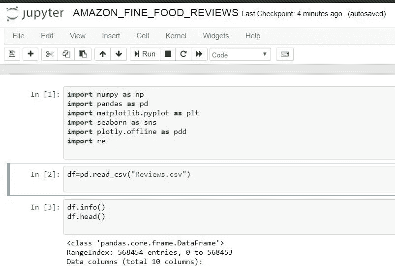

**df.info** 将告诉我们关于数据帧的重要信息，如总列数、总行数等。

**df.head()** 将返回数据帧的前五行。

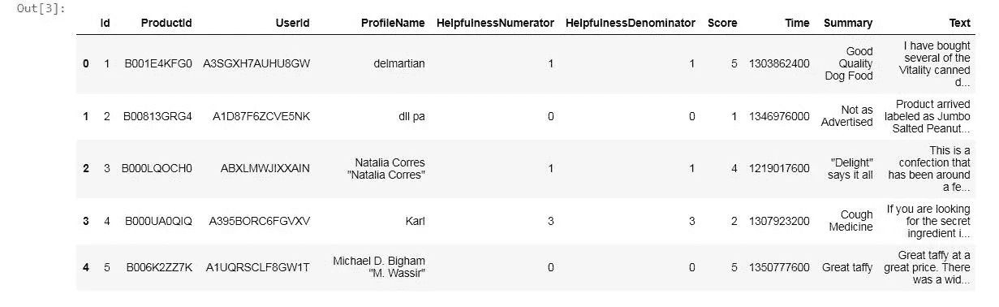

**df.columns** 将返回数据集中所有列的名称。

**df.describe** 将返回每个特征的总数、平均值、标准偏差、最小值等。

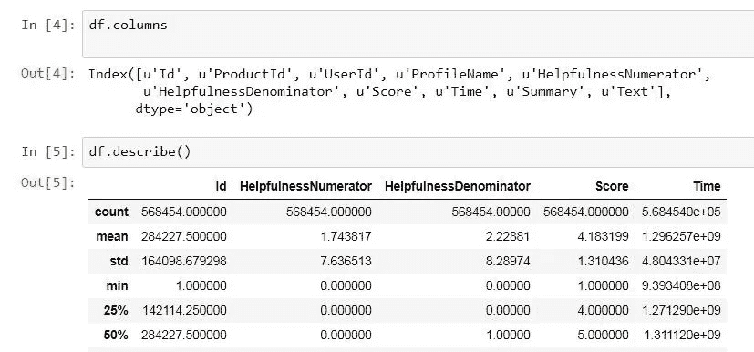

让我们创建一个函数，以正面、负面和中性的方式返回评论。

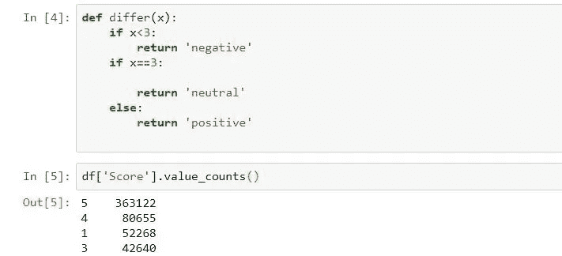

我们将使用 map 函数来调用函数 different()。

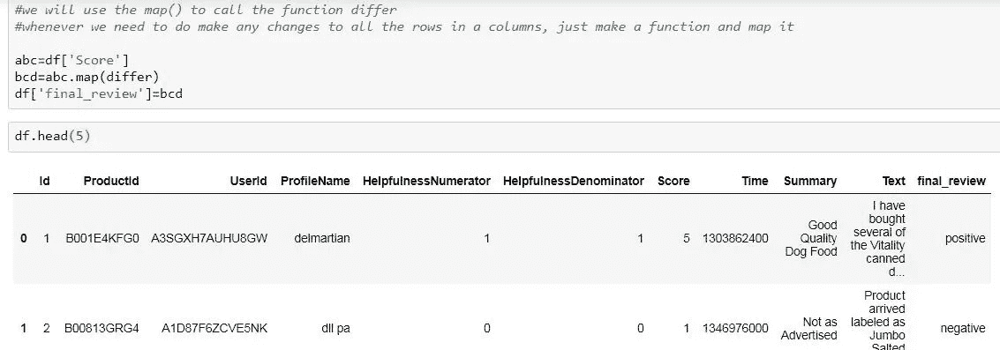

我们发现正面评价的数量远远高于负面评价的数量。

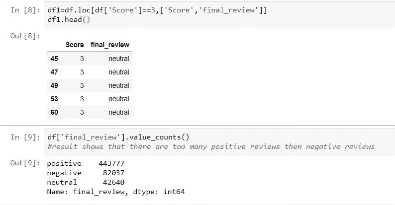

我们现在将从数据框架中删除**“分数”**功能，因为我们希望使用自然语言编程和 NLTK 工具来分析客户的评论。

我们需要一个模型来分析文本，然后根据分析预测评论是正面的还是负面的。

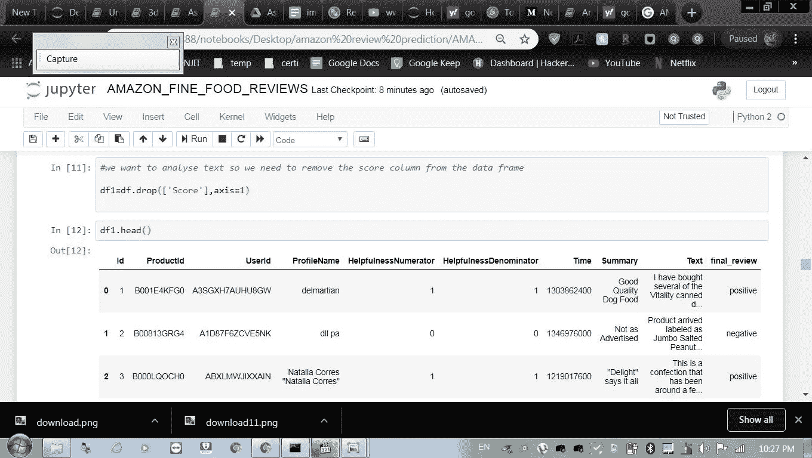

## **EDA(探索性数据分析)**

1.  **数据清理:重复数据删除**

观察到(如下表所示)评论数据有许多重复条目。因此，有必要删除重复，以获得数据分析的公正结果。

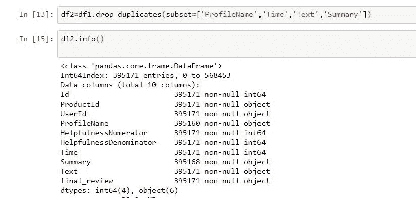

**2。观察:**还可以看到，在下面给出的两行中，帮助性分子的值大于帮助性分母，这实际上是不可能的，因此这两行也被从计算中删除

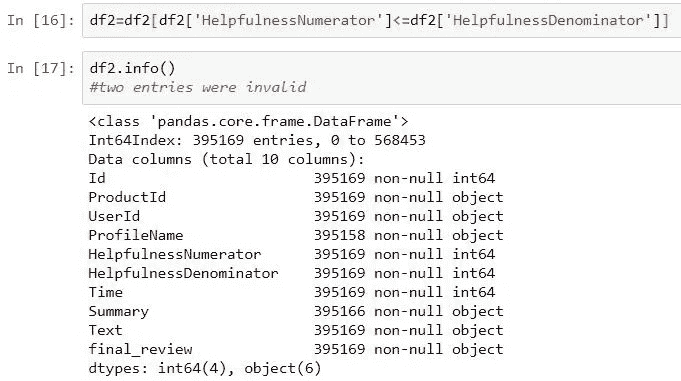

现在，我们将学习 NLP 工具和技术，如词干化、标记化、词性标记、词汇化、单词包、TF-IDF、W2V(单词到向量)、平均 TF-IDF 等。

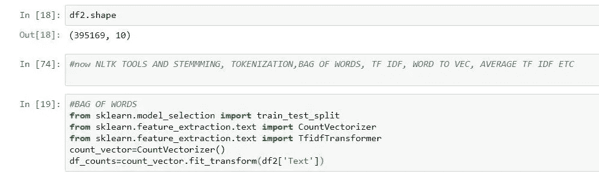

现在，我们将清理用户提供的评论，我们将删除所有对文本意义没有任何意义的标签、标点符号和停用词(the、and、if、but)。

我们将对每个句子进行标记，这样我们就可以很容易地获得每个单词在文档中的出现频率。

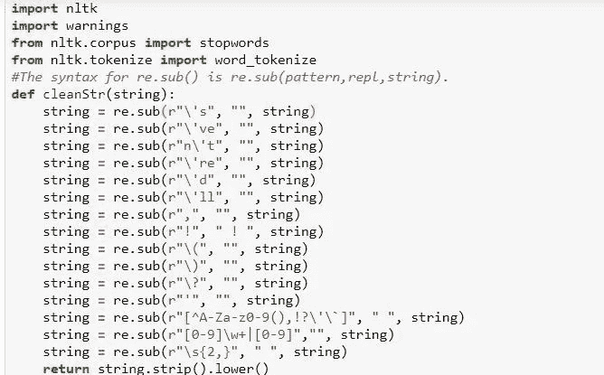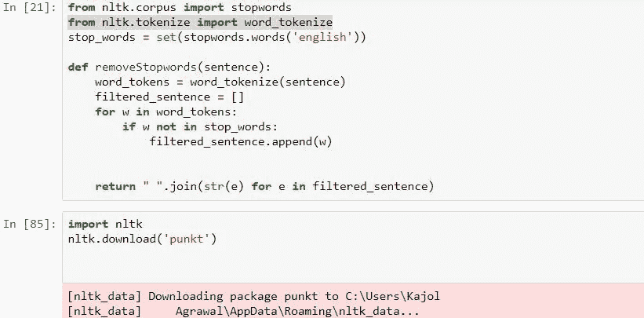

清洗后所有的评论都存储在一个名为 **gdArr2 的列表中(包括正面、负面和中立)。**

所有正面评价都存储在一个名为 **all_pos5 的列表中。**

所有负面评论都存储在一个名为 **all_neg5 的列表中。**

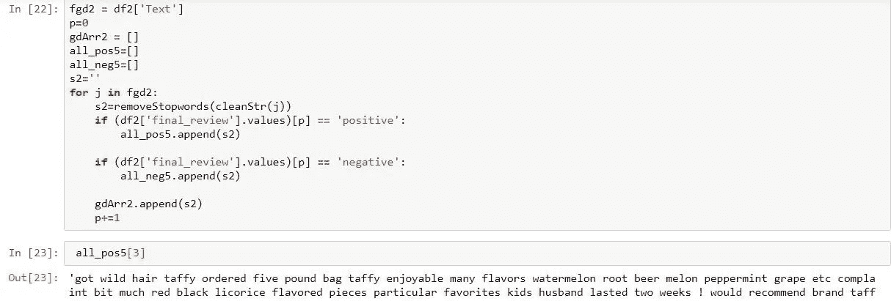

现在下一步是找出 all_pos5、all_neg5 和 gdArr 的长度。

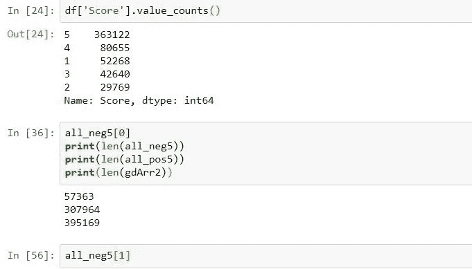

这是第一部分的结尾，在下一部分，我们将看到单词包，tf_idf，w2v 是如何在文本分类中工作的。
**感谢阅读……**