# Amazon EC2 逐步推出，静态网页托管在 Apache 上

> 原文：<https://medium.com/analytics-vidhya/amazon-ec2-launch-step-by-step-with-static-web-page-hosting-on-apache-3beea6afa4?source=collection_archive---------6----------------------->

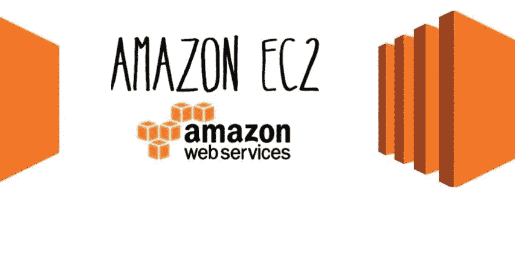

亚马逊 EC2

在云计算系列中，我们已经看到了云计算的基础知识以及类型和架构。我们还讨论了市场上现有的云计算供应商。本文是上一篇文章用户云计算系列的延续。在本文中，我们将尝试了解有关 EC2 实例的所有信息，我们将尝试启动虚拟机，并将在该机器上托管一个静态网页。

在继续之前，首先要理解什么是 EC2。EC2 是由 Amazon Web Services 提供的虚拟机。EC2 代表弹性计算云。我们将打破这三个词，并试图理解真正的含义。首先是**弹性，这意味着对象可以调整大小**，我的意思是可以压缩和拉伸，**计算意味着计算机**，最后**云意味着互联网**，我们在上一个教程中已经讨论过云。如果我们将 3 个词的意思结合起来，那么它的意思是“托管在云上的计算机，它可以被拉伸或压缩，我的意思是它是有弹性的”。很明显，EC2 是一个托管在云上的虚拟机，由亚马逊提供。像 GCP Azure 这样的许多其他供应商也有自己的虚拟机。在本文中，我们将继续关注 Amazon EC2。

要处理 EC2，我们首先需要 AWS 帐户。我希望阅读这篇文章的人有一个 AWS 帐户。如果没有，我建议创建 AWS 帐户，这是非常简单的过程。转到 https://aws.amazon.com/free 的网址，按照上面提到的步骤去做。AWS 附带 12 个月免费层，但每项服务都有限制。对于所有服务的详细信息，我建议你去同一个网站查看详情。在本文中，我们将讨论 EC2，因此我们将详细了解 EC2 在自由层下的用法。我附上一个截图，将显示免费层下 EC2 的详细使用。**在免费等级下，亚马逊每月提供 750 小时的使用时间。**

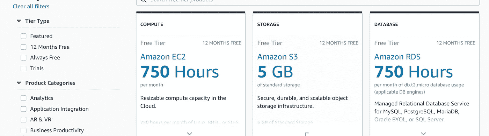

EC2 自由层使用

签约 AWS 后。点击登录，并提供电子邮件和密码登录到帐户。您将看到 AWS 管理控制台。我建议单击位于 AWS 管理控制台左上方的服务。

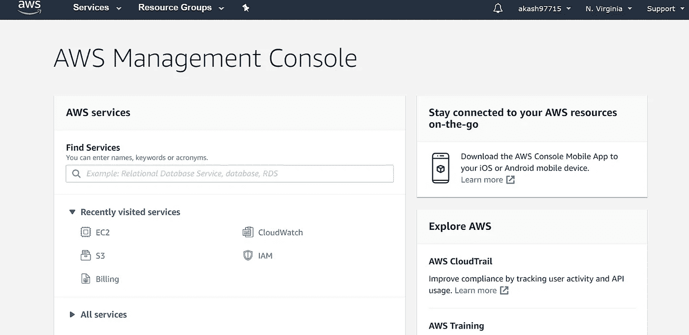

AWS 管理控制台

单击服务后，将出现下面的屏幕，从服务中单击 EC2，我们可以在计算部分看到它。

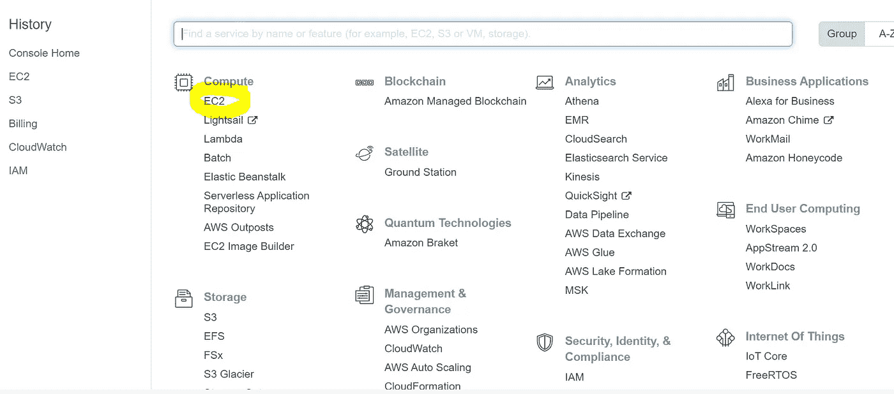

AWS 服务列表

点击 EC2 后，我们将进入 EC2 控制台，会有很多选项。不要担心，现在我们将只关注如何启动 EC2 实例以及如何登录到我们的虚拟计算机中，也就是 EC2。我们将在下一节详细讨论所有的味道。

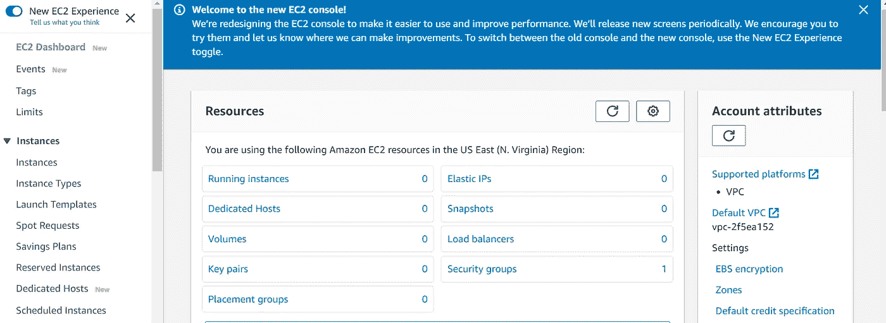

EC2 控制台

在 EC2 控制台下，我们将有几个选项，如运行实例，它将显示 AWS 帐户下所有正在运行的实例。key pairs 表示 aws 帐户下存在的密钥对的数量。当我们登录虚拟计算机或 EC2 时，需要密钥对，并且有许多选项。我们将在以后的文章中详细讨论所有选项。正如我在本文前面所说的，我们的重点主要是 EC2 实例。要启动实例，请单击 EC2 控制台中的启动实例。

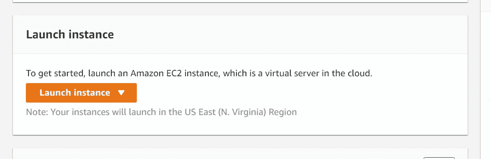

启动实例

在启动实例之后，我们需要选择 AMI 的类型，AMI 只不过是 Amazon 机器映像。我们可以认为 **AMI** 是操作系统的 **ISO** 映像。事实上 AMI 不仅仅是 ISO 的 AMI，我们将在下一篇文章中详细讨论 AMI。**对于这个用例，我建议选择亚马逊 Linux 2 AMI。这就是红帽 linux**

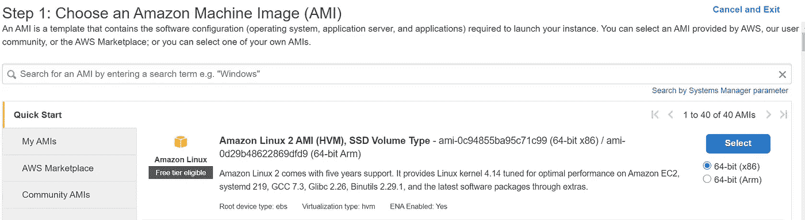

亚马逊 linux 2

选择 AMI 之后，现在我们必须选择实例类型。实例类型是我们需要选择的机器的能力。如果您在控制台中看到，它会清楚地告诉您，所有实例类型都包含在自由层下，我们将选择 **t2.micro** 。有许多实例类型，实际上我们根据我们的使用案例选择这个选项。选择 t2.micro 后，单击下一步

现在我们需要配置实例细节，现在我们将使用实例细节的默认值。现在，单击下一步:添加存储

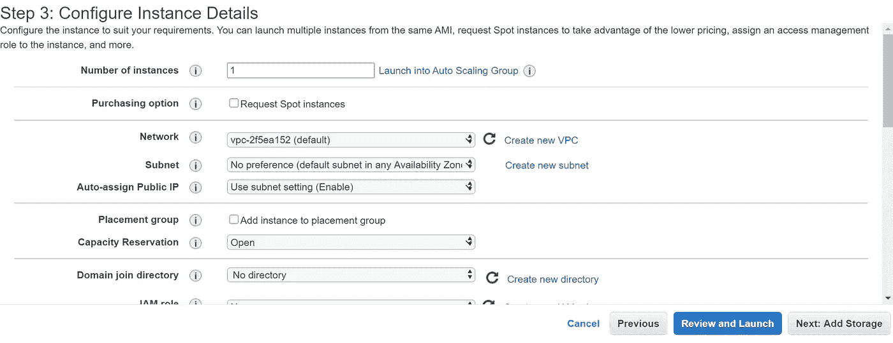

实例详细信息

在“存储”部分，我们不会添加任何额外的存储，如果您需要，可以通过单击“添加存储”按钮来添加额外的存储。由于存储不是本次讨论的一部分，我们将跳过这一部分，我们将使用默认存储，我的意思是仅选择根存储。它将包含机器的所有二进制文件和所有安装文件。如果您将它与您的 windows PC 进行比较，在 windows 笔记本电脑中，我们有 C 驱动器，它包含所有二进制值或您的操作系统的所有安装文件，在这种情况下也是如此。

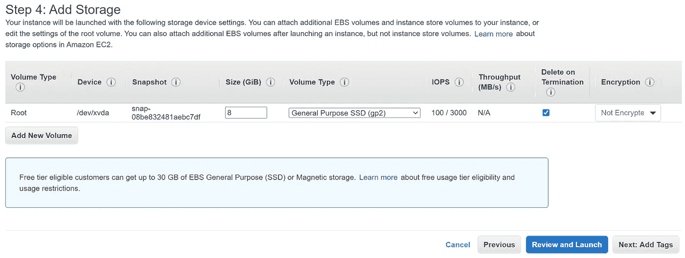

储存；储备

现在我们将添加标签。标签非常有用，因为在实时环境中，我们将会处理大量的实例。标签将标识实例。因此，我会建议根据您的项目案例给出标签名称。

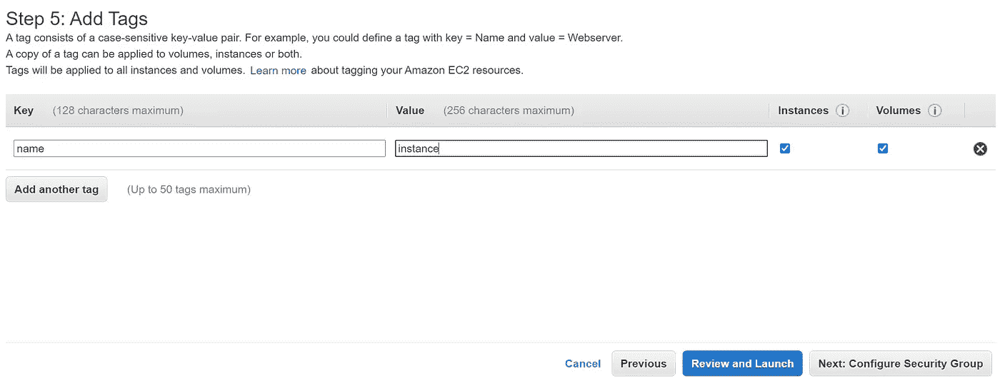

添加标签

添加标签后，我们现在必须配置安全组。安全组允许任何人都可以登录到您的机器。默认情况下，端口 22 是打开的。该端口用于 SSH 进入虚拟机。我们可以在安全组选项下打开端口。在我们的用例中，我们将打开端口 80，因为 apache 监听端口 80。无论如何，我们将在下一篇文章中详细讨论安全组。我们将尝试理解入站、出站和更多内容。

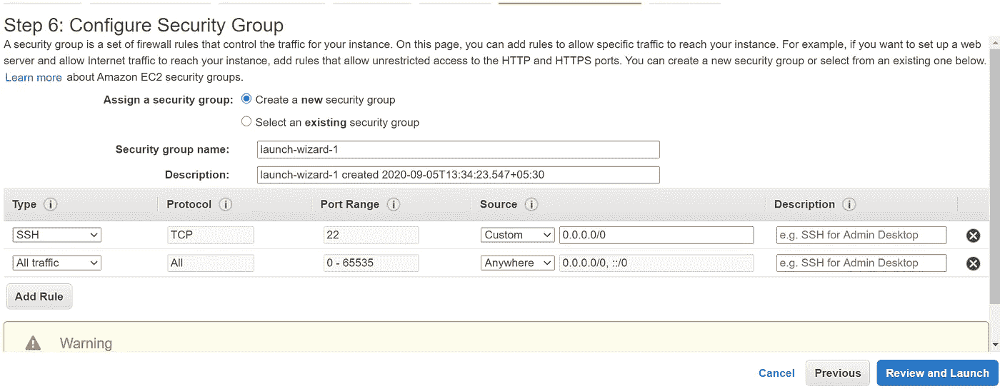

安全组配置

配置安全组后，单击查看并启动。点击启动。现在我们需要创建一个密钥对，我们需要用它 SSH 到创建的 EC2 实例中。点击创建一个新的密钥对，给密钥对命名，最重要的是点击下载密钥对。点击下载后。pem 文件将从您的下载文件夹下载到您的本地机器。我们需要转换这个。pem 文件放入。ppk 文件借助 putty 键生成.

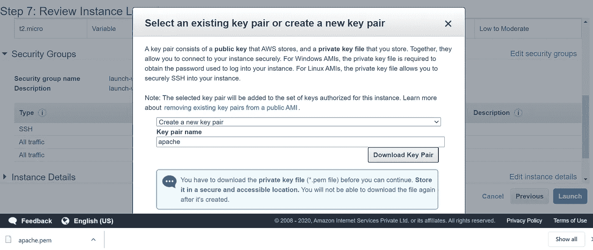

创建密钥对

现在，单击启动实例。我们单击启动实例后，大约需要 1-2 分钟，实例就会启动并运行，这可以在 EC2 控制台中看到。

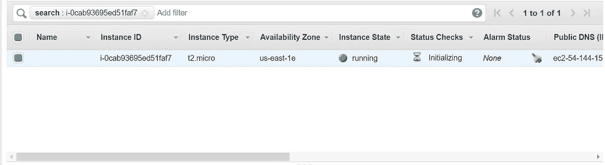

EC2 控制台

在 EC2 控制台上，我们将拥有与 EC2 实例相关的所有信息，如公共 IP、私有 IP、安全组信息、VPC 信息等等。到目前为止，我们对公开的知识产权信息感兴趣。在**公共 IP** 和密钥**值对**的帮助下，我们将进入这台机器

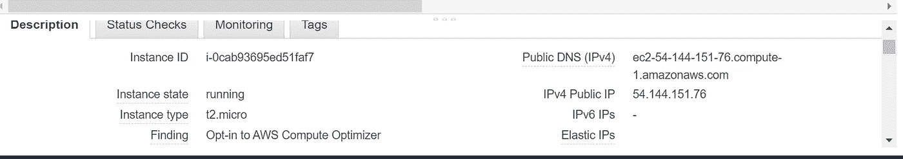

Ec2 控制台和公共 ip 信息

现在我们需要关注如何登录到正在运行的实例。为此我们需要油灰。Putty 是一个工具，用于登录云中的任何虚拟机。非常简单，只需从这个网站下载 putty[https://www . chiark . greenend . org . uk/~ sgtatham/putty/latest . html](https://www.chiark.greenend.org.uk/~sgtatham/putty/latest.html)。

下载后，将其安装在您的本地机器上。安装后，keygen 也被默认安装到系统中。转换时需要 Keygen。pem to。ppk 文件。在你的搜索栏中搜索 keygen。单击 load(加载)。pem 进入 putty key gen)并点击保存。ppk 文件保存在您的机器中，现在我们将使用该 ppk 文件登录到启动的实例。借助公共 ip 和 ppk，我们将登录到虚拟机。

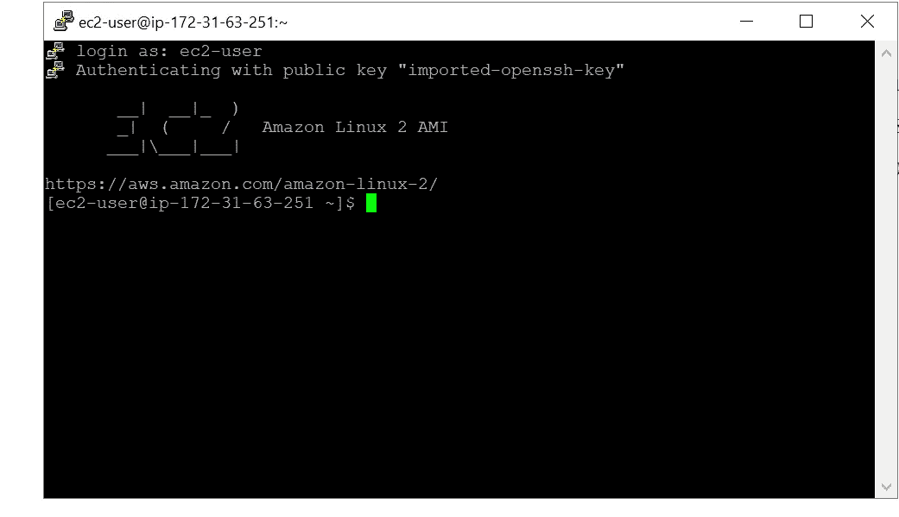

虚拟计算机

进入机器后，我们将使用命令" **sudo yum update** "更新我们的机器。现在，我们将使用命令“ **sudo yum install httpd** ”在虚拟机上安装 apache。这个命令将在您的虚拟机中安装 apache

现在我们将转到路径“ **/var/www/html** ”。在这个路径下，我们将保存一个需要在 web 浏览器上显示的静态 html 页面。下面的命令用来走指定的路径

**cd /var/www/html**

我们将使用下面的命令创建一个简单的网页

**须藤纳米 h1.html**

下面我们将使用 html 代码创建一个简单的静态网页。您可以自由使用任何需要在网页上显示的网页 html 或 java 脚本代码。

<头>
<头衔>欢迎光临，这是阿卡什</头衔>
</头>
<身>
< h1 >可喜可贺，阿帕奇正在制作 EC2</h1>
</身>
< /html >

**恭喜，**我们已经启动了 ec2 实例，并且在虚拟机上配置了 apache 服务器以及简单的网页托管。如果它对你不起作用，我建议使用命令

**sudo system CTL start httpd**

下面的网页是我们可以在浏览器上看到的。

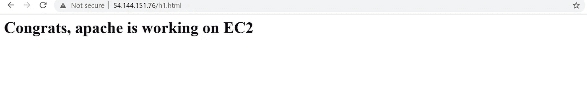

网页浏览器

在下一篇文章中，我们将尝试详细理解 EC2 实例的组件，我们还将看到 amazon web services 中的其他一些服务。如果您想了解更多关于云计算的知识，我建议您阅读本系列的第一篇文章。这篇文章的链接在下面。

 [## 云计算简介和迈向亚马逊网络服务的第一步

### 在这篇文章中，我将主要关注云计算的基本介绍，我们将尝试了解步骤…

medium.com](/analytics-vidhya/cloud-computing-introduction-and-1st-step-towards-amazon-web-services-22344ac7178e) 

如果你对这篇文章和创建 AWS 帐户有任何困惑，请在下面评论，我将很乐意回应。我们将在云计算系列的下一篇文章中讨论更多关于 AWS 服务的内容。

# 敬请关注