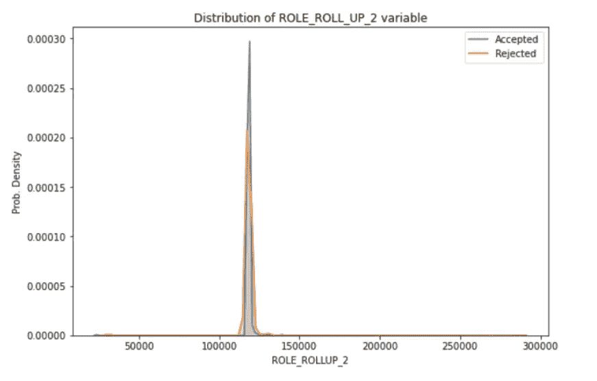

# 亚马逊员工访问挑战

> 原文：<https://medium.com/analytics-vidhya/amazon-employee-access-challenge-e23fa2a1ddc2?source=collection_archive---------8----------------------->

> **目录**

1.  介绍
2.  使用 ML 解决这个问题
3.  数据概述
4.  绩效指标
5.  探索性数据分析
6.  特征工程
7.  特征选择
8.  构建 ML 模型
9.  模型之间的比较
10.  CatBoost 模型简介
11.  ML 模型的部署。
12.  进一步的改进
13.  代码参考:GitHub
14.  参考

# 介绍

当员工开始在一家公司工作时，他/她需要获得履行其职责所需的访问权限。该过程通常由提出提供必要访问的请求的员工手动完成，主管将拾取该请求并手动授予该员工访问权。这通常是一个耗时的过程，并且在大多数阶段都需要人工干预。其想法是通过使用机器学习模型来取代这一手动过程，该模型使用包含员工角色、部门名称等详细信息的现有数据进行训练。该模型将有助于自动授予或撤销访问权，并减少该过程中所需的人工参与。

# 使用 ML 解决这个问题

我们的目标是开发一个机器学习模型，该模型将员工的访问请求作为输入，其中包含有关员工属性的详细信息，如角色、部门等..模型必须决定是否提供访问。这个问题可以被视为一个二元分类问题，其中我们的机器学习模型应该预测两个类别中的一个(批准/拒绝)作为结果。

# 数据概述

该数据集是 Amazon.com Kaggle 竞赛[*—员工访问—挑战*](https://www.kaggle.com/c/amazon-employee-access-challenge/overview) *的一部分。数据由 2010 年到 2011 年收集的真实历史数据组成。数据集由两个文件 train.csv 和 test.csv 组成。Train.csv 包含 32，769 个值，test.csv 包含 58，921 个值。*

使用 Pandas 导入数据。

数据中给出的列列表:

**动作**:如果资源被批准，动作为 1，如果资源未被批准，动作为 0

**资源**:每个资源的 ID

**MGR_ID** :当前员工 ID 记录的经理的员工 ID；一个员工一次只能有一个经理

**ROLE_ROLLUP_1** :公司角色分组类别 id 1(如美国工程)

**ROLE_ROLLUP_2** :公司角色分组类别 id 2(如美国零售)

**角色 _ 部门名称**:公司角色部门描述(如零售)

**角色 _ 职务**:公司角色职务描述(如高级工程零售经理)

**角色 _ 家族 _DESC** :公司角色家族扩展描述(如零售经理、软件工程)

**角色系列**:公司角色系列描述(如零售经理)

**角色 _ 代码**:公司角色代码；该代码对每个角色(如经理)都是唯一的

# 绩效指标

此处用于此问题的性能指标是 **AUC 得分**

**什么是 AUC 分数？**

AUC 是检验分类模型性能的重要评价指标之一。AUC 也称为 AUROC，代表受试者操作特性曲线下的*面积。* 在潜入 AUC 评分之前，我们先了解几个概念。

**混淆矩阵** 混淆矩阵是一种特定的表格布局，用于可视化算法的性能

TP:真阳性
TN:真阴性
FP:假阳性
FN:假阴性

让我们考虑你有两个类标签，比如 1(正)和 0(负)。
**真正:**您预测类标签为正，其实际标签为正(即基础真值也为正)
**真负:**您的预测为负，其实际标签也为负
**假正:**您的预测为正，但实际标签为负。这也被称为**I 型错误
假阴性:**你的预测是阴性而实际标签是阳性。
这也称为**第二类错误。**

理想情况下，对于好的分类模型，TPR，TNR 值需要很高，而 FPR，FNR 值需要很小。

ROC 曲线(接收器操作特征曲线)是显示分类模型在所有分类阈值下的性能的图表。ROC 曲线是用 **TPR 对 FPR** 绘制的，其中 TPR 在 y 轴上，FPR 在 x 轴上。ROC 是概率曲线，AUC 代表可分性的程度或度量。**它告诉我们模型在多大程度上能够区分不同的类别**。AUC 越高，模型预测 0 为 0 和 1 为 1 的能力越强。

# 探索性数据分析

探索性数据分析是分析数据集以了解数据分布、获取其主要特征以及可视化数据集分布的过程。

从上面的图中，我们可以注意到给定的数据集是不平衡的，因为在给定的数据中，大多数请求被批准，只有很少的请求被拒绝。

该图表明，大多数 MGR_ID 变量值位于 0–5000 的范围内，批准请求的密度更多地位于该范围内。

查看上面的图，我们可以看到一个高峰，这表明与其他值相比，ROLE_ROLLUP_2 变量在大多数时间只出现了几个值。

我们可以在上面的图中看到多个峰值，这表明 ROLE_FAMILY 变量的大部分值都来自这两个值的范围，这里，与拒绝的请求相比，批准的请求的密度也更大。

使用该热图，我们可以得出结论，在大多数给定的特征之间没有**相关性**，因为上图中的大多数值为零。

# 特征工程

**特征工程**是利用领域知识从原始数据中提取特征的过程。这些特征可以用来提高机器学习算法的性能。

特征工程过程包括以下步骤:

*   头脑风暴或测试功能。
*   决定创建什么特征。
*   检查功能如何与模型配合使用。
*   如果需要，改进您的功能。
*   回去集思广益/创造更多的功能，直到工作完成。

在这个问题中使用的一些特征工程技术是

*   一个热编码
*   频率编码
*   响应编码/目标编码
*   奇异值分解编码

## 一个热编码

执行一次热编码

一种热编码策略是将每个类别值转换成一个新列，并根据该特性的存在与否为其赋值 1 或 0。在上图中，对于第 4 个样本，值 1 仅被赋予一列(octopus)，其余值为零。

**频率编码**

频率编码是利用类别的频率作为标签的一种方式。假设我们总共有 9 个点，其中 4 个点属于类别 A。因此类别 A 的频率编码值为 0.44 (4/9)。如果对于给定的特征，特定的类别比其他类别出现得更频繁，那么与其他类别相比，该特定类别将获得高频编码值。

在频率编码中，值取决于数据的频率。例如，在上面的图像中，A 出现了 4 次(共 9 次)，值为 0.44 (4/9)，B 的值为 0.33 (3/9)，依此类推。

## 目标编码

目标编码/均值编码是一种策略，其中我们使用目标变量(输出类标签)来提取新特征。顾名思义，目标编码/均值编码是使用目标变量的**均值对训练数据进行计算的。
目标编码可通过以下步骤实现:**

1.  选择一个分类变量。

2.按分类变量分组，并获得目标变量的聚合**和**

3.按分类变量分组，并获得目标变量的合计**计数**。

4.将步骤 2 /步骤 3 的结果分开，并将其与列车重新连接。

## 奇异值分解编码

奇异值分解(SVD)是一种矩阵分解方法，用于将矩阵(A)化简为其组成部分，以使某些后续矩阵计算更简单。

适马。V^T

奇异值分解的一个流行应用是降维。假设我们有一个包含许多列的数据集，降维有助于我们将其减少到与预测问题最相关的更小的特征子集。

结果是一个具有较低秩的矩阵，据说该矩阵近似于原始矩阵。为此，我们可以对原始数据执行 SVD 操作，并选择适马中前 k 个最大的奇异值。这些列可以从西格玛中选择，而行可以从 V^T.中选择

在这个问题中，我们将为每对特征构建一个共现矩阵。每一行对应于特性 A 中的一个唯一值，而每一列对应于特性 b 中的一个唯一值。每个元素是 A 中的值与 b 中的值一起出现的行数。
然后使用**奇异值分解**找到两个更小的矩阵，当相乘时等于计数矩阵。以上步骤可以用 sklearn 的**[**truncated SVD**](https://scikit-learn.org/stable/modules/generated/sklearn.decomposition.TruncatedSVD.html)**来实现。****

# **特征选择**

**当用给定的数据执行一次热编码时，它产生了大约 16k 个特征。拥有太多的特征有时不是很有用，因为不相关或不太重要的特征不会提高模型的性能，而太多的特征会增加模型的训练时间。**

**特征选择是自动或手动选择对预测变量贡献最大的那些特征的过程。数据中包含不相关的要素会降低模型的准确性，并使模型基于不相关的要素进行学习。**

**有各种方法来执行特征选择，我使用的方法之一是**卡方方法**。**

****什么是卡方值？****

**卡方检验在统计学中用于检验两个事件的独立性。给定两个变量的数据，我们可以得到观察计数 O 和期望计数 E。卡方测量期望计数 E 和观察计数 O 如何相互偏离。**

****

**卡方值越高，特征越依赖于响应，并且可以被选择用于模型训练。**

# **构建 ML 模型**

**现在，我们已经有了现成的数据，并且我们还使用了一些功能工程技术来获得一些新功能，让我们继续尝试各种分类模型并比较每个模型的性能。**

**各种分类算法/模型的简短介绍:**

## **k-最近邻**

****

**k 最近邻**

**KNN 算法的工作原理是找出查询与给定数据集中所有其他点之间的距离。在计算它们之间的距离之后，选择 K 个离查询点最近的点(K-最近邻居)。在分类任务的情况下，多数投票用于找到类标签(最近邻中最频繁的标签)。在回归的情况下，计算最近邻标注的平均值。**

## **支持向量机(SVM)**

****

**支持向量机算法的目标是在 N 维空间(N-特征的数量)中找到一个超平面，该超平面清楚地分类数据点。为了分离这两类数据点，可以选择许多可能的超平面。我们的目标是找到一个具有**最大余量**的平面，即两个类别的数据点之间的**最大距离。最大化边缘距离提供了一些加强，以便可以更有把握地对未来的数据点进行分类。****

****逻辑回归****

****

**逻辑回归**

**逻辑回归的目标是找到一个最佳超平面(N-Dim ),它将正点与负点分开。逻辑回归假设给定的数据是线性可分的。**

****随机森林****

****

**随机森林通过 bagging 方法训练。Bagging 或 Bootstrap 聚合包括随机采样训练数据的子集，使模型适合这些较小的数据集，并聚合预测。每棵树都是用不同的数据子集来训练的。总的来说，树打包包括对训练集的子集进行采样，为每个子集拟合一个决策树，并汇总它们的结果。使用随机森林模型的优势在于，由于每个模型都是使用不同的数据子集来训练的，因此每个模型都是相互独立的，并且模型训练可以并行化。**

****XGBoost(极限梯度提升)****

****

**梯度推进**

****增强算法**采用了更加*迭代*的方法。从技术上来说，这仍然是一种合奏技术，因为许多模型被组合起来执行最终的一个，但采取了更聪明的方法。boosting 不是在彼此隔离的情况下训练所有模型，而是连续训练模型，每个新模型都被训练来纠正前一个模型所犯的错误。**

## **超参数调谐**

**超参数是在学习过程开始之前设置其值的参数。选择最佳超参数非常重要，因为它有助于防止模型过拟合或欠拟合。**

**超参数调整最常用的两种方法是网格搜索和随机搜索。这里我们使用**随机搜索**来寻找最佳超参数**

**随机搜索与网格搜索的不同之处在于，与网格搜索不同，我们不会为每个超参数提供一组要探索的值；相反，我们为每个超参数提供一个统计分布，从中可以随机抽取值。**

# **模型之间的比较**

**假设我们已经使用一些特性工程技术创建了一些新特性，现在是时候用各种模型来尝试这些特性了，看看哪些特性更重要，哪些模型比其他模型表现得更好。**

**下面是一段代码，其中对逻辑回归模型进行了超参数调整，使用响应编码/目标编码数据对模型进行了训练，并为测试数据预测了类标签。**

**与上面类似，我们可以使用使用不同特性的不同模型，并找出哪个模型提供最佳性能。**

********************

**上面的屏幕截图显示了不同模型的测试 AUC 分数，这些模型使用使用各种特征工程技术获得的不同特征集进行训练。**

**通过比较所有上述模型，**一个热编码**看起来是一种很好的特征工程技术，因为几乎所有模型都给出了很好的性能分数，其中逻辑回归模型在使用一个热编码特征训练的模型中给出了最高分数 **0.88167** 。**

**响应编码特征似乎对所有模型都表现不错，而 SVD 编码特征对 KNN、SVM 和 LR 表现不佳，它对随机森林和 XGBoost 给出了不错的 AUC 分数。**

****Random Forest 和 XGBoost** 在这里是有趣的模型，因为如果你看一看没有使用额外特征训练的模型的测试 AUC 分数(即，模型使用给定的原始数据训练，没有任何特征变换)，这两个模型给出了良好的 AUC 分数(分别为 0.876 和 0.880)。此外，当我们使用**频率编码特性时，这两种模型的性能都有所提高(测试分数增加到 0.8856)。****

**如果您比较所有这些分数， **0.88561** 似乎是使用使用原始数据+频率编码特征训练的**随机森林模型**获得的最高分数。**

# **CatBoost 模型简介**

**[CatBoost](https://catboost.ai/docs/concepts/about.html) 是决策树上**梯度提升的算法。它由 Yandex 的研究人员和工程师开发，是公司内部广泛用于任务排序、预测和提出建议的**矩阵网算法**的继任者。它是通用的，可以应用于广泛的领域和各种问题。****

****CatBoost 模型的优势****

**1.**无需参数调整的卓越品质****

**CatBoost 模型倾向于自动找到最佳超参数，因此我们不需要显式执行超参数调整。**

**2.**分类特征支持****

**开发 CatBoost 模型是为了很好地处理分类特征，因此我们不需要花费时间将它们转换为数字特征，然后训练模型。**

**3.**提高了精确度****

**CatBoost 模型往往比其他 boosting 模型提供更好的准确性。**

**4.**快速预测****

**使用 CatBoost 模型，我们可以比其他模型更快地预测类标签。**

**下面是使用给定数据使用 CatBoost 分类器解决这个问题的代码片段**

****

**从上面可以看出，CatBoost 模型给出的**最佳测试 AUC 得分为 0.91446(公开得分)/ 0.90876(私人得分)**，如果比较所有模型，这是最高的。**

****这个分数有多好？**
这个 **0.90876** 的私人分数让你进入 Kaggle 比赛的 ***前 5%的私人排行榜*** 。**

# **ML 模型的部署**

**机器学习模型的部署是使您的模型在生产环境中可用的过程，在生产环境中，它们可以向其他软件系统提供预测。只有当模型被部署到生产中，它们才开始增值，这使得部署成为关键的一步。**

**将您的 ML 模型部署到产品中有多种方法，这里我使用了一种最简单的方法，即使用 **Flask 和 AWS 实例来部署模型。****

****

**一个简单的 HTML 页面，从用户那里获取所需的详细信息**

**下面给出了一个简单的代码，它从 HTML 页面获取数据，使用用户数据预测类标签，并使用 Flask 在另一个 HTML 页面中显示状态。**

****

**说明请求是被批准还是被拒绝的 HTML 页面。**

# **进一步的改进**

**您可以尝试使用其他特征工程技术来开发新的特征，以提高模型的性能。**

**您还可以尝试层叠等集成技术来组合多个模型，以提高模型的性能。**

# ****代码参考****

**[https://github . com/shri ram 016/Amazon-Employee-access-challenge](https://github.com/Shriram016/Amazon-Employee-access-challenge)**

****联系人** 邮箱 Id:shri16ram@gmail.com
领英:[https://www.linkedin.com/in/shriram016/](https://www.linkedin.com/in/shriram016/)
手机:+91–7200681570**

# **参考**

1.  **[https://towards data science . com/understanding-AUC-roc-curve-68b 2303 cc9 C5](https://towardsdatascience.com/understanding-auc-roc-curve-68b2303cc9c5)**
2.  **https://en.wikipedia.org/wiki/Sensitivity_and_specificity**
3.  **[https://developers . Google . com/machine-learning/crash course/classification/roc-and-AUC](https://developers.google.com/machine-learning/crash-course/classification/roc-and-auc)**
4.  **[https://en.wikipedia.org/wiki/Feature_engineering](https://en.wikipedia.org/wiki/Feature_engineering)**
5.  **[https://medium . com/analytics-vid hya/different-type-of-feature-engineering-encoding-techniques-for-category-variable-encoding-214363 a 016 FB](/analytics-vidhya/different-type-of-feature-engineering-encoding-techniques-for-categorical-variable-encoding-214363a016fb)**
6.  **[https://towards data science . com/the-5-feature-selection-algorithms-every-data-scientist-need-to-know-3a6b 566 EFD 2](https://towardsdatascience.com/the-5-feature-selection-algorithms-every-data-scientist-need-to-know-3a6b566efd2)**
7.  **[https://www . kdnugges . com/2017/10/random-forests-explained . html](https://www.kdnuggets.com/2017/10/random-forests-explained.html)**
8.  **[https://towards data science . com/understanding-AUC-roc-curve-68b 2303 cc9 C5](https://towardsdatascience.com/understanding-auc-roc-curve-68b2303cc9c5)**
9.  **[https://www.kaggle.com/dmitrylarko/notebooks](https://www.kaggle.com/dmitrylarko/notebooks)**
10.  **[https://towards data science . com/machine-learning-basics-with-k-nearest-neighbors-algorithm-6a 6 e 71d 01761](https://towardsdatascience.com/machine-learning-basics-with-the-k-nearest-neighbors-algorithm-6a6e71d01761)**
11.  **[https://www.appliedaicourse.com/](https://www.appliedaicourse.com/)**