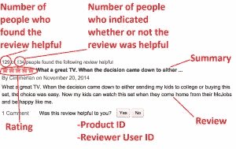

# 亚马逊美食评论通过自然语言处理实现特色化

> 原文：<https://medium.com/analytics-vidhya/amazon-fine-food-reviews-featurization-with-natural-language-processing-a386b0317f56?source=collection_archive---------1----------------------->

亚马逊美食评论分析

***首先我们想知道什么是亚马逊美食点评分析？***

*这个数据集由亚马逊的美食评论组成。这些数据跨越了 10 多年的时间，包括截至 2012 年 10 月的所有约 500，000 篇评论。评论包括产品和用户信息、评级和明文评论。我们也有来自所有其他亚马逊类别的评论。*

*亚马逊评论通常是消费者产品中最受公众关注的评论。作为一个经常使用亚马逊的用户，我对检查亚马逊评论的大型数据库的结构和可视化这些信息很感兴趣，以便成为一个更聪明的消费者和评论者。*

# ***简介***

*亚马逊美食点评数据集由亚马逊美食点评组成。*

1.  *评论数:568454*
2.  *用户数量:256059 人*
3.  *产品数量:74258*
4.  时间跨度:1999 年 10 月至 2012 年 10 月
5.  *数据中的属性/列数:10*

*属性信息:*

1.  *Id*
2.  *产品 id——产品的唯一标识符*
3.  *UserId —用户的唯一标识符*
4.  *轮廓名称*
5.  *有用性分子——认为评论有用的用户数量*
6.  *helpfullnesdenominator——表示他们认为评论是否有用的用户数量*
7.  *分数——1 到 5 分之间的评级*
8.  *时间—审核的时间戳*
9.  *总结——审查的简要总结*
10.  *文本—评论的文本*

# *目标*

*给定一个评价，确定该评价是正面的(评分为 4 或 5)还是负面的(评分为 1 或 2)。*

*【问】如何确定一篇评论是正面还是负面？*

*【答案】我们可以使用分数/评级。4 或 5 级可以被认为是积极的评价。1 或 2 的评论可能被认为是负面的。3 的评论是中性的，被忽略了。这是一种确定评论极性(积极/消极)的近似和代理方式。*

# *加载数据*

*数据集有两种形式*

1.  *。csv 文件*
2.  *SQLite 数据库*

*为了加载数据，我们使用了 SQLITE 数据集，因为它更易于高效地查询数据和可视化数据。*

*在这里，由于我们只想获得推荐的整体情绪(正面或负面)，我们将有意忽略所有等于 3 的分数。如果得分高于 3，则推荐将被设置为“正面”。否则，它将被设置为“负”。*

我使用了一个数据库，里面有超过 500，000 条关于亚马逊美食的评论，可以通过 Kaggle 找到，在这里可以找到**。**

**当我使用 pandas 加载数据集时，我在 Jupiter 笔记本中得到这个输出。**

**

****但是在输出窗口中你可能想知道什么是有益分子和有益分母？****

> ****有用性分子:*** *认为评论对自己有用的人数。**
> 
> ****有用性分母:*** *表示认为评论有用与否的人数。**

*在机器学习中，数据清洗非常重要，我们希望使用 Pandas 对数据进行预处理。*

**观察到(如下图所示)评论数据有许多重复条目。因此，有必要删除重复，以获得数据分析的公正结果。**

**

**从上面可以看出，同一用户对具有相同的有用性分子、有用性分母、分数、时间、摘要和文本值的进行了多次评论，在进行分析时发现**

**ProductId=B000HDOPZG 是 Loacker Quadratini 香草威化饼干，8.82 盎司包装(一包 8 个)**

**

**ProductId=B000HDL1RQ 是 Loacker Quadratini 柠檬威化饼干、8.82 盎司包装(一包 8 个)等等**

**

****我们可以看到，上面两个图像中，两种产品的品牌相同，但味道不同。****

**经过分析推断，除了 ProductId 之外具有相同参数的评论属于相同的产品，只是具有不同的味道或数量。因此，为了减少冗余，决定消除具有相同参数的行。**

**同样的方法是，我们首先根据产品 Id 对数据进行排序，然后只保留第一个类似的产品评论，删除其他的。在上面的例子中，只剩下对 ProductId=B000HDL1RQ 的审查。这种方法确保每个产品只有一个代表，并且不进行排序的重复数据删除可能会导致同一产品仍然存在不同的代表。**

**

**删除这些重复数据后，我们可以检查原始数据中还剩下多少数据。**

**

*我们可以看到，在删除重复数据后，只剩下 69.25 %的数据，我们观察到原始数据中有 30.75%的数据是重复的。*

*我们还可以看到，在下图中，我们可以观察到在下面给出的两行中，Helpfulness 分子的值大于 Helpfulness 分母，这实际上是不可能的，因此这两行也被从计算中删除。*

**

**所以我们要删除包含 Helpfulness 分子大于 Helpfulness 分母的行的数据。**

**

**什么是最终的[‘分数’]。value_counts()它在我们给定的数据集中有 307061 个点是正的，57110 个点是负的。**

> *但是这里有一个问题，我们可以看到在我们的数据集中有文本和摘要列。这些是文本特征，但在机器学习中，我们只想使用数字特征来建立模型。现在，问题是如何将文本特征转换成数字向量？*

**

***文本特征***

**但是你可能会想为什么我们要把文本转换成数字向量呢？**

**考虑如果我们的文本特征被转换成 d 维数字向量，那么我们可以画出平面的法线来分离正面评论和负面评论，考虑下面的图像蓝色十字是正面评论，红色十字是负面评论，由平面 w 分开。**

**如果假设有人对分类给出了新的评价，那么我们将其转换为数字向量并乘以权重，如果结果为> 0，我们认为是正面评价，如果结果为< 0，我们认为是负面评价。**

**因为从线性代数来看，所有的点都在平面法线的相同方向上被认为是正的，而平面法线的相反方向被认为是负的。**

**

**所以我们想把文本特征转换成数字向量。但问题是如何转换成数值向量呢？**

> ****答案是自然语言处理:*** *我们使用自然语言处理的一些技术将文本转换成数值向量。**
> 
> ****字*** *嵌入或* ***字*** *矢量化是一种方法论，在* ***NLP 到*** *图中从词汇***到****的单词或词组对应一个向量，其中用到的实数* ***将文字* ***转换成数字*** *的* ***过程称为矢量化。…*********

********

*******文本和数值向量有什么关系？*******

1.  *****考虑如果两个评论非常相似，那么这两个向量之间的距离很小，即相似的点必须更近。*****
2.  *****如果两条评论的向量距离大于评论相异度。*****
3.  *****如果两个评论 r1、r2 更相似，则评论 v1 和 v2 的向量表示必定接近。*****
4.  *****相似的文字必须在几何上接近。*****
5.  ****我们想找到一种方法，它把文本作为输入，把数字向量作为输出，这样，相似的文本在几何上必须是接近的。****

> *******我们使用其中的一些技术来寻找给定文本的矢量表示:*******
> 
> *****包话*****
> 
> *****TF–IDF*****
> 
> *****Word2vec*****
> 
> *****平均 Word2vec*****
> 
> *****平均 TF–IDF word 2 vec*****

*****在自然语言处理中，文本被称为文档，文档的集合被称为语料库。*****

****在我们深入研究自然语言处理技术之前，我们首先对给定的文本数据做一些预处理。我们使用文本预处理是因为要减少给定文本数据的大小，这些都是增加文本数据的长度。****

********

*******文本预处理:*******

1.  ****从移除 html 标签开始。****
2.  ****删除标点符号或有限的特殊字符，如，或。或#等。****
3.  ****检查单词是否由英文字母组成，并且不是字母数字。****
4.  *****检查单词的长度是否大于 2(据研究，2 个字母中没有形容词)。*****
5.  *****将单词转换成小写。*****
6.  *****删除停用词(停用词在文本中被视为干扰。文本可能包含停用词，如 is、am、are、this、a、an、the 等)。*****
7.  *****最后，像滚雪球一样给单词做词干(词干是将相关单词转化为基本形式的过程。词干有助于将单词简化为一种叫做词干的紧凑形式)。这些词的基本形式是 tast，词干之后。*****

********

*******python 中文本预处理的所有步骤如下:*******

********

*******对文本进行预处理后，如下图所示，并将其存储以备将来使用，同样，我们也可以对摘要进行此操作。*******

********

*******文本特征化技巧:*******

> *******鞠躬(袋字):*******

*****词袋(BOW)是一种从文本文档中提取特征的方法。这些特征可以用于训练机器学习算法。它创建了在训练集中的所有文档中出现的所有唯一单词的词汇表。*****

*******简单来说，就是一个单词的集合，用字数来表示一个句子，大多不考虑它们出现的顺序。*******

*****BOW 是一种广泛使用的方法:*****

1.  ****自然语言处理。****
2.  *****从文档中检索信息。*****
3.  *****文档分类。*****

****在高层次上，它包括以下步骤。****

********

******什么是词向量？******

****在一个层面上，它只是一个权重向量。在简单的 1-of-N(或“one-hot”)编码中，向量中的每个元素都与词汇表中的一个单词相关联。给定单词的编码只是一个向量，其中相应的元素被设置为 1，所有其他元素都是 0。****

****假设我们的词汇只有五个词:国王、王后、男人、女人和孩子。我们可以将单词“Queen”编码为:****

********

*******标记化:*******

*****标记化是文本分析的第一步。将一个文本段落分解成更小的块，如单词或句子的过程称为标记化。标记是一个单独的实体，它是句子或段落的组成部分。*****

## ****句子标记化****

*****句子标记器将文本段落分割成句子。*****

********

## *****单词标记化*****

*****分词器将文本段落拆分成单词。*****

********

## ****使用单词包的特征生成****

*****在文本分类问题中，我们有一组文本和它们各自的标签。但是我们不能直接在模型中使用文本。你需要把这些文本转换成一些数字或者数字的向量。*****

****单词袋模型(BoW)是从文本中提取特征的最简单的方法。BoW 将文本转换成文档中单词出现的矩阵。这个模型关注给定的单词是否出现在文档中。****

*****举例:假设有三个文档:*****

*****医生 1:我喜欢狗。*****

****医生 2:我讨厌狗和编织。****

****文件 3:编织是我的爱好和激情。****

*****现在，您可以通过统计单词在给定文档中的出现次数来创建文档和单词的矩阵。创建包含三个文档中所有单词的文档词汇表，并从句子中提取单词。*****

*****计数并放入该词将在向量中存在多少次，否则放 0。如果我们的词汇量的维数很大，那么我们的向量 v1 是稀疏向量，这意味着向量中的大多数元素都是零。*****

********

*****可以看到，* ***每个句子都与我们生成的单词列表进行了比较。基于该比较，向量元素值可以递增*** *。这些向量可以在 ML 算法中用于文档分类和预测。*****

****示例:Doc1-Doc2 = | | Doc1-Doc2 | | = sqrt(0+1+0+1+1+0+0+0+0)****

****Doc1-Doc2=sqrt(4)=2****

*******二进制包词(BoW):*** *在二进制包词中我们考虑的不是词出现的次数，我们只考虑词是否退出。如果该字存在，则放 1，否则将 0 赋给向量。*****

*****这个矩阵使用的是单个单词。它可以是两个或更多单词的组合，这被称为二元或三元模型，一般的方法被称为 n 元模型。*****

# *****洞察包话:*****

*****BOW 模型只考虑一个已知单词是否出现在文档中。它不关心它们出现的意义、上下文和顺序。*****

****这给出了相似文档将具有彼此相似的字数的洞察。换句话说，两个文档中的单词越相似，文档就越相似。****

# *****弓的局限性*****

1.  *******语义*** *:基本的 BOW 方法不考虑文档中单词的含义。它完全忽略了使用它的上下文。根据上下文或邻近单词，同一个单词可以用在多个地方。*****
2.  *******矢量大小*** *:对于一个大文档，矢量大小可能会很大，导致大量的计算和时间。您可能需要根据与您的用例的相关性来忽略单词。*****

# *******sci-kit 中亚马逊美食评论数据集上 Bow 的实现*******

****你不必在需要的时候编写 BOW 代码。它已经是许多可用框架的一部分，如 sci-kit learn 中的 CountVectorizer。****

****************

> ******TF-IDF(词频-逆文档频):******

*****TF-IDF 代表* ***“词频—逆文档频”*** *。这是一种量化文档中单词的技术，我们通常计算每个单词的权重，这表示该单词在文档和语料库中的重要性。该方法是信息检索和文本挖掘中广泛使用的技术。*****

*******【词频(tf)*** *:词频是该词在语料库中各个文档中出现的频率。它是单词在文档中出现的次数与该文档中单词总数的比率。它随着该单词在文档中出现的次数的增加而增加。每个文档都有自己的 tf。*****

********

*****术语频率给出了单词‘w’在文档 d 中出现的频率。如果更频繁，单词‘w’TF 将增加。*****

*******逆数据频率(idf):*** *这个* *衡量文档在整套语料库中的重要性，这个和 tf 很相似。唯一的区别是 tf 是文档 d 中术语 t 的频率计数器，其中 as DF 是术语 t 在文档集合 n 中出现* ***次*** *的计数*****

********

*****idf 为我们提供了语料库中所有文档中稀有词的权重。在语料库中很少出现的单词具有高 idf 分数。*****

*****如果我们已经计算了 tf 值，并且如果这产生了文档的矢量化形式，为什么不仅仅使用 tf 来寻找文档之间的相关性呢？我们为什么需要英特尔信息技术峰会？*****

*****让我解释一下，虽然我们计算了 tf 值，但仍然有一些问题，例如，像“是，是”这样最常见的词将具有非常高的值，赋予这些词非常高的重要性。但是用这些词来计算相关性会产生不好的结果。这种常见的词被称为停用词，尽管我们将在后面的预处理步骤中删除停用词，找出该词在所有文档中的重要性，并使用该值进行规范化，这样可以更好地代表文档。*****

*****最后，通过取 tf 和 idf 的乘积值，我们得到 tf-idf 分数，tf-idf 有许多不同的变体，但现在让我们集中于这个基本版本。*****

****************

*****让我们举个例子来更清楚地了解一下。*****

*****第一句:汽车在路上行驶。*****

****第二句:卡车在高速公路上行驶。****

****在这个例子中，每个句子都是一个单独的文档。****

*****我们现在将计算代表我们语料库的上述两个文档的 tf-idf。*****

********

*****从上表可以看出，常用词的 tf-idf 为零，说明不显著。另一方面，“汽车”、“卡车”、“公路”和“高速公路”的 tf-idf 不为零。这些话有更多的意义。*****

****在 tf-idf 中，我们更加重视:****

1.  ****生僻字出现在我们的语料库中。****
2.  ****我们的文档中出现了更频繁的单词。****

# ****tf-idf 的局限性****

1.  *******语义*** *:这也不考虑词的语义。它完全忽略了使用它的上下文。根据上下文或邻近单词，同一个单词可以用在多个地方。*****

# *******在 sci-kit learn 中的 Amazon food reviews 数据集上实现 TF-IDF*******

********

*****基于分数的前 10 个特征由*给出****

********

> *******word2vec:*******

*****这种技术是最先进的算法，它考虑单词的语义。*****

*****如果我们给这个词它就转换成矢量。它还自动从文本中学习关系。*****

*****word 2 vec 模型的输出是* ***密集*** *矢量。* Word2vec 模型需要大文本语料库。****

*****在 word2vec 中，使用了单词的分布式表示。取一个几百维的向量(比如 1000)。每个单词都由这些元素的权重分布来表示。因此，向量中的元素和单词之间不是一对一的映射，而是单词的表示分布在向量中的所有元素上，向量中的每个元素都有助于许多单词的定义。*****

*****如果我在一个假设的词向量中标注维度(当然，在算法中没有这种预先指定的标注)，它可能看起来有点像这样:*****

********

****这样的向量以某种抽象的方式来代表一个单词的“意思”。正如我们接下来将看到的，简单地通过检查一个大型语料库，就有可能学习到能够以一种令人惊讶的表达方式捕捉单词之间关系的单词向量。我们也可以使用向量作为神经网络的输入。****

*******矢为国王、男人、王后、&女人:*******

********

*******向量构图王的结果——男人+女人=？*******

********

****[***要了解 word2vec 模型的完整工作原理，请访问此处。*T52**](https://blog.acolyer.org/2016/04/21/the-amazing-power-of-word-vectors/)****

# *******sci-kit learn***中亚马逊美食评论数据集上 word2vec 的实现****

****************

*******训练后的模型相似度输出如下图:*******

********

*******词语的简单相似度也由:*** 给出****

********

> *******平均字 2vec:*******

*****我们可以使用 Word2Vec 训练我们的模型，然后使用* ***句子*** *向量。******word 2 vec****矢量。我们可以只取一个* ***句子*** *中所有词向量的***。这个* ***平均*** *矢量将代表你的* ***句子*** *矢量。********

**********

*****我们需要给出大型文本语料库，其中每个单词都会创建一个向量。它试图从原始文本中自动学习向量之间的关系。向量的维数越大，它的信息量就越大。*****

# *****sci-kit learn 中 Amazon food reviews 数据集上***Average word 2 vec***的实现*****

**********

> ********tf-idf 加权 Word2vec:********

*****在这种方法中，我们将首先计算每个单词的 tf-idf 值，然后乘以每个单词的 word2vec 值并取其平均值。*****

**********

# *****在 sci-kit learn 中的 Amazon food reviews 数据集上实现 tf-idf 加权 word2vec*****

******首先我们会计算每个词的 tf-idf 值。******

**********

******然后我们计算每个单词的 word2vec，乘以单词值的 tf-idf，取其平均值。******

**********

******这是通过使用来自 Kaggle 的真实世界数据集 Amazon Food Reviews 的自然语言处理的文本特征化的小介绍。******

*****[***完整代码请访问我的 GitHub 资源库点击这里***](https://github.com/Sachin-D-N/Amazon_Food_Reviews/blob/main/01.Amazon_Fine_Food_Review_Analysis_Featurization/Amazon%20Fine%20Food%20Reviews%20Analysis.ipynb)*****

# *****参考*****

*   *****应用人工智能*****
*   *****Coursera*****
*   *****数据营*****

*****感谢您的阅读和耐心。如果帖子中有错误，请告诉我。让我们在评论中讨论，如果你发现帖子中有什么错误，或者你有什么要补充的..*****