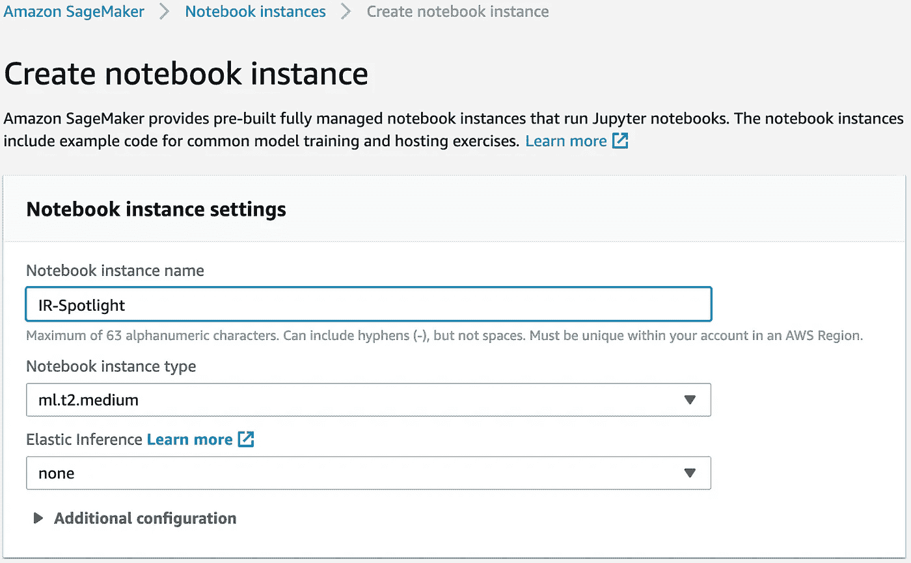
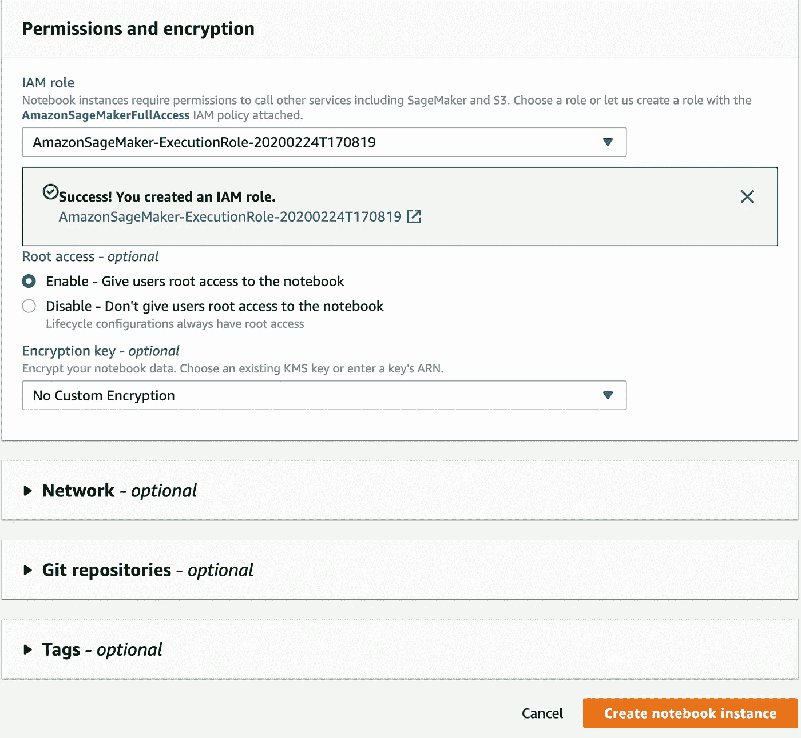
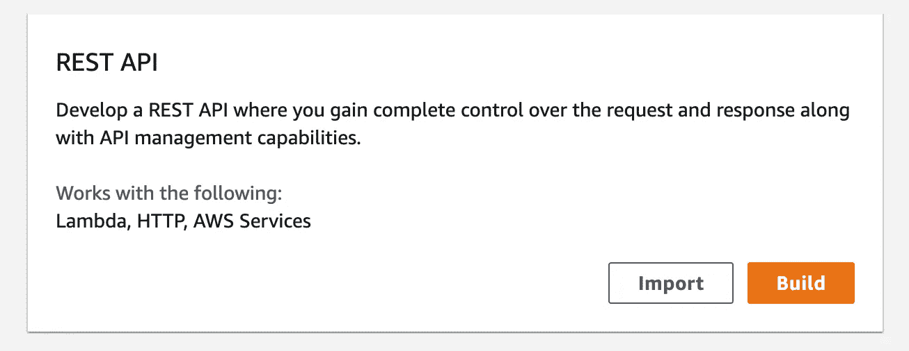
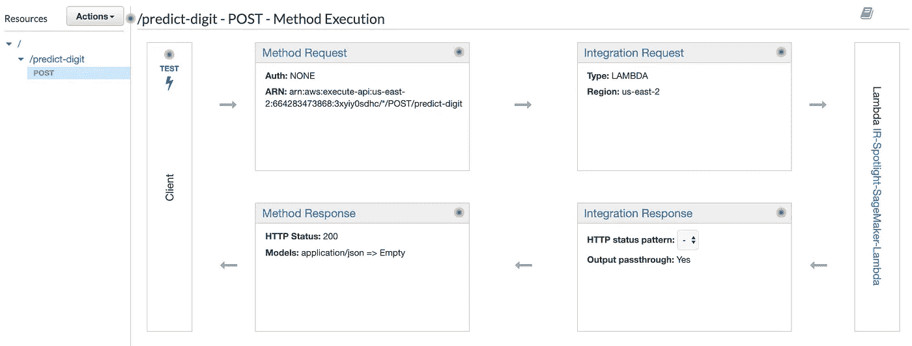
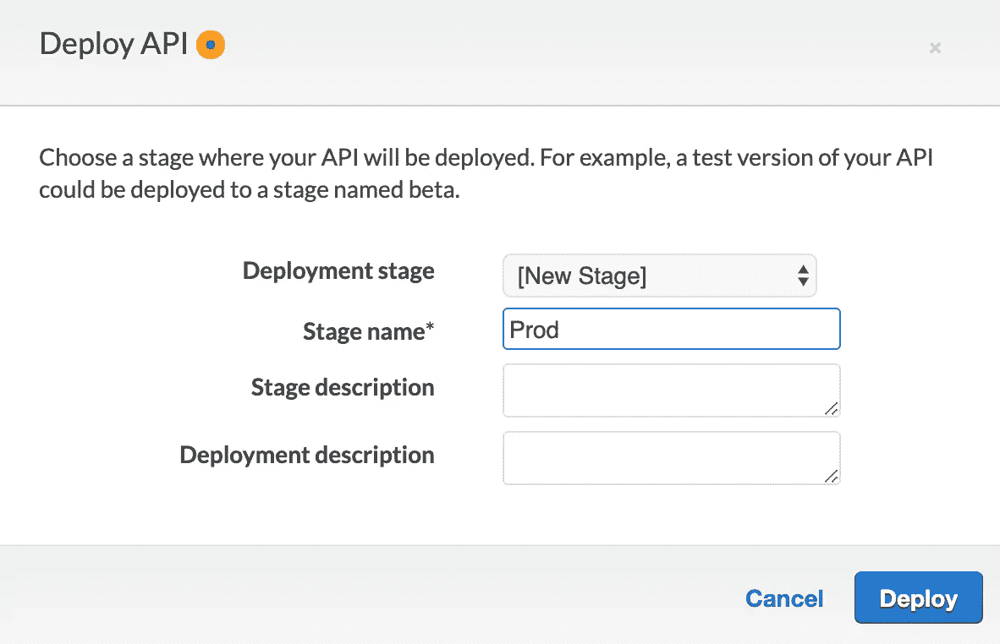
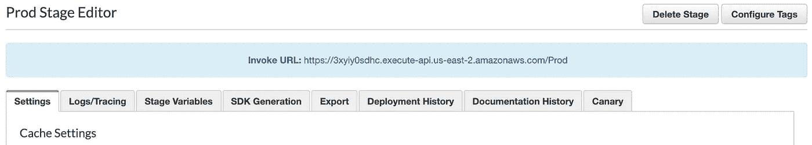

# 亚马逊 SageMaker

> 原文：<https://medium.com/analytics-vidhya/amazon-sagemaker-6ae5c872e330?source=collection_archive---------12----------------------->

如今，随着基于机器学习的软件开发需求的不断增长，对基于云的平台有着巨大的需求，该平台将简化基于机器学习的模型的管理数据集、培训、测试和部署，并使其可供最终用户使用。

有许多基于云的平台可用于机器学习，其中很少有人声称您几乎不需要任何编码技能就可以解决您的数据科学问题，而很少有人提供在云中平稳创建和部署基于机器学习的模型的解决方案。

今天，我们将谈论亚马逊 SageMaker，这是一个基于云的机器学习平台，在[AWS re:Invent conference 2017](https://www.youtube.com/watch?v=lM4zhNO5Rbg)推出。

来源:https://www.allthingsdistributed.com/

我们可以将 SageMaker 的任务分为三大类

1.  **构建**:在这里，我们定义问题、收集数据、分析数据、执行预处理以获得所需形式的数据。
2.  **训练**:我们使用任何机器学习算法对上一步得到的训练数据进行训练。基于模型的性能，我们执行超参数调整和交叉验证，以获得性能最佳的模型。
3.  **部署**:我们将训练好的模型部署到生产环境中，在那里它对消费者可用。

如果你什么都不明白也没关系。为了简单起见，我们将整篇文章分成 6 个问题，我们将用大量的图片回答每个问题。:D

1.  **如何创建 SageMaker 笔记本实例？**
2.  **如何创建 S3 存储桶来存储用于训练的数据？**
3.  **如何在 AWS SageMaker Jupyter 中建立模型？**
4.  **如何部署模型？**
5.  **如何使用 Lambda 函数调用训练好的模型端点？**
6.  **如何使用 AWS API Gateway 让 lambda 函数像 REST API 一样可用？**

# 1.如何创建 SageMaker 笔记本实例？

SageMaker Notebook 实例就像一个 jupyter 笔记本服务器，您可以在其中管理您的虚拟环境和所有 Jupyter 笔记本，就像在 Anaconda 中一样。

首先，[登录](https://aws.amazon.com/console/)你的 AWS 账户，在 find service 选项卡中，搜索“ *Amazon SageMaker* ”。

在亚马逊 SageMaker 主页上，点击“*笔记本实例*”，然后点击橙色的“*创建笔记本实例*”按钮。

点击“*创建笔记本实例*”后，会打开一个新页面，要求您填写笔记本实例的名称。在这个练习中，我们将其命名为“*红外聚光灯*”。使用 SageMaker 的[成本取决于用于培训的实例/服务器的用途和类型。在这个练习中，我们使用的是 *ml.t2.medium* 实例，它受 AWS 的自由层限制。弹性推断选择*无。*](https://aws.amazon.com/sagemaker/pricing/)

接下来，在**权限和加密**框下，它会要求您为此笔记本选择一个 IAM 角色。 [IAM](https://aws.amazon.com/iam/) 角色用于管理一个 AWS 资源对另一个 AWS 资源的访问和权限。我们将通过单击下拉菜单中的“*创建新角色*”选项来创建一个新的 IAM 角色。

单击它会提示您一个框，该框的默认值设置为对 S3 的完全访问权限。我们的笔记本实例需要访问 S3 以获取数据来训练我们的机器学习模型。只需点击“*创建角色*”按钮。

单击“*创建角色*”按钮将创建一个新的 IAM 角色，该角色可以访问 S3。之后，不要修改任何其他默认设置，并点击“创建笔记本实例”。

最后，在所有这些步骤之后，您将能够看到您的笔记本实例。最初，状态将为“*待定*”，但一段时间后，它将变为带有绿色勾号的“服务中”。

要打开您的 jupyter 笔记本，只需点击“*打开 Jupyter* ”。在此之后，你将能够看到一个定期 jupyter 一样的笔记本会议。

# 2.如何创建一个 S3 存储桶来存储用于训练的数据？

[亚马逊 S3 或亚马逊简单存储服务](https://aws.amazon.com/s3/)是亚马逊网络服务提供的一项服务，通过网络服务接口提供对象存储。亚马逊 S3 使用与 Amazon.com 相同的可扩展存储基础设施来运行其全球电子商务网络。

在服务选项卡中，搜索“ *S3* ”，然后单击 S3 选项。

以上操作会将你带到亚马逊的 S3 主页。只需点击“*创建桶*”按钮，输入桶名。在本练习中，铲斗名称为“*IR-spot light-S3-铲斗*”。

继续单击“*下一个*”按钮，保持配置选项的默认设置，设置权限，最后当您处于查看阶段时，只需单击“*创建存储桶*”按钮。

所有这些步骤之后，你可以在 S3 主页看到你的 S3 桶。

呜啊呜啊！！！

后退一步，伸展双臂，放松。试着去理解到目前为止你已经取得了什么。您已经创建了自己的 Jupyter 笔记本实例，它使用 AWS 服务器(不是您的笔记本电脑),您还创建了一个 S3 存储桶，您可以在其中转储所有数据(不是您的笔记本电脑)。最棒的是，当你的模特在训练时，你可以安心睡觉，因为你猜怎么着，AWS 从来不像你的笔记本电脑那样睡觉、关机或崩溃。

# 3.如何在 AWS SageMaker Jupyter 中建立模型？

一旦你创建了一个 Jupyter 笔记本实例和 S3 桶，下一步就是创建一个 Jupyter 笔记本。就像你的普通 jupyter 笔记本一样，通过点击 jupyter 笔记本中的新建按钮创建一个“ *conda_python3* ”，并给它命名。在这次演习中，它被命名为“*红外聚光灯*”。

在这之后，我们开始在我们的 Jupyter 笔记本上写代码。作为这项练习的一部分，我们将使用 **MNIST** 数据和 **xgboost** 算法训练一个数字分类模型。

第一步是从 deeplearning.net 下载数据

接下来，我们从中分离出训练、验证和测试数据，并将其转储到我们在上一步中创建的 s3 桶中。我们在这里使用的是[**boto 3**](https://aws.amazon.com/sdk-for-python/)**，这是用于 Python 的亚马逊网络服务(AWS)软件开发工具包(SDK)，它允许 Python 开发人员编写利用亚马逊 S3 和亚马逊 EC2 等服务的软件。**

**一旦用于训练的数据在 s3 中可用，下一步就是导入 Amazon SageMaker Python SDK 并获得 XGBoost 容器。SageMaker 已经包含了一些预先部署在 ECS 中 Docker 容器上的已知算法。我们所需要的就是一个 API 来为我们自己获取一个！**

**接下来，我们创建一个"*sage maker . estimator . estimator "*类的实例，并通过调用 estimator 的" *set_hyperparameter"* 方法为 XGBoost 训练作业设置超参数值。**

**在 estimator 的构造函数中，可以指定以下参数:**

*   **`role`–Amazon sage maker 可以承担的 AWS 身份和访问管理(IAM)角色，代表您执行任务(例如，从 S3 存储桶中读取称为模型工件的培训结果，并将培训结果写入 Amazon S3)。**
*   **`train_instance_count`和`train_instance_type`–用于模型训练的 ML 计算实例的类型和数量。在本练习中，您仅使用一个训练实例。**
*   **`train_volume_size`–附加到训练实例的 Amazon Elastic Block Store(Amazon EBS)存储卷的大小，以 GB 为单位。如果您使用`File`模式(默认为`File`模式)，它必须足够大以存储训练数据。**
*   **`output_path`–通往亚马逊 SageMaker 存储训练结果的 S3 桶的路径。**
*   **`sagemaker_session`–管理与 Amazon SageMaker APIs 和培训作业使用的任何其他 AWS 服务的交互的会话对象。**

**接下来，我们创建数据通道来访问从 S3 到 SageMaker 的数据。我们为训练集和验证集创建数据通道。数据通道保存了我们训练模型所需的所有数据的引用，并减少了 RAM 开销。**

**最后，我们拟合我们的模型 xgb_model.fit()，如果我们设置 logs=True，它也会生成日志。**

# **4.如何部署模型？**

**一旦模型合适，部署模型只需调用一个函数。您可以通过添加以下代码来部署您的模型。**

**一旦执行了上述所有代码，我们就可以在 SageMaker 仪表板中看到创建的整个实例、作业和模型。**

****

**如果您单击“Models 1 Created ”,您可以看到在之前的练习中创建的所有模型；如果您单击“Endpoints 1 in Service ”,您可以看到为您准备好的端点，可以使用 lambda 函数调用该端点。**

****

**让我们了解到目前为止我们做了什么。**

**我们将在这里和萨格马克说再见。我们在 jupyter 笔记本上写了一个代码，可以下载数据并保存在 S3。然后，它使用 S3 的数据来训练我们的模型，一旦模型最终被训练好，我们就使用非常简单的一行代码来部署模型。现在，我们的模型可以使用我们在上一步中创建的端点。**

****

# **5.如何使用 Lambda 函数调用训练好的模型端点？**

**AWS Lambda 是一个事件驱动的无服务器计算平台，由 Amazon 作为 Amazon Web Services 的一部分提供。它是一种计算服务，运行代码以响应事件，并自动管理该代码所需的计算资源。**

**转到服务选项卡，在那里搜索“ *Lambda* ”并点击它。**

****

**点击“*创建函数*，这将带您进入一个页面，该页面将为您提供创建 lambda 函数的多个选项。**

**选择“*作者从头开始*”，将你的 lambda 命名为“*IR-spot light-sage maker-Lambda*”，选择“ *Python 3.7* ”作为你的运行时语言选项，点击“*创建函数*”。**

****

**一旦你点击*创建函数*，你的 lambda 函数在几秒钟内就创建好了。**

****

**点击你的函数名来查看函数和一个内置的代码编辑器来编写你的 lambda 代码。**

****

**接下来，您希望它能够访问 SageMaker 的一些函数来调用端点。为此，您必须在为这个 lambda 函数创建的默认 IAM 角色中添加一些策略。**

**在代码编辑器下方的同一页面中向下滚动，找到**执行角色**框，在现有角色下方，点击“*查看 your-default-IAM-role-name* ”。**

****

**单击它后，您将被重定向到 IAM 管理控制台。在该页面中，点击“*awslambdabasiceexecutionrole-some-random-number*”查看授予该角色的权限。**

****

**单击它后，您可以看到与该角色相关的默认权限/策略。默认情况下，lambda 被授予写日志的权限。**

****

**单击“*编辑策略*，为该 IAM 角色添加额外权限。之后，点击“*添加额外权限*”，这将带来一个大下拉菜单，选择服务以及在该服务上添加什么权限。**

****

**点击后，选择“Read”选项下的“ *SageMaker* ”作为服务，“*invokendpoint*”作为动作，点击“Resource”部分的“ *All Resources* ”单选按钮。最后，单击“*审查策略*”，然后单击“*保存更改*”，在您的 IAM 角色中添加新权限。**

****

**一旦完成，回到 lambda 函数，开始编写 lambda 函数，从那里调用端点。**

**下面的代码是 lambda 函数的实现，该函数调用 SageMaker 中的一个端点。**

**ENDPOINT_NAME 是您之前创建的模型端点的名称，您可以使用使用 boto3 创建的 sagemaker 客户端来调用模型端点。**

**要测试你的 lambda 函数，点击测试按钮，它会让你配置一个测试。只需点击它，并通过创建一个 json 来创建一个测试用例，如下所示。**

**一旦测试配置完成，只需再次点击测试，在控制台的代码编辑器下方，您可以看到 lambda 函数的输出。**

****

**感觉不错吧？**

****

**在这个漫长的过程中是一个很好的进步。我们已经创建了我们的 lambda，并且能够测试它。**

**这的确是一种难以置信的感觉！！**

# **6。如何使用 AWS API Gateway 让 lambda 函数像 REST API 一样可用？**

**Amazon API Gateway 是一个完全托管的服务，使开发人员可以轻松地创建、发布、维护、监控和保护任何规模的 API。API 充当应用程序从后端服务访问数据、业务逻辑或功能的“前门”。使用 API Gateway，您可以创建支持实时双向通信应用程序的 RESTful APIs 和 WebSocket APIs。**

**转到服务标签，搜索“ *API 网关*”并单击它。**

****

**在 API 网关主页上，单击创建 API。然后，在页面中选择 API 类型，点击*构建*获取 REST API。**

****

**在下一页中，保持默认选项不变，只需输入您想要的 API 名称，然后单击“ *Create API* ”。对于这个练习，它是“ *IR-Spotlight-Lambda-API* ”。**

****

**一旦创建了 API，那么在 API 页面中，点击“*动作*”按钮，并在下拉菜单中点击“*创建资源*”。资源就像包含 https 方法的主 API 上的子 API。**

**在这个练习中，将资源命名为 predict-digit，因为我们希望使用这个 API 从给定的像素矩阵中预测数字。**

****

**一旦创建了资源，下一步就是创建方法。理想情况下，出于这个目的，我们应该创建一个 GET API，但是由于我们的请求非常大，所以我们将创建一个 POST API，在请求体中，我们可以发送图像矩阵。**

****

**从资源名称下方的下拉列表中选择 POST 后，单击十字标记左侧的小勾号。**

**在这之后，在右边，输入你的 lambda 函数的名字，点击“*保存*”，然后点击“*确定*”。**

****

**在所有这些步骤之后，您可以看到您的方法以及它如何与您的 lambda 交互的整个流程。**

****

**现在要测试你的 API 是否与你的 lambda 很好地集成，点击 test。向下滚动，在“*请求体*”中，输入如下 json 格式，点击“*测试*”。**

****

**如果你的 API 和你的 lambda 很好的集成了，那么在页面的右边，你会看到你的 API 调用的响应。**

****

**如果您看到一些错误，请转到 cloudwatch 查看日志并调试问题。**

**现在，最后一步是让消费者可以使用这个 API。为此，再次点击“*操作*，并从下拉菜单中选择“*部署 API* ”。**

**在弹出窗口中，创建一个新的部署阶段，将其命名为“ *Prod* ，然后单击“ *Deploy* ”。**

****

**一旦 API 部署到生产中，您将被重定向到“ *Stages* ”页面，在那里您可以看到您的 API 生产 url。**

****

**这个 url 现在是一个 API，任何人都可以从任何地方使用它来调用您的 lambda，从而调用模型端点。**

**你可以使用 [Postman](https://www.postman.com/) 进行 POST API 调用，或者有多种方法可以这样做，比如 curl 等等。下面是使用 Postman 点击这个 API 的例子。**

****

**耶，我们做到了。已经完成了，它就在那里。**

**向你的朋友炫耀一下，让他们试试你新开发的基于 ML 的 API。**

****

# **总结与结论！**

**在本文中，我们讨论了使用各种 AWS 工具创建一个简单的机器学习模型，并将其提供给最终用户。从事项目工作的大多数学生专注于他们的机器学习代码的工作，而不是专注于整个堆栈和流程的正确创建，这些堆栈和流程可以轻松管理他们的项目，并像新产品一样提供给最终用户。这篇文章将帮助他们像软件一样交付他们的项目。**