# 亚马逊简单存储服务(S3)

> 原文：<https://medium.com/analytics-vidhya/amazon-simple-storage-service-s3-d504bc366bff?source=collection_archive---------16----------------------->

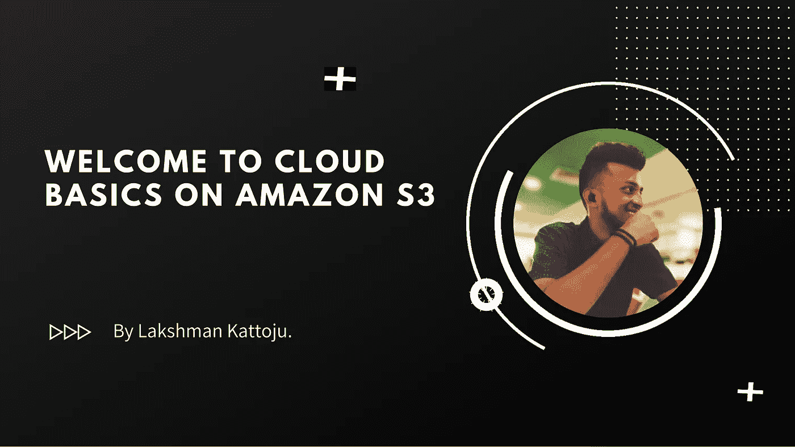

C 云计算是计算机系统资源的按需可用性，尤其是数据存储和计算能力，无需用户的直接主动管理。在我们开始学习亚马逊网络服务的具体细节之前，让我们先了解什么是云计算，为什么要关注云计算，尤其是为什么要关注 AWS，因为还有许多其他大型云存储提供商，如微软、azure、谷歌云平台、阿里云等…

让我们了解什么是云计算以及它是如何工作的。云计算是通过互联网按需交付 IT 资源，采用随用随付的价格。无需购买、拥有和维护物理数据服务器，您可以根据需要从亚马逊这样的云提供商那里获得计算能力、存储和数据库等技术服务。

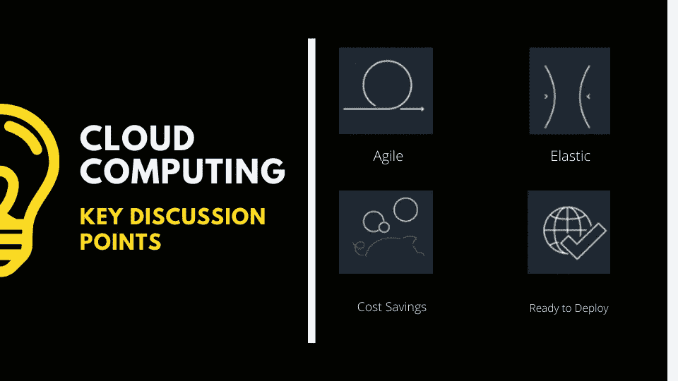

## 灵活

*云让我们可以轻松获得广泛的技术，这样你就可以更快地创新，几乎可以构建任何东西。*

## 弹性

*在云计算中，你不需要担心管理你的基础设施，你需要的一切都在云上，你只需要专注于你的发展。*

## 成本节约

*也许，云计算最显著的好处之一是可以大大节省公司的 IT 成本。…通过使用您的云服务提供商的资源，您将降低资本和运营成本，而不是在硬件、软件或许可和续订费用上花费大量资金。*

## 准备部署

*借助云，您可以扩展到新的地理区域，并在几分钟内完成全球部署。例如，AWS 在世界各地都有基础设施，所以只需点击几下鼠标，就可以在多个物理位置部署应用程序。将应用程序放在离最终用户更近的地方可以减少延迟并改善他们的体验。*

因此，当用户在云上工作并登录 aws 或 azure 或谷歌云平台等云服务时，云会向用户要求一项服务，然后云会施展魔法，将服务提供给用户，用户会为他在最短时间内使用的服务付费。

# 传统方法与云计算

太好了，现在让我们在一个例子的帮助下看看传统方法和云计算之间的区别，例如，假设一个用户正在为他的公司计算税收，他需要一个税收计算设备来计算，那么他就去市场购买设备，比如说 50 美元，然后在他想使用它的时候使用它，或者把它放在他的抽屉里。太好了，现在让我们看看云计算的出现，在这里我们不需要花费 50 美元购买计算器，而是我们可以向云提供商请求服务，作为回报，云提供商以最低的成本让我们访问服务，比如 1 美元，报酬是基于我们的使用，包括小时或分钟或特定时间，这非常有趣，但你们中的一些人可能会想，哦！传统计算要好得多，因为我已经将设备放在身边，我可以实际使用它，并可以购买我选择的设备，云的魔力来了，今年税法遵循一定的公式，在下一个财政期，公式可能会改变，计算器会过时，但在云服务中，我们将根据我们的使用情况以 25 美分或更高的价格获得更新的服务。因此，想想大规模应用程序会发生什么，然后我们会发现云具有成本优势和灵活性。

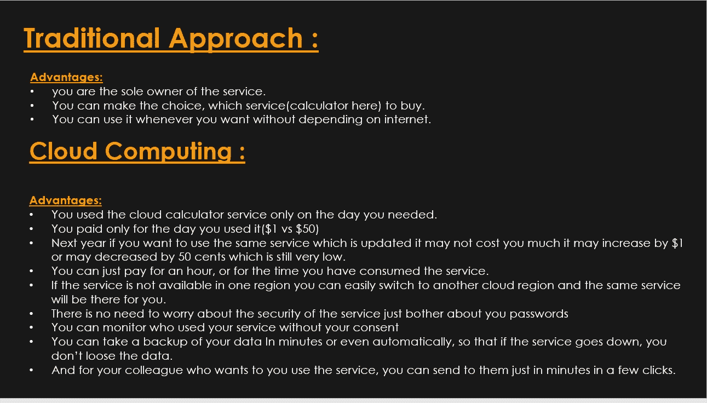

> 对于初次接触云计算并了解其功能和用法的用户来说，这是一个非常酷的介绍。因此，让我们看看我们的简单存储服务(亚马逊 S3)的主要特点，

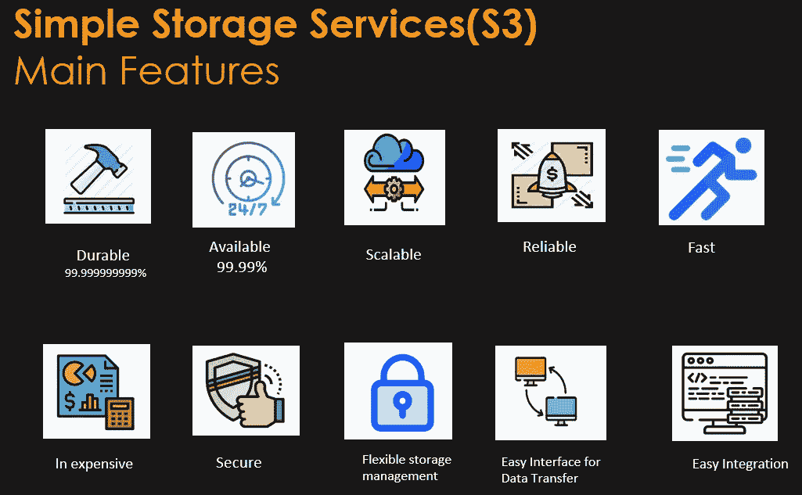

## 持久性

*让我们将耐久性定义为一年后该物品保持完整和可访问的概率。亚马逊* *S3 旨在为给定年份的物体提供 99.999999999%的耐用性。该耐久性水平相当于 0.000000001%的平均年预期损失。*

## **可用性**

*S3 标准存储级别设计为 99.99%的可用性，数据分布在 3 个最低可用性区域，因此，如果任何人作为备份的其他工作失败，即使整个区域无法正常工作，也有其他剩余区域用于数据恢复。*

## **可扩展性**

*可伸缩性是系统通过向系统添加资源来处理不断增长的工作量的属性。在这种情况下，S3 是高度可扩展的*

## 可靠且快速

*它非常可靠，并通过多部分上传选项为我们提供了更快的访问服务，使您能够分部分上传大型对象。*

## 便宜又安全

*这是最有效的数据存储和归档服务，它为您提供不同的存储层，根据您的需求提供不同的定价选项，它是高度安全的服务，它为您提供服务器端加密和客户端加密，它还提供与 cloud trail 的复杂集成，以记录、监控和保留存储 API 调用活动，用于审计。*

## 灵活的存储管理

*它为我们提供了最灵活的存储管理功能，存储管理员可以对数据分析报告进行分类、报告和可视化，从而降低成本并提高服务水平。*

## **用于数据传输的简易接口**

它有一个简单的网络服务界面，你可以用它在任何时间从网络上的任何地方存储、检索或下载任何数量的数据。

## 易于集成

*最后，除了与大多数 AWS 服务集成之外，亚马逊 S3 还获得了数万家咨询系统集成商和独立软件供应商合作伙伴的支持。*

> *在下图中，您可以找到一些关于 S3 用例的信息图细节，它在实时世界中得到了应用。*

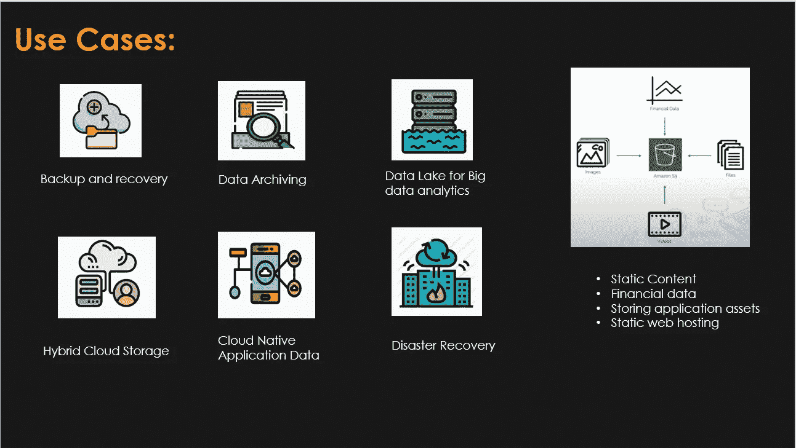

# 现在让我们来看看我们需要知道的亚马逊 S3 的基础知识。

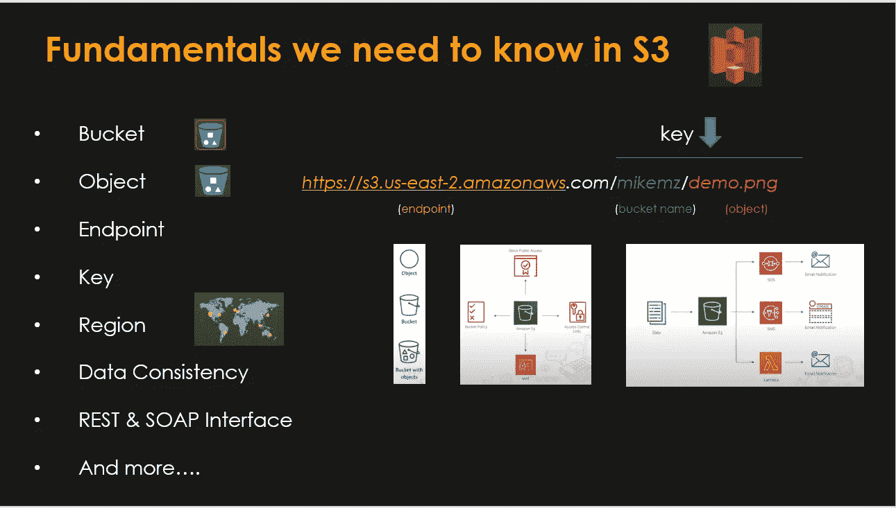

## 水桶

*亚马逊 S3 存储桶是亚马逊网络服务(AWS)简单存储服务(S3)中的公共云存储资源，这是一种对象存储产品。亚马逊***S3 桶，类似于文件夹，存储对象，由数据及其描述性元数据组成。**

## ***对象***

*亚马逊 S3 是一个简单的键值存储，可以存储你想要的任意多的对象。您将这些对象存储在一个或多个桶中，每个对象的大小可以达到 5 TB。对象由以下内容组成:Key 您分配给对象的名称。*

## ***终点***

**这些端点易于配置，高度可靠，并提供到 S3 的安全连接，不需要网关或 NAT 实例。在 VPC 的私有子网中运行的 EC2 实例现在可以控制对与 VPC 位于同一区域的 S3 桶、对象和 API 函数的访问。**

## *钥匙*

*亚马逊 S3 是一个简单的键值存储，可以存储你想要的任意多的对象。您将这些对象存储在一个或多个桶中，每个对象的大小可以达到 5 TB。… Key —您分配给对象的名称。您可以使用对象键来检索对象。有关更多信息，请参见对象键和元数据。*

## *地区*

**S3 的一个地区规定了您将在哪个地区推出您的服务，以及在任何地区部署的服务可以在哪里准确工作，最好选择一个优化延迟、最小化成本或满足监管要求的地区。**

## *数据一致性*

**数据一致性是指在整个数据集中变量测量的一致性。这成为一个问题，尤其是当数据从多个来源聚合时。数据源之间数据含义的差异会产生不准确、不可靠的数据集。**

## *REST 和 SOAP 接口*

**使用基于 web 的协议访问 S3，这些协议使用标准 HTTP(S)和基于 REST 的应用程序编程接口(API)。表述性状态转移(REST)是一种协议，它实现了一种与基于 web 的应用程序进行对话的简单、可伸缩和可靠的方式。**

*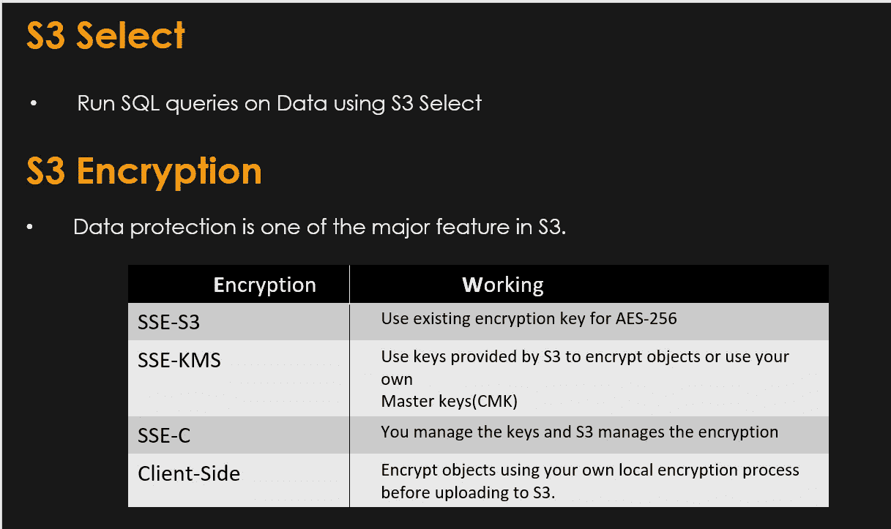*

# *有趣的部分来了，让我们在 S3 建立一个静态网站，*

*在开始之前，准备好你的 AWS 免费试用帐户，并登录到你的根用户帐户开始在 AWS 上工作。*

*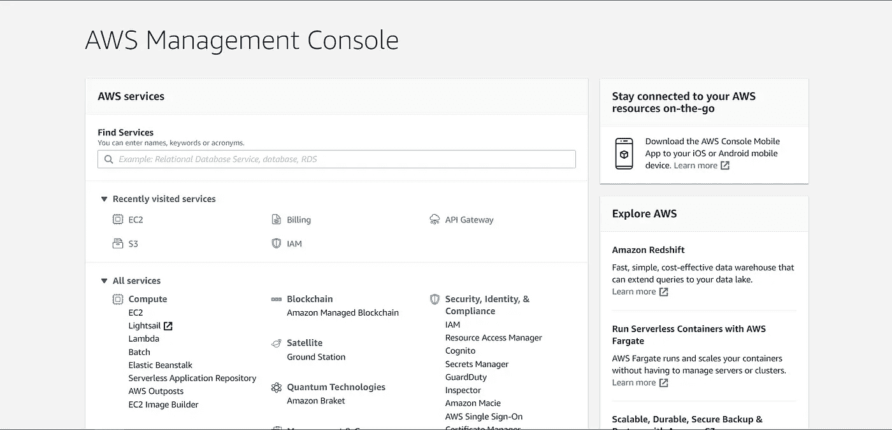*

*这是我们的 AWS 管理控制台的外观，现在你可以开始找到你最喜欢的服务，并通过在快速查找中搜索来继续工作，现在我们来看看亚马逊 S3。*

*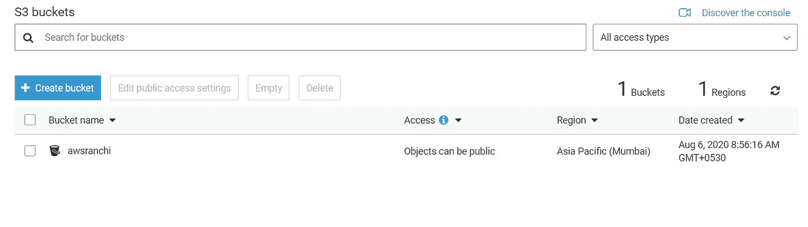*

*现在点击创建桶，创建你的第一个 S3 桶，我已经创建了一个，并命名为 awsranchi。*

*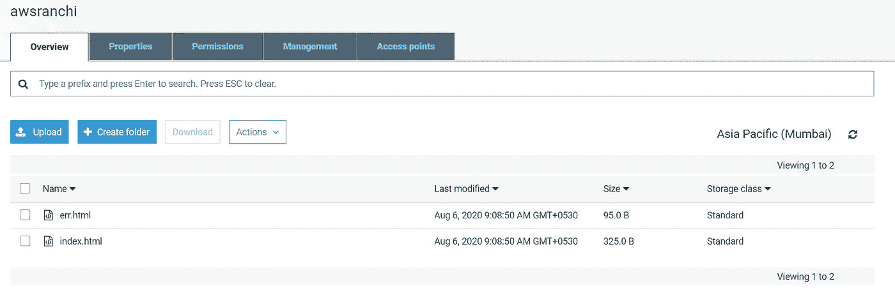*

*现在点击上传选项，从你的本地文件夹上传你的文件，我已经上传了我的命名为*index.html*和*err.html*的文件，并在上面的权限选项卡中给对象赋予权限，然后点击对象上的任意位置，你将获得对象的端点 url，在那里它被全球部署，现在你准备好了，让我们托管网站。*

*授予公共访问权限后，从同一个选项卡转到属性，然后单击静态网站托管，您将看到如下，然后在 index.html 和 error.html 占位符中提及您的文件名，并单击保存，现在您将获得端点 url，在下图中突出显示，您的网站成功托管。现在打开网址检查一下。在我的例子中，这是我的端点 URL([http://awsranchi.s3-website.ap-south-1.amazonaws.com](http://awsranchi.s3-website.ap-south-1.amazonaws.com))*

*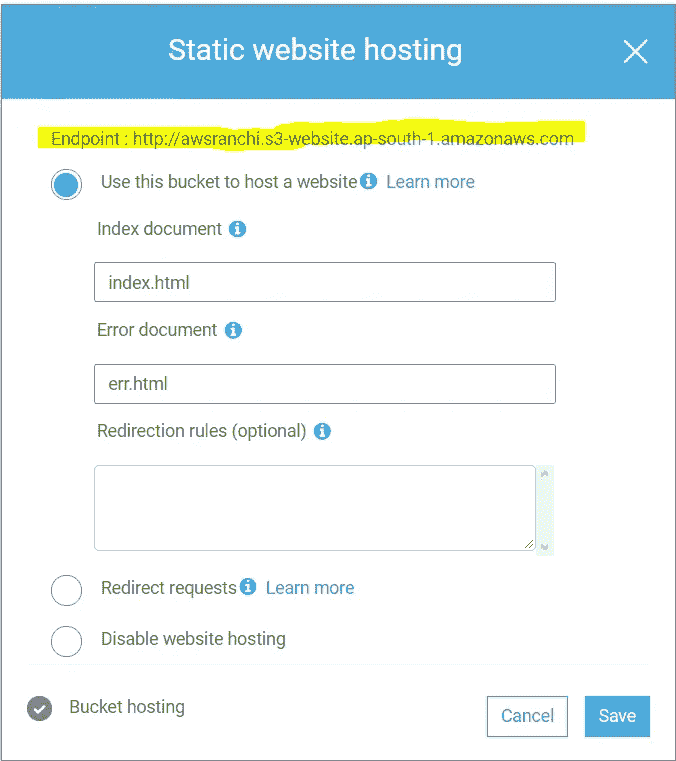*

*这是我的 index.html 和 error.html 预展，*

*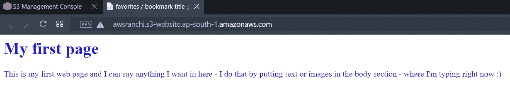**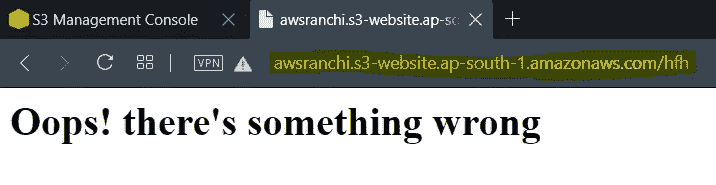*

*万岁！你完成了，恭喜你拥有了你的第一个静态网站。*

*关于我:大家好，我是拉克什曼·卡托朱，一名本科生，我喜欢探索事物，不断学习新的东西并教授它们。*