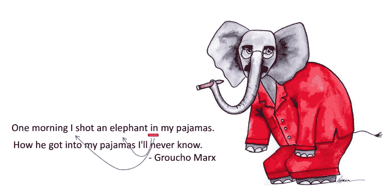
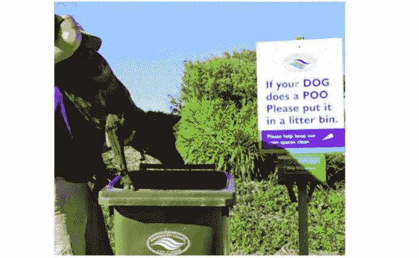

# 自然语言处理中的歧义句

> 原文：<https://medium.com/analytics-vidhya/ambiguous-sentences-in-nlp-f5e2b1fc244e?source=collection_archive---------16----------------------->

语言是一座城市，每个人都为它添砖加瓦~爱默生

异常检测: [Unsplash](https://unsplash.com/photos/et5mfj1eB94)

人类大量增长背后的一个基本原因是语言和交流媒介的演变。我们通常认为语言是理所当然的，并无意识地忽略了伴随着良好的语言知识而来的深刻理解。在某种程度上，它影响我们的思维，也可以重塑它。

几天前，我参加了一个关于 NLP 工程师实习的精彩面试，其中也包括一些语言练习。其中一个人挑战说出给定句子中的歧义以及它在 NLP 中可能产生的问题。直到那时，我才发现准确理解我们所使用的语言的重要性。

我们通常在文本预处理过程中使用 NER、词性标注和依存句法分析，但有时它们在分配正确的标签时会遗漏一些句子。这些句子在本质上可能是模棱两可的，在这里，我将解释我在采访后对模棱两可的句子所做的研究。

# 有一句模棱两可的话是什么意思？

当一个句子、单词或短语的意思不能被精确地解释并且通常有一个以上的意思时，这个句子、单词或短语就被认为是歧义的。这些模棱两可的句子给人类的理解带来了问题，更不用说需要填鸭式教学的计算机了。

# 歧义的类型:

继续我对歧义的研究，我发现有许多令人兴奋的形式值得一提:

*   **一般歧义(多义句)**

例***“树旁发现的盗画”*** *，*一个不为人类习俗所知的人可以通过两种方式得到，要么画就躺在树旁，要么树发现了画(再读例)。如果不单独解决这些歧义，NLP 模型也会发生同样的情况。

*   **附件歧义**

如果任何提到的实体的归属是不确定的，那么就出现了附件歧义。 ***“她看见了拿着望远镜的人”，*** 呈现依恋歧义，因为不清楚望远镜属于哪个人。望远镜可以和男人躺在一起，也可以被女士用来观察男人。两者都有可能，因此这个句子在本质上是模糊的。

在下面的图片中，只给出了第一行，人们可能会弄不清大象是穿着睡衣还是那个人(尽管我们都知道事实)。既然是著名的笑话，作者第二行就清了:)

依恋歧义

*   基于动词的歧义

***“我们每个人都看到了她的鸭子”，*** 显示了基于动词的歧义，因为人们无法区分女性是在做闪避的动作还是在展示真正的“鸭子”。无论哪个是真的，都不能在这里得到充分的解释。

*   **共指歧义**

顾名思义，通常句子中使用的代词会导致理解上的问题。我姐姐和我去见我的律师喝咖啡，但是她生病了，不得不离开。显然，很难理解是姐姐生病了还是律师生病了，这给我们留下了共指歧义。

共指歧义

*   最后一个讨论是关于句子的框架和表达。有时候，有很多方法可以说出完全相同的句子，这对于一个不会说话的机器来说又是一个问题。例如 ***“她把书给了亚当”*** 或 ***“她把书递给了亚当”*** 对人类来说是令人信服的理解，但对机器来说是两个不同的句子。

*讨论没完没了，这就是妙处！*

参考资料:[https://literarydevices.net/ambiguity/](https://literarydevices.net/ambiguity/)，CS295 课程，[https://literaryterms.net/ambiguity/](https://literaryterms.net/ambiguity/)