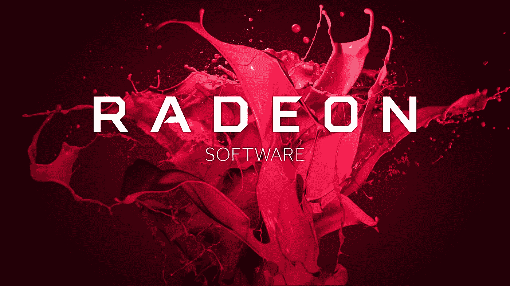
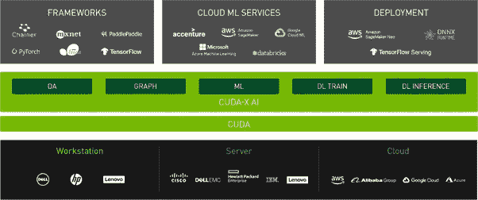
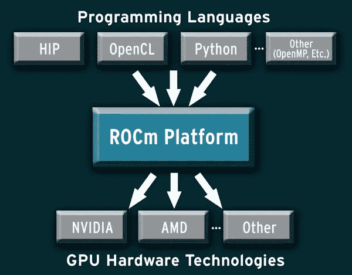

# AMD GPUs 和没人会告诉你的东西

> 原文：<https://medium.com/analytics-vidhya/amd-gpus-and-things-that-no-one-will-tell-you-about-it-5e633da53b9?source=collection_archive---------6----------------------->

去年我得到了我的笔记本电脑，在匆忙中，我用它买了一个 AMD 的 GPU。几个月后，我意识到游戏过程中帧速率会下降，而且很容易发热。好吧，这对我来说不是什么大问题，因为我不怎么玩游戏。我主要用我的笔记本电脑进行编程。我最近开始学习人工智能编程，并着手建立我的第一个人工智能项目，但没有意识到 AMD 将抛弃我。

我们都知道人工智能是即将到来的现实，它提高了处理越来越多数据以产生有意义结果的需求。人工智能需要大量的计算能力来训练模型。这就是 CPU 的不足之处，也是 GPU 的切入点。GPU 的架构与 CPU 不同，它以并行方式工作，而 CPU 则按顺序工作。GPU 大大减少了模型训练所需的时间。

如果你是那种热爱人工智能和机器学习的人，并且建立自己的人工智能模型是你的下一个目标，那么首要的事情是你必须有一台由良好的 GPU 支持的笔记本电脑来训练你的机器学习模型(我不知道)。说到 GPU，有两大品牌 NVidia 和 AMD。两者在图形处理器领域一直是竞争对手，但我们都知道 NVidia 是这个领域无可争议的王者。

AMD 在制造优秀的 CPU 方面也有很长的历史，但在 GPU 方面，AMD 远不及英伟达。不过，AMD 还是设法生产出了好的 GPU，可以帮你完成这项工作。

如果你的笔记本电脑上安装了 NVidia，那么一切都会很顺利。如果你购买了 AMD 显卡，那么你将会经历一段艰难的时光。

NVidia 拥有 CUDA 支持，可加速图形处理和深度神经网络模型训练任务。为机器学习任务安装 CUDA 就像是小菜一碟。AMD 还为所有类型的 GPU 提供了 ROCm 平台环境，但该环境是新的，并不支持所有硬件。

# 库达

CUDA 是 NVIDIA 开发的并行计算平台和编程模型，用于图形处理单元(GPU)上的一般计算。有了 CUDA，开发人员可以通过利用 GPU 的能力来显著加快计算应用程序的速度。

英伟达的 CUDA 工具包提供了开发 GPU 加速应用所需的一切。CUDA 工具包包括 GPU 加速库、编译器、开发工具和 CUDA 运行时。

# ROCm

ROCm 是 GPU 加速计算的通用平台。模块化设计允许任何硬件供应商构建支持 ROCm 堆栈的驱动程序。ROCm 还集成了多种编程语言，并且很容易添加对其他语言的支持。

ROCm 甚至提供了将特定于厂商的 CUDA 代码移植到厂商中立的 ROCm 格式的工具，这使得为 CUDA 编写的大量源代码可用于 AMD 硬件和其他硬件环境。

CUDA Toolkit 可用于 Windows 和 Linux 平台，而 ROCm 抛弃了 Windows 用户，只为 Linux 用户提供支持。

ROCm 很少或没有社区支持，因为它是最近开发的，需要时间来建立它的社区。互联网上充斥着 CUDA 支持，这使得 NVidia 用户的生活更容易。

当我开始建立我的第一个图像识别模型时，我需要在一个巨大的数据集上训练我的模型。使用 CPU 训练模型需要几个小时才能完成。我切换到 GPU，但由于我是 windows 用户，我不能使用我的 AMD 显卡 ROCm。它对我来说就像一块死了的碎片。

AMD 没有声明任何关于 windows 支持的事情，我们对此也不太乐观。ROCm 需要几年的时间才能获得良好的社区支持。在那之前，我们只有一个选择，那就是购买 NVidia GPUs。