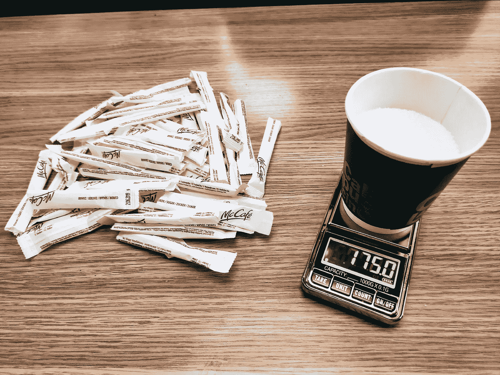

# 美国人正在吃数量惊人的糖

> 原文：<https://medium.com/analytics-vidhya/americans-are-eating-mind-boggling-amounts-of-sugar-f9fd5b4b4d06?source=collection_archive---------22----------------------->

## 分析美国食糖消费总量。

175 克添加糖——在这些[哈佛医学院饮食指南](https://www.health.harvard.edu/staying-healthy/dietary-guidelines-and-caloric-percentages)的限度内。由作者捕获。

添加糖是我们饮食中最致命的成分之一。食用糖——我们身边常见的白色物质——来自甜菜和甘蔗。

使用分析工具 [Apteo](http://apteo.co) 查看美国农业部[的蔗糖消费数据](https://www.ers.usda.gov/data-products/food-availability-per-capita-data-system/)，我们看到蔗糖消费量从每吨 90 多磅明显下降